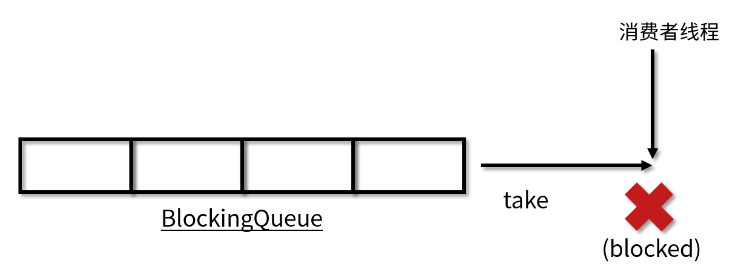
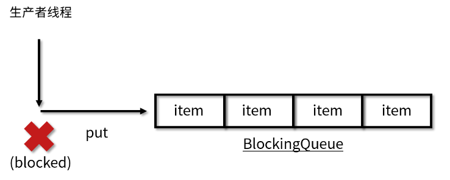
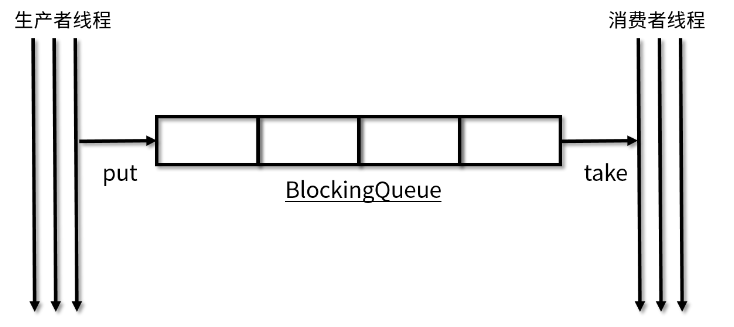
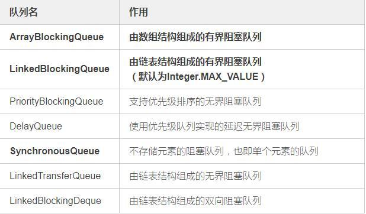

# 阻塞队列

>阻塞队列；
>
>//todo  挺不错的一个消费队列的实现和测试案例；
>
>https://baijiahao.baidu.com/s?id=1659873724613844132&wfr=spider&for=pc
>
>阻塞队列是线程安全的； //todo 以后去搞这些东西把； 这个是java的知识；牵扯到线程再说把；或者是本身需要加锁把；
>
>Q: 就是需要锁； take 和 put 数据的时候需要锁；
>
>开启多个线程去阻塞队列里面取消息；肯定会存在线程竞争的问题；
>
>----
>
>
>
>redis的list也是阻塞队列但是是单线程的不会存在数据竞争的问题；
>
>但是多个消费者，rpush 消费失败会存在数据丢失的风险；lindex 就会存在竞争的问题；
>
>
>
>----
>
>就像 kafka的消费机制；一个分区只能有一个消费者来消费；就是为了减少了消费者竞争问题；
>
>---
>
>锁可以保护共享资源，避免并发更新造成的数据错误。只有持有锁的线程才能访问被保护资源。线程在访问资源之前必须获取锁，访问完成后一定要记得释放锁。
>
>

----


## 什么是阻塞队列

　　【1】阻塞队列：从定义上来说是队列的一种，那么肯定是一个先进先出（FIFO）的数据结构。与普通队列不同的是，它支持两个附加操作，即阻塞添加和阻塞删除方法。

　　【2】阻塞添加：当阻塞队列是满时，往队列里添加元素的操作将被阻塞。

　　【3】阻塞移除：当阻塞队列是空时，从队列中获取元素/删除元素的操作将被阻塞。


----

## java中对阻塞队列的定义

　　【1】BlockingQueue接口与Queue接口【Queue 和 BlockingQueue 都是在 Java 5 中加入的】

　　　　1）Queue接口

[](javascript:void(0);)

```
public interface Queue<E> extends Collection<E> {
     //添加一个元素，添加成功返回true, 如果队列满了，就会抛出异常
    boolean add(E e);
    //添加一个元素，添加成功返回true, 如果队列满了，返回false
    boolean offer(E e);
    //返回并删除队首元素，队列为空则抛出异常
    E remove();
    //返回并删除队首元素，队列为空则返回null
    E poll();
    //返回队首元素，但不移除，队列为空则抛出异常
    E element();
    //获取队首元素，但不移除，队列为空则返回null
    E peek();
}
```

[](javascript:void(0);)

 　　　2）BlockingQueue接口

　　　　　　1.源码展示

[](javascript:void(0);)

```
public interface BlockingQueue<E> extends Queue<E> {

    boolean add(E e);

    boolean offer(E e);

    void put(E e) throws InterruptedException;

    boolean offer(E e, long timeout, TimeUnit unit) throws InterruptedException;

    E take() throws InterruptedException;

    E poll(long timeout, TimeUnit unit) throws InterruptedException;

    int remainingCapacity();

    boolean remove(Object o);

    public boolean contains(Object o);

    int drainTo(Collection<? super E> c);

    int drainTo(Collection<? super E> c, int maxElements);
}
```

[](javascript:void(0);)

----

### take 的时候也会加锁么？既然 put 和 take 都会加锁，是不是同一时间只能运行其中一个方法。

 答：**1：是的，take 时也会加锁的，像 LinkedBlockingQueue 在执行 take 方法时，在拿数据的同时，会把当前数据删除掉，就改变了链表的数据结构，所以需要加锁来保证线程安全。**

2：这个需要看情况而言，对于 LinkedBlockingQueue 来说，队列的 put 和 take 都会加锁，但两者的锁是不一样的，所以两者互不影响，可以同时进

`````php
# 这边可以测试一个共享数据 php 多进程的只能使用一个外部系统来做测试
# 这里我们选用 mysql 来做测试；

### 测试  用高并发量打一下试一下； 看看是什么效果；肯定有会存在很多线程 拿到了 id=1; 的数据；所以我们这边最好加锁；来实现；
# select id from t where id =1; // 当前读 并没有加锁，来提高并发能力；
# delete from t where id = 1; // 

###  select id from wehre id = 1 for update;
`````


----


　　　　　　2.分析说明

　　　　　　　　【1】BlockingQueue 继承了 Queue 接口，是队列的一种。阻塞队列（BlockingQueue）是一个在队列基础上又支持了两个附加操作的队列，两个附加操作:

　　　　　　　　　　　　1）支持阻塞的插入方法put: 队列满时，队列会阻塞插入元素的线程，直到队列不满。

　　　　　　　　　　　　2）支持阻塞的移除方法take: 队列空时，获取元素的线程会等待队列变为非空。

　　　　　　　　【2】BlockingQueue和JDK集合包中的Queue接口兼容，同时在其基础上增加了阻塞功能：

　　　　　　　　　　　　入队：
　　　　　　　　　　　　（1）offer(E e)：如果队列没满，返回true，如果队列已满，返回false（不阻塞）
　　　　　　　　　　　　（2）offer(E e, long timeout, TimeUnit unit)：可以设置阻塞时间，如果队列已满，则进行阻塞。超过阻塞时间，则返回false
　　　　　　　　　　　　（3）put(E e)：队列没满的时候是正常的插入，如果队列已满，则阻塞，直至队列空出位置
　　　　　　　　　　　　出队：
　　　　　　　　　　　　（1）poll()：如果有数据，出队，如果没有数据，返回null （不阻塞）
　　　　　　　　　　　　（2）poll(long timeout, TimeUnit unit)：可以设置阻塞时间，如果没有数据，则阻塞，超过阻塞时间，则返回null
　　　　　　　　　　　　（3）take()：队列里有数据会正常取出数据并删除；但是如果队列里无数据，则阻塞，直到队列里有数据

　　　　　　　　【3】BlockingQueue常用方法示例：　　

| 方法         | 抛出异常  | 返回结果但不抛出异常 | 阻塞   | 阻塞特定时间         |
| ------------ | --------- | -------------------- | ------ | -------------------- |
| 入队         | add(e)    | offer(e)             | put(e) | offer(e, time, unit) |
| 出队         | remove()  | poll()               | take() | poll(time, unit)     |
| 获取队首元素 | element() | peek()               | 不支持 | 不支持               |

 

## 阻塞队列特性

>阻塞功能使得生产者和消费者两端的能力得以平衡，当有任何一端速度过快时，阻塞队列便会把过快的速度给降下来。
>
>阻塞队列还有一个非常重要的属性，那就是容量的大小，分为有界和无界两种。

　　【1】阻塞

　　　　1）阻塞队列区别于其他类型的队列的最主要的特点就是“阻塞”这两个字，所以下面重点介绍阻塞功能：**阻塞功能使得生产者和消费者两端的能力得以平衡，当有任何一端速度过快时，阻塞队列便会把过快的速度给降下来。**实现阻塞最重要的两个方法是 take 方法和 put 方法。

　　　　2）take 方法

　　　　　　take 方法的功能是获取并移除队列的头结点，通常在队列里有数据的时候是可以正常移除的。可是一旦执行 take 方法的时候，队列里无数据，则阻塞，直到队列里有数据。一旦队列里有数据了，就会立刻解除阻塞状态，并且取到数据。过程如图所示：

 　　　　　　　

 

　　　　3）put 方法

　　　　　　put 方法插入元素时，如果队列没有满，那就和普通的插入一样是正常的插入，但是如果队列已满，那么就无法继续插入，则阻塞，直到队列里有了空闲空间。如果后续队列有了空闲空间，比如消费者消费了一个元素，那么此时队列就会解除阻塞状态，并把需要添加的数据添加到队列中。过程如图所示：

 　　　　　　　

　　【2】是否有界

　　　　**阻塞队列还有一个非常重要的属性，那就是容量的大小，分为有界和无界两种。**无界队列意味着里面可以容纳非常多的元素，例如 LinkedBlockingQueue 的上限是 Integer.MAX_VALUE，是非常大的一个数，可以近似认为是无限容量，因为我们几乎无法把这个容量装满。但是有的阻塞队列是有界的，例如 ArrayBlockingQueue 如果容量满了，也不会扩容，所以一旦满了就无法再往里放数据了。

##  

## 阻塞队列应用场景

>线程安全的； 一个阻塞队列对应着一个线程，所以肯定是安全的；
>
>

　　【1】**BlockingQueue 是线程安全的，我们在很多场景下都可以利用线程安全的队列来优雅地解决我们业务自身的线程安全问题。比如说，使用生产者/消费者模式的时候，我们生产者只需要往队列里添加元素，而消费者只需要从队列里取出它们就可以了**，如图所示：

 　　　　　　　　　　　

　　【2】**因为阻塞队列是线程安全的，所以生产者和消费者都可以是多线程的，不会发生线程安全问题。**生产者/消费者直接使用线程安全的队列就可以，而不需要自己去考虑更多的线程安全问题。这也就意味着，考虑锁等线程安全问题的重任从“你”转移到了“队列”上，降低了我们开发的难度和工作量。

　　【3】同时，队列它还能起到一个隔离的作用。比如说我们开发一个银行转账的程序，那么生产者线程不需要关心具体的转账逻辑，只需要把转账任务，如账户和金额等信息放到队列中就可以，而不需要去关心银行这个类如何实现具体的转账业务。而作为银行这个类来讲，它会去从队列里取出来将要执行的具体的任务，再去通过自己的各种方法来完成本次转账。这样就实现了具体任务与执行任务类之间的解耦，任务被放在了阻塞队列中，而负责放任务的线程是无法直接访问到我们银行具体实现转账操作的对象的，实现了隔离，提高了安全性。

 

## 常见阻塞队列

　　BlockingQueue 接口的实现类都被放在了 juc 包中，它们的区别主要体现在存储结构上或对元素操作上的不同，但是对于take与put操作的原理，却是类似的（可自行查看源码分析）：

| 队列                                                         | 描述                                                         |
| ------------------------------------------------------------ | ------------------------------------------------------------ |
| [ArrayBlockingQueue](https://www.cnblogs.com/chafry/p/16780051.html) | 基于数组结构实现的一个有界阻塞队列                           |
| [LinkedBlockingQueue](https://www.cnblogs.com/chafry/p/16782730.html) | 基于链表结构实现的一个无界阻塞队列，指定容量为有界阻塞队列   |
| [PriorityBlockingQueue](https://www.cnblogs.com/chafry/p/16783035.html) | 支持按优先级排序的无界阻塞队列                               |
| [DelayQueue](https://www.cnblogs.com/chafry/p/16783225.html) | 基于优先级队列（PriorityBlockingQueue）实现的无界阻塞队列    |
| [SynchronousQueue](https://www.cnblogs.com/chafry/p/16782932.html) | 不存储元素的阻塞队列                                         |
| [LinkedTransferQueue](https://www.cnblogs.com/chafry/p/16783230.html) | 基于链表结构实现的一个无界阻塞队列                           |
| [LinkedBlockingDeque](https://www.cnblogs.com/chafry/p/16782914.html) | 基于链表结构实现的一个无界双端阻塞队列，指定容量为有界阻塞队列 |

##  

## 如何选择适合的阻塞队列

###  选择策略

　　通常我们可以从以下 5 个角度考虑，来选择合适的阻塞队列：

　　**第 1 个需要考虑的就是功能层面，比如是否需要阻塞队列帮我们排序，如优先级排序、延迟执行等。如果有这个需要，我们就必须选择类似于 PriorityBlockingQueue 之类的有排序能力的阻塞队列。**

　　第 2 个需要考虑的是容量，或者说是否有存储的要求，还是只需要“直接传递”。在考虑这一点的时候，我们知道前面介绍的那几种阻塞队列，有的是容量固定的，如 ArrayBlockingQueue；有的默认是容量无限的，如 LinkedBlockingQueue；而有的里面没有任何容量，如 SynchronousQueue；而对于 DelayQueue 而言，它的容量固定就是 Integer.MAX_VALUE。所以不同阻塞队列的容量是千差万别的，我们需要根据任务数量来推算出合适的容量，从而去选取合适的 BlockingQueue。

　　第 3 个需要考虑的是能否扩容。因为有时我们并不能在初始的时候很好的准确估计队列的大小，因为业务可能有高峰期、低谷期。如果一开始就固定一个容量，可能无法应对所有的情况，也是不合适的，有可能需要动态扩容。如果我们需要动态扩容的话，那么就不能选择 ArrayBlockingQueue ，因为它的容量在创建时就确定了，无法扩容。相反，PriorityBlockingQueue 即使在指定了初始容量之后，后续如果有需要，也可以自动扩容。所以我们可以根据是否需要扩容来选取合适的队列。

　　第 4 个需要考虑的点就是内存结构。我们分析过 ArrayBlockingQueue 的源码，看到了它的内部结构是“数组”的形式。和它不同的是，LinkedBlockingQueue 的内部是用链表实现的，所以这里就需要我们考虑到，ArrayBlockingQueue 没有链表所需要的“节点”，空间利用率更高。所以如果我们对性能有要求可以从内存的结构角度去考虑这个问题。

　　第 5 点就是从性能的角度去考虑。比如 LinkedBlockingQueue 由于拥有两把锁，它的操作粒度更细，在并发程度高的时候，相对于只有一把锁的 ArrayBlockingQueue 性能会更好。另外，SynchronousQueue 性能往往优于其他实现，因为它只需要“直接传递”，而不需要存储的过程。如果我们的场景需要直接传递的话，可以优先考虑 SynchronousQueue。

 

### 线程池对于阻塞队列的选择

　　线程池有很多种，不同种类的线程池会根据自己的特点，来选择适合自己的阻塞队列：

```
FixedThreadPool（SingleThreadExecutor 同理）选取的是 LinkedBlockingQueue
CachedThreadPool 选取的是 SynchronousQueue
ScheduledThreadPool（SingleThreadScheduledExecutor同理）选取的是延迟队列
```


---


## 阻塞队列的种类；




常见的几种已经加粗了。

ArrayBlockingQueue和LinkedBlockingQueue是最为常用的阻塞队列，前者使用一个有边界的数组来作为存储介质，而后者使用了一个没有边界的链表来存储数据。

**PriorityBlockingQueue是一个优先阻塞队列。所谓优先队列，就是每次从队队列里面获取到的都是队列中优先级最高的，对于优先级，PriorityBlockingQueue需要你为插入其中的元素类型提供一个Comparator，PriorityBlockingQueue使用这个Comparator来确定元素之间的优先级关系。底层的数据结构是堆，也就是我们数据结构中的那个堆。**

**DelayQueue是一个延时队列，所谓延时队列就是消费线程将会延时一段时间来消费元素。**

**SynchronousQueue是最为复杂的阻塞队列。SynchronousQueue和前面分析的阻塞队列都不同，因为SynchronousQueue不存在容量的说法，任何插入操作都需要等待其他线程来消费，否则就会阻塞等待，看到这种队列心里面估计就立马能联想到生产者消费者的这种模式了，没错，就可以使用这个队列来实现。**