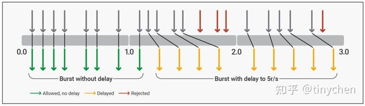

## 四种限流算法


## 比较常问的两种


burst  迸发 ，爆发；

slot 槽；


### 漏桶算法

`````nginx
# 限制用户的ip 一秒只能访问一次 ；多余的要被抛弃；
limit_req_zone $binary_remote_addr zone=req_zone:10m rate=1r/s;#控制流速；


# 限流的调用；
location /reqlimit {
    limit_req zone=req_zone; # 
    proxy_pass htttp://backend;
}
#burst 尽可能“均匀平滑”地处理所有的请求而不是直接拒绝掉它们。
limit_req zone=req_zone burst=10;  # 控制并发数；  对于并发的问题的处理逻辑；
# burst 放在队列里面等待处理 需要慢慢等待去处理 也太慢了把；响应太慢了；

#也就是说如果有22个请求同时发送过来，那么NGINX会马上把**第1个**请求根据相关规则转发给upstream服务器，然后把接下来的**第2到21共计20个请求**放入队列中，接着直接返回`503代码`给**第22个请求**，随后的2秒时间内，每100毫秒从队列中取出一个请求发送给upstream服务器进行处理。所以就是处理响应很慢；

limit_req zone=req_zone burst=10 nodelay;   # 队列没有延迟直接推送给后面的服务器；
#加上了`nodelay`参数之后，nginx的处理方式和上面基本相同，唯一的区别在于：当nginx接受了**第2到21共计20个请求**之后，不会把它们放入队列中，而是直接将它们转发给upstream服务器，同时标记队列中的这20个插槽(slot)为已使用，然后把剩下的全部请求都503拒绝掉，接着每过100毫秒再释放一个新的slot让新的请求进来

limit_req zone=req_zone burst=10 delay=5;
`````


# nginx篇10-限速三剑客之limit_req


本文主要是对nginx官方`limit_req`相关模块的限速原理的解释和一些个人理解，主要参考的文章为`Rate Limiting with NGINX and NGINX Plus`和nginx的`ngx_http_limit_req_module`的详细说明。


目前来说在nginx上面我们常见的三种限速操作分别是：限制请求数(request)、限制连接数(connection)、限制响应速度(rate)，对应在nginx的模块相关指令分别是`limit_req`、`limit_conn`和`limit_rate`三个系列。

## 1、前言

限速（rate limiting）是NGINX中一个非常有用但是经常被误解且误用的功能特性。我们可以用它来限制在一段时间内的HTTP请求的数量，这些请求可以是如`GET`这样的简单请求又或者是用来填充登录表单的`POST`请求。

限速还可以用于安全防护用途，例如限制密码撞库暴力破解等操作的频率，也可以通过把请求频率限制在一个正常范围来抵御[DDoS攻击](https://link.zhihu.com/?target=https%3A//www.nginx.com/blog/mitigating-ddos-attacks-with-nginx-and-nginx-plus/)。不过更常见的使用情况是通过限制请求的数量来确保后端的upstream服务器不会在短时间内遭受到大量的流量访问从而导致服务异常。

本文会尽量覆盖nginx中限速（rate limiting）的基本概念也相关知识同时会顺带尽可能多的提一下相关的进阶配置方法。限速（rate limiting）在付费版本的nginx（Nginx Plus）中也是同样可以使用的。

> NGINX Plus R16 及之后的版本支持“全局限速（global rate limiting）”，可以在一整个nginx集群中对某个用户或者连接进行限速状态的同步。原理基本上类似于openresty+redis的工作模式，将限速的状态存储到一个集群中，当需要限速操作的时候就去集群中读取相关参数，For details, see our [blog](https://link.zhihu.com/?target=https%3A//www.nginx.com/blog/nginx-plus-r16-released/%23r16-cluster-rate-limiting) and the [NGINX Plus Admin Guide](https://link.zhihu.com/?target=https%3A//docs.nginx.com/nginx/admin-guide/high-availability/zone_sync/).

## 2、工作原理

nginx中限速（rate limiting）的主要算法原理就是基于在计算机网络中当带宽是有限时十分常用的**漏桶算法**。基本原理就是：**以漏桶为例，水从顶部倒入，从底下漏出。**这里的几个概念分别是：

- 漏桶对应我们服务器的带宽或者是处理请求的能力或者是一个队列
- 水表示客户端发送过来的请求
- 倒入的水则代表客户端发送给服务器但尚未进行处理的请求，此时请求仍在队列（在桶内）
- 漏出的水则代表从队列中出来即将发送给服务器端处理的请求，此时请求已经离开了队列（在桶外）

漏桶在一定程度上可以代表服务器的处理能力，请求根据**先进先出（FIFO）**调度算法等待处理。如果倒入水的速度小于漏水的速度，可以理解为服务器能够处理完所有的请求，此时整体服务表现正常。如果倒入水的速度大于漏水的速度，那么水桶内的水会不断增加直到最后溢出，这种情况下在水桶中的水可以理解为在队列中等待的请求，而溢出的水则表示直接被丢弃不处理的请求。


## 3、基础配置

下面这里我们列举一个简单的nginx限速配置：

```nginx
 limit_req_zone $binary_remote_addr zone=mylimit:10m rate=10r/s;
  
 server {
     location /login/ {
         limit_req zone=mylimit;
         
         proxy_pass http://my_upstream;
     }
 }
```

这里首先使用了`limit_req_zone指令`定义了一个限速zone，名为`mylimit`，大小为10MB，对应的变量是`$binary_remote_addr`，限制的请求速率是每秒限制10个请求（10requests/secends），在`login`这个`location`中使用`limit_req指令`指定了限制的`zone`。接下来我们详细解析一下整个限速的过程：

首先是`limit_req_zone指令`主要用于**定义速度限制相关的参数**，而`limit_req指令`则是用于**启用定义的限速参数**（如这里是在login中启用）

`limit_req_zone` 指令一般用于http块中，使其可以在多个相关server、location等contexts中使用，一般来说它需要定义下面三个必要参数：

> Syntax：**limit_req_zone** *key* zone=*name*:*size* rate=*rate* [sync];
> Syntax: **limit_req** zone=*name* [burst=*number*] [nodelay | delay=*number*];

- key：定义用于限制请求的变量，在这个示例中使用的是NGINX的自带变量`$binary_remote_addr`，它的特点是使用二进制来表示IP地址，如`123.183.224.65`这个IP在`$remote_addr`中显示为`123.183.224.65`，在`$binary_remote_addr`表示为`{\xB7\xE0A`，因此`$binary_remote_addr`占用的空间要比`$remote_addr`更少。使用`$binary_remote_addr`则意味着将每个唯一的用户IP作为限制速率的判断依据。
- zone：定义用于存储**前面定义的key变量**和**限制其访问请求频率rate变量**的共享内存空间，将信息保存在共享内存中的好处是能够在多个worker进程中共享。存储空间的定义由两个部分组成：`zone=`后面的名称以及冒号后面的大小，如`zone=mylimit:10m` 就是一个名为`mylimit`的大小为`10m`的共享内存空间。以`$binary_remote_addr` 变量为例，它使用4 bytes来存储IPv4 地址或者是使用16 bytes来存储IPv6地址。存储状态始终在32位平台上占用64个字节，并在64位平台上占用128个字节。**考虑到现在的服务器绝大多数都是64位的操作系统**，1M的大小可以保留大约8192个128字节的状态。
  当存储空间耗尽的时候，如果需要记录新的值，那么就会通过**LRU算法**移除旧的变量来腾出空间，如果这样腾出来的空间还是不足以接纳新的记录值，那么nginx就会返回状态码`503``(Service``Temporarily``Unavailable)`。此外，为了防止内存耗尽，nginx每次创建一个新记录值的时候就会清理掉两个60秒内没被使用过的旧记录值。
  If the zone storage is exhausted, the least recently used state is removed. If even after that a new state cannot be created, the request is terminated with an [error](https://link.zhihu.com/?target=https%3A//nginx.org/en/docs/http/ngx_http_limit_req_module.html%23limit_req_status).
- rate：设定允许的最大请求速率。上面的例子是每秒十个请求(10r/s)。nginx实现的是**毫秒级别的控制粒度**，10r/s对应的就是1r/100ms，这也就意味着在没有设置`bursts`的情况下，如果一个请求接受处理之后的100ms内出现第二个请求，那么它就会被拒绝处理。

`limit_req_zone`指令设置了速率限制和共享内存区域的参数，但它实际上并不限制请求速率。因此我们需要通过在`contexts`中使用`limit_req`指令来将其限制应用于特定`location`或`server`块。在上面的例子里，我们将请求速率限制在`/login/`这个`location`块中。因此现在每个唯一的 IP 地址被限制为每秒 10 个**/login/**请求，或者更准确地说，不能在前一个 URL 请求的 100 毫秒内发出对该 URL 的第二次请求。


## 4、突发请求处理(Bursts)


上面的基础配置只能处理最简单的理想情况，但是如果服务器在100毫秒内收到了2个及以上的请求，那么在上面的配置中，nginx就会向第1个请求之后的所有客户端返回503代码。考虑到并发是程序的天然属性，大多数情况下都是同一时间内涌入大量的请求，因此这显然并不是我们想要的处理方案，我们想要的应该是**尽可能“均匀平滑”地处理所有的请求而不是直接拒绝掉它们**。因此在这种情况下我们可以使用`burst`参数设置突发阈值，允许并发情况的处理。

```nginx
 location /login/ {
     limit_req zone=mylimit burst=20;
     proxy_pass http://my_upstream;
 }
```

上面这段配置中我们设置了`burst=20`，该配置定义了客户端可以超过区域指定速率的请求数（对于我们前面定义的`mylimit`区域，请求速率限制为每秒 10 个请求即每 100 毫秒 1 个）。在前一个请求之后 100 毫秒内到达的请求会被放入到队列中，这里我们将队列大小设置为 20。

也就是说如果有22个请求同时发送过来，那么NGINX会马上把**第1个**请求根据相关规则转发给upstream服务器，然后把接下来的**第2到21共计20个请求**放入队列中，接着直接返回`503代码`给**第22个请求**，随后的2秒时间内，每100毫秒从队列中取出一个请求发送给upstream服务器进行处理。


## 5、无延迟队列(Queueing with No Delay)


上面的方法虽然使得请求的流量变得**“均匀平滑”**，但是确很大程度上增加了响应时间，排在队列越后面的请求的等待时间越长，这就导致了它们的响应时间平白无故地增加了许多，过长的响应时间甚至可能会导致客户端认为请求异常或者直接导致请求超时。为了解决这种情况，我们可以在`brust`参数后面加上`nodelay`参数。

```nginx
 location /login/ {
     limit_req zone=mylimit burst=20 nodelay;
     proxy_pass http://my_upstream;
 }
```

加上了`nodelay`参数之后，nginx的处理方式和上面基本相同，唯一的区别在于：当nginx接受了**第2到21共计20个请求**之后，不会把它们放入队列中，而是直接将它们转发给upstream服务器，同时标记队列中的这20个插槽(slot)为已使用，然后把剩下的全部请求都503拒绝掉，接着每过100毫秒再释放一个新的slot让新的请求进来。

With the `nodelay` parameter, NGINX still allocates slots in the queue according to the `burst` parameter and imposes the configured rate limit, but not by spacing out the forwarding of queued requests.

Instead, when a request arrives “too soon”, NGINX forwards it immediately as long as there is a slot available for it in the queue. It marks that slot as “taken” and does not free it for use by another request until the appropriate time has passed (in our example, after 100ms).

现在假设在第一组请求转发后 101 毫秒，另外 20 个请求同时到达。队列中只有 1 个插槽已被释放，因此 NGINX 转发 1 个请求给upstream服务器并以 `status 503` 拒绝其他 19 个请求。如果在 20 个新请求到达之前 已经过去了501毫秒而不是101毫秒，则有 5 个空闲槽，因此 NGINX 立即转发 5 个请求upstream服务器并拒绝剩余15 个请求。**这样最终的效果相当于每秒 10 个请求的速率限制，只不过没有了前面的\*“均匀平滑”\*的特性，但是却有效降低了响应时间。**因此如果我们需要在不限制每个请求之间的时间间隔的情况下限制请求速率，可以考虑使用`nodelay`参数。

> **Note:** For most deployments, we recommend including the `burst` and `nodelay` parameters to the `limit_req` directive.

## 6、两段限速(Two-Stage Rate Limiting)


## **6.1 原理解析**

**简单来说，所谓的分段限速就是允许客户端在刚开始的时候有一定的突发请求，后面再进入到平稳的限速中。**

我们可以在`NGINX Plus R17`或者是`NGINX 1.15.7`使用`limit_req` 指令和`delay参数`来实现两段限速，`delay参数`将nginx配置为允许突发请求以适应典型的 Web 浏览器请求模式，然后将额外的过度请求限制到一定程度，超过该点的额外过度请求将被拒绝。

这里我们以5r/s的限制速率为例，一般来说网站通常每个页面有 4 到 6 个资源，并且永远不会超过 12 个资源。该配置允许最多 12 个请求的突发，其中前 8 个请求会被直接转发给upstream处理。在达到5r/s的请求限制之后，第6到第13个请求会被添加到延迟(delay)中，再之后的任何请求都会被拒绝。

```text
 limit_req_zone $binary_remote_addr zone=ip:10m rate=5r/s;
 
 server {
     listen 80;
     location / {
         limit_req zone=ip burst=12 delay=8;
         proxy_pass http://website;
     }
 }
```

下面假设有一个客户端不断地向我们的限速服务器发出请求，根据上面的配置，nginx的处理情况如下：





- 这里可以看到，从burst队列中首先最开始的12个请求可以按照配置分为8+5
- 即最前面的8个请求会被直接发送给`upstream`处理，也就是在burst队列中的`no delay`部分，这里的8个和配置中的参数`delay=8`吻合
- 随后的5个请求也会被加入到burst队列中，这里的处理规则就不是按照前面的`no delay`部分的规则来处理，而是先按照设定的`rate=5r/s`来进行处理，接着同样是这一秒内的其他请求都会被返回503代码拒绝掉
- 再进入下一秒的时间，这里的请求就和之前设定的一样，全部按照`rate=5r/s`来进行处理，同样是这一秒内的其他请求都会被返回503代码拒绝掉

## **6.2 实测**

这里我们使用jmeter来进行实测查看不同的配置对应的效果，这里我们尝试5秒内发送100次请求，然后查看测试结果，由于nginx的日志写入有延迟，和这里的精确到毫秒级别的测试会有误差，这里我们以秒为单位来查看日志。

```text
 1.1.1.1 | [16/Jun/2021:15:24:45 +0800] | 200 | test.tiny777.com
 1.1.1.1 | [16/Jun/2021:15:24:45 +0800] | 200 | test.tiny777.com
 1.1.1.1 | [16/Jun/2021:15:24:45 +0800] | 200 | test.tiny777.com
 1.1.1.1 | [16/Jun/2021:15:24:45 +0800] | 200 | test.tiny777.com
 1.1.1.1 | [16/Jun/2021:15:24:45 +0800] | 200 | test.tiny777.com
 1.1.1.1 | [16/Jun/2021:15:24:45 +0800] | 200 | test.tiny777.com
 1.1.1.1 | [16/Jun/2021:15:24:45 +0800] | 200 | test.tiny777.com
 1.1.1.1 | [16/Jun/2021:15:24:45 +0800] | 200 | test.tiny777.com
 1.1.1.1 | [16/Jun/2021:15:24:45 +0800] | 200 | test.tiny777.com
 1.1.1.1 | [16/Jun/2021:15:24:45 +0800] | 200 | test.tiny777.com
 1.1.1.1 | [16/Jun/2021:15:24:45 +0800] | 200 | test.tiny777.com
 1.1.1.1 | [16/Jun/2021:15:24:45 +0800] | 200 | test.tiny777.com
 1.1.1.1 | [16/Jun/2021:15:24:46 +0800] | 503 | test.tiny777.com
 1.1.1.1 | [16/Jun/2021:15:24:46 +0800] | 200 | test.tiny777.com
 1.1.1.1 | [16/Jun/2021:15:24:46 +0800] | 503 | test.tiny777.com
 1.1.1.1 | [16/Jun/2021:15:24:46 +0800] | 503 | test.tiny777.com
 1.1.1.1 | [16/Jun/2021:15:24:46 +0800] | 503 | test.tiny777.com
 1.1.1.1 | [16/Jun/2021:15:24:46 +0800] | 200 | test.tiny777.com
 1.1.1.1 | [16/Jun/2021:15:24:46 +0800] | 503 | test.tiny777.com
 1.1.1.1 | [16/Jun/2021:15:24:46 +0800] | 503 | test.tiny777.com
 1.1.1.1 | [16/Jun/2021:15:24:46 +0800] | 503 | test.tiny777.com
 1.1.1.1 | [16/Jun/2021:15:24:46 +0800] | 200 | test.tiny777.com
 1.1.1.1 | [16/Jun/2021:15:24:46 +0800] | 503 | test.tiny777.com
 1.1.1.1 | [16/Jun/2021:15:24:46 +0800] | 503 | test.tiny777.com
 1.1.1.1 | [16/Jun/2021:15:24:46 +0800] | 503 | test.tiny777.com
 1.1.1.1 | [16/Jun/2021:15:24:46 +0800] | 200 | test.tiny777.com
 1.1.1.1 | [16/Jun/2021:15:24:46 +0800] | 503 | test.tiny777.com
 1.1.1.1 | [16/Jun/2021:15:24:46 +0800] | 200 | test.tiny777.com
 1.1.1.1 | [16/Jun/2021:15:24:46 +0800] | 503 | test.tiny777.com
 1.1.1.1 | [16/Jun/2021:15:24:46 +0800] | 503 | test.tiny777.com
 1.1.1.1 | [16/Jun/2021:15:24:46 +0800] | 503 | test.tiny777.com
 1.1.1.1 | [16/Jun/2021:15:24:46 +0800] | 503 | test.tiny777.com
 1.1.1.1 | [16/Jun/2021:15:24:47 +0800] | 200 | test.tiny777.com
 1.1.1.1 | [16/Jun/2021:15:24:47 +0800] | 503 | test.tiny777.com
 1.1.1.1 | [16/Jun/2021:15:24:47 +0800] | 503 | test.tiny777.com
 1.1.1.1 | [16/Jun/2021:15:24:47 +0800] | 503 | test.tiny777.com
 1.1.1.1 | [16/Jun/2021:15:24:47 +0800] | 503 | test.tiny777.com
 1.1.1.1 | [16/Jun/2021:15:24:47 +0800] | 200 | test.tiny777.com
 1.1.1.1 | [16/Jun/2021:15:24:47 +0800] | 503 | test.tiny777.com
 1.1.1.1 | [16/Jun/2021:15:24:47 +0800] | 503 | test.tiny777.com
 1.1.1.1 | [16/Jun/2021:15:24:47 +0800] | 503 | test.tiny777.com
 1.1.1.1 | [16/Jun/2021:15:24:47 +0800] | 200 | test.tiny777.com
 1.1.1.1 | [16/Jun/2021:15:24:47 +0800] | 503 | test.tiny777.com
 1.1.1.1 | [16/Jun/2021:15:24:47 +0800] | 503 | test.tiny777.com
 1.1.1.1 | [16/Jun/2021:15:24:47 +0800] | 503 | test.tiny777.com
 1.1.1.1 | [16/Jun/2021:15:24:47 +0800] | 200 | test.tiny777.com
 1.1.1.1 | [16/Jun/2021:15:24:47 +0800] | 503 | test.tiny777.com
 1.1.1.1 | [16/Jun/2021:15:24:47 +0800] | 503 | test.tiny777.com
 1.1.1.1 | [16/Jun/2021:15:24:47 +0800] | 200 | test.tiny777.com
 1.1.1.1 | [16/Jun/2021:15:24:47 +0800] | 503 | test.tiny777.com
 1.1.1.1 | [16/Jun/2021:15:24:47 +0800] | 503 | test.tiny777.com
 1.1.1.1 | [16/Jun/2021:15:24:48 +0800] | 200 | test.tiny777.com
 1.1.1.1 | [16/Jun/2021:15:24:48 +0800] | 503 | test.tiny777.com
 1.1.1.1 | [16/Jun/2021:15:24:48 +0800] | 503 | test.tiny777.com
 1.1.1.1 | [16/Jun/2021:15:24:48 +0800] | 503 | test.tiny777.com
 1.1.1.1 | [16/Jun/2021:15:24:48 +0800] | 503 | test.tiny777.com
 1.1.1.1 | [16/Jun/2021:15:24:48 +0800] | 503 | test.tiny777.com
 1.1.1.1 | [16/Jun/2021:15:24:48 +0800] | 200 | test.tiny777.com
 1.1.1.1 | [16/Jun/2021:15:24:48 +0800] | 503 | test.tiny777.com
 1.1.1.1 | [16/Jun/2021:15:24:48 +0800] | 503 | test.tiny777.com
 1.1.1.1 | [16/Jun/2021:15:24:48 +0800] | 503 | test.tiny777.com
 1.1.1.1 | [16/Jun/2021:15:24:48 +0800] | 200 | test.tiny777.com
 1.1.1.1 | [16/Jun/2021:15:24:48 +0800] | 503 | test.tiny777.com
 1.1.1.1 | [16/Jun/2021:15:24:48 +0800] | 503 | test.tiny777.com
 1.1.1.1 | [16/Jun/2021:15:24:48 +0800] | 503 | test.tiny777.com
 1.1.1.1 | [16/Jun/2021:15:24:48 +0800] | 200 | test.tiny777.com
 1.1.1.1 | [16/Jun/2021:15:24:48 +0800] | 503 | test.tiny777.com
 1.1.1.1 | [16/Jun/2021:15:24:48 +0800] | 503 | test.tiny777.com
 1.1.1.1 | [16/Jun/2021:15:24:48 +0800] | 503 | test.tiny777.com
 1.1.1.1 | [16/Jun/2021:15:24:48 +0800] | 200 | test.tiny777.com
 1.1.1.1 | [16/Jun/2021:15:24:48 +0800] | 503 | test.tiny777.com
 1.1.1.1 | [16/Jun/2021:15:24:48 +0800] | 503 | test.tiny777.com
 1.1.1.1 | [16/Jun/2021:15:24:49 +0800] | 503 | test.tiny777.com
 1.1.1.1 | [16/Jun/2021:15:24:49 +0800] | 200 | test.tiny777.com
 1.1.1.1 | [16/Jun/2021:15:24:49 +0800] | 503 | test.tiny777.com
 1.1.1.1 | [16/Jun/2021:15:24:49 +0800] | 503 | test.tiny777.com
 1.1.1.1 | [16/Jun/2021:15:24:49 +0800] | 200 | test.tiny777.com
 1.1.1.1 | [16/Jun/2021:15:24:49 +0800] | 503 | test.tiny777.com
 1.1.1.1 | [16/Jun/2021:15:24:49 +0800] | 503 | test.tiny777.com
 1.1.1.1 | [16/Jun/2021:15:24:49 +0800] | 503 | test.tiny777.com
 1.1.1.1 | [16/Jun/2021:15:24:49 +0800] | 503 | test.tiny777.com
 1.1.1.1 | [16/Jun/2021:15:24:49 +0800] | 200 | test.tiny777.com
 1.1.1.1 | [16/Jun/2021:15:24:49 +0800] | 503 | test.tiny777.com
 1.1.1.1 | [16/Jun/2021:15:24:49 +0800] | 503 | test.tiny777.com
 1.1.1.1 | [16/Jun/2021:15:24:49 +0800] | 503 | test.tiny777.com
 1.1.1.1 | [16/Jun/2021:15:24:49 +0800] | 200 | test.tiny777.com
 1.1.1.1 | [16/Jun/2021:15:24:49 +0800] | 503 | test.tiny777.com
 1.1.1.1 | [16/Jun/2021:15:24:49 +0800] | 503 | test.tiny777.com
 1.1.1.1 | [16/Jun/2021:15:24:49 +0800] | 503 | test.tiny777.com
 1.1.1.1 | [16/Jun/2021:15:24:49 +0800] | 200 | test.tiny777.com
 1.1.1.1 | [16/Jun/2021:15:24:49 +0800] | 503 | test.tiny777.com
 1.1.1.1 | [16/Jun/2021:15:24:49 +0800] | 503 | test.tiny777.com
 1.1.1.1 | [16/Jun/2021:15:24:50 +0800] | 503 | test.tiny777.com
 1.1.1.1 | [16/Jun/2021:15:24:50 +0800] | 200 | test.tiny777.com
 1.1.1.1 | [16/Jun/2021:15:24:50 +0800] | 503 | test.tiny777.com
 1.1.1.1 | [16/Jun/2021:15:24:50 +0800] | 503 | test.tiny777.com
 1.1.1.1 | [16/Jun/2021:15:24:50 +0800] | 200 | test.tiny777.com
 1.1.1.1 | [16/Jun/2021:15:24:50 +0800] | 200 | test.tiny777.com
 1.1.1.1 | [16/Jun/2021:15:24:50 +0800] | 200 | test.tiny777.com
 1.1.1.1 | [16/Jun/2021:15:24:50 +0800] | 200 | test.tiny777.com
```

这里的效果就非常明显了，由于15:24:45内刚好只有12个请求，因此全部都能够正常处理，而之后的每一秒的请求处理都超过5个，但是由于我们限定了rate=5r/s，因此每秒只有5个成功的请求，其余均被503.