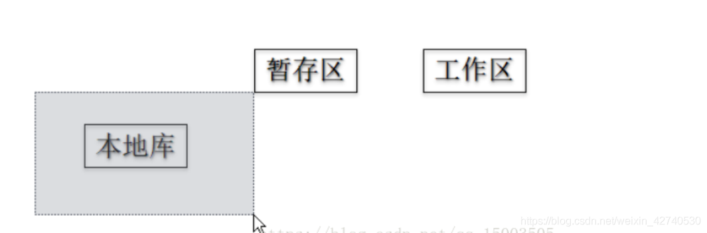
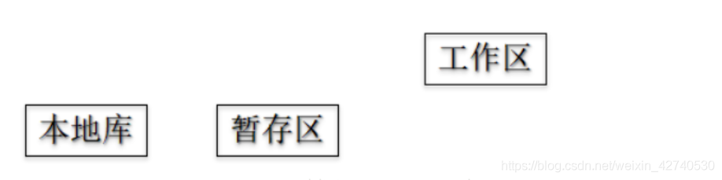
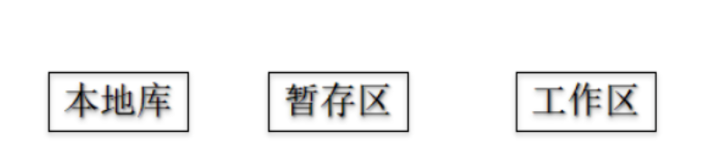
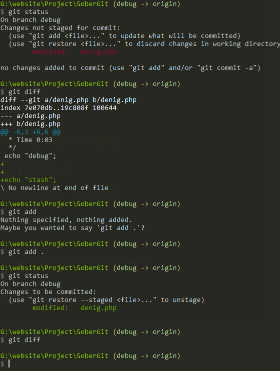
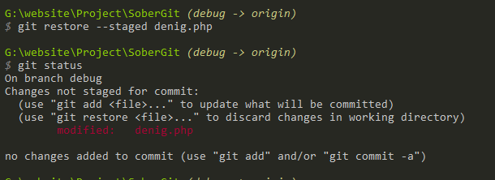
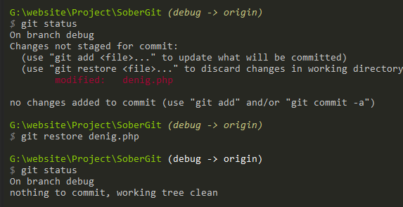
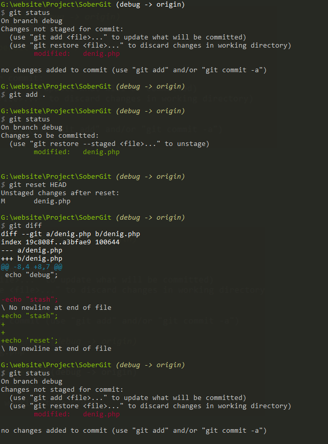
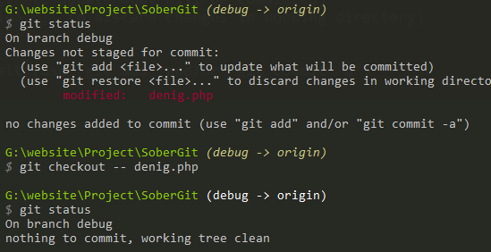

#  git reset


---


## 版本库的回滚；

---


先要清楚在本地，git会分三个区：工作区、暂存区、本地库。

当使用去做版本移动的时候，那么在使用【`--hard`】、【`--mixed`】、【`--soft`】是不一样的。

**1. --soft参数**

```xml
git reset --soft abcdef
1
```

- **仅仅移动本地库`HEAD`指针，并不会对暂存区和工作区产生任何的影响；因为index的暂存数据已经是存在的了；**

仅仅是把本地库的指针移动了，而暂存区和你本地的代码是没有做任何改变的。但是这个时候你上次提交到本地库的代码状态是<font color=red>**绿色**</font>的，即你未做【`commit`】操作。



**2. --mixed参数**

```xml
git reset --mixed abcdef
1
```

- **移动本地库`HEAD`指针**
- **重置暂存区**

不仅移动了本地库的指针，同时还把暂存区的代码也做了移动。也就是说你上次添加到暂存区的代码，现在变成了<font color=red>红色</font>，即未做【`add`】操作。如果不写`--mixed`，**默认也是此参数**。

**3. --hard参数**

```xml
git reset --hard abcdef
1
```

- **移动本地库`HEAD`指针**
- **重置暂存区**
- **重置工作区**

不用解释了，除了上面描述的，同时你本地的代码就是你回退的版本代码。本地代码会丢失，所以基本不用；



不过很多时候，我们在回退更多的是要保留本地代码的，即使用`--mixed`参数。除非你是重新拉取一份，那可以使用`--hard`参数。

---


## git  reset HEAD； 当前版本内的回退；


工作区----1---->暂存区----2-----> 版本库

````````php
git reset HEAD //  //重置暂存区；git status 代码变成了红色 modified；

git  checkout -- file_Name // 重置工作区，当工作区出问题之后可以重置工作区；    
````````


---


## git  restore;当前版本内的回退的优化；

因为git checkout 可以切换分支又可以进行恢复；所以为了保证他的单一原则，座椅在git2.23做了优化；

做了拆分；

``````shell
#eg:
G:\website\Project\SoberGit (debug -> origin)
$ git version
git version 2.25.0.windows.1

# git restore  //当前版本的恢复；
git restore    # 重置工作区； 

git restore --cached    # 重置暂存区；  git status  变红 modified；  // --staged
``````


---


## 测试





//重置索引区；




//重置工作区；




git reset HEAD





git  checkout -- file_name;


