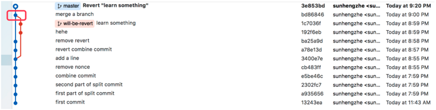

# git revert

# [Git 之 revert](https://segmentfault.com/a/1190000012897697)  ---- 主要是看一下版本链；


>**revert HEAD处于前进的模式，来解决回退的问题；**
>
>**reset 是处于后退模式来解决版本回退的问题；**

---


revert 可以取消指定的提交内容。

**当讨论 revert 时，需要分两种情况，因为 commit 分为两种：一种是常规的 commit，也就是使用 `git commit` 提交的 commit；另一种是 merge commit，在使用 `git merge` 合并两个分支之后，你将会得到一个新的 merge commit**

merge commit 和普通 commit 的不同之处在于 merge commit 包含两个 parent commit，代表该 merge commit 是从哪两个 commit 合并过来的。



在上图所示的红框中有一个 **merge commit，使用 `git show` 命令可以查看 commit 的详细信息**

```bash
#  git show 来查看详细信息！！！
➜  git show bd86846
commit bd868465569400a6b9408050643e5949e8f2b8f5
Merge: ba25a9d 1c7036f
## 需要去考虑 保留那一个分支；
```

这代表该 merge commit 是从 ba25a9d 和 1c7036f 两个 commit 合并过来的。

而常规的 commit 则没有 Merge 行

```bash
# 来查看详细信息！！！
➜  git show 3e853bd
commit 3e853bdcb2d8ce45be87d4f902c0ff6ad00f240a

# git revert commitid 直接进行合并就可以了；
```


---


## revert 常规 commit

**使用 `git revert <commit id>` 即可，git 会生成一个新的 commit，将指定的 commit 内容从当前分支上撤除。**

## revert merge commit

revert merge commit 有一些不同，这时需要添加 `-m` 选项以代表这次 revert 的是一个 merge commit

但如果直接使用 `git revert <commit id>`，git 也不知道到底要撤除哪一条分支上的内容，这时需要指定一个 parent number 标识出"主线"，主线的内容将会保留，而另一条分支的内容将被 revert。

如上面的例子中，从 git show 命令的结果中可以看到，merge commit 的 parent 分别为 ba25a9d 和 1c7036f，其中 ba25a9d 代表 master 分支（从图中可以看出），1c7036f 代表 will-be-revert 分支。需要注意的是 -m 选项接收的参数是一个数字，数字取值为 1 和 2，也就是 Merge 行里面列出来的第一个还是第二个。

我们要 revert will-be-revert 分支上的内容，即 **保留主分支，应该设置主分支为主线**，操作如下：

```bash
➜  git revert -m 1 bd86846
#  -m, --mainline <parent-number>
                          select mainline parent  ## 主线父级
```


## revert 之后重新上线

假设狗蛋在自己分支 goudan/a-cool-feature 上开发了一个功能，并合并到了 master 上，之后 master 上又提交了一个修改 h，这时提交历史如下：

```xl
a -> b -> c -> f -- g -> h (master)
           \      /
            d -> e   (goudan/a-cool-feature)
```

突然，大家发现狗蛋的分支存在严重的 bug，需要 revert 掉，于是大家把 g 这个 merge commit revert 掉了，记为 G，如下：

```xl
a -> b -> c -> f -- g -> h -> G (master)
           \      /
            d -> e   (goudan/a-cool-feature)
```

然后狗蛋回到自己的分支进行 bugfix，修好之后想重新合并到 master，直觉上只需要再 merge 到 master 即可（或者使用 [cherry-pick](https://segmentfault.com/a/1190000012897542)），像这样：

```xl
a -> b -> c -> f -- g -> h -> G -> i (master)
           \      /               /
            d -> e -> j -> k ----    (goudan/a-cool-feature)
```


<font color=red>**i 是新的 merge commit。但需要注意的是，这 不能 得到我们期望的结果。因为 d 和 e 两个提交曾经被丢弃过，如此合并到 master 的代码，并不会重新包含 d 和 e 两个提交的内容，相当于只有 goudan/a-cool-feature 上的新 commit 被合并了进来，而 goudan/a-cool-feature 分支之前的内容，依然是被 revert 掉了。**</font>


所以，如果想恢复整个 goudan/a-cool-feature 所做的修改，应该先把 G revert 掉：

```coq
a -> b -> c -> f -- g -> h -> G -> G' -> i (master)
           \      /                     /
            d -> e -> j -> k ----------    (goudan/a-cool-feature)
```

其中 G' 是对 G 的 revert 操作生成的 commit，把之前撤销合并时丢弃的代码恢复了回来，然后再 merge 狗蛋的分支，把解决 bug 写的新代码合并到 master 分支