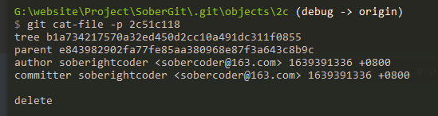
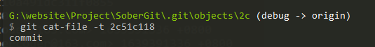
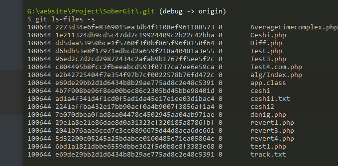

#  数据存储原理；


---

## .git下的文件

>最主要的几个目录；

refs  引用； ===> 本地分支  远程分支 + tag 主要就是这些引用；

**HEAD 本分支的commit；所处的commit； 永远指向当前工作分支！！！**

index 文件索引文件；

objects 对象目录；

---


git的数据存储原理是数据名（index 索引）和数据内容是分开的；


blob 对象就是数据的内容（存储文件内容；），保存在 .git/objects/

````php
// 注意要加上目录名；
git cat-file -t  // 数据类型  
git cat-file -p // 数据内容；
````







对象的三种形式 blob  + tree commit  对象 + tag 对象；四种对象；


git commit 就会生成一个 commit 对象 和一个或者多个tree对象，tree对象里面包含blob对象； tree对象就是包含了 很多的blob对象，一个commit 对象就是有很多的tree对象；

tree对象代表的是commit的目录结构；


## 索引区 也就是暂存区；

>**index 文件的数据，仅仅是索引，数据还是存储在objects 对象里面；**

index  也就是暂存区是存在于.git/index 文件下面的；

可以通过 命令 git ls-files -s  查看文件内容；

索引在index里面；

命令：

`````php
//tree  树的目录结构；方便观看；
git ls-files -s  //查看索引区   .git/index的内容；
`````

分别是权限  blob对象 和 文件名； 0 暂时不知道；


git add  .  当存在于untracked 或者modified修改的时候就  git add .  就会生成一个blob对象;

当 git  add .的时候会在objects区生成一个blob对象，而索引区的blob对象机会改变；表示最新的；




