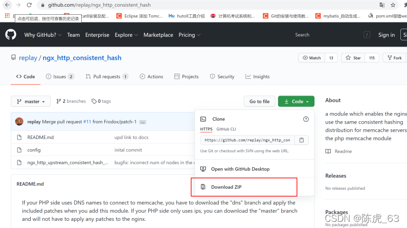
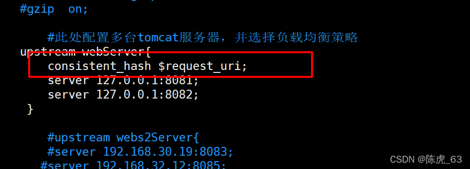
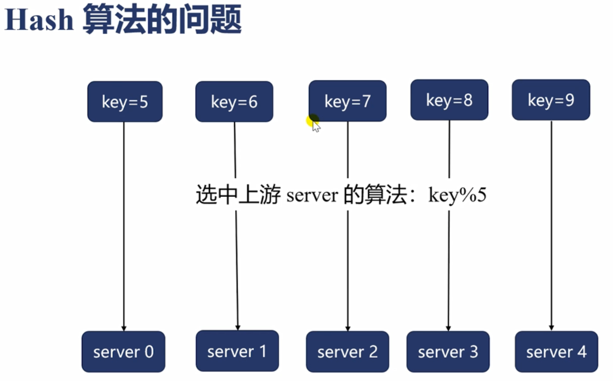
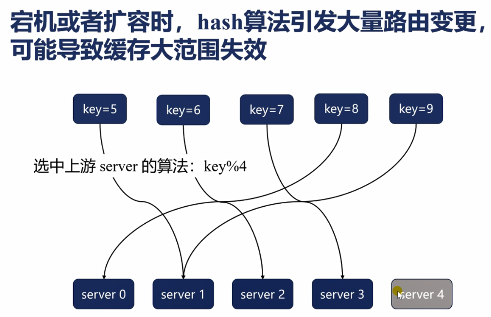
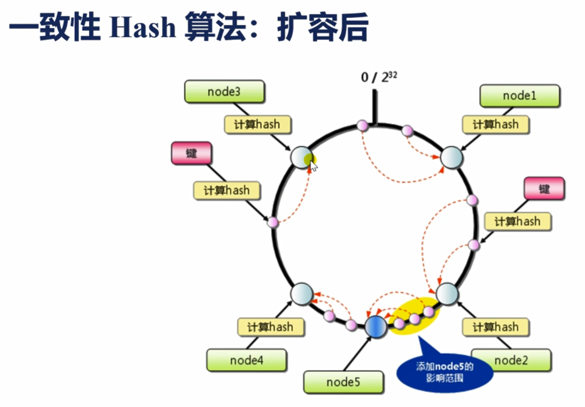

# consistent_hash

 >一致性哈希


安装：
1)下载Nginx一致性hash模块
https://github.com/replay/ngx_http_consistent_hash 进入GitHub下载



2）上传模块到Linux
上传完成后将 zip文件进行解压

3）给Nginx安装模块
进入nginx-1.17.8目录执行命令：
./configure --add-module=/software/ngx_http_consistent_hash-master
注释：module=后面时下载解压的模块在服务器中的绝对路径；
然后执行命令：make
在执行命令：make install

此时一致性Hash模块安装完成！！

配置：
Nginx三种一致性Hash策略：

````nginx
consistent_hash $remote_addr; 根据客户端IP进行映射（常用）
consistent_hash $request_uri; 根据客户端请求的uri进行映射（常用）
consistent_hash $args; 根据客户端请求携带的参数进行映射
````




-----

## 一致性哈希


### hash算法  如果出现扩容，那么会导导致大量的缓存失效；







## 一致性哈希

扩容后，只有部分的缓存失效； 部分缓存失效；

**为了解决哈希偏斜的问题，用虚拟节点来解决这个问题； 服务器节点分布均匀；**

