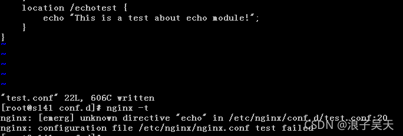
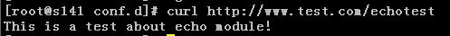

# echo-module


**nginx安装ehco模块；**

<font color= red> 注意：要设置default_type application/octet-stream  当请求的accept字段没有这个这类文件格式的时候就默认是字节流的方式，也就是下载的方式；</font>

**accept  代表浏览器可以展现的，或者说是可以显示的；**

**当然 我们也可以自己去设置自己的head头；他就回去自己去下载；**

我去测试一下；

a'dd_header "content-type" "octet-stream";

add_header "access-control-allow-origin" "*";

````nginx
#default_type  application/octet-stream;
# echo  需要设置默认的type
default_type text/plain;
#设置在某一个路径下也是可以的；
location / {
    default_type text/plain;
}

#设置 add_header头 直接下载；
 47         location / {
 48             add_header "content-type" "application/octet-stream";
 49             #echo $request;
 50             #echo $document_root;
 51             #echo $uri;
 52             #echo $request_uri;
 53             root   html;
 54             #echo $document_root;
 55             index  index.html index.htm;
 56             #echo $request_filename;
 57         }


````

​      


## 1. 直接一开始就用源码安装


要使用第三方模块ngx_echo的功能，请重新配置添加到nginx插件中

 

####下载第三方模块

wget https://github.com/openresty/echo-nginx-module/archive/v0.61.tar.gz

tar -zxvf v0.61.tar.gz ##解压

cd nginx-1.15.8 ##进入nginx源码目录，准备重新配置nginx

 

####配置，--add-module指向模块目录即会安装插件到nginx中

./configure --add-module=/usr/local/src/echo-nginx-module-0.61/

make && make install


##  2.一开始用yum安装了nginx 后面需要自己去编译；


一、Nginx第三方模块简介
ΌΌ第三模块是对nginx 的功能扩展，**第三方模块需要在编译安装nginx 的时候使用参数–add-module=PATH指定路径添加**，有的模块是由公司的开发人员针对业务需求定制开发的，有的模块是开源爱好者开发好之后上传到github进行开源的模块，**nginx支持第三方模块，需要重新编译源码才能支持。**当然除了第三方模块，nginx自身也有些模块默认是不安装的，如果需要可以通过重新编译并–add-module模块名称方式安装模块。本博文以安装echo模块为例，实验环境如下：

操作系统：centos7.6
nginx：1.20.1
echo模块：0.62
二、安装步骤
**1、检查nginx版本**
[root@s141 nginx-1.20.1]# nginx -V
nginx version: nginx/1.20.1

````shell
[root@localhost conf]# nginx -V
nginx version: nginx/1.21.3
built by gcc 4.8.5 20150623 (Red Hat 4.8.5-44) (GCC) 
configure arguments: --add-module=/usr/local/src/echo-nginx-module-0.61

````

**2、确认模块是否安装**

nginx -V

**3、下载对应版本的nginx源代码包**
[root@s141 opt]# wget http://nginx.org/download/nginx-1.20.1.tar.gz

**4、解压nginx软件包**
[root@s141 opt]# tar -zxvf nginx-1.20.1.tar.gz

**5、下载echo模块**
[root@s141 opt]# wget https://github.com/openresty/echo-nginx-module/archive/v0.62.tar.gz

**6、解压echo模块软件包**
[root@s141 opt]# tar -zxvf v0.62.tar.gz

**7、重新编译并添加echo模块**
[root@s141 opt]# cd nginx-1.20.1
[root@s141 nginx-1.20.1]# ./configure [省略] --add-module=/opt/echo-nginx-module-0.62
省略内容根据nginx -V查看的内容补充，需要补充的内容见下截图位置1所示，位置2为需要新安装的模块，使用–add-module关键字，后面是模块的存储路径。


**8、make安装**
切忌不要直接make install。
[root@s141 nginx-1.20.1]# make

**9、备份原nginx二进制文件**
[root@s141 nginx-1.20.1]# which nginx
/usr/sbin/nginx
[root@s141 nginx-1.20.1]# cp /usr/sbin/nginx /usr/sbin/nginx.bak

**10、使用新编译安装的nginx二进制文件覆盖原文件**
[root@s141 nginx-1.20.1]# **cp -f objs/nginx /usr/sbin/nginx**
cp: overwrite ‘/usr/sbin/nginx’? y

**三、安装验证**
1、配置echo测试内容
**如下下图所示配置echo测试指令，验证配置文件的时候报错找不到echo指令，原因就是echo模块未安装。**


2、**安装第三方模块后验证配置**
[root@s141 nginx-1.20.1]# **cp -f objs/nginx /usr/sbin/nginx**
**cp: overwrite ‘/usr/sbin/nginx’? y**
[root@s141 sbin]# nginx -t  #测试模块；
**nginx: the configuration file /etc/nginx/nginx.conf syntax is ok**
**nginx: configuration file /etc/nginx/nginx.conf test is successful**

3、重启nginx服务
[root@s141 conf.d]# systemctl stop nginx
[root@s141 conf.d]# systemctl start nginx

4、访问链接验证




