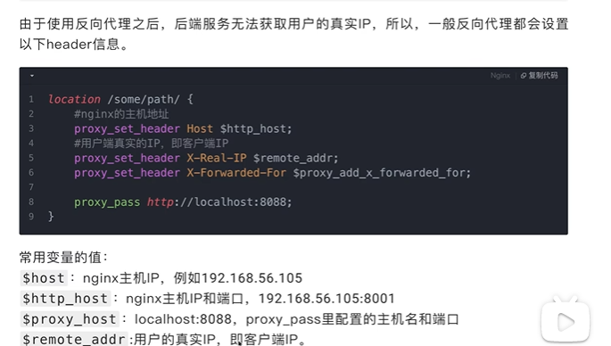
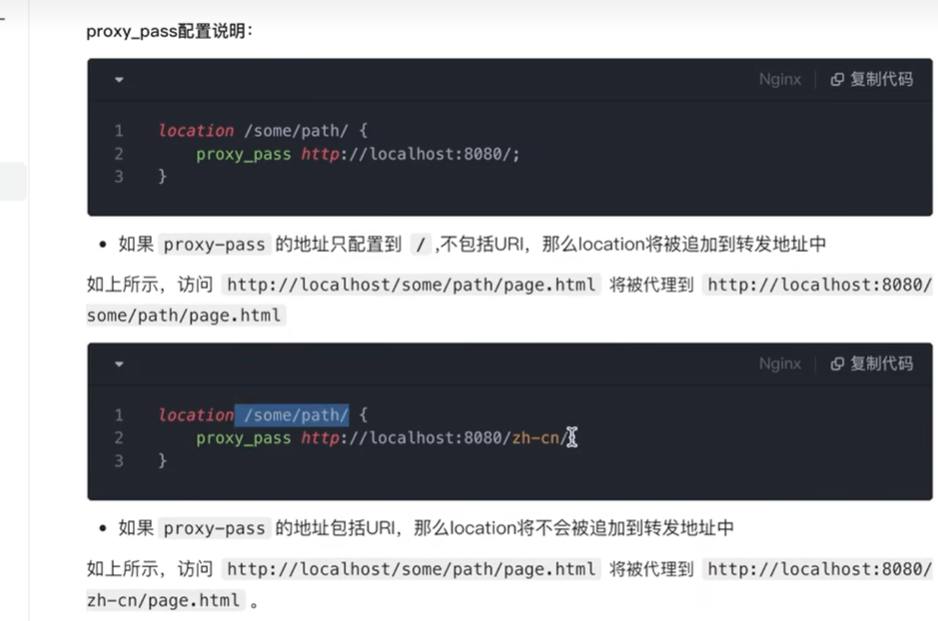
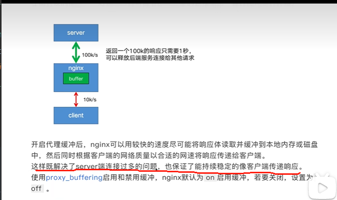
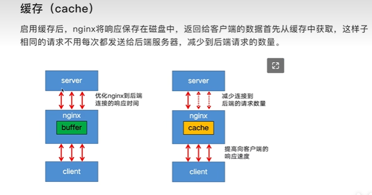
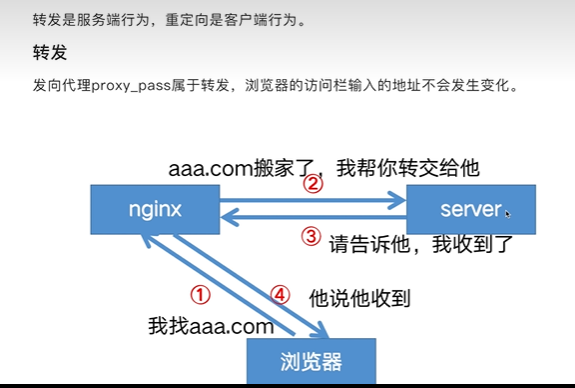
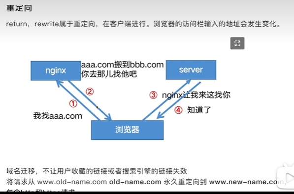
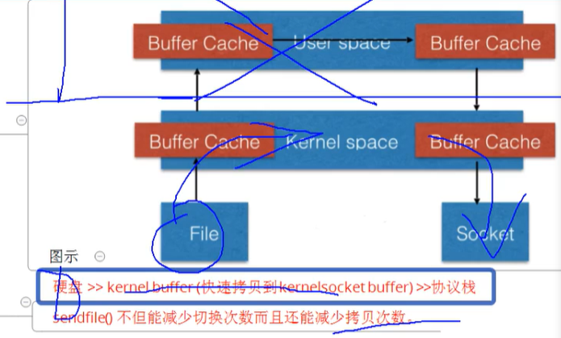
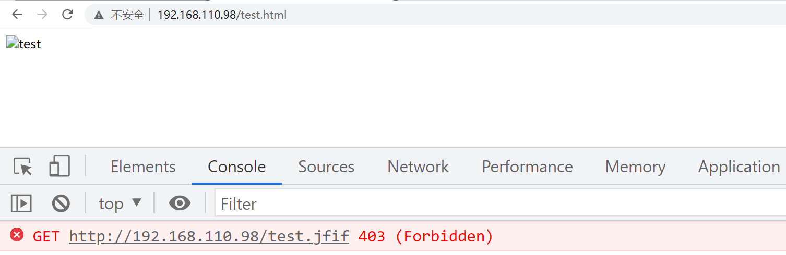

# Summary 总结


---

##  nginx 的优势；

多进程，分为master进程和多个worker进程，master进程调度和管理工作进程；

多路复用异步模型epoll；

一个进程处理多个请求，所以消耗内存会比较小；

一般会作为静态服务器；支持php动态需要fastcgi 公共网关接口来支持；

---

## 基础语法

`````nginx
##nginx.conf
# 设置一个变量；
set $ceshi_ss sss; 设置一个变量；
使用是直接使用$ceshi_ss

`````


---


##nginx.conf 的目录结构；


<font color=red>**注意上面的upstream 属于http模块里面的模块；和server 是同级别的；**</font>

**每一个server 就是一个虚拟服务器，虚拟主机配置；**

`````nginx
## 静态网页；
## 日志所在的目录 tail -f /var/log/nginx/*.log  动态的查看一下日志把；
server {
    ## 注意listen+server_name 只要这两个有一个不一样就可以了，端口相同，那么会根据server_name 来做区分；
    listen 8000;
    server_name localhost;
    
    location / {  ## 路由规则；-- 就是url的匹配规则；
        root /ceshi/; # 配置根目录；
        index Index.php index.html; ## 配置首页； 可以是多个首页，多个之间用 空格隔开；
	}
    
    location /admin {
		root /ceshi;  # 这个访问的目录是/ceshi/admin 加上这个目录； 
        index  index.php index.html;
    }
    location /admin {
		alias /ceshi/; # 取别名  用ceshi/来代替admin；来代替url中的admin；
    }
    
    
}

`````


``````nginx
# alias 和root的区别？ --- 深层次的了解去看看 详细的root 和alias的详解！！！！
alias和root是Nginx配置中用于指定文件路径的两个指令，它们之间有一些重要的区别。
##指定了根目录 要在那个目录里面去寻找，alias指定文件所在的目录；
root指令用于指定一个目录，Nginx会在这个目录下寻找与请求的URI相对应的文件。例如，如果请求的URI是/images/image.jpg，并且root指令指定的是/var/www，那么Nginx会尝试在/var/www/images/image.jpg中寻找对应的文件。

alias指令也用于指定一个目录，但它可以用于重写请求的URI。当使用alias指令时，请求的URI会被重写为指定目录下的路径。例如，如果请求的URI是/static/images/image.jpg，并且alias指令指定的是/var/www/static/，那么Nginx会尝试在/var/www/static/images/image.jpg中寻找对应的文件，但在响应中，URI仍然是/static/images/image.jpg。

因此，root用于简单地指定文件所在的根目录，而alias则允许您重写请求的URI，并指定文件所在的具体目录。
``````


---

## 反向代理

>服务器端的代理就是反向代理；
>
>客户端的代理就是正向代理；比如，翻墙软件；

````nginx
server {
    listen 8001;
    server_name shuai.com
    location  / {
        ##怎么获取真实的用户ip解决问题；
        ## 给代理设置一个header头；
        ##nginx 的主机服务器；
        proxy_set_header Host $http_host; #代理服务器的主机；
        ##用户端真实的IP地址，及客户端IP;
        proxy_set_header X-Real-IP $remote_addr;
        proxy_set_header X-Forwarded-For $proxy_add_x_forwarded_for;
		proxy_pass http://localhost:8088
    }
}
````





````nginx
# 也是分为替换，根目录都是一样的；都是一样的；；是否替换了目录；
````




````nginx
   location ~ \.php$ {
        include fastcgi_params;
        fastcgi_read_timeout 1200;
        fastcgi_param SCRIPT_FILENAME $document_root$fastcgi_script_name;
        fastcgi_pass   php7.4:9000;
        #fastcgi_param PATH_INFO $1;
        #fastcgi_pass unix:/var/run/php5-fpm.sock;
        #fastcgi_param REMOTE_ADDR "192.168.0.105";
        try_files $uri =404;
    }
````


----

## 动静分离

>**给后台服务器降压； 请求流太多了，做一个分流把；**

````nginx
server  {
    listen 9000;
    server_name synamic.com
    
    location /static {
        #跨服务器的匹配！！！
        proxy_pass http://static/
    }
    #动态服务器；
    location ~ \.php$ {
     	   fastcgi_pass php7.4:9000
	}
    location ~ \.(js|css|gif|jpg|png|ico)$ {
        root /homw/www/static #去这个根目录去修改；
    }
    ## 当文件后缀太多没法用后缀进行匹配的时候 可以使用文件目录的匹配；
    ## ^~前缀匹配；uri开始是啥！！！
    location ^~ /fonts/ {
		root /home/www/static
    }
    
}

````


---

## try_files

>先去找文件存不存在，然后再去找目录存不存在，如果都不存在；

`````nginx
## 上面的动静分离可以做优化

server {
    listen 9011;
    server_name ceshi.com
    root  # 根目录
    index # 首页；
    
    location /proxy {
        # 访问的目录和root 是有关系的；root + proxy;就是访问的目录和文件结构；
        # 先去本地目录去查找，找不到然后
        try_files $uri $uri/ @proxy =404;
    }
    
    location proxy {
        proxy_pass http://ceshi.com;
    }
}
`````


----

## 限流

>**漏桶和令牌桶，了解一下呀；**

---

````nginx
http {
	limit_req_zone $binary_remote_addr zone=iplimit:10m rate=1r/s;
    server {
        server_name  www.nginx-lyntest.com;
        listen       80;
        location /access-limit/ {
            proxy_pass   http://127.0.0.1:5001/;
            # 根据ip地址限制流量
            limit_req zone=iplimit burst=2 nodelay;
        }
    }
}
````


---

## 缓冲（buffer） and   缓存（cache）

>**这里的缓冲的作用就是：异步网络通信，ｓｅｒｖｅｒ不需要等待ｎｇｉｎｘ传输消息到ｃｌｉｅｎｔ就可以关闭网络了；**
>
>**proxy代理 的缓冲和缓存；**
>
>不加缓冲区，整个通信，需要server传递消息到nginx nginx 传送给client，server的任务才算完成；才会关闭连接；因为nginx到client 的通信属于外网，有可能受到网络状况的影响会变得很差；
>
>加缓冲区，server把全部消息发送给nginx buffer就算结束了；发送消息交给nginx就行了；
>
>





---

## 负载均衡

`````nginx
##考虑一下这几种模式；
## upstream 是和 server 是同一个层级的；
## 轮询  权重，ip hash 一致性哈希； 解决服务器宕机和服务器扩容大量服务器没办法正常请求的问题；

## 轮询；默认；
upstream ruoyi
{
	server localhost:8080;
    server localhost:8089;
}
## weight
upstream ruoyi
{
    server localhost:8080 weigh=2;
    server localhost:8089 ;
}


#一致性哈希；
upstream ruoyi
{
    # 一致性哈希算法，可以最大程度的减少缓存失效；
    hash $request_uri consistent; 
	server localhost:8080;
    server localhost:8089;
}
#ip hash;
upstream ruoyi
{
    ip_hash;
	server localhost:8080;
    server localhost:8089;
}

##----------------------------
server {
    listen 9000; 
    server_name ceshi.com;
    location /proxy {
        #这里加了协议名字了，那么upstream 就不不需要加了；
        proxy_pass http://ruoyi;
    }
}
`````


----

## return and rewrite 重写 和 转发的区别？

> 

`````nginx
#return 服务器停止处理并且将状态码status code返回给客户端；
return code URL;  # 注意url 一定要写ip地址；  // 301  或者直接302 
return code text; #default_type text/plain;可以返回text 文本的形式；
return code;
return URL;
# eg ：
return 301 $schema://www.new_name.com$uri; # 一般会用这种方式来做重定向；


## rewrite -- 指定正则匹配；
## 调试的时候一定要先打开rewrite_log on;  会以指令的处理结果以notice级别的日志写入到error_log中。
## 语法： rewrite regex replacement [flag];
# eg: 
rewrite ^/users/(.*)$ http://ceshi.com/show?user=$1;
## flag 标志位；
last;      #last ；
break;    # break;
redirect； # 暂时重定向；
permanent; # 永久重定向；

   location  /ceshi1 {
        #默认是last 客户端url 并不会发生改变；；
        rewrite ^ http://www.demo.com;
   }


`````

### <font color=red>转发是服务端的行为，重定向是客户端的行为；</font>

### 转发



### 重写

> 还是客户端访问，如果客户端没有在host定义这个服务肯定是访问不到的，所以这里用了ip地址；



---

## location

`````nginx
## 就四个优先级
## 加* 代表是忽视大小写；不加* 代表的有大小写；
######---------------------------------------------------------------------------------------------
## 精确匹配 优先级最高； /ceshi后面必须是没有东西的，然后结束匹配；
location = /ceshi  {
    
}
##模糊匹配是只要有这个
## 模糊匹配 前缀匹配；  ceshi 后面可以是有东西的；但是开始必须是以/ceshi为开头；
location ^~ /ceshi {

}
## 模糊匹配  ---只要存在ceshi 就可以了；
location ~ /cehi {
    
}

##  普通匹配 优先级是最低的； 全部的请求都会走这个location  普通匹配原则 就是前缀匹配原则；
## 普通匹配，优先匹配长的  并且是从开头开始匹配的；
## Nginx中的普通匹配是从URI的开头开始匹配的。当使用普通的location指令时，Nginx会尝试将请求的URI与配置中的location路径进行前缀匹配。如果请求的URI以指定的location路径开头，Nginx就会使用该location块中的配置来处理请求。
location  /  {

}

location  /ceshi {
    
}
`````


`````php
# 优先级会高；
这两个location指令之间的区别在于它们的匹配优先级和匹配规则。

"location /ceshi"使用的是普通的前缀匹配规则。它会匹配以"/ceshi"开头的所有URI，并且如果有更具体的匹配规则，比如正则表达式匹配，那么这个普通匹配规则会被忽略。

而"location ^~ /ceshi"使用的是最长的前缀匹配规则。它会优先匹配以"/ceshi"开头的URI，并且如果有更具体的匹配规则，比如正则表达式匹配，也会被忽略。这意味着当请求的URI以"/ceshi"开头时，Nginx会优先选择这个最长前缀匹配规则来处理请求，而不会再去尝试其他匹配规则。

因此，"location ^~ /ceshi"具有更高的匹配优先级，即使有更具体的匹配规则存在，也会被忽略。
`````

`````php
## 最长前缀匹配规则；
最长前缀匹配规则指的是在Nginx配置中，当有多个location指令可以匹配同一个URI时，Nginx会选择最长的匹配前缀来处理请求。这意味着如果有一个URI可以匹配多个location指令，Nginx会选择URI与location路径最匹配的那个location块来处理请求。

举个例子，如果有以下两个location指令：

location /images
location ^~ /images/avatars
当请求的URI是/images/avatars/test.jpg时，因为"/images/avatars"是"/images"的最长匹配前缀，Nginx会选择第二个location指令来处理这个请求。

这种规则可以帮助您更精确地控制请求的处理逻辑，确保请求被正确地路由到相应的location块中。
`````


----

## Header 及其参数；

`````nginx
### http模块的嵌入式变量；

<font color=red>注意：带有http的都是请求的header头信息； 客户端想要获取该字段信息必须要加一个http</font>；

<font color=red>注意 带有\$request的基本都跟请求行有关；请求的相关信息；</font>

<font color=red> \$remote  基本都跟客户端相关的信息；</font>

<font color=red>$server 都是跟服务器 相关的信息；</font>

````nginx
#最常用的几个参数
$request 
$request_uri == $uri
$request_filename  #绝对路径
$request_method  
$args  参数query_string;
$is_arg 是否有参数
#   try_files $uri $uri/  /index.php$is_args$args;
$request_body
$document_root
$request_id # 不怎么常用；

# header头
$http_user_agent
$http_referer
$content_type
$status  状态
$host
$scheme

#remote  客户端
$remote_addr
$remote_port
$remote_name
$binary_remote_addr  # 二进制 客户端ip

# 服务端
$server_addr
$server_name
$server_port
$time_local 本地的时间格式；


url   http://192.168.146.29/ceshiceshi/a.html

\$uri  /ceshiceshi/a.html   request 请求的目录；

\$request_filename  ===> /usr/local/nginx/ceshi/ceshiceshi/a.html  基于root（根） 和别名的url；
$request_filename
当前请求的文件路径，基于 根或别名 指令，以及请求 URI
````


`````

`````nginx
# add_header 
在Nginx中，add_header指令用于向响应头部添加一个或多个自定义的HTTP头。其语法如下：
add_header name value [always];
name: 指定要添加的HTTP头的名称。
value: 指定要添加的HTTP头的值。
always: 可选参数，如果指定了always，则表示无论响应状态码是什么，都会添加指定的HTTP头。如果不指定always，则只有当响应状态码为2xx或3xx时才会添加指定的HTTP头。

## ---------
add_header指令可以在http、server和location块中使用。这意味着您可以在全局配置中使用它（在http块内），也可以在特定的服务器配置中使用（在server块内），还可以在特定的位置配置中使用（在location块内）
`````


---

## https

---

## tcp模块； tcp的反向代理；

`````nginx
## 和http是同一个等级的模块；
main 模块；
events {
}
http {
    upstream sum {

    }
    server {
        location  / {

        }
        
    }
    
}
# tcp模块；和http是同级的；
stream {
    # 当超过 60s空闲时间超过60s则会关闭连接；
    # keepalive 就是长连接的意思；
    keepalive_timeout 60;
    upstream backend {
        server localhost:3306;
        server localhost:6679;
        # 可以设置连接池，这里的8是空闲连接的数目；
        keepalive 8;  ## 解决 tcp 连接频繁创建的问题；
    }
    server {
        listen 12345;
        proxy_pass localhost:3306;
    }
}
`````


---

## upstream 上游，谁有数据谁就是上游；上游是有源头 的呀，在互联网中源头就是数据；

>**数据由服务器提供，留下客户端，服务器肯定是上游呀；**

我们可以对照人类对现实物理世界的理解来理解这个问题。我们普遍认为河流的源头是在整条河流的【上流】的。观照物理世界，虚拟世界也采用了这种思维方式。网络资源好比是水流。因为网络资源的【源头】是在源服务器（origin server），所以在网络资源流经的这个路径来看，它是上游（upstream）。
我们也可以换一个通俗的角度去理解：客户端请求服务端，服务端是爷啊，当然在高高在up啦。


---

## Remote SSH  ---以后搞把，可以直接访问 服务器；


---

## 其他的http模块；

````nginx
gzip on; # gzip 压缩；压缩；传输效率变高了，但是需要运算 ，肯定会消耗cpu；
````

`````nginx
expires 24h; # 添加强制缓存； cache-control:max-age=111111;
expires 30d;
default_type application/json;  # 设置响应的content-type;
`````


``````nginx
sendfile on;
tcp_nopush on;
``````

`````nginx
keepaliv_timeout 1200; ## 长连接；
`````

`````nginx
error_page 404 /404.html; 
`````

`````nginx
# 只能 address1 可以访问 其他的都可以访问；
allow address1;
allow address2;可以是多个address2；
deny all;
return 403;禁止访问；
#### -------------------------------------------------------------------------------------------------------------
以下是一个简单的示例：
http {
    deny 192.168.1.1;
    allow all;
    ...
}
在这个示例中，IP地址为192.168.1.1的客户端将被拒绝访问。您还可以使用正则表达式等更复杂的条件来定义黑名单规则，以满足特定的需求。
请注意，使用黑名单功能时要小心，确保您的规则不会误伤合法用户。
`````


### sendfile

>减少copy 的次数； 如果你们服务器需要大量的文件传输需要使用这个方案；
>
>零copy；

默认是打开的；

只走内核态的buffer 缓冲区；

sendfile  on；

位置：http  模块




---


###tcp_nopush 

>并不是直接发送消息，而是加一个缓冲区；

**产生的信息 不直接不推送；** 这里就是加一个缓存；

不加  tcp_nopush 会造成网络资源； 

典型情况下，一个包忽悠用一个字节的数据，以及40个字节长的包长，会产生4000%的过载；很轻易的就能令网络产生拥塞，同时也浪费资源；

就像马路上的货车一样，本来可以运输1吨重的货车，现在只能运输1KG那么车的车辆 肯定增多，并且浪费的油和人力资源也就越多；


积累一定的程度然后再发送包；	


----

## **3.1 域名重定向**

**场景：**公司官网上线的时候地址为[www.aaa.com](https://zhuanlan.zhihu.com/p/629012092/www.aaa.com)，随着公司的不断发展，需要将官网地址升级为[www.bbb.com](https://zhuanlan.zhihu.com/p/629012092/www.bbb.com)，但是需要在访问[www.aaa.com](https://zhuanlan.zhihu.com/p/629012092/www.aaa.com)能够自动跳转到[www.bbb.com](https://zhuanlan.zhihu.com/p/629012092/www.bbb.com)。

**Tips：[www.aaa.com](https://zhuanlan.zhihu.com/p/629012092/www.aaa.com)和[www.bbb.com](https://zhuanlan.zhihu.com/p/629012092/www.bbb.com)需要指向同一IP。**

**解决方案：**使用rewrite指令重写URI。

```properties
 server {
     listen 80;
     server_name www.aaa.com;
     rewrite ^(.*) https://www.bbb.com$1;  #需要做重定向；
 }
```

## **3.2 优雅处理防盗链**

## vaild_referers 

"valid_referers"指**令用于指定允许访问资源的引用来源。当客户端请求资源时，Nginx会检查请求的引用来源，并根据"valid_referers"指令中定义的规则来决定是否允许访问。**

以下是一个示例配置：

```nginx
CopyOpenlocation /protected/ {
    valid_referers none blocked server_names example.com *.example.com;
    if ($invalid_referer) {
        return 403;
    }
    # 其他指令
}
```

在这个例子中，"valid_referers"指令指定了允许访问资源的引用来源。如果请求的引用来源不符合指定的规则，Nginx会将变量$invalid_referer设置为1，然后返回403 Forbidden响应。

---


## 实例

前面我们在【Nginx静态资源防盗链】一文中已经简单的实现了静态资源的防盗链，但是展示在页面的是一个裂开的小图片，不够美观。



我们可以如下配置：

```properties
 location ~^/.*\.(png|jpg|gif|jfif) {
     valid_referers www.example.com;
     if ($invalid_referer){
         rewrite ^/ http://192.168.110.98/images/forbidden.png;
     }
     root   html;
 }
```

如果出现盗链的情况，将会出现类似于如下效果：


**以上就是Nginx之rewrite实现URL重写，Nginx是多模块化的，还有很多高级功能，我们后面继续探索。**


---

## todo

rewrite return 重定向问题 ，客户端的url会不会发生改变；

```nginx

    # return 实现重定向；
    location /returnc {
        #客户端url 会发生改变；
        # return 301 http://demo.com;
        # 暂时重定向；
        # 客户端url 也会发生改变；
        return 302 http://demo.com;
    } 
    # rewrite
    location /rewritec {
        #也会跳转；客户端也会跳转；
        # rewrite ^ http://demo.com redirect;
        # rewrite ^ http://demo.com permanent;
        # 没有flag； 默认是302
        rewrite ^ http://demo.com; 
    }
```


break；

````php
#块内的代码不再运行你；
````


 rewrite flag ；怎么设置的；

`````nginx
#还有问题的只有last 和break 的区别？
last  和break；的问题；
###------------------------------------
last 会去搜索其他的location；
break; 不会去搜索其他的location；


`````


try_files 这边第三个参数是什么？  是重定向吗？

````nginx
# 就会 fall back 到 try_files 的最后一个选项 /index.php，发起一个内部 “子请求”，也就是相当于 nginx 发起一个 HTTP 请求到 http://localhost/index.php。
# 并不是重定向呀； 重定向是从客户端发送请求；
# 先是文件，然后是目录 然后是nginx 的内部请求；
try_files $uri $uri/ index.php$is_arg$args  ## 一般都是把后缀不是.php的并且不是静态文件的转换成后缀是.php 的文件;
````

----


## uri  和文件的对应关系；


`````nginx

server {

    #注意nginx 没有暴漏 9000端口；
    listen 80;
    server_name  test.com www.test.com;
    root /datadisk/website/Project/Test; # 没有fastcgi 并不会走php的；
    index index.html;

    location / {
        default_type text/html;
        #访问的文件地址 一直都是$document_root + $uri == $request_filename;
        #这个变量就是我要访问的文件的变量；
        # return 200 $request_filename;
        # rewrite ^/old/(.*)$ /new/$1;  #404 后面的不会执行；
        # rewrite ^/new/(.*)$ /pro/$1;
    }
}

如果我们uri = /ceshi
那么访问的文件目录 $request_filename == $root + $uri  才是真正的目录；注意一下；
`````


----

## location的普通匹配是什么意思？

`````nginx
##普通匹配搞明白他； 
## 就是普通的前缀匹配规则+ 最长前缀匹配原则 /php 肯定会比 / 优先匹配；
location /php
{
    
    
}
# 全部都匹配；
location /  {

}
`````


## 怎么看待 rewrite 和  try_files

>last 会重新处理这个请求（就会去重新匹配location）；break 不会重新处理这个请求；但是都会重写url；
>
>try_files 看成

````nginx
Developer/Programmer (vscode-openai) Date: 1/2/2024, 4:09:13 PM

### 不是，默认情况下，nginx的rewrite指令的默认参数是last，而不是redirect。当使用rewrite指令时，如果没有指定参数，则默认情况下会使用last参数，这将导致nginx在执行重写后继续处理请求的其余部分。如果您想要执行重定向，您需要显式地指定redirect参数。

Date: 1/2/2024, 4:13:09 PM
nginx rewrite last 和 break 是nginx发送的新请求还是 ？

Developer/Programmer (vscode-openai) Date: 1/2/2024, 4:13:13 PM

### nginx rewrite指令中的last和break参数都不会发送新的请求。
##### 当使用last参数时，nginx会重新处理请求，但是URL会被重写。
######而使用break参数时，nginx会停止当前的rewrite指令集并使用重写后的URL。
####这些参数的作用是控制nginx在重写后如何处理请求的后续流程，而不是发送新的请求。

Date: 1/2/2024, 4:15:14 PM
try_files 的第三个参数 nginx 会重新发送一个请求吗？

Developer/Programmer (vscode-openai) Date: 1/2/2024, 4:15:23 PM
### nginx 内部的重定向；
### try_files指令的第三个参数是一个URI或者一个状态码。如果指定了一个URI，则nginx会内部重定向到这个URI，而不会发送新的请求。如果指定了一个状态码，nginx会返回该状态码，也不会发送新的请求。因此，try_files指令的第三个参数不会导致nginx发送新的请求。
````

---


```nginx
## ------ keepalive 
大白话来说就是，VRRP协议允许一台机器可以拥有一个或者多个虚拟IP。在高可用的一组机器中，有
一个master，多个slave，对外提供一个虚IP，通过虚IP访问master，slave负责监控master，如果
master宕机，则选举其中一个slave接管master，虚IP绑定到新的master上（俗称IP漂移），从而实
现了高可用。
```

