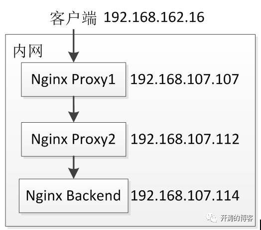
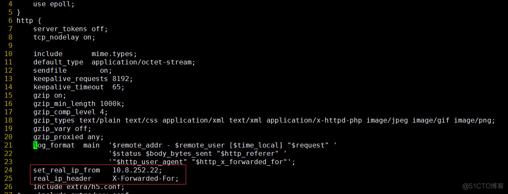
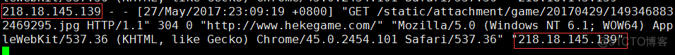

#  real_ip module


[nginx](https://so.csdn.net/so/search?q=nginx&spm=1001.2101.3001.7020)的自带变量 $remote_addr 代表客户端的IP


remote_addr代表客户端的IP，但它的值不是由客户端提供的，而是服务端根据客户端的ip指定的，当你的浏览器访问某个网站时，假设中间没有任何代理，那么网站的web服务器（Nginx，[Apache](https://so.csdn.net/so/search?q=Apache&spm=1001.2101.3001.7020)等）就会把remote_addr设为你的机器IP，如果你用了某个代理，那么你的浏览器会先访问这个代理，然后再由这个代理转发到网站，这样web服务器就会把remote_addr设为这台代理机器的IP。


但是实际场景中，我们即使有代理，也需要将$remote_addr设置为真实的用户IP，以便记录在日志当中，当然nginx是有这个功能，但是需要编译的时候添加--with-http_realip_module 这个模块，默认是没有安装的。


\#这个模块允许从请求标头更改客户端的IP地址值，默认为关


忽略x_forwarded_for    


其实，当你使用了Nginx的realip模块后，就已经保证了remote_addr里设定的就是客户端的真实IP，再看下这个配置

上面的配置就是把从192.168.100.0这一网段过来的请求全部使用X-Forwarded-For里的头信息作为remote_addr

```
set_real_ip_from 192.168.100.0` `/24` `;``real_ip_header   X-Forwarded-For;
```


它就是把x_forwarded_for设为remote_addr，而nginx里的x_forwarded_for取的就是其中第一个IP。

使用这些设置就能保证你的remote_addr里设定的一直都是客户端的真实IP，而x_forwarded_for则可以忽略了


提示:

nginx -V 可以查看到的编译参数和编译的模块(静态和动态)


没有这个模块  ngixn配置文件中是不识别set_real_ip_from  192.168.100.0/24; 这个指令的


最简单测试的的就是:

 --prefix=/usr/local/nginx --with-http_stub_status_module --with-http_ssl_module --with-http_realip_module


模拟当然就很简单了

客户端:

curl -I bbs.test.com  -H 'X-Forwarded-For: 2.2.2.2' 

代理看到的remote_addr 会是"2.2.2.2"


ngixn server看到的也是2.2.2.2 


有client nginx-proxy  ngixn-server  curl -I bbs.test.com 这样就可以测试了。

本文转自残剑博客51CTO博客，原文链接http://blog.51cto.com/cuidehua/1827244如需转载请自行联系原作者


cuizhiliang


# REMOTE_ADDR


代理器的ip地址；

**表示发出请求的远程主机的 IP 地址，remote_addr代表客户端的IP，但它的值不是由客户端提供的，而是服务端根据客户端的ip指定的，当你的浏览器访问某个网站时，假设中间没有任何代理，那么网站的web[服务器](https://www.baidu.com/s?wd=服务器&tn=24004469_oem_dg&rsv_dl=gh_pl_sl_csd)（[Nginx](https://www.baidu.com/s?wd=Nginx&tn=24004469_oem_dg&rsv_dl=gh_pl_sl_csd)，[Apache](https://so.csdn.net/so/search?q=Apache&spm=1001.2101.3001.7020)等）就会把remote_addr设为你的机器IP，如果你用了某个代理，那么你的浏览器会先访问这个代理，然后再由这个代理转发到网站，这样web服务器就会把remote_addr设为这台代理机器的IP**

# x_forwarded_for

简称XFF头，它代表客户端，也就是HTTP的请求端真实的IP，只有在通过了HTTP 代理或者负载均衡服务器时才会添加该项，正如上面所述,当你使用了代理时,web服务器就不知道你的真实IP了,为了避免这个情况,代理服务器通常会增加一个叫做x_forwarded_for的头信息,把连接它的客户端IP(即你的上网机器IP)加到这个头信息里,这样就能保证网站的web服务器能获取到真实IP

格式一般为：

```csharp
X-Forwarded-For: 1.1.1.1, 2.2.2.2, 3.3.3.3
```

代表 请求由`1.1.1.1`发出，经过三层代理，第一层是`2.2.2.2`，第二层是`3.3.3.3`，而本次请求的来源IP`4.4.4.4`是第三层代理



## 场景1

是很简单的场景，[Nginx](https://so.csdn.net/so/search?q=Nginx&spm=1001.2101.3001.7020) Proxy直接把请求往后转发，没有做任何处理

```csharp
Nginx Proxy


192.168.107.107 nginx.conf


location /test {


    proxy_pass http://192.168.107.112:8080;


}


192.168.107.112 nginx.conf


location /test {


    proxy_pass http://192.168.107.114:8080;


}


Nginx Proxy就是简单的把请求往后转发。


Nginx Backend


192.168.107.114 nginx.conf


location /test {


    default_type text/html;


    charset gbk;


    echo "$remote_addr || $http_x_forwarded_for";


}
```

Nginx Backend输出客户端IP（$remote_addr）和X-Forwarded-For请求头（$http_x_forwarded_for），当访问服务时输出结果如下所示：

```csharp
192.168.107.112 ||
```

分析
1.$remote_addr代表客户端IP，当前配置的输出结果为最后一个代理服务器的IP，并不是真实客户端IP； 
2.在没有特殊配置情况下，X-Forwarded-For请求头不会自动添加到请求头中，即Nginx Backend的$http_x_forwarded_for输出为空。

## 场景2

通过添加X-Real-IP和X-Forwarded-For捕获客户端真实IP。

```csharp
Nginx Proxy


192.168.107.107 nginx.conf


location /test {


    proxy_set_header X-Real-IP $remote_addr;


    proxy_set_header X-Forwarded-For $proxy_add_x_forwarded_for;


    proxy_pass http://192.168.107.112:8080;


}


192.168.107.112 nginx.conf


location /test {


    proxy_set_header X-Forwarded-For $proxy_add_x_forwarded_for;


    proxy_pass http://192.168.107.114:8080;


}


Nginx Backend


192.168.107.114 nginx.conf


location /test {


    default_type text/html;


    charset gbk;


    echo "$remote_addr ||$http_x_real_ip  ||$http_x_forwarded_for";


}
```

当访问服务时，输出结果为：

```csharp
192.168.107.112 || 192.168.162.16 || 192.168.162.16, 192.168.107.107
```

分析
1.在离用户最近的反向代理NginxProxy 1，通过“proxy_set_header X-Real-IP $remote_addr”把真实客户端IP写入到请求头X-Real-IP，在NginxBackend输出$http_x_real_ip获取到了真实客户端IP；而Nginx Backend的“$remote_addr”输出为最后一个反向代理的IP； 
2.“proxy_set_headerX-Forwarded-For $proxy_add_x_forwarded_for”的是把请求头中的X-Forwarded-For与$remote_addr用逗号合起来，如果请求头中没有X-Forwarded-For则$proxy_add_x_forwarded_for为$remote_addr。 
X-Forwarded-For代表了客户端IP，反向代理如Nginx通过$proxy_add_x_forwarded_for添加此项，X-Forwarded-For的格式为X-Forwarded-For:real client ip, proxy ip 1, proxy ip N，每经过一个反向代理就在请求头X-Forwarded-For后追加反向代理IP。 
到此我们可以使用请求头X-Real-IP和X-Forwarded-For来获取客户端IP及客户端到服务端经过的反向代理IP了。这种方式还是很麻烦，$remote_addr并不是真实客户端IP。

# X-Real-IP

当有多个代理时候，可以在第一个反向代理上配置“proxy_set_header X-Real-IP $remote_addr” 获取真实客户端IP；

# -----------------------------------------

X-Forwarded-For一般是每一个非[透明代理](https://www.baidu.com/s?wd=透明代理&tn=SE_PcZhidaonwhc_ngpagmjz&rsv_dl=gh_pc_zhidao)转发请求时会将上游服务器的IP地址追加到X-Forwarded-For的后面，使用英文逗号分割
X-Real-IP一般是最后一级代理将上游IP地址添加到该头中
X-Forwarded-For是多个IP地址，而X-Real-IP是一个


 


  做网站时经常会用到remote_addr和x_forwarded_for这两个头信息来获取客户端的IP，然而当有反向代理或者CDN的情况下，这两个值就不够准确了，需要调整一些配置。Nginx作为web服务器时需要根据源IP地址（remote_addr）进行某些限制，但是假如前端是负载均衡的话，Nginx获得的地址永远是负载均衡的内网地址，虽然可以通过设置x_forwarded_for获取到真实的源IP地址但是无法针对这个地址进行一些权限设置，及Nginx获取到的remote_addr是没有多大意义的，可以通过nginx的 realip模块，让它使用x_forwarded_for里的值。使用这个模块需要重新编译Nginx，

增加--with-http_realip_module参数

1，编译安装Nginx

   不详述安装过程，编译增加--with-http_realip_module

2，修改配置文件

在http标签添加两行，其中IP地址代表负载均衡器的IP地址



3，查看日志


remote_addr和http_x_forwared_for一样了



4，设置某个页面的访问权限

  

其中admincp.php页面为后台管理员页面，只有通过拨号到对应的IP地址那台主机才允许访问

否则跳403错误


-----------------------------------
©著作权归作者所有：来自51CTO博客作者minseo的原创作品，请联系作者获取转载授权，否则将追究法律责任
Nginx限制IP访问及获取客户端realip实战
https://blog.51cto.com/u_13045706/3835964