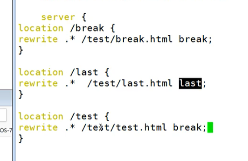
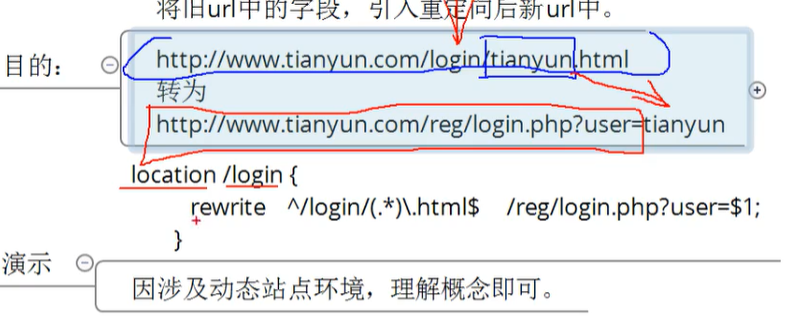
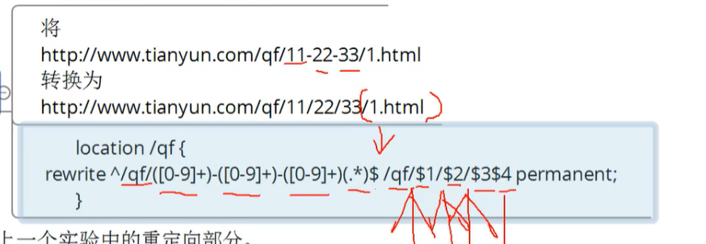
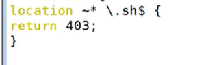
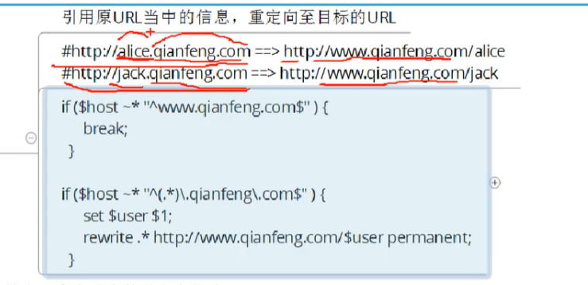
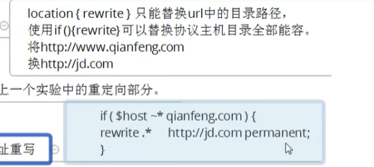
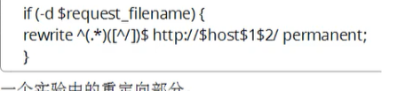
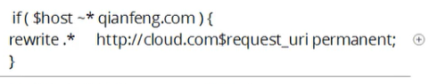

# rewrite  

###重写url的模块

注意：regex  和 repacement 都是对uri的重写；

- [ngx_http_rewrite_module](https://nginx.org/en/docs/http/ngx_http_rewrite_module.html)
- Syntax:	rewrite regex replacement [flag];
  Default:	—
  Context:	**server, location, if**
- **rewrite regex 和replacement 针对的都是 uri模块；** **都是以 / 开头的；**
- **flag：**

| flag      | comment                                                      |      |
| --------- | ------------------------------------------------------------ | ---- |
| redirect  | 302  暂时重定向； url会发生变化；url是新的；                 |      |
| permanent | 301 永久重定向；url会发生变化；url是新的；请求了两次  第一次 301 第二次 请求新的url； |      |
| last      | 继续向下匹配location规则；                                   |      |
| break     | 不在向下匹配location规则；                                   |      |
| 不带flag  | url不会发生变化；url还是旧的；                               |      |


### 动态地址  和静态地址；

依赖于后端传递的参数，根据不同的参数会有不同的结果；一边url的参数有可能是变化的；

静态就是不随后端传递的数据而变化，并且网站也是不变化的；


### 应用

* 伪静态化；
* 安全性，隐藏一些参数，转换成html的方式；
* 跳转；重写url；

### last 和break；



##eg

1. 

 ````nginx
  location /rewrite {  #有没有目录 都没有关系 /rewrite
  99 
 100             rewrite  .* /ceshi/ redirect;
 101 
 102         }
 ````

2.  

3. 

4. 

5. 

6. 

7. 

8. 

9. 

   `````nginx
   #  不是整体替换的；
   
   location /2016/ {
       rewrite ^/2016/(.*)$ /2017/$1 permanent;
   }
   `````
