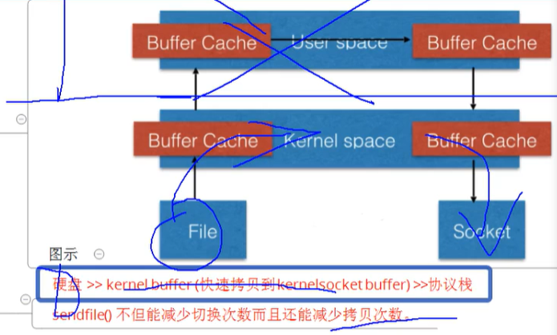

# sendfile  tcp_nopush

### nginx.conf 配置

**全局**  worker_processes  工作进程数目； error_log;

**events**  work_connections  1024;  epoll;

**http**  sendfile fastcgi_read_timeout keepalive_timeout 1200s;

**server** 

**location** 

**if ()**

---

### sendfile

>减少copy 的次数； 如果你们服务器需要大量的文件传输需要使用这个方案；
>
>零copy；

默认是打开的；

只走内核态的buffer 缓冲区；

sendfile  on；

位置：http  模块

---

###tcp_nopush 

>并不是直接发送消息，而是加一个缓冲区；

**产生的信息 不直接不推送；** 这里就是加一个缓存；

不加  tcp_nopush 会造成网络资源； 

典型情况下，一个包忽悠用一个字节的数据，以及40个字节长的包长，会产生4000%的过载；很轻易的就能令网络产生拥塞，同时也浪费资源；

就像马路上的货车一样，本来可以运输1吨重的货车，现在只能运输1KG那么车的车辆 肯定增多，并且浪费的油和人力资源也就越多；

积累一定的程度然后再发送包；	

---

### tcp_nodelay  一般和 tcp_nopush配套使用；

tcp 不延迟；

ack包会立刻发送出去；

因为客户端会有可能进行重传；所以这里应该ack包立刻发出去；