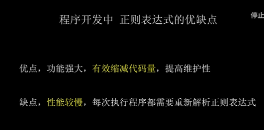

# regex - summary

>**主要用来字符串或者文本的 查找，替换，格式校验；**

---

>正则表达式主要分为几部分组成：
>
>* 元字符；
>
>  * 普通字符；包括有转义的字符；
>  * 字符集合[]; (单个关键字的值范围，包括在一对[]zz中间；) 
>  * 限定符；（* ？ + ）
>  * 定位符
>  * 子表达式
>  * 修饰符
>
>  ---
>
>  1. ^ - 匹配输入字符串的开始位置
>  2. $ - 匹配输入字符串的结束位置
>  3. . - 匹配除换行符以外的任意单个字符
>  4. ? 匹配前面的元素零次或多次
>  5. \+ -匹配前面的元素一次或多次
>  6. ? - 匹配前面的元素零次或一次
>  7. \ - 转义字符，用于匹配特殊字符
>  8. [] - 字符类，匹配括号内的任意一个字符
>  9. () - 分组，用于将多个元素组合为一个单元
>  10. {} - 限定符，指定匹配元素的次数范围
>
>  

---

##  普通字符；

``````php
#集中表现形似；
a _ 
\\  #需要去转义的一些字符； 注意一下；一些特殊字符需要转义一下！！！！
``````


## 字符集合

`````php
# 几种表现形式；
g[oe]t  #匹配 get got;
[a-z]   # a-z 字符；
[^a-z] #除去a-z之外的所有字符；
[_\-]  #- _  这两个字符
`````


## 限定符

>**给前面的一个字符追加出现的次数范围；**

````php
# *  {0,}
# ? {0,1}
# + {1,}
## 可以自己指定出现的次数{}
##限定符 前面为模糊匹配的时，会出现产生贪婪匹配的问题；
## g[a-z]+d  尽可能多的去匹配比如：gasbsssd之类的；
## g[a-z]+?d 非贪婪匹配
````

---

## 定位符

> **标记匹配位置的元字符；**

`````php
^ 行首；
$行尾；
\b单词的边界；精确匹配；
`````

## 子表达式

>**子表达式；标记一个子匹配的一个内容；**

`````php
# () 看成一个整体；
# (|) 可以包含多个子表达式；
# () \1 后向引用的问题；
//g(a|oe)t;  匹配gat和goet；
`````

## 修饰符

>**并不是表达式中的一部分，并且可以叠加；**

`````php
i忽视大小写；
g 寻找所有的匹配资源；
m 多行匹配；
s 默认情况下是匹配除了.是匹配除了换行符\n之外的任何字符，加上s修饰符之后.包含换行\n;
`````

## 另外的元字符

>**这个元字符通常用于匹配单词字符。**

`````php
. 除了换行意外所有的字符；
\d   [0-9]
\w  [A-Za-z0-9_]
\s  space 空格特殊字符；
##大写就是反写；
`````


----



----

