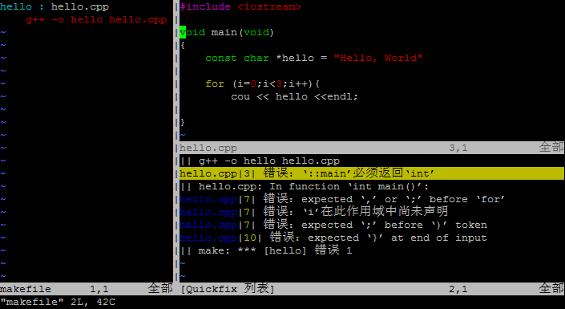
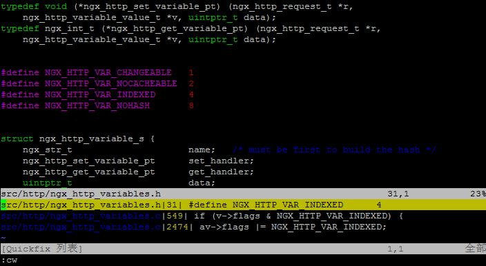

#  Quickfix

#### Quickfix

假如我们有一个hello.cpp文件和一个makefile，于是我们可以直接在vim下输入 :make ， 于是就可以make这个hello.cpp文件，如果出错了，我们需要按回车返回，这个时候，我们可以使用下面的命令来把出错显到在vim的分屏中：

> **:cw**

于是，就会出现下面右边的那个样子：（是不是看上去和我一样很帅？）

上图中左边是我的makefile，右边是我的错误百出的源代码，右边下面是quickfix窗屏。你可以看到quickfix窗屏指向的第一个错误已经定位到我们相就错误的文件行上了。

你可以使用像浏览文件那样用j, k在quckfix窗屏中上下移动到相应的错误上然后按回车，然后就可以在上面的窗屏里定位到相应的源文件的代码行。但是，如果是这样的话， 你要定位下一条错误还得用Ctrl +W 回到quickfix屏中来然后重复来过。

你可以使用下面的命令而不用回到quickfix中来：

> **:cp 跳到上一个错误**
>
> **:cn 跳到下一个错误**
>
> **:cl 列出所有错误**
>
> **:cc 显示错误详细信息**

下面我们来看另一个quickfix的功能。

如果你用过vim的cscope插件，你就知道cscope可以用来查找相当的代码，但cscope需要事先生成一个数据库，对一些简单的查找，其实，我们用vim的grep命令就可以了，不需要专门为之生成数据库。vim的grep命令和shell的几乎一样。

我们来看个例子：

比如我们正在浏览nginx的代码，这时，我想看看哪里用到了nginx的NGX_HTTP_VAR_INDEXED宏。于是，我可以在vim里输入如下的命令：

> **:grep -r –include=”\*.[ch]” NGX_HTTP_VAR_INDEXED src/**

上面这个命令意思是递归查询src目录下所有的.c和.h文件，其中包括NGX_HTTP_VAR_INDEXED宏。然后，你就会看到vim到shell里去执行并找到了相关的文件，按回车返回vim后，别忘了用 【:cw 】把grep的输出取回来，于是我们就有下面的样子：

然后同上面一样，你可以用 j，k 键移动quickfix里的光标到相应的行，然后按回车定位文件，或是使用【:cn】或【:cp】来移动到定位。（这样，你会把多个文件打开到缓冲区，别忘了【:ls】来查看缓冲区）

你看，到这里，一个小小的IDE就这样产生了，而且，**最帅的时，我们连一点插件都没有装，也没有在.vimrc文件中配置过什么**。

