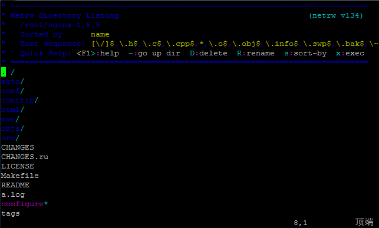
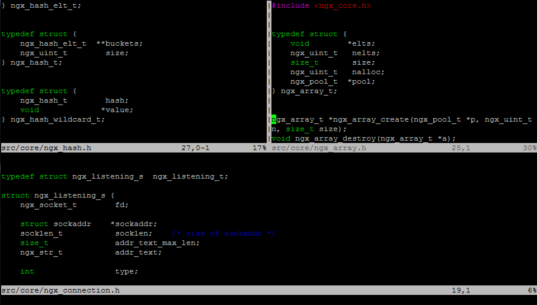

# 浏览代码

>分屏+浏览目录  :He;

#### 浏览代码

首先，我们先从浏览代码开始。有时候，我们需要看多个文件，所以，传统的做法是，我们开多个tty终端，每个tty里用Vim打开一个文件，然后来回切换。这很没有什么效率。我们希望在一个Vim里打开多个文件，甚至浏览程序目录。

**浏览目录的命令很简单：（你也可以直接vim一个目录）**

> **:E**

注意，是大写。于是，你会看到下面这样的界面：

这个界面中，**你可以用 j, k 键上下移动，然后回车，进入一个目录，或是找开一个文件**。你可以看到上面有一堆命令：

- 【 – 】 到上级目录
- 【D】删除文件（大写）
- 【R】改文件名（大写）
- 【s】对文件排序（小写）
- 【x】执行文件

当然，打开的文件会把现有已打开的文件给冲掉——也就是说你只看到了一个文件。

如果你要改变当前浏览的目录，或是查看当前浏览的目录，你可以使用和shell一样的命令：

> **:cd <dir> – 改变当前目录**
>
> **:pwd  – 查看当前目录**

#### 缓冲区

其实，你用:E 浏览打开的文件都没有被关闭，这些文件都在缓冲区中。你可以用下面的命令来查看缓冲区：

> **:ls**

于是，在你的Vim下，你会看到如下界面：

你可以看到Vim打开了四个文件，编号是4，5，6，7，如果你要切换打开的文件，这个时候，你不要按回车（按了也没事，只不过按了就看不到:ls输出的buffer列表了），你可以使用下面的命令切换文件（buffer后面的4表示切到4号文件也就是src/http/ngx_http.c）：

> **:buffer 4**

或是：

> **:buffer src/http/ngx_http.c**

注意，

- 你可以像在Shell中输入命令按Tab键补全一样补全Vim的命令。
- **也可以用像gdb一样用最前面的几个字符，只要没有冲突。如：buff**

你还可以动用如下命令，快速切换：

> :bnext    缩写 :bn
> :bprevious  缩写 :bp
> :blast  缩写 :bl
> :bfirst 缩写 :bf

上图中，我们还可以看到5有一个%a，这表示当前文件，相关的标记如下：

– （非活动的缓冲区）
a （当前被激活缓冲区）
h （隐藏的缓冲区）
% （当前的缓冲区）
\# （交换缓冲区）
= （只读缓冲区）
\+ （已经更改的缓冲区）

#### 窗口分屏浏览

相信你在《[Vim的窗口分屏](https://coolshell.cn/articles/1679.html)》一文中，你已经知道了怎么拆分窗口了。其实，我更多的不是用拆分窗口的命令，而是用浏览文件的命令来分隔窗口。如：

**把当前窗口上下分屏，并在下面进行目录浏览：**

> **:He  全称为 :Hexplore  （在下边分屏浏览目录）**

如果你要在上面，你就在 :He后面加个 !，

> **:He!  （在上分屏浏览目录）**

如果你要左右分屏的话，你可以这样：

> **:Ve 全称为 :Vexplore （在左边分屏间浏览目录，要在右边则是 :Ve!）**

下图是分别用:He 和 :Ve搞出来的同时看三个文件：

在分屏间的跳转和切换在《[Vim的窗口分屏](https://coolshell.cn/articles/1679.html)》一文中提过了：**先按Ctrl + W，然后按方向键：h j k l**

#### 分屏同步移动

要让两个分屏中的文件同步移动，很简单，你需要到需要同步移动的两个屏中都输入如下命令（相当于使用“铁锁连环”）：

> **:set scb**

如果你需要解开，那么就输入下面的命令：

> **:set scb!**

注：set scb 是 set scrollbind 的简写。

#### 保存会话

保存完会话后，你也没有必要一个一个Tab/Windows的去Close。你可以简单地使用：

> **:qa  – 退出全部** 
>
> **:wqa  -保存全部并退出全部**

