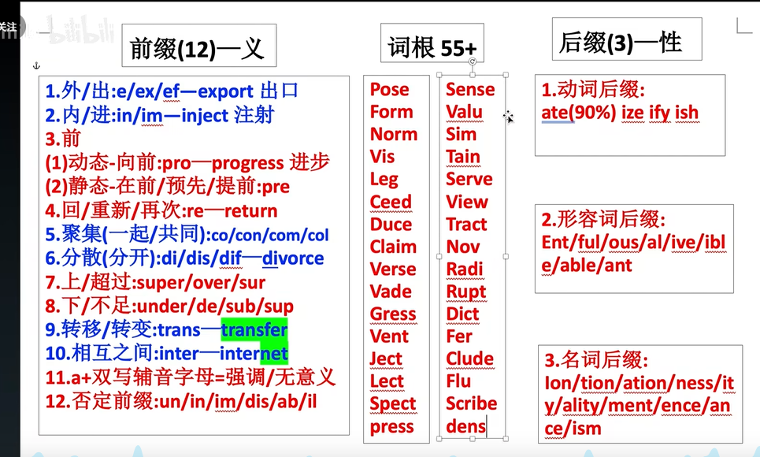

#  	英语的前缀和后缀

###  

朝向 表示否定！！

emit

e- *+* mit-

**词根词缀**

- 前缀e-,ef-,ex- 表示“从，从...离开，从...向外，向外，向上”，来自PIE *eghs, 向外。该原始印欧语根进入希腊语产生变体形式 ek-, 进入英语拼写演变为 ec-；进入拉丁语演变成 ex-；在浊辅音 b, d, g 和半辅音 j, l, m, n, r, v 前缩写成 e-；在字母f前同化为 ef-。
- 词根mess-,miss-,mit- = send, cast, 表示“送，放出”，源自拉丁语 mittere "let go, send", 分词形式 missus。

发出，发行，发表！！！

admit permit	

**同根词**

[admit](dic://admit)

1. vt. 承认；准许进入；可容纳 2. vi. 承认；容许

\#四级# #考研#

I blush to admit it.

我羞愧地承认了那件事。

[commit](dic://commit)

使…承担义务；把...交托给；指派…作战；犯罪，做错事

\#四级# #考研#

She drove him on to commit murder.

她唆使他去杀人。

[permit](dic://permit)

1. vi. 许可；允许 2. vt. 允许；许可

   per- 表示“完全，贯穿，自始至终，向前”

\#四级# #考研#

[submit](dic://submit)

1. vt. 使服从；呈递；主张 2. vi. 提交；服从

\#四级# #考研#

[transmit](dic://transmit)

1. vt. 传达；遗传；传输；传播；发射 2. vi. 发射信号；传输