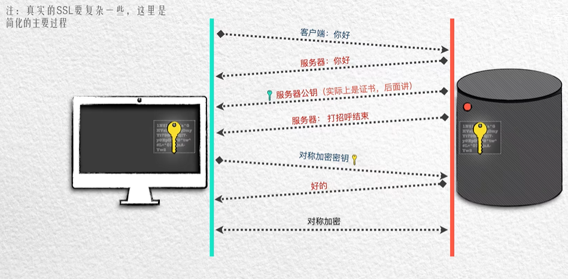
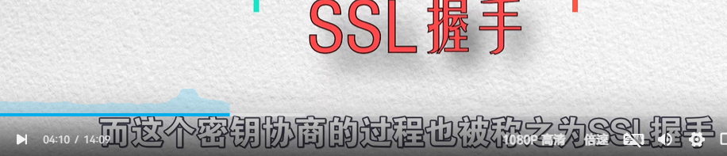
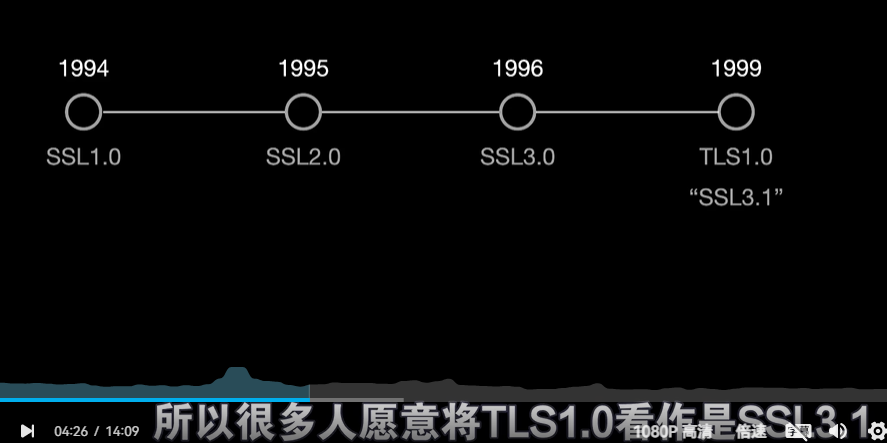
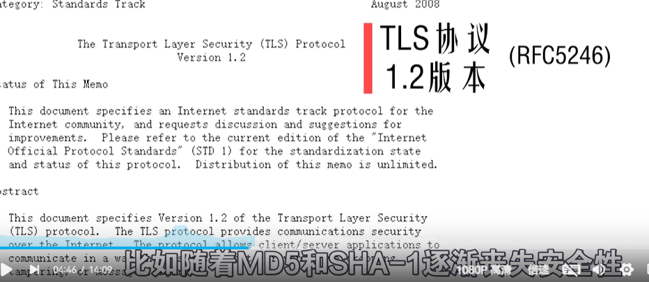
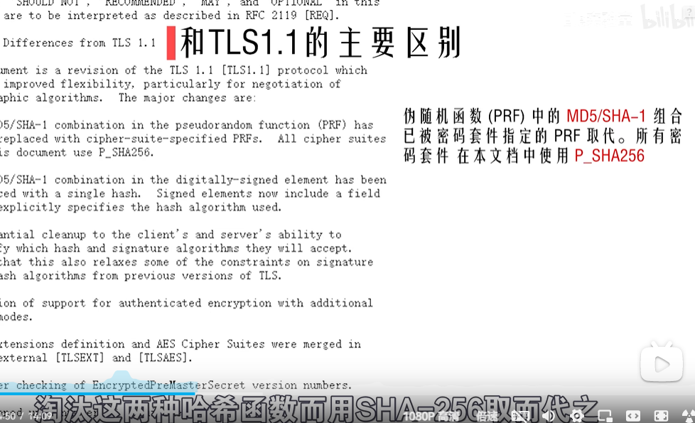
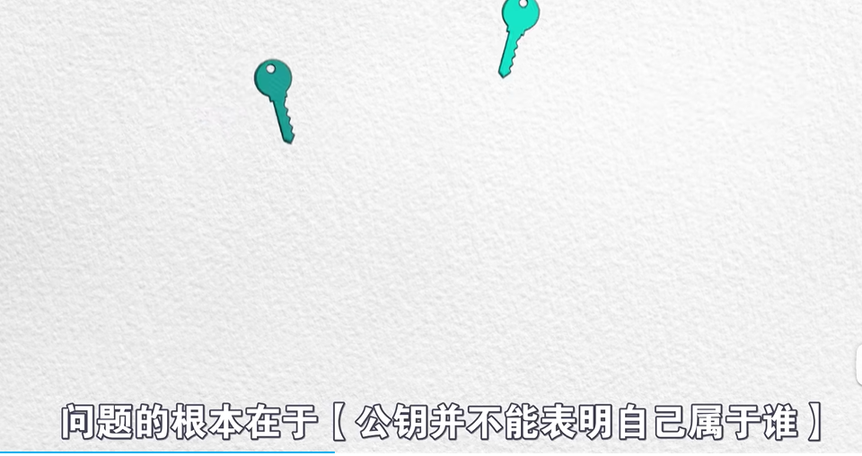
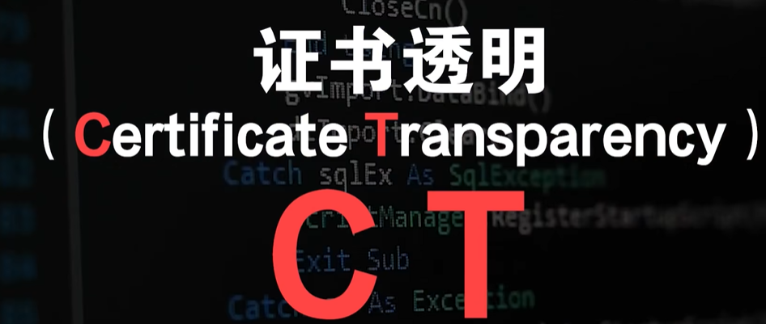
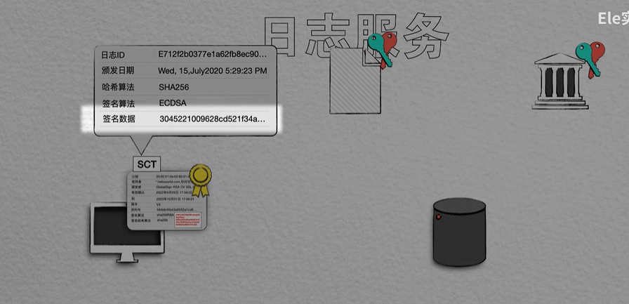
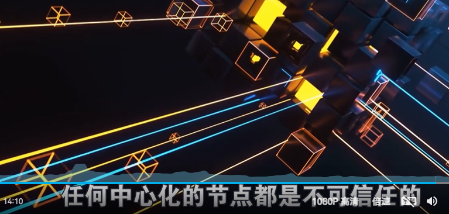
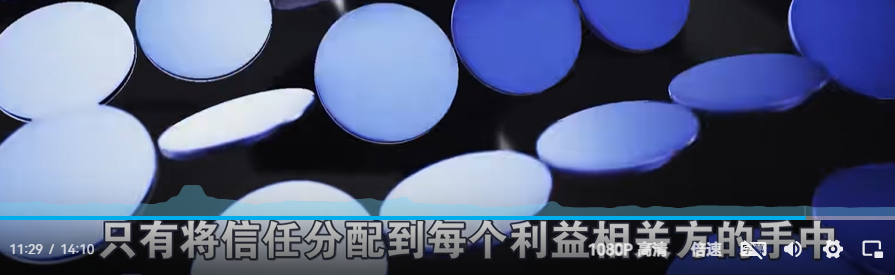

# https的基础知识

>https tls  +  ssl 
>
>https  secure 安全 实现的方式就是 加密；
>
>**tls  传输层的安全！！！** **transport secure；**

 CA证书，就是用ca机构私钥加密的服务器公钥！（服务器的公钥就是CA证书；）

https加密  包含 对称加密和非对称加密两种加密方式都会有！！！

非对称加密 密钥是成对出现的！

## ssl  secure socket layer 安全套接字层，这是独立于http的一个层；后面又更改名字 位tsl  传输安全层；

## 但是还会存在于中间人攻击问题；

>就是给用户的公钥并不是 服务端的公钥，而是中间人（黑客）的公钥，那么就会发生中间人攻击；

这个问题 可以通过CA来解决；

就是把服务器的公钥交给CA，CA会用自己的私钥来加密，

**产生这个问题的根本： 公钥并不能表明自己属于谁！！！证明自己的身份就要引入第三方，也就是CA；**

## 有了CA机构的公钥一般内嵌在操作系统的内部，防止网路传输的过程中被人篡改；

然后 上面进行https的时候，拿到的是CA私钥加密的服务器公钥 == 这里会被称为签名；

传给 客户端，当客户端，CA机构的公钥进行解密成功的时候，代表这个网站是被信任的网站，但是当解密失败，那么代表这个网站并不是被信任的网站；这个就是https；

##  但是上述的CA机构的权力过大，存在棱镜门时间CA权力过大；

>这个确实是一个很好的解决方案：去中心化；**使用的去中心化，的方法，证书透明的解决方案；**
>
>

默克尔树防止被纂改；