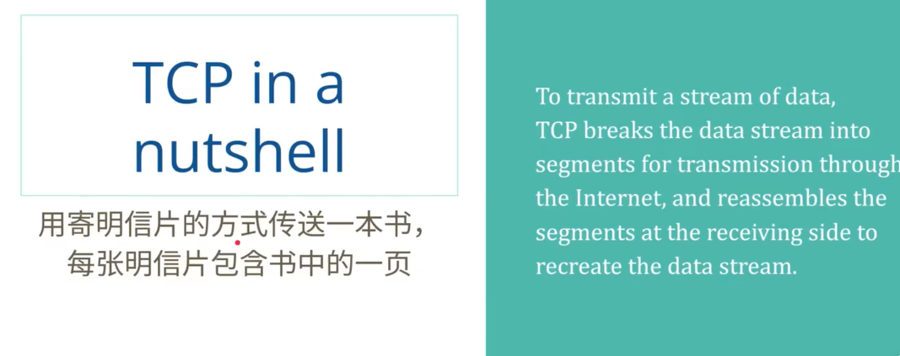
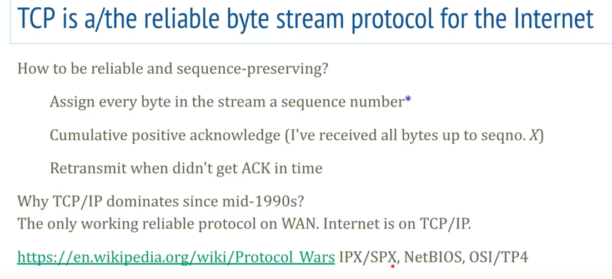
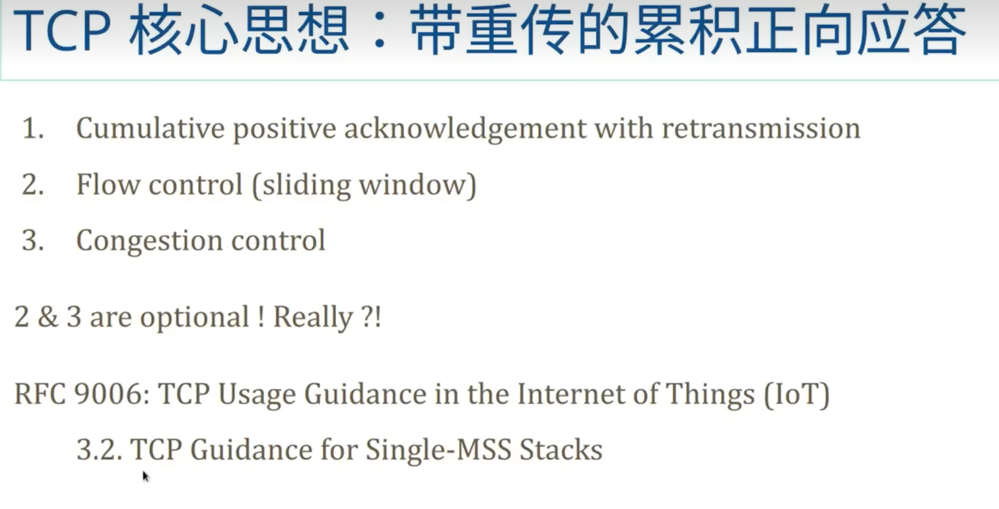
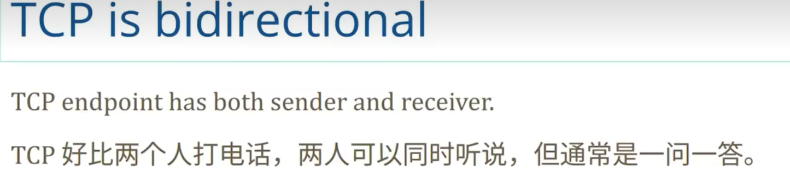
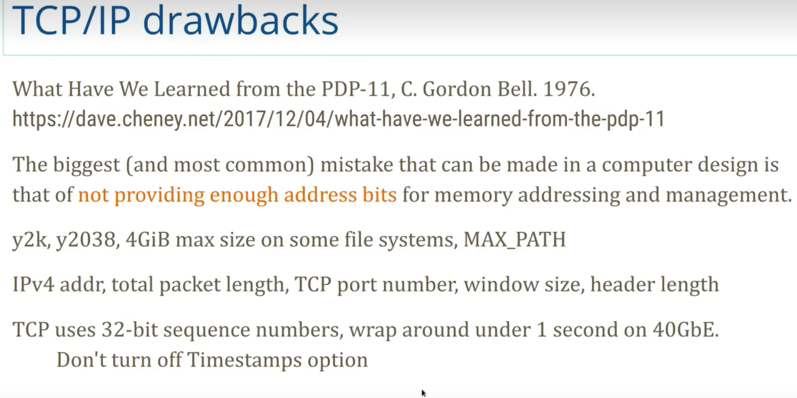
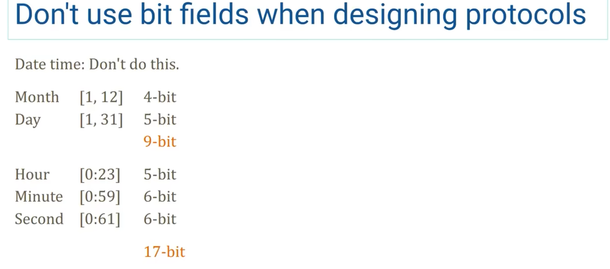
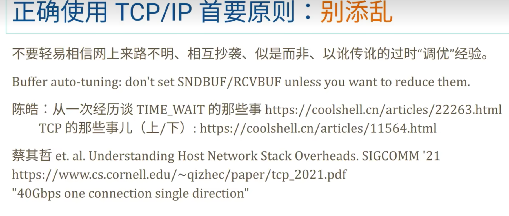

# tcp brief

> tcp is a nutshell;
>
>

双向  不知道是不是全双工的；

但是底层是满足，一边 send数据，一边receive数据；  是全双工的；

相似度非常高的数据压缩效果非常高；

> 压缩类似于把相似的部分给提取出来，然后，赋值给一个变量，然后里面所有的类似内容都用这个变量来代替；
>
>

 

---

##  自己可以看一下；

