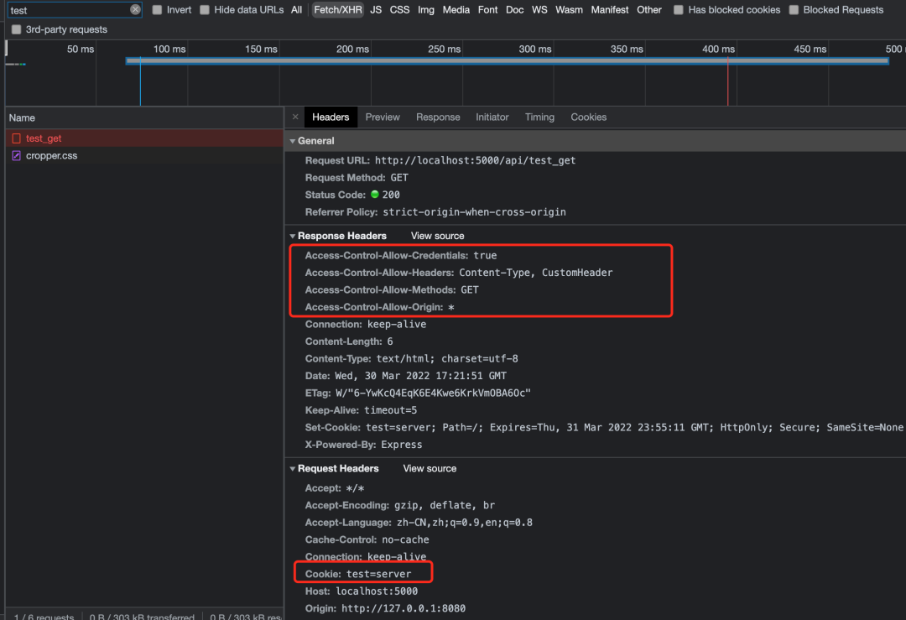

# cors   cross orign  resource sharing


需要预检对象（options）是：

* 对服务器产生副作用的请求方法；就是除了get以外的请求方法；

* 非简单请求；除了http1.0 的get post head之外的请求方法，一般是http1.1 的delete，put，depatch；

  

  res.header("Access-Control-Allow-Origin", "http://127.0.0.1:8080");
  res.header("Access-Control-Allow-Methods", "GET");
  res.header("Access-Control-Allow-Headers", "Content-Type");


`````
# 简单请求看不到这个东西的；响应里面； 对服务器不产生副作用的；请求；
#非简单请求就可以看到；  

res.header("Access-Control-Allow-Origin", "http://127.0.0.1:8080");
res.header("Access-Control-Allow-Methods", "GET");
res.header("Access-Control-Allow-Headers", "Content-Type, CustomHeader");
res.header("Access-Control-Max-Age", 1000); // 1000秒
`````


# 前后端都需要了解的CORS知识


##### 什么是CORS？


跨源资源共享 (`CORS`)（或通俗地译为跨域资源共享）是一种基于 `HTTP` 头的机制，该机制通过允许服务器标示除了它自己以外的其它`origin`（域，协议和端口），这样浏览器可以访问加载这些资源。

比如例子：网站https://a.com的js代码中发起一个对https://b.com/xxx 域名api的跨域请求，而此时浏览器出于安全限制，限制了XMLHttpRequest 和 Fetch API 需要遵循同源策略，所以这意味着a.com只能对同一个域发起 HTTP 资源请求。那么为了能支持跨域请求，我们就需要使用到 CORS 技术。


##### 谁应该掌握CORS

说实话，我觉得做web程序的，对于前端、后端、包括测试这些都需要掌握cors的概念。

##### Preflight Request（预检请求）

前面说了，CORS是基于HTTP头的机制，它允许服务器声明哪些网站源通过浏览器有权限访问哪些资源。而除此之外，CORS规范里要求需要对那些可能对服务器数据产生副作用的HTTP请求（比如像POST这种提交数据给服务器这种可以理解为副作用，特别是GET以外的，但其实GET也有可能产生副作用）浏览器必须先使用`OPTIONS`方法发起一个预检请求，从而知道服务端是否允许该跨源请求。当服务器允许后，浏览器才会发起实际的HTTP请求。

##### 简单请求

前面提到了有的请求会产生副作用，有的那就不会，而不会产生副作用的请求，我们可以称之为简单请求。怎么判断一个请求是否为`简单请求`？则需要同时满足以下条件（不熟悉的，建议收藏反复阅读记忆）：

- 使用请求方法为（GET，HEAD，POST）
- 请求头headers中只有浏览器自动代理的首部字段（如Connection，User-Agent）和Fetch禁用首部名称以外的字段，以及用户自己设置的首部字段：

- - Accept
  - Accept-Language
  - Content-Language
  - Content-Type（有额外的限制）
  - Fetch 中禁用首部名称以外的字段（以下是fetch中禁用头部名称）

- - `Accept-Charset`
  - `Accept-Encoding`
  - `Access-Control-Request-Headers`
  - `Access-Control-Request-Method`
  - `Connection`
  - `Content-Length`
  - `Cookie`
  - `Cookie2`
  - `Date`
  - `DNT`
  - `Expect`
  - `Host`
  - `Keep-Alive`
  - `Origin`
  - `Referer`
  - `TE`
  - `Trailer`
  - `Transfer-Encoding`
  - `Upgrade`
  - `Via`

- Content-Type的值仅限于下列三者之一

- - application/x-www-form-urlencoded
  - multipart/form-data
  - text/plain

- 请求中的XMLHttpRequest对象没有注册任何事件监听器：

- - 比如xhr.upload.onprogress = function() {};

- 请求中没有使用到`ReadableStream`对象

- - 比如Response.body属性是 Response 对象暴露出的底层接口，返回一个 ReadableStream 对象，供用户操作。For example：

```
const response = await fetch('flower.jpg');
const reader = response.body.getReader();

while(true) {
  const {done, value} = await reader.read();

  if (done) {
    break;
  }

  console.log(`Received ${value.length} bytes`)
}
```


#### CORS 实战

这里新建了后端服务一个GET请求的api：

```
const http = require("http");
const express = require("express");
const bodyParser = require("body-parser");
const path = require("path");

const app = express();
const server = http.Server(app);

const router = express
  .Router()
  .get("/test_get", (req, res) => {
    res.send("get_ok");
  })；

app.all("*", (req, res, next) => {
    next();
});

// post数据解析
app.use("/api", router);
server.listen(5000, "localhost");
```

启动server，暴露访问http://localhost:5000源的api接口，而我在另一源（http://127.0.0.1:8080）页面里请求这个server的api，如下：

##### case 1: 简单请求 get  也不能跨域；

```
fetch("http://localhost:5000/api/test_get");
```

不出意外的话，我们这个请求应该会默认被浏览器当作跨域请求阻止的，因为这里还没有应用CORS http头部信息。如下：


那如何解决这个问题呢？我们首先可以来看下这个test_get请求的请求头：



你会发现浏览器会自动为我们的请求头加上Origin的请求头部，这表明此请求是来自于当前http://127.0.0.1:8080的。那我们服务器收到这个Origin头部时，可以根据这个字段值来判断是否当前访问源有权限跨域访问。比如我们在后端配置如下CORS头部：

```
app.all("*", (req, res, next) => {
  res.header("Access-Control-Allow-Origin", "http://127.0.0.1:8080");
  next();
});
```

然后再次访问这个接口，你就会发现成功了，并且此请求的响应头里可以看到`Access-Control-Allow-Origin`：

并且请求到了这个接口的响应内容：


##### case 2: 非简单请求（预检请求）

上面我们在页面发起api请求时，只是发起了最简单的一个GET请求，里面没涉及到更多的headers头部信息，假如我们增加一些请求配置，如下：

```
  fetch("http://localhost:5000/api/test_get", {
    headers: {
      "Content-Type": "application/json",
    },
  });
```

我们再次请求后端api，这时候你会发现，这个接口请求又跨域不能访问了，并且这里出现一个Preflight的预检请求，具体是干嘛的，我们可以看看它的header头部信息：

 预检请求的请求Methods是OPTIONS，然后它会根据我们的请求头配置（这里是Content-Type）自动发给服务器端，通过`Access-Control-Request-Method`头部告诉服务端我真正的请求方式为GET，通过`Access-Control-Request-Headers`告诉服务器端我携带了一个content-type的头部给你。


但是有人会会问了明明我看Response Headers里已经允许http://127.0.0.1:8080的用户访问了，那为什么还会被禁止跨域请求呢？


根本其原因就是这个请求在这里是一个非简单请求，那么非简单请求的意思就是，你这里带了一个`content-type`为`application/json`不在简单请求里的三个值范围里，那么你这个时候带上这个header头部，则还需要被服务端允许携带这个这个头部才行，并且你真正的请求是需要用GET方式请求的，那么也需要服务端允许你使用GET方式请求，所以我们可以在服务端进行如下配置：

```
  res.header("Access-Control-Allow-Origin", "http://127.0.0.1:8080");
  res.header("Access-Control-Allow-Methods", "GET");
  res.header("Access-Control-Allow-Headers", "Content-Type");
```

然后我们再看一下response headers里的返回信息：这个时候服务端已经允许使用携带Content-Type头部进行访问，并且允许GET的请求方法，那么我们真正请求的api则可以顺利获取到api的响应数据：


另外这里我们如果再在请求里带上一个自定义的header头部，比如：`CustomHeader`

```
fetch("http://localhost:5000/api/test_get", {
  headers: {
    "Content-Type": "application/json",
    "CustomHeader": 'test'
  },
});
```

你会发现重新请求的话，又是跨域的，因为后端还并没有允许你携带`CustomHeader`这个头部字段进行访问api：


仍然需要配置才能解决这个问题：（多个头部之间用逗号分隔）

```
res.header("Access-Control-Allow-Headers", "Content-Type, CustomHeader");
```

补充一点http头部是不区分大小写的，大小写并不敏感

##### case 3: 预检请求-额外消耗

上面的case2 我们分析了预检请求需要和后端服务器进行协商通信，那么如果我们的api每次在一定时间内访问的话都需要有OPTIONS这个请求与后端协商，显得有比较多的网络资源消耗。因此为了避免这些额外的消耗，CORS规范还增加了一个`Access-Control-Max-Age`的头部字段。比如我们在后端配置了此header：

```
res.header("Access-Control-Allow-Origin", "http://127.0.0.1:8080");
res.header("Access-Control-Allow-Methods", "GET");
res.header("Access-Control-Allow-Headers", "Content-Type, CustomHeader");
res.header("Access-Control-Max-Age", 1000); // 1000秒
```

然后重新请求，发现这个OPTIONS预检请求返回了Max-Age（1000秒）的有效时间

 说明在这接下来的1000秒内，我们再次请求此接口时，就不需要再此进行预检请求了，比如经过上一次请求后，我又重新刷新页面，这个时候就没有发起预检请求了，因为之前设置的1000秒还在有效期内：（当然测试这个的话你还需要取消掉这个`Disable cache`选项）


值得注意的是，其实基于Chromium内核的浏览器，在这里比如我们的chrome浏览器，它自己默认规定了一个预检请求有5秒的有效时长，所以有的时候服务端在没配置Access-Control-Max-Age的时候，你在测试的时候如果在5秒的时间内，你是发现不了有额外的预检请求消耗的，所以有时候会给你造成一定的误解。

当然，有效时间在各个浏览器都有最大时间限制：

在 Firefox 中，上限是24小时 （即 86400 秒）。
在 Chromium v76 之前， 上限是 10 分钟（即 600 秒)。
从 Chromium v76 开始，上限是 2 小时（即 7200 秒)。
如果值为 -1，表示禁用缓存，则每次请求前都需要使用 OPTIONS 预检请求。

##### case 4: 附带身份认证的请求

在`XMLHTTPRequest`或者`Fetch`这两个请求时，浏览器默认不会发送cookie的身份凭证信息。如果要发送凭证，则需要设置一下请求参数，比如下面：

```
fetch("http://localhost:5000/api/test_get", {
  credentials: "include",
});
// or
// const xhr = new XMLHttpRequest();
// xhr.withCredentials = true;
```

我们这里只是发起一个GET的简单请求，所以不会有OPTIONS的预检请求在这里，如下，请求里携带里cookie凭证信息：


但是为何又出现跨域错误呢，原因是如果服务器端的响应中未携带 Access-Control-Allow-Credentials: true，浏览器将不会把响应内容返回给请求的发送者，就会出现请求错误：

那么我再在服务端配置上这个试试：这次就能正常请求啦：

```
  res.header("Access-Control-Allow-Origin", "http://127.0.0.1:8080");
  res.header("Access-Control-Allow-Methods", "GET");
  res.header("Access-Control-Allow-Headers", "Content-Type, CustomHeader");
  res.header("Access-Control-Allow-Credentials", true);
```


补充说明下，CORS 预检请求不包含凭据，只有真实请求才会包含凭证。预检请求的 响应 必须指定 Access-Control-Allow-Credentials: true 来表明可以携带凭据进行实际的请求。

##### case 5: 附带身份信息与通配符 *

如果我们服务端设置了`Control-Allow-Credentials: true`允许携带凭证，那么响应请求还会受到一下限制：

- 服务器不能将 Access-Control-Allow-Origin 的值设为通配符“*”，而应将其设置为特定的域，如：Access-Control-Allow-Origin: https://example.com。
- 服务器不能将 Access-Control-Allow-Headers 的值设为通配符“*”，而应将其设置为首部名称的列表，如：Access-Control-Allow-Headers: X-PINGOTHER, Content-Type
- 服务器不能将 Access-Control-Allow-Methods 的值设为通配符“*”，而应将其设置为特定请求方法名称的列表，如：Access-Control-Allow-Methods: POST, GET

我们进行测试一下，将服务器端端cors改成以下配置：

```
  res.header("Access-Control-Allow-Origin", "*");
  res.header("Access-Control-Allow-Methods", "GET");
  res.header("Access-Control-Allow-Headers", "Content-Type, CustomHeader");
  res.header("Access-Control-Allow-Credentials", true);
```

发现前端携带cookie凭证的请求，会被禁止不能使用：

 这是因为请求的首部中携带了 Cookie 信息，如果 Access-Control-Allow-Origin 的值为“*”，请求将会失败。而将 Access-Control-Allow-Origin 的值设置为 https://127.0.0.1:8080，则请求将成功执行。


#### 额外补充头部信息解释

##### Access-Control-Expose-Headers：

在跨源访问时，XMLHttpRequest 对象的 getResponseHeader() 方法只能拿到一些最基本的响应头，Cache-Control、Content-Language、Content-Type、Expires、Last-Modified、Pragma，如果要访问其他头，则需要服务器设置本响应头。

Access-Control-Expose-Headers 头让服务器把允许浏览器访问的头放入白名单，例如：

Access-Control-Expose-Headers: X-My-Custom-Header, X-Another-Custom-Header

这样浏览器就能够通过 getResponseHeader 访问 X-My-Custom-Header 和 X-Another-Custom-Header 响应头了。


不想多写，毕竟能参考的文档很多，个个都比我复制粘贴一遍好。

我就看文档瞎写下。

------

首先什么叫跨域，谁控制跨域。

浏览器处理跨域问题。如果当前访问站点 a.com，a.com上的脚本 a.js 尝试请求 api.b.com ，则出现跨域。跨的是域名（domain）。

跨域请求按是不是简单请求分为两种情况。

非简单请求：

1. 预检请求(pre-flight)，询问指定站点的跨域策略
2. 正式请求

简单请求则跳过预检。

预检中，服务器告诉浏览器自己的跨域策略：允许什么域名访问，允许以什么方法请求，是否允许附带身份验证等...

------

那么 cookies 能跨域吗？

答案可能比较奇怪，能。对于简单请求，浏览器不会预检，只要在 xhr 设置标志位 `withCredentials`，就能附带 cookies 发出 xhr 请求。

当附带 cookies 的 xhr 发出后，服务端可以用 `Access-Control-Allow-Credentials` 来控制浏览器要不要把响应体返回给 js 。如果没有设置 `Access-Control-Allow-Credentials` 则浏览器不会吧响应返回给发送者。

要让 cookies 跨域还有个要求就是 `Access-Control-Allow-Origin` 不能是 `*`，这也要求了服务器必须显式指定允许的跨域来源。

------

那 token 怎么实现的跨域呢？

首先还是要跨的目标要允许你跨。设置 `Access-Control-Allow-Origin`。如果 token 放在 HTTP Header 里则可能导致产生一个预检请求，如果放在 Cookies 里则可能不会产生预检。但最终都是要受到跨域策略限制的。

------

参考：
