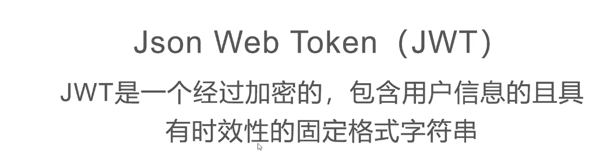
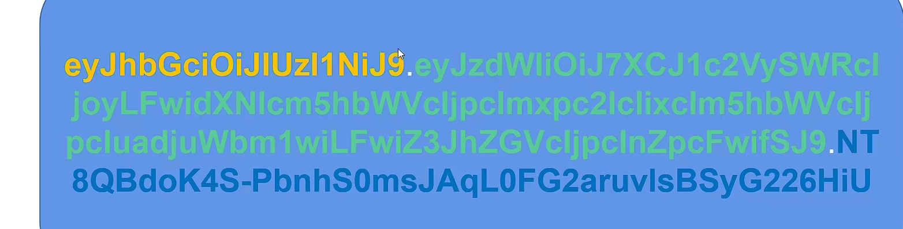
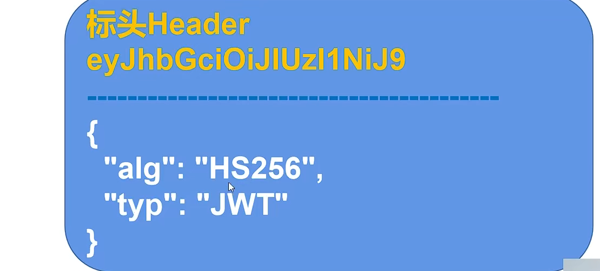
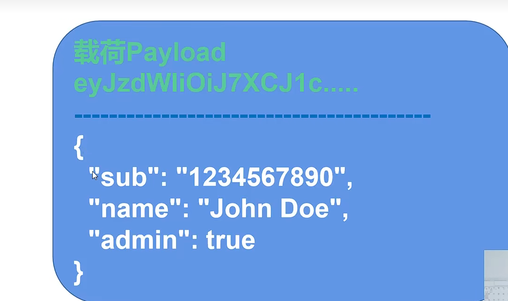
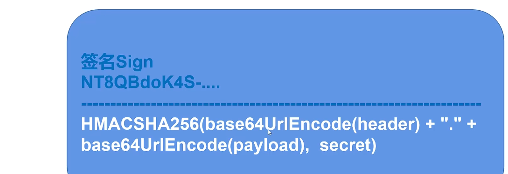

# JWT

https://github.com/firebase/php-jwt


git hub jwt文档；

jwt  加密的  包含用户信息  具有时效性的        固定格式的字符串

​	


## 颜色不同分为三部分   ；标头  --- 载荷 -- 签名；




## 标头Header




##用户的信息；  非敏感的信息；




## 签名 数据校验； secert 我们自己的代码；




## 使用

php代码的实现

````php
<?php
namespace api\helpers;

class JWT
{
    private $signKey = 'p9Uui666666666yyyxxrffghhjkkh';
    
    private $header = [
        'typ' => 'JWT',
        'alg' => 'SHA256',
    ];
    
    
    private $payload = [];
    
    function __construct() {
        $expiresAt = strtotime('+10hour');
        $this->withExpiresAt($expiresAt);
    }
    
    public function withPayload($payload)
    {
        $this->payload = $payload;
        return $this;
    }
    public function withClaim($key,$value)
    {
        $this->payload[$key] = $value;
        return $this;
    }
    
    public function withExpiresAt($expiresAt)
    {
        $this->withClaim('exp',$expiresAt);
        return $this;
    }
    public function withIdentity($identity)
    {
        $this->withClaim('jti',$identity);
        return $this;
    }

    public function getClaim($key)
    {
        return $this->payload[$key]??null;
    }
    
    private function signature($data,$signKey,$alg)
    {
        //function hash_hmac ($algo, $data, $key, $raw_output = false) {}  md5 类似的加密；
         return hash_hmac($alg,$data,$signKey,true);
    }
    
    public function createToken()
    {
        $base64header = base64_encode(json_encode($this->header));
        $base64payload = base64_encode(json_encode($this->payload));
        $data = $base64header . '.' . $base64payload;
        $signature = $this->signature($data,$this->signKey,$this->header['alg']);
        $base64signature = base64_encode($signature);
        $token = $data . '.' . $base64signature;
        return $token;
    }
    
    /*
    public function getDecodeExpiresAt()
    {
        $this->getClaim('exp');
    }

    public function getDecodeIdentity()
    {
        $this->getDecodeClaim('jti');
    }
    
    
    public function getDecodeClaim($key)
    {
        $decodePayload = $this->getDecodePayload($token);
        return $decodePayload[$key]??null;
    }
    */
    public function getDecodePayload($token)
    {
        $result = null;
        try {
            list($base64header,$base64payload,$signature) = explode('.',$token);
            $data = $base64header . '.' . $base64payload;
            
            $newSignature = $this->signature($data,$this->signKey,$this->header['alg']);
            $newSignature = base64_encode($newSignature);
            if($newSignature == $signature)
            {
                $payload = base64_decode($base64payload);
                $result = json_decode($payload,true);
            }
        }catch (\Exception $e) {
            
        }
        return $result;
    }
    
    public function verifyToken($token)
    {
        $result = false;
        $arr = $this->getDecodePayload($token);
        if(isset($arr['exp']) && $arr['exp'] > time()){
            $result = true;
        }
        return $result;
    }
    
}
————————————————
版权声明：本文为CSDN博主「buyue__」的原创文章，遵循CC 4.0 BY-SA版权协议，转载请附上原文出处链接及本声明。
原文链接：https://blog.csdn.net/buyueliuying/article/details/123429666
````


一个学习php函数的网站 还不错的；


https://www.jc2182.com/php/php-hash-hmac-ref.html

​	

```php
#生成一个带有密钥的哈希值；hash_hmac() 使用 HMAC 方法生成带有密钥的哈希值  
# 要使用的哈希算法名称，例如："md5"，"sha256"，"haval160,4" 等。 如何获取受支持的算法清单，请参见 hash_hmac_algos() 函数。

hash_hmac( string $algo , string $data , string $key [, bool $raw_output = FALSE ] )
```