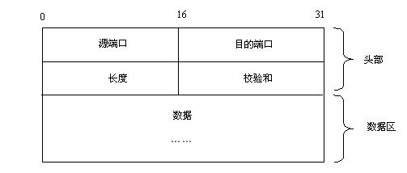
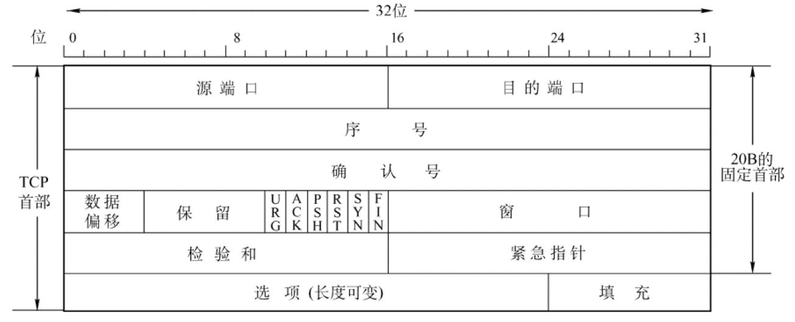
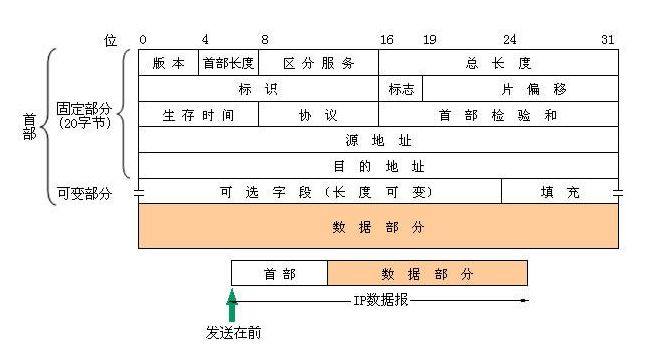
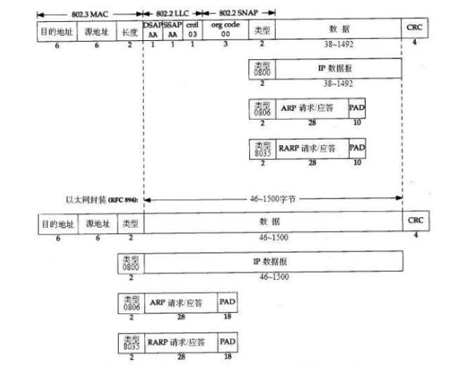

# UDP TCP IP 数据链路层头部


##UDP头部



`````php
可以看到UDP头部由(源端口)、(目的端口)、(长度)跟(校验和)组成，总共8字节。

源端口：发送方的端口号，16位，即2字节。
目的端口：接收方的端口号，16位，即2字节。
长度：头部+数据的字节数，16位，即2字节。
校验和：此字段用来校验数据是否出错。
`````

`````php
UDP最小长度：即无数据的情况下，仅首部长度8字节。
UDP数据部分最小长度：即无数据的情况下，0字节。
UDP最大长度：因长度字段16位限制，所以最大长度为216-1=65535字节。
UDP数据部分最大长度：即UDP最大长度-IP最小头部-UDP头部，216-1-20-8=65507字节

`````


##TCP头部



`````
TCP为保证数据的可靠传输，自然多了很多东西。
`````

`````php
源端口：16位，2字节。
目的端口：16位，2字节。
序号：此报文的序号[1]，可用于确认。
确认号：用于确认序号[1]。
数据偏移：

数据部分往后偏移，这是TCP的头部长度字段，代表有多少个32bit，即1代表32bit，2代表64bit。
一共4位最大为15，15×32=480b=60B。所以头部最大为60个字节，最小为20字节。
(此字段与图中选项字段相关联)

接下来是保留字段，未使用。
下面是6位用于TCP通信的字段，相应位置1表示特殊的信号。比如典型的SYN、FIN和ACK用于三次握手和四次挥手[2]。
窗口：用于拥塞控制，接收方可以控制发送方发送数据报文的吞吐量，防止自己太忙来不及接收。
校验和：此字段用来校验数据是否出错。
紧急指针：用于发送紧急数据的情况。
选项与填充：

TCP头部的长度可以变化，因此可以承载更多的数据。
注意这里必须使用32位的数据，用来快速定位数据部分的位置，所以没有那么多数据的话需要在后面进行填充。
这里与数据偏移字段相关联，这样就可以知道头部的长度以及数据部分的准确位置。
`````

`````php
[1]：关于序号和确认号，不是简简单单为数据随意编号，确认号也不是确认数据报文的序号。可以点击这里看我关于TCP序号和确认号的博客
[2]：关于三次握手和四次挥手的细节，可以点击这里看我关于三次握手和四次挥手的博客
`````


##IP头部



`````php
版本：IP的版本，IPv4或IPv6，4bit。
首部长度：跟TCP头部中的数据偏移意义一致。
区分服务：这是Tos字段，用于Oos服务质量中，这个一两句话也说不完。
总长度：顾名思义，指整个数据报的长度（以字节为单位）。占16bit，最大长度为65535字节。
标识：用来唯一地标识主机发送的每一份数据报。通常每发一份报文，它的值会加1。
标志：占3比特。标志一份数据报是否要求分段。详细可以看这里：https://blog.csdn.net/NetRookieX/article/details/80640383
片偏移：占13比特。如果一份数据报要求分段的话，此字段指明该段偏移距原始数据报开始的位置。
生存时间：即TTL。可用于防止环路占用带宽，每经过一跳路由器则TTL减1，减为0则丢弃数据包。
协议：标识了上层所使用的协议
	01    ICMP
	02    IGMP
	06    TCP
	17    UDP
	88    IGRP
	89    OSPF
首部校验和：用来做IP头部的正确性检测，但不包含数据部分。 因为每个路由器要改变TTL的值,所以路由器会为每个通过的数据包重新计算这个值。
源地址：发送方的IP地址
目的地址：接收方的目的地址
可选字段与填充：与TCP中选项与字段意义一致。
`````


##数据链路层头部



`````php
这里指出图中缺点：CRC应改为FCS，FCS才是字段，CRC为校验方式。
`````


`````php
目的地址：接收方MAC地址，因为此地址是局部链路地址，局域网中所有设备都需查看是否发送给自己，所以排在第一位。
源地址：发送方MAC地址。
长度/类型：指定长度/指定网络层所用的协议类型，通常是IP协议，0x0800。
接下来是数据部分，注意：如果有LLC子层，那么LLC子层占用的是数据部分的空间
`````

``````php
最小帧：64字节，这是根据CSMA/CD的标准推导出。
帧头部：14字节，6字节目的地址+6字节源地址+2字节长度/类型=14字节。
帧中最小数据：64字节-6字节目的地址-6字节源地址-2字节长度/类型-4字节FCS字段(CRC)=46字节。
**最大数据：即MTU=1500字节。** 最大传输单元式包括 数据链路层的头部的呀；
最大帧：MTU+帧头部14字节+FCS4字节=1518字节。
以上均未考虑前导码。
``````

————————————————
版权声明：本文为CSDN博主「NetRookieX」的原创文章，遵循CC 4.0 BY-SA版权协议，转载请附上原文出处链接及本声明。
原文链接：https://blog.csdn.net/NetRookieX/article/details/93158773