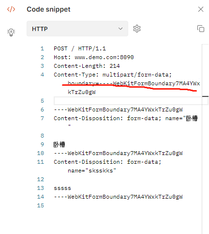

# from-data  urlencoded

我们在平时的postman请求调试，以及web的http请求开发时，常常能看到以下几种传参的形式 form-data、x-www-form-urlencoded、raw、binary，那么这些请求方式的区别是什么呢？

postman post param

### 1、form-data:

就是http请求中的multipart/form-data,它会将表单的数据处理为一条消息，以标签为单元，用分隔符分开。既可以上传键值对，也可以上传文件。当上传的字段是文件时，会有Content-Type来说明文件类型；content-disposition，用来说明字段的一些信息；

由于有boundary隔离，所以multipart/form-data既可以上传文件，也可以上传键值对，它采用了键值对的方式，所以可以上传多个文件。

上图中我们可以看到在postman中form-data选项，key是有下拉选择项的，这也说明了form-data类型支持key-value和文件传输。

上图中我们可以看到，**明显的不同的key参数之间是有boundary分割的。每个参数都有Content-Disposition: form-data; name="xxx"信息**  

### 2、x-www-form-urlencoded：

就是application/x-www-from-urlencoded,会将表单内的数据转换为键值对，比如,name=java&age = 23

我们可以看到，这个形式的传参方式，postman的key是并没有像form-data一样改出File的下拉选项的，**这也说明了这种方式只支持string的key-value值传递。**

在上图中我们也能明显的看到在http的body体中传输的格式。同时我们也看到对于存在中文和空格的情况，它是会进行转换的。

> 1、它是post的默认格式，使用js中URLencode转码方法。包括将name、value中的空格替换为加号；将非ascii字符做百分号编码；将input的name、value用‘=’连接，不同的input之间用‘&’连接。
>  2、百分号编码什么意思呢。比如汉字‘丁’吧，他的utf8编码在十六进制下是0xE4B881，占3个字节，把它转成字符串‘E4B881’，变成了六个字节，每两个字节前加上百分号前缀，得到字符串“%E4%B8%81”，变成九个ascii字符，占九个字节（十六进制下是0x244534254238253831）。把这九个字节拼接到数据包里，这样就可以传输“非ascii字符的  utf8编码的 十六进制表示的 字符串的 百分号形式”，_。
>  3、同样使用URLencode转码，这种post格式跟get的区别在于，get把转换、拼接完的字符串用‘?’直接与表单的action连接作为URL使用，所以请求体里没有数据；而post把转换、拼接后的字符串放在了请求体里，不会在浏览器的地址栏显示，因而更安全一些。
>  4、对于一段utf8编码的字节，用application/x-www-form-urlencoded传输其中的ascii字符没有问题，但对于非ascii字符传输效率就很低了（汉字‘丁’从三字节变成了九字节），因此在传很长的字节（如文件）时应用multipart/form-data格式。smtp等协议也使用或借鉴了此格式。
>  5、multipart/form-data将表单中的每个input转为了一个由boundary分割的小格式，没有转码，直接将utf8字节拼接到请求体中，在本地有多少字节实际就发送多少字节，极大提高了效率，适合传输长字节。

### 3、raw

可以上传任意格式的文本，可以上传text、json、xml、html等 

http的传输格式：

### 4、binary

相当于Content-Type:application/octet-stream,从字面意思得知，只可以上传二进制数据，通常用来上传文件，由于没有键值，所以，一次只能上传一个文件。

postman中也可以看出，下面只有一个select file的功能。也说明只能传文件。

### 辅助

postman有个很好用的功能预览代码，点击右侧code，选择格式

有多种格式，尤其是对于各种语言的功能，比如像Go语言，直接生成代码，简直太6了。大家也可以亲自看一下。代码简直是可以直接拿过去用了。

https://blog.csdn.net/u013827143/article/details/86222486

**一是数据包格式的区别，二是数据包中非ANSCII字符怎么编码，是百分号转码发送还是直接发送**

## 很大的缺点urlencode 编码太长了，但是url只能进行ascii编码所以，需要转换汉字和一些具有歧义的字符；  

一、application/x-www-form-urlencoded   

>这里用 urlencode 的编码方式；所以叫 urlencoded的编码格式；

1、**它是post的默认格式，使用js中URLencode转码方法。包括将name、value中的空格替换为加号；将非ascii字符做百分号编码；将input的name、value用‘=’连接，不同的input之间用‘&’连接。**

## 仔细看一下这个转化格式；

2、**百分号编码什么意思呢。比如汉字‘丁’吧，他的utf8编码在十六进制下是0xE4B881，占3个字节，把它转成字符串‘E4B881’，变成了六个字节，每两个字节前加上百分号前缀，得到字符串“%E4%B8%81”，变成九个ascii字符，占九个字节（十六进制下是0x24534  254238    253831）。把这九个字节拼接到数据包里，这样就可以传输“非ascii字符的  utf8编码的 十六进制表示的 字符串的 百分号形式”，^_^。**

3、同样使用URLencode转码，这种post格式跟get的区别在于，get把转换、拼接完的字符串用‘?’直接与表单的action连接作为URL使用，所以请求体里没有数据；而post把转换、拼接后的字符串放在了请求体里，不会在浏览器的地址栏显示，因而更安全一些。

二、multipart/form-data  form-data  格式数据

1、对于一段utf8编码的字节，用application/x-www-form-urlencoded传输其中的ascii字符没有问题，**但对于非ascii字符传输效率就很低了（汉字‘丁’从三字节变成了九字节），因此在传很长的字节（如文件）时应用multipart/form-data格式。smtp等协议也使用或借鉴了此格式。**

2、此格式表面上发送了什么呢。用此格式发送一段一句话和一个文件，请求体如下

同时请求头里规定了Content-Type: multipart/form-data; boundary=----WebKitFormBoundarymNhhHqUh0p0gfFa8

**可见请求体里不同的input之间用一段叫boundary的字符串分割，每个input都有了自己一个小header，其后空行接着是数据。**

3、此格式实际上发送了什么呢。fiddler抓包如下

**右边明显看到了一段乱码，为什么呢，以汉字‘丁’为例，其utf8编码为0xE4B881，这三个字节会直接拼接到数据包中，即其在实际发送时只占三字节，上图右边是逐字节转为ascii字符显示的，因此会显示为三个乱码字符。**

4、**由上可见，multipart/form-data将表单中的每个input转为了一个由boundary分割的小格式，没有转码，直接将utf8字节拼接到请求体中，在本地有多少字节实际就发送多少字节，极大提高了效率，适合传输长字节。**

有binary 做隔离； 还是卧槽 utf-8 没有做urlencode 的处理；

上传文件；

ASCII（发音：，American Standard Code for Information Interchange，美国信息交换标准代码）是基于拉丁字母的一套电脑编码系统。它主要用于显示现代英语，而其扩展版本延伸美国标准信息交换码则可以部分支持其他西欧语言，并等同于国际标准ISO/IEC 646。

ASCII 由电报码发展而来。第一版标准发布于1963年 ，1967年经历了一次主要修订[5][6]，最后一次更新则是在1986年，至今为止共定义了128个字符；

**0-127  一共128 个字符；**

其中33个字符无法显示（一些终端提供了扩展，使得这些字符可显示为诸如笑脸、扑克牌花式等8-bit符号），且这33个字符多数都已是陈废的控制字符。控制字符的用途主要是用来操控已经处理过的文字。

**在33个字符之外的是95个可显示的字符。用键盘敲下空白键所产生的空白字符也算1个可显示字符（显示为空白）。**

### 可显示字符

可显示字符编号范围是32-126（0x20-0x7E），共95个字符。

### 控制字符

ASCII控制字符的编号范围是0-31和127（0x00-0x1F和0x7F），共33个字符。

