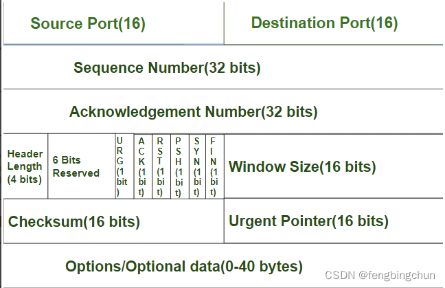
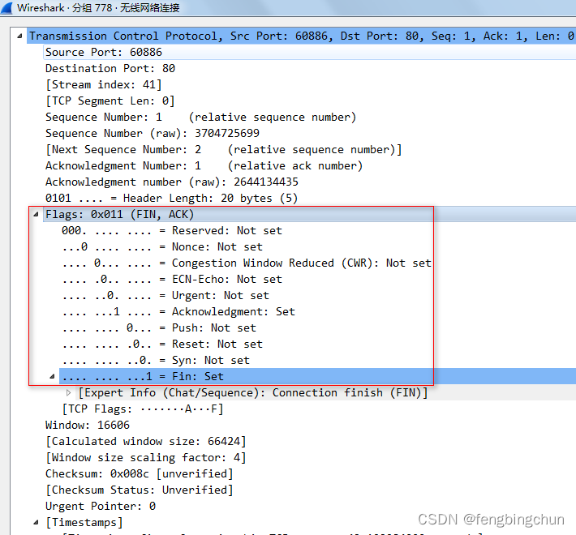
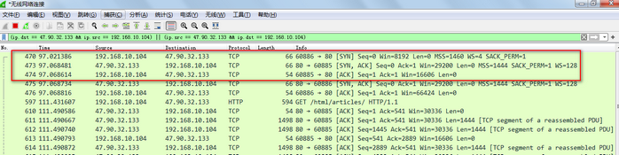

# iP 协议的格式


传输控制协议(Transmission Control Protocol，TCP)是一种传输层协议。TCP使数据包从源到目的地的传输更加顺畅。它是一种面向连接的端到端协议。每个数据包由TCP包裹在一个报头中，该报头由10个强制字段共20个字节和一个0到40 字节的可选数据字段组成。如下图所示：来自于https://www.geeksforgeeks.org

​     

```markdown
  1.源端口号(Source Port)：16bits，该字段标识发送方应用程序的端口号。

  2.目标端口号(Destination Port)：16bits，该字段标识接收方应用程序的端口号。

  3.序列号(Sequence Number)：32bits，在连接建立(三次握手)后，该字段包含一个32位随机初始序列号/起始数据位，随后增加传输的字节数。

  4.确认应答号(Acknowledgement Number)：32bits，接收方使用这个32位参数来请求下一个TCP段。它是下一个预测的TCP段的序列号。

  5.报头长度(Header Length)：4bits，该字段表示TCP报头的大小，但是是按比例缩小的版本。

  6.保留位(Reserved)：6bits，该字段的位设置为零。这些位保留供以后使用。

  7.标志位(Flags bits)：6bits，一组六个字段，每个字段长一位。TCP标志用于指示TCP会话期间的特定状态，可用于故障排除或控制特定连接的处理方式。每个标志位值为1，表示特定标志为”设置”。如下图所示：
```



       TCP标志是TCP报头中存在的各种类型的标志位，它们每个都有自己的意义，它们启动连接、携带数据并断开连接。
    
      SYN和ACK标志用于TCP三次握手以建立连接。在TCP连接建立过程中，TCP发送了一个设置了SYN标志的TCP段。ACK标志始终设置，除了TCP连接建立的第一段。只有SYN标志被设置，表示这是新的TCP连接的第一个段。
    
      TCP使用三次握手来建立可靠的连接。连接是全双工的(full-duplex)，双方相互同步(SYN)和确认(ACK)。三次握手分三个步骤进行：SYN、SYN, ACK、ACK，如下图所示：



##<font color=red>这六个标志位  注意一些；</font>

       四次挥手分四个步骤进行：FIN, ACK、ACK、FIN, ACK、ACK。四次挥手，就是在关闭连接的时候双方一共要操作四次。
    
      URG和PSH标志在数据传输期间使用。
    
      (1).URG(Urgent，紧急标志)：当设置此位值时，数据优先于其它数据。表示数据包所携带的数据应立即由TCP堆栈处理。表明发送端向另一端使用紧急方式发送数据，包中有需要紧急处理的数据。
    
      (2).ACK(Acknowledgment，确认标志)：应答响应，这个位字段在连接建立(三次握手)和数据传输期间使用。用于确认数据包已经收到，也用于确认发起请求和拆除请求。TCP规定除了最初建立连接时的SYN包之外该位必须设置为1。
    
      (3).PSH(Push，推送标志)：这个位字段告诉应用程序立即发送数据。表示传入的数据应该直接传递给应用程序，而不是被缓存。PSH为0，也就是普通情况下，则不需要立即传，而是先进行缓存。
    
      (4).RST(Reset，重置标志)：这个位字段设置是为了重置TCP连接。表示连接已关闭，或者服务可能不接受请求。表示TCP连接中出现异常必须强制断开连接。RST标志用于中止连接，经常用它解决网络连接问题。
    
      (5).SYN(Synchronization，同步标志)：这个位标志用于发起一个连接，建立连接并设置初始序列号。
    
      (6).FIN(Finish，完成标志)：这个位字段表示TCP连接的结束，表示正在断开连接或关闭连接。发送方和接收方都发送FIN包以终止连接。表示发送方完成任务，今后不会有数据发送，希望断开连接。当通信结束希望断开连接，通信双方的主机之间就可以相互交换FIN位置为1的TCP段。FIN标志用于终止TCP连接。
    
    
    
      8.窗口大小(Window Size)：16bits，该参数表示接收端的缓存容量。窗口的大小用于管理数据流。
    
      9.校验和(Checksum)：16bits，发送方计算循环冗余校验(Cyclic Redundancy Check，CRC)校验和，并在数据传输前将其添加到该字段中，以防止数据错误。接收设备可以使用校验和来检查接收到的报头和载荷(payload)中的缺陷。
    
      10.紧急指针(Urgent Pointer)：16bits，指向段中紧急数据的结尾。但是，仅当设置了URG标志时才会出现此字段。
    
      11.选项/可选数据(Options/optional data)：0--40字节，该字段包含可选的信息，例如最大段大小、时间戳、窗口大小扩展、填充等。
    
      以上内容主要来自于网络整理。
    
      GitHub：https://github.com/fengbingchun/OpenSSL_Test