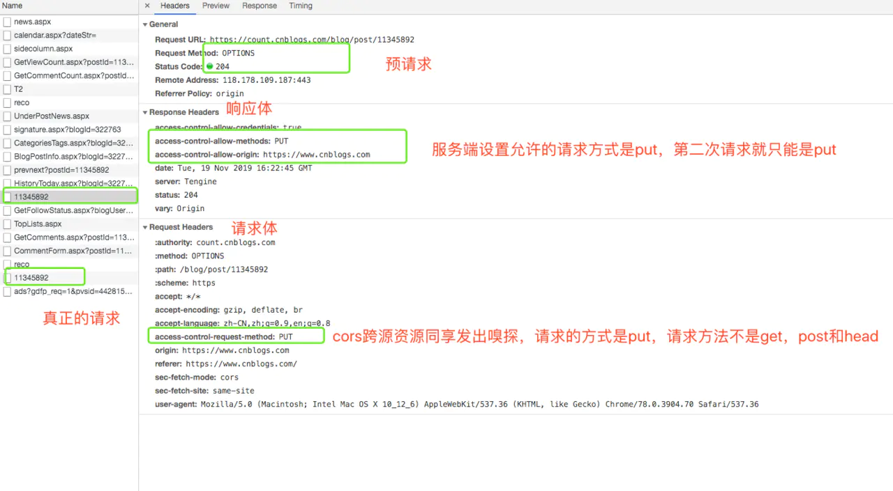
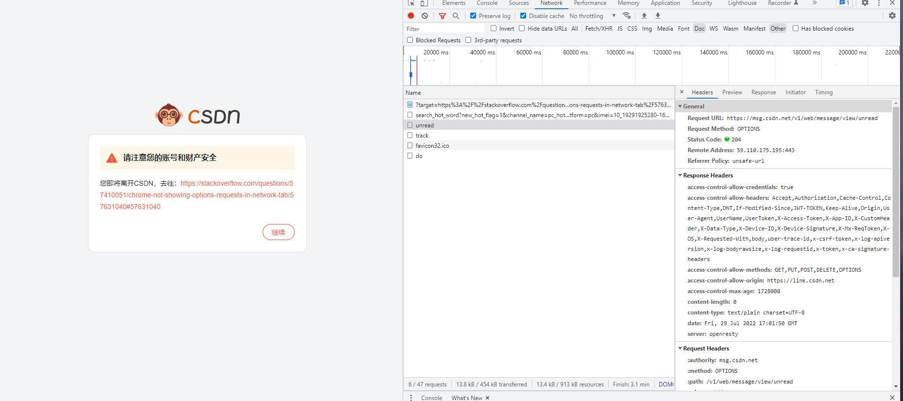
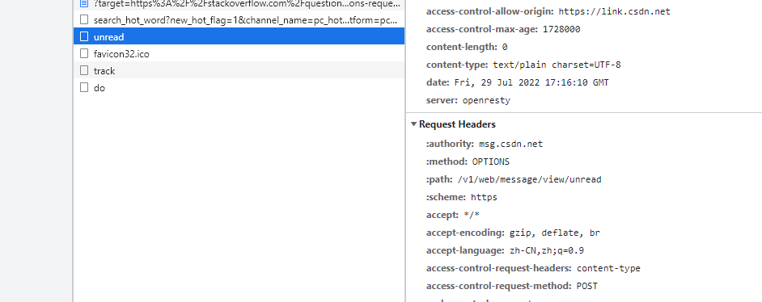
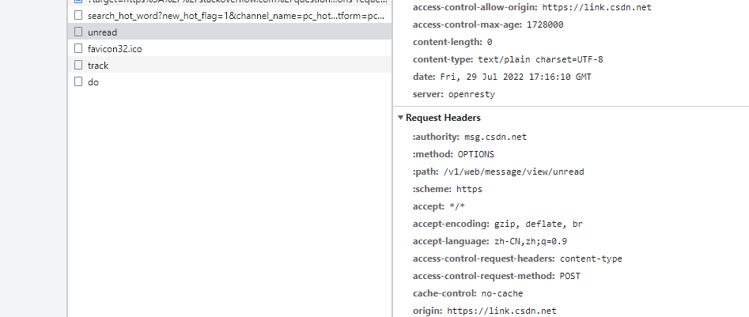
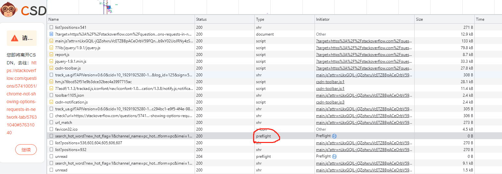
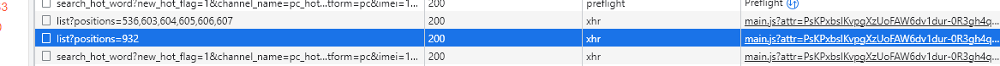
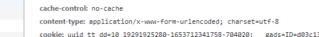
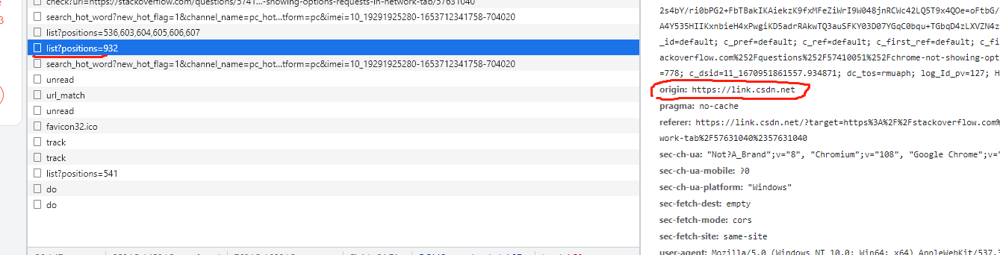

# OPTIONS 预检请求； 非简单请求和跨域都会发起options的预检；


https://www.ruanyifeng.com/blog/2016/04/cors.html


**1、 在新版的 chrome 中，如果你发送了复杂请求，你却看不到 `options` 请求。可以在这里设置 `chrome://flags/#out-of-blink-cors` 设置成 `disbale` ，重启浏览器。对于非简单请求就能看到 `options` 请求了。**

# 一、HTTP一共有八种常见请求方法

1. get：参数在url上，浏览器长度有限制，不安全；
2. post：参数不可见，长度不受限制；
3. put：上传最新内容到指定位置；
4. delete：删除请求的url所表示的资源；
5. head：不返回相应主体，主要用于客户端查看服务器性能; 查看服务器的head；
6. options：**与head类似，是客户端用于查看服务器的性能 。JavaScript的XMLHttpRequest对象进行CORS跨域资源共享时，就是使用OPTIONS方法发送嗅探请求，以判断是否有对指定资源的访问权限**
7. connect：http1.1预留的，将连接方式改为管道方式，通常用于SSL加密服务器的链接与 HTTP非加密的代理服务器之间的通信
8. trace：请求服务器[回显收到的请求信息]主要用于HTTP请求的测试或诊断
9. patch：出现的较晚，用于更新局部的资源，不存在时，会创建一个新的(http1.1之后使用的较多的)

```php
一般来说我们只需要用到post和get，但是如果后端是RestFul设计规范下就需要用到各种语义化的方法了
```

# **二、什么是预请求**

预请求就是复杂请求（可能对服务器数据产生副作用的HTTP请求方法，如put，delete都会对服务器数据进行修改，所以要先询问服务器）。
跨域请求中，浏览器自发的发起的预请求,浏览器会查询到两次请求，第一次的请求参数是options，以检测试实际请求是否可以被浏览器接受

# 三、为什么需要

```
w3c规范要求，对复杂请求，浏览器必须先使用options发起一个预检请求，从而获知服务器是否允许该跨域请求，服务器确认以后才能发起实际的HTTP请求，否则停止第二次正式请求。
```

那为什么我们不常见options请求呢？？
因为大部分我们使用的是get，post请求，他们属于简单请求，而简单请求不会触发options请求。
那什么情况下会发生options请求呢？？？👇

# 四、什么情况下发生（以下都属于复杂请求）

- 请求方法不是get head post
- post 的content-type不是application/x-www-form-urlencode,multipart/form-data,text/plain **[也就是把content-type设置成"application/json"]**
- 请求设置了自定义的header字段: 比如业务需求，传一个字段，方面后端获取，不需要每个接口都传

```
例如设置了post请求的content-type：application/json,就会发生预请求
```

# 五、为什么需要设置成contentType:"application/json"

```
ajax发送复杂的json数据结构， 处理方式困难， 服务器端难以解析， 所以就有了application/json这种类型（数据格式的声明）
服务端好解析并且比较统一，如果你请求中没有设置成json格式的，有的服务端收到后也会改成json格式的，但是如果请求中就改成了json格式的就会发生options预请求
```

if设置了：

- 表示json格式的字符串，发送的json对象必须使用json.stringify进行序列化字符串才能匹配
- spring 需要使用@RequestBody来注解

if没设置：

- 默认将使用contentType: "application/json”application/x-www-form-urlencoded

# 六、需要配置什么

```
在 CORS 中，可以使用 OPTIONS 方法发起一个预检请求，服务器基于从预检请求获得的信息来判断，以检测实际请求是否可以被服务器所接受。
```

1.预请求的请求报文中要设置👇

- **Access-Control-Request-Method首部字段：** 告知服务器实际请求所使用的 HTTP 方法；
- **Access-Control-Request-Headers首部字段：** 告知服务器实际请求所携带的自定义首部字段。

2.同时服务端或者nginx 需要设置响应体👇

```
"Access-Control-Allow-Origin" : * 【跨域】
Access-Control-Allow-Methods:POST,GET,OPTIONS,DELEDET 【所允许的请求方法告知客户端】
Access-Control-Allow-Headers: X-Requested-With, accept, origin, content-type【自定义的请求头】
Access-Control-Allow-Age:3600  
【一段时间内不需要再次预请求，直接用本次结果即可】
"Content-Type", "application/json;charset=utf-8"
```



# 七、options作用

OPTIONS请求方法的主要用途有两个：

1. 获取服务器支持的HTTP请求方法；也是黑客经常使用的方法。
2. 用来检查服务器的性能。例如：AJAX进行跨域请求时的预检，需要向另外一个域名的资源发送一个options请求头，用以判断实际发送的请求是否安全。

# 八、跨域方法

- JSONP跨域：动态生成script标签，只支持get请求，但是兼容性比较好可以支持老浏览器;
- CORS跨源资源共享：options请求做嗅探;
- webSockted：全双工通信;
- img src ：不受浏览器的同源限制;

# 九、简单请求和非简单请求（复杂请求）

在 cors 中会有 `简单请求` 和 `复杂请求`的概念。

## **a.简单请求**

不会触发 CORS 预检请求。这样的请求为“简单请求”，请注意，该术语并不属于 Fetch （其中定义了 CORS）规范。**若请求\**满足所有下述条件\**，则该请求可视为“简单请求”**：

情况一: 使用以下方法 (意思就是以下请求以外的都是非简单请求)

- `GET`
- `HEAD`
- `POST`

情况二: 人为设置以下集合外的 **请求头**

- `Accept`
- `Accept-Language`
- `Content-Language`
- `Content-Type` （需要注意额外的限制）
- `DPR`
- `Downlink`
- `Save-Data`
- `Viewport-Width`
- `Width`

情况三：`Content-Type`的值仅限于下列三者之一：(例如 application/json 为非简单请求)

- `text/plain`
- `multipart/form-data`
- `application/x-www-form-urlencoded`


情况四:

请求中的任意`XMLHttpRequestUpload` 对象均没有注册任何事件监听器；`XMLHttpRequestUpload` 对象可以使用 `XMLHttpRequest.upload` 属性访问。

情况五:

请求中没有使用 `ReadableStream` 对象。

## **b.非简单请求**

除以上情况外的。

## c.浏览器如何查看options请求

1、 在新版的 chrome 中，如果你发送了复杂请求，你却看不到 `options` 请求。可以在这里设置 `chrome://flags/#out-of-blink-cors` 设置成 `disbale` ，重启浏览器。对于非简单请求就能看到 `options` 请求了。


2、 一般情况下后端接口是不会开启这个跨域头的，除非是一些与用户无关的不太重要的接口。

# 十、如何在抓包工具和F12开发者工具中查看OPTION预检请求？

未完待续……


在chrome90上之前展示跨域请求预检请求的方法失效了：

在chrome地址栏总输入 chrome://flags/#out-of-blink-cors
将其设置为Disabled后重启浏览器

在chrome://flags找不到选项out-of-blink-cors。


<font color=red>**取而代之的是chrome将预检请求放到了控制台网络面板的 OTHER 面板中。**</font>

<font color=red>**要和XHR一起查看可以使用ctrl + click 或者 command + click。**</font>

另外注意并不是所有跨域请求都会发送预检请求，之后非简单请求才会发送跨域请求：

fetch(URL, {headers: {'Content-Type': 'Application/json'}})
1
参考
Chrome不显示OPTIONS请求的解决方法
Chrome not showing OPTIONS requests in Network tab


## options 的预检  这里是发生 跨域的时候的预检查；

案例：

https://link.csdn.net/?target=https%3A%2F%2Fstackoverflow.com%2Fquestions%2F57410051%2Fchrome-not-showing-options-requests-in-network-tab%2F57631040%2357631040




options 因为什么原因做的一个 请求；

header 的原因；header   




// 请求方法的原因；？？？


content-type

·


**//preflight ;; // 预检；**  




//    origin 普通请求；  普通请求；







## 了解一下  access-control-request-header 是什么意思？？

###Access-Control-Request-Headers
Access-Control-Request-Headers发出请求时报头用于预检请求让服务器知道哪些 HTTP 头的实际请求时将被使用。

Header type

Request header

Forbidden header name

yes

语法
Access-Control-Request-Headers: <header-name>, <header-name>, ...
指令
<header-name> 请求中包含的 HTTP 的 header 的逗号分隔列表。

例子
Access-Control-Request-Headers: X-PINGOTHER, Content-Type


###Access-Control-Request-Method
Access-Control-Request-Method发出请求时报头用于预检请求让服务器知道哪些 HTTP 方法的实际请求时将被使用。这个头是必要的，因为预检请求始终是一个OPTIONS，并且不使用与实际请求相同的方法。

Header type

Request header

Forbidden header name

yes

语法
Access-Control-Request-Method: 
<method>
指令
<method> HTTP 请求的方法之一，例如GET，POST，或DELETE。

例子
Access-Control-Request-Method: POST
