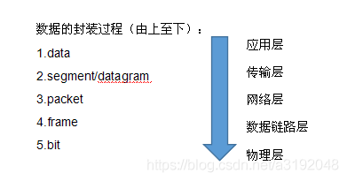
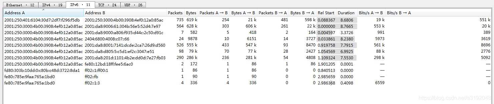

#  报文 报文段 分组 包 数据报 帧 流的概念和区别

## 0注意 tcp 是面向字节流的

所以，存在一个http需要多个tcp来传输； 存在的，毕竟是面向字节流的；

upd面向报文的，一个upd就传送一个message；当超过mtu最大传输单元，就会报错；mtu 收到链路层的影响；

##1.报文(message)
**我们将位于应用层的信息分组称为报文。**

**报文是网络中交换与传输的数据单元，也是网络传输的单元。**

报文包含了将要发送的完整的数据信息，其长短不需一致。

**报文在传输过程中会不断地封装成分组、包、帧来传输，封装的方式就是添加一些控制信息组成的首部，那些就是报文头。**

##2.报文段（segment） tcp and udp

通常是指起始点和目的地都是传输层的信息单元。

##3.分组/包(packet)  ip
分组是在网络中传输的二进制格式的单元，为了提供通信性能和可靠性，每个用户发送的数据会被分成多个更小的部分。在每个部分的前面加上一些必要的控制信息组成的首部，有时也会加上尾部，就构成了一个分组。它的起始和目的地是网络层。

##4.数据报(datagram)
面向无连接的数据传输，其工作过程类似于报文交换。采用数据报方式传输时，被传输的分组称为数据报。通常是指起始点和目的地都使用无连接网络服务的网络层的信息单元。(指IP数据报)

##5.帧(frame)  数据链路层
帧是数据链路层的传输单元。它将上层传入的数据添加一个头部和尾部，组成了帧。它的起始点和目的点都是数据链路层。

##6.数据单元（data unit）

指许多信息单元。常用的数据单元有服务数据单元（SDU）、协议数据单元（PDU）。

SDU是在同一机器上的两层之间传送信息。PDU是发送机器上每层的信息发送到接收机器上的相应层（同等层间交流用的）。

应用层——消息  message  报文；

传输层——报文段(segment)/数据报(datagram) (注：TCP叫TCP报文段，UDP叫UDP数据报,也有人叫UDP段)也是 segment

网络层——分组、数据包（packet）

链路层——帧（frame）（添加了mac地址吗？）

物理层——P-PDU（bit）

其实，segment，datagram，packet，frame是存在于同条记录中的，是基于所在协议层不同而取了不同的名字。我们可以用一个形象的例子对数据包的概念加以说明：我们在邮局邮寄产品时，虽然产品本身带有自己的包装盒，但是在邮寄的时候只用产品原包装盒来包装显然是不行的。必须把内装产品的包装盒放到一个邮局指定的专用纸箱里，这样才能够邮寄。这里，产品包装盒相当于数据包，里面放着的产品相当于可用的数据，而专用纸箱就相当于帧，且一个帧中通常只有一个数据包。
注：Datagram: This is used in 2 layers. If the network protocol is IP, the unit of data is called Datagram. At transport layer, if protocol is UDP, we use datagram there as well. Hence, we differentiate them as UDP Datagram, IP Datagram. (参考链接:Definition of Network Units: Fragment, Segment, Packet, Frame, Datagram)

TCP数据流(TCP stream)

Wireshark中是这么定义的：相同四元组(源地址，源端口，目的地址，目的端口)的包就为一条TCP流，即一条流有很多个包。

 [IP address A, TCP port A, IP address B, TCP port B]

All the packets for the same tcp.stream value should have the same values for these fields (though the src/dest will be switched for A->B and B->A packets).

the stream index is an internal Wireshark mapping to: [IP address A, TCP port A, IP address B, TCP port B]

All the packets for the same tcp.stream value should have the same values for these fields (though the src/dest will be switched for A->B and B->A packets)

see the Statistics/Conversations/TCP tab in Wireshark to show a summary of these streams.

以下用Wireshark实际抓包说明一下：

一个包就是一行记录，可看出是从No.1开始计数的。

点击Follow->TCP Stream可查看该包所属的流：

可看出wireshark中流是从0开始计数的，这个流序号没什么意义，只是为了唯一标识一条流(Stream indexes are Wireshark-internal. It just uses a number to uniquely identify a TCP stream.)，该流有3个客户端包，40个服务端包，最左边的packet 2 表示鼠标点击的这个包在全部包序列中的序号。

点击Statistics->Conversations

(注：我的ipv4地址是公网ip，所以做了马赛克处理，ipv6是临时ip就无所谓了。)

**可看到：TCP流有24条，UDP流有26条。IPv4流有19条，IPv6流有11条，为什么IPv4+IPv6流总数小于TCP+UDP流呢？**

**因为IP流没有端口，只考虑相同二元组(源ip，目的ip)：**

参考链接：https://stackoverflow.com/questions/6076897/follow-tcp-stream-where-does-field-stream-index-come-from
————————————————
版权声明：本文为CSDN博主「啊大1号」的原创文章，遵循CC 4.0 BY-SA版权协议，转载请附上原文出处链接及本声明。
原文链接：https://blog.csdn.net/a3192048/article/details/84671340