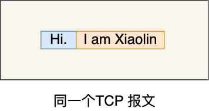
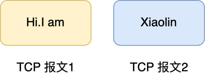

# 面向报文和 面向字节流

>原因是由于，TCP和UDP协议的发送方的发送机制不一样；

#### UDP 面向报文；

不会对消息进行拆分；

**一个udp的报文就是一个消息；**

**一个udp报文就是一个完整用户信息；**

---

#### TCP 面向字节流；

**消息可能被拆分成多个TCP报文进行传输；**

注意： 我们的send 之后，消息并没有真正的从网络上发送出去，而是放在了缓冲区；

什么时候的发送取决于；发送窗口和拥塞窗口的大小，当前发送窗口的缓冲区大小；

eg：案例  ：同一个消息有可能被拆分成多个tcp报文；

所以我们不能认为一个tcp报文对应着一个用户消息，所以tcp是面向字节流的协议；

**存在的问题：**

当两个消息的某个部分内容被分到同一个 TCP 报文时，就是我们常说的 TCP 粘包问题，这时接收方不知道消息的边界的话，是无法读出有效的消息。

要解决这个问题，要交给**应用程序**。

 **特殊字符作为边界；EOF；其实一般用回车作为一个tcp的边界字符；**  比如微信聊天里面的回车发送消息，回车代表着一个消息的结束；

