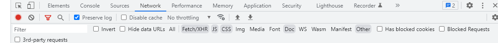
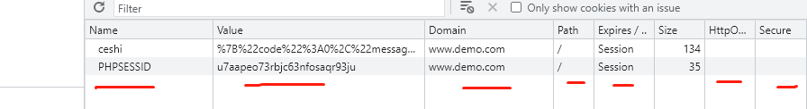

# 浏览器的设置

disabale  caceh  不要去缓存；

other ： 这个是可以看到options的请求的

我们php平常看的doc 文件格式；

jscss 都是html的；

XHR 都是 ajax的请求；

WS 就是websocket的请求；

**invert  反转 倒转  ；倒置  ； 倒转，颠倒，倒置;**

​	

## 注意  application 

一般用来看 cookie 和  和sessioID的；

可以查看关于cookie的信息；\

cookie 的几个信息呀 多去注意一下呀；

