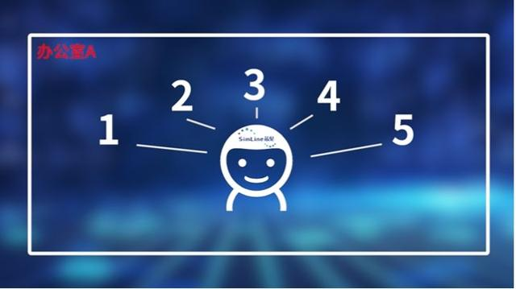

# 分布式

>以前一个人一个活，这个是传统IT架构的单节点计算。
>
>后来一个人干多个活，这个人就支持不住了，开始提升这个人的干活能力，这叫Scale up。
>
>最后发现还是不行，于是多个人干多个活这就是分布式，也就是Scale out。
>
>多个人干一个活，就是集群，并行计算，超算。
>
>不是很准确，大概是这个意思！

无论你是不是从业人员，近两年肯定听说过一个词，那就是分布式。分布式到底是什么？

提起分布式，就不得不提到它的前身。举个例子，如果将一款App的服务器看做一间办公室，办公室里坐着一位全能打工人“小明”，一人同时负责五个功能。

全能小明从早忙到晚，难免吃不消，这时，我们将这些功能拆解开，让每个小明单独负责五个功能中的一个，这些小明就可以同步进行工作，哪怕其中一个宕机，其他功能仍然能继续运转。这种将完整的系统拆分成一个个独立子系统的方式就是分布式。

分布式的应用非常广泛，而它的具体做法也会因行业而异。这也是为什么我们经常在网上看到各种版本的分

## CAP理论 好好看一下把；

https://zhuanlan.zhihu.com/p/382966178