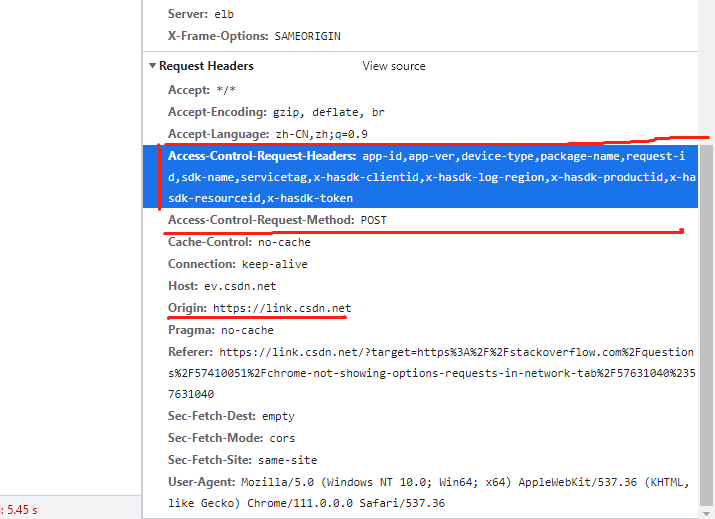

https://javascript.ruanyifeng.com/bom/cors.html

https://javascript.ruanyifeng.com/bom/same-origin.html#toc1


cors 资料 仔细看一下把；


# CORS通信

来自[《JavaScript 标准参考教程（alpha）》](https://javascript.ruanyifeng.com/)，by 阮一峰

## 目录

- [简介](https://javascript.ruanyifeng.com/bom/cors.html#toc0)
- [两种请求](https://javascript.ruanyifeng.com/bom/cors.html#toc1)
- [简单请求](https://javascript.ruanyifeng.com/bom/cors.html#toc2)
- [基本流程](https://javascript.ruanyifeng.com/bom/cors.html#toc3)
- [withCredentials 属性](https://javascript.ruanyifeng.com/bom/cors.html#toc4)
- [非简单请求](https://javascript.ruanyifeng.com/bom/cors.html#toc5)
- [预检请求](https://javascript.ruanyifeng.com/bom/cors.html#toc6)
- [预检请求的回应](https://javascript.ruanyifeng.com/bom/cors.html#toc7)
- [浏览器的正常请求和回应](https://javascript.ruanyifeng.com/bom/cors.html#toc8)
- [与 JSONP 的比较](https://javascript.ruanyifeng.com/bom/cors.html#toc9)
- [参考链接](https://javascript.ruanyifeng.com/bom/cors.html#toc10)

重要说明：本教程已经搬迁，此处不再维护，请访问新网址：[wangdoc.com/javascript](https://wangdoc.com/javascript/)。

CORS 是一个 W3C 标准，全称是“跨域资源共享”（Cross-origin resource sharing）。它允许浏览器向跨域的服务器，发出`XMLHttpRequest`请求，从而克服了AJAX只能同源使用的限制。

---


## 为啥要做预检请求options；


预检请求（OPTIONS 请求）是 CORS 中的一种机制，**用于在实际请求之前进行验证和协商。**它的存在是为了确保服务器允许浏览器发送实际请求，并且请求的方法、头部等符合服务器的要求。**以下是预检请求的原因和作用：**

1. **安全性**：预检请求可以确保服务器只接受来自可信任的源和方法的请求。通过预检请求，服务器可以验证请求的来源和方法是否符合其安全策略。**这有助于防止恶意请求和跨站点请求伪造（CSRF）等安全威胁。**
2. **避免不必要的请求**：**预检请求可以避免发送不必要的实际请求。**在某些情况下，服务器可能只允许特定的方法或头部字段。通过预检请求，浏览器可以在发送实际请求之前，先向服务器确认请求是否符合服务器的要求。**如果不符合要求，浏览器可以避免发送实际请求，从而节省网络带宽和服务器资源。**
3. **缓存预检请求**：预检请求的响应可以被缓存，以减少对服务器的频繁请求。**预检请求的响应中包含了服务器允许的方法、头部字段等信息，这些信息可以被浏览器缓存起来。当下次发送相同的跨域请求时，浏览器可以直接使用缓存的预检请求响应，而无需再次发送预检请求。**

需要注意的是，预检请求只在特定情况下才会被发送。根据 CORS 规范，以下情况下会发送预检请求：

- **使用了非简单方法（如 PUT、DELETE）或自定义头部字段的请求。**
- 发送带有身份验证凭证（如 Cookie）的请求，并且服务器的响应头中没有设置 `Access-Control-Allow-Credentials: true`。

预检请求的流程如下：

1. 浏览器在发送实际请求之前，先发送一个 OPTIONS 请求，称为预检请求。
2. 服务器接收到预检请求后，根据请求头中的信息进行验证和协商。
3. 服务器返回预检请求的响应，其中包含了允**许的方法、头部字段等信息**。
4. **浏览器根据预检请求的响应，判断是否允许发送实际请求。**   
5. 如果允许发送实际请求，浏览器发送实际请求。
6. 服务器接收到实际请求后，进行处理并返回响应。

----


## 简介

**CORS 需要浏览器和服务器同时支持。目前，所有浏览器都支持该功能。**

整个 CORS 通信过程，都是浏览器自动完成，不需要用户参与。对于开发者来说，CORS 通信与普通的 AJAX 通信没有差别，代码完全一样。**浏览器一旦发现 AJAX 请求跨域，就会自动添加一些附加的头信息，有时还会多出一次附加的请求，但用户不会有感知**。

**因此，实现 CORS 通信的关键是服务器。只要服务器实现了 CORS 接口，就可以跨域通信。**


## 两种请求

CORS 请求分成两类：简单请求（simple request）和非简单请求（not-so-simple request）。

只要同时满足以下两大条件，就属于简单请求。

（1）请求方法是以下三种方法之一。

> - HEAD
> - GET
> - POST

（2）HTTP 的头信息不超出以下几种字段。

> - Accept
> - Accept-Language
> - Content-Language
> - Last-Event-ID
> - Content-Type：只限于三个值`application/x-www-form-urlencoded`、`multipart/form-data`、`text/plain`

**凡是不同时满足上面两个条件，就属于非简单请求。****一句话，简单请求就是简单的 HTTP 方法与简单的 HTTP 头信息的结合。**

<font color=red>这样划分的原因是，表单在历史上一直可以跨域发出请求。**简单请求就是表单请求，浏览器沿袭了传统的处理方式，不把行为复杂化，否则开发者可能转而使用表单，规避 CORS 的限制。对于非简单请求，浏览器会采用新的处理方式。**</font>


## 简单请求


### 基本流程

**对于简单请求，浏览器直接发出 CORS 请求。具体来说，就是在头信息之中，增加一个`Origin`字段。**

下面是一个例子，浏览器发现这次跨域 AJAX 请求是简单请求，就自动在头信息之中，添加一个`Origin`字段。

```
GET /cors HTTP/1.1
Origin: http://api.bob.com
Host: api.alice.com
Accept-Language: en-US
Connection: keep-alive
User-Agent: Mozilla/5.0...
```

上面的头信息中，**`Origin`字段用来说明，本次请求来自哪个域（协议 + 域名 + 端口）。服务器根据这个值，决定是否同意这次请求。**

<font color=red>**如果`Origin`指定的源，不在许可范围内，服务器会返回一个正常的 HTTP 回应。浏览器发现，这个回应的头信息没有包含`Access-Control-Allow-Origin`字段（详见下文），就知道出错了，从而抛出一个错误，被`XMLHttpRequest`的`onerror`回调函数捕获。注意，这种错误无法通过状态码识别，因为 HTTP 回应的状态码有可能是200。**</font>

<font color=red>**如果`Origin`指定的域名在许可范围内，服务器返回的响应，会多出几个头信息字段。**</font>

```
Access-Control-Allow-Origin: http://api.bob.com
Access-Control-Allow-Credentials: true
Access-Control-Expose-Headers: FooBar
Content-Type: text/html; charset=utf-8
```

上面的头信息之中，有三个与 CORS 请求相关的字段，都以`Access-Control-`开头。

**（1）`Access-Control-Allow-Origin`**

**该字段是必须的。它的值要么是请求时`Origin`字段的值，要么是一个`*`，表示接受任意域名的请求。**

**（2）`Access-Control-Allow-Credentials`**

<font color=red>**该字段可选。它的值是一个布尔值，表示是否允许发送 Cookie。默认情况下，Cookie 不包括在 CORS 请求之中。设为`true`，即表示服务器明确许可，浏览器可以把 Cookie 包含在请求中，一起发给服务器。这个值也只能设为`true`，如果服务器不要浏览器发送 Cookie，不发送该字段即可。**</font>

**（3）`Access-Control-Expose-Headers`**

该字段可选。CORS 请求时，`XMLHttpRequest`对象的`getResponseHeader()`方法只能拿到6个服务器返回的基本字段：`Cache-Control`、`Content-Language`、`Content-Type`、`Expires`、`Last-Modified`、`Pragma`。如果想拿到其他字段，就必须在`Access-Control-Expose-Headers`里面指定。上面的例子指定，`getResponseHeader('FooBar')`可以返回`FooBar`字段的值。


### withCredentials 属性

上面说到，CORS 请求默认不包含 Cookie 信息（以及 HTTP 认证信息等）。如果需要包含 Cookie 信息，一方面要服务器同意，指定**`Access-Control-Allow-Credentials`字段。**

```
Access-Control-Allow-Credentials: true
```

另一方面，开发者必须在 AJAX 请求中打开`withCredentials`属性。

```
var xhr = new XMLHttpRequest();
xhr.withCredentials = true;
```

否则，即使服务器同意发送 Cookie，浏览器也不会发送。或者，服务器要求设置 Cookie，浏览器也不会处理。

但是，如果省略`withCredentials`设置，有的浏览器还是会一起发送 Cookie。这时，可以显式关闭`withCredentials`。

```
xhr.withCredentials = false;
```

需要注意的是，如果要发送 Cookie，`Access-Control-Allow-Origin`就不能设为星号，必须指定明确的、与请求网页一致的域名。同时，Cookie 依然遵循同源政策，只有用服务器域名设置的 Cookie 才会上传，其他域名的 Cookie 并不会上传，且（跨域）原网页代码中的`document.cookie`也无法读取服务器域名下的 Cookie。


## 非简单请求


### 预检请求

<font color=red>**非简单请求是那种对服务器提出特殊要求的请求，比如请求方法是`PUT`或`DELETE`，或者`Content-Type`字段的类型是`application/json`。**</font>

<font color=red>**非简单请求的 CORS 请求，会在正式通信之前，增加一次 HTTP 查询请求，称为“预检”请求（preflight）。**</font>

浏览器先询问服务器，当前网页所在的域名是否在服务器的许可名单之中，以及可以使用哪些 HTTP 动词和头信息字段。只有得到肯定答复，浏览器才会发出正式的`XMLHttpRequest`请求，否则就报错。这是为了防止这些新增的请求，对传统的没有 CORS 支持的服务器形成压力，给服务器一个提前拒绝的机会，这样可以防止服务器大量收到`DELETE`和`PUT`请求，这些传统的表单不可能跨域发出的请求。

下面是一段浏览器的 JavaScript 脚本。

```
var url = 'http://api.alice.com/cors';
var xhr = new XMLHttpRequest();
xhr.open('PUT', url, true);
xhr.setRequestHeader('X-Custom-Header', 'value');
xhr.send();
```

上面代码中，HTTP 请求的方法是`PUT`，并且发送一个自定义头信息`X-Custom-Header`。

浏览器发现，这是一个非简单请求，就自动发出一个“预检”请求，要求服务器确认可以这样请求。下面是这个“预检”请求的 HTTP 头信息。

```
OPTIONS /cors HTTP/1.1
Origin: http://api.bob.com
Access-Control-Request-Method: PUT
Access-Control-Request-Headers: X-Custom-Header
Host: api.alice.com
Accept-Language: en-US
Connection: keep-alive
User-Agent: Mozilla/5.0...
```

**“预检”请求用的请求方法是`OPTIONS`，表示这个请求是用来询问的。头信息里面，关键字段是`Origin`，表示请求来自哪个源。**




除了`Origin`字段，“预检”请求的头信息包括两个特殊字段。

（1）`Access-Control-Request-Method`

该字段是必须的，用来列出浏览器的 CORS 请求会用到哪些 HTTP 方法，上例是`PUT`。

（2）`Access-Control-Request-Headers`

该字段是一个逗号分隔的字符串，指定浏览器 CORS 请求会额外发送的头信息字段，上例是`X-Custom-Header`。


### 预检请求的回应

服务器收到“预检”请求以后，检查了`Origin`、`Access-Control-Request-Method`和`Access-Control-Request-Headers`字段以后，确认允许跨源请求，就可以做出回应。

```
HTTP/1.1 200 OK
Date: Mon, 01 Dec 2008 01:15:39 GMT
Server: Apache/2.0.61 (Unix)
Access-Control-Allow-Origin: http://api.bob.com
Access-Control-Allow-Methods: GET, POST, PUT
Access-Control-Allow-Headers: X-Custom-Header
Content-Type: text/html; charset=utf-8
Content-Encoding: gzip
Content-Length: 0
Keep-Alive: timeout=2, max=100
Connection: Keep-Alive
Content-Type: text/plain
```

上面的 HTTP 回应中，关键的是`Access-Control-Allow-Origin`字段，表示`http://api.bob.com`可以请求数据。该字段也可以设为星号，表示同意任意跨源请求。

```
Access-Control-Allow-Origin: *
```

**如果服务器否定了“预检”请求，会返回一个正常的 HTTP 回应，但是没有任何 CORS 相关的头信息字段，或者明确表示请求不符合条件。**

```
OPTIONS http://api.bob.com HTTP/1.1
Status: 200
Access-Control-Allow-Origin: https://notyourdomain.com
Access-Control-Allow-Method: POST
```

上面的服务器回应，`Access-Control-Allow-Origin`字段明确不包括发出请求的`http://api.bob.com`。

这时，浏览器就会认定，服务器不同意预检请求，因此触发一个错误，被`XMLHttpRequest`对象的`onerror`回调函数捕获。控制台会打印出如下的报错信息。

```
XMLHttpRequest cannot load http://api.alice.com.
Origin http://api.bob.com is not allowed by Access-Control-Allow-Origin.
```

服务器回应的其他 CORS 相关字段如下。

```
Access-Control-Allow-Methods: GET, POST, PUT
Access-Control-Allow-Headers: X-Custom-Header
Access-Control-Allow-Credentials: true
Access-Control-Max-Age: 1728000
```

**（1）`Access-Control-Allow-Methods`**

该字段必需，它的值是逗号分隔的一个字符串，表明服务器支持的所有跨域请求的方法。注意，返回的是所有支持的方法，而不单是浏览器请求的那个方法。这是为了避免多次“预检”请求。

**（2）`Access-Control-Allow-Headers`**

如果浏览器请求包括`Access-Control-Request-Headers`字段，则`Access-Control-Allow-Headers`字段是必需的。它也是一个逗号分隔的字符串，表明服务器支持的所有头信息字段，不限于浏览器在“预检”中请求的字段。

**（3）`Access-Control-Allow-Credentials`**

该字段与简单请求时的含义相同。

**（4）`Access-Control-Max-Age`**

该字段可选，用来指定本次预检请求的有效期，单位为秒。上面结果中，有效期是20天（1728000秒），即允许缓存该条回应1728000秒（即20天），在此期间，不用发出另一条预检请求。


### 浏览器的正常请求和回应

**一旦服务器通过了“预检”请求，以后每次浏览器正常的 CORS 请求，就都跟简单请求一样，会有一个`Origin`头信息字段。服务器的回应，也都会有一个`Access-Control-Allow-Origin`头信息字段。**

下面是“预检”请求之后，浏览器的正常 CORS 请求。

```
PUT /cors HTTP/1.1
Origin: http://api.bob.com
Host: api.alice.com
X-Custom-Header: value
Accept-Language: en-US
Connection: keep-alive
User-Agent: Mozilla/5.0...
```

上面头信息的`Origin`字段是浏览器自动添加的。

下面是服务器正常的回应。

```
Access-Control-Allow-Origin: http://api.bob.com
Content-Type: text/html; charset=utf-8
```

上面头信息中，`Access-Control-Allow-Origin`字段是每次回应都必定包含的。


## 与 JSONP 的比较

CORS 与 JSONP 的使用目的相同，但是比 JSONP 更强大。JSONP 只支持`GET`请求，CORS 支持所有类型的 HTTP 请求。JSONP 的优势在于支持老式浏览器，以及可以向不支持 CORS 的网站请求数据。


## 参考链接

- Monsur Hossain, [Using CORS](https://www.html5rocks.com/en/tutorials/cors/)
- MDN, [HTTP access control (CORS)](https://developer.mozilla.org/en-US/docs/Web/HTTP/Access_control_CORS)
- Ryan Miller, [CORS](https://frontendian.co/cors)