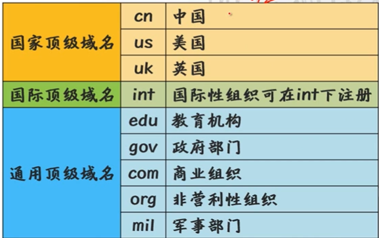

# DNS

> 域名：方便记忆；
>
> DNS：域名->ip;

**域名的基础知识**

**组成：**

* 主机名  www  mail zone  eg：mail.qq.com www.qq.com 

* 主体    qq  baidu  bilibili           

* 后缀   .com  .org .net  

  顶级域名

  * 一般域名：.com .net .org
  * 国家  .cn .uk

* 根域名 . 隐藏的 一般不显示

**cn的二级域名；**

三级域名就是一个公司名字之类的，.qq.com   就是一个二级域名  

**域名分类**

* 根域名 . 
* 顶级域名   .com  .org .net
* 权威域名  .qq.com  .baidu.com .bilibili.com

