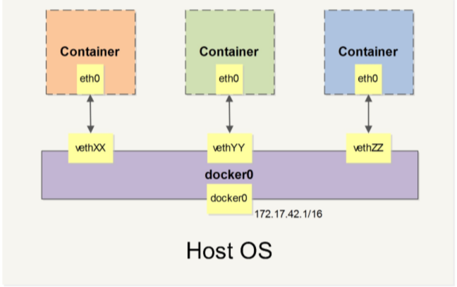
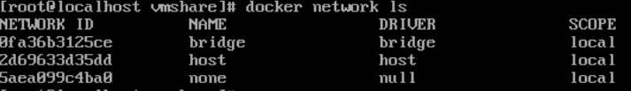
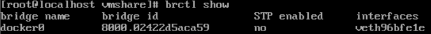
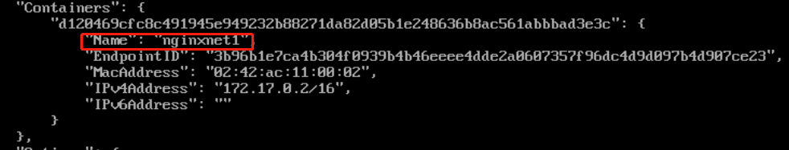
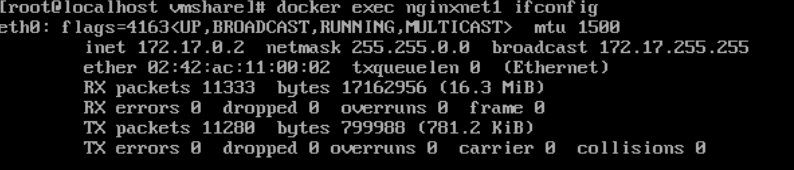
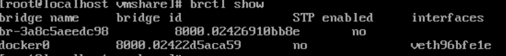
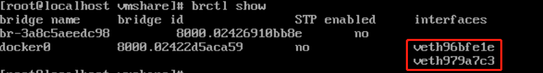
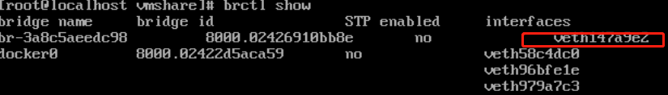
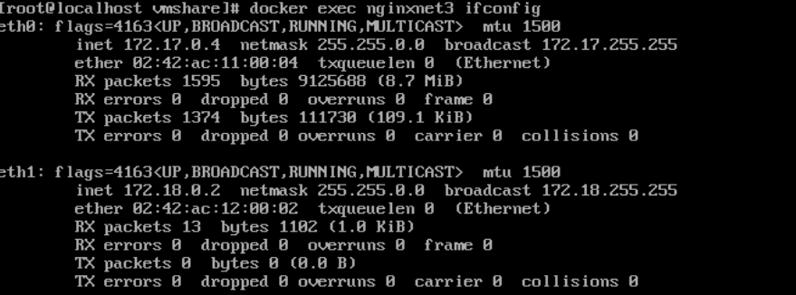

# Docker网络的原理和验证

#### 基础命令

----

| 命令                                            | 效果                               |
| ----------------------------------------------- | ---------------------------------- |
| docker network create -d bridge xxx             | 创建网桥                           |
| docker network ls                               | 查看所有的docker                   |
| docker network inspect xxx                      | 查看网桥的详细情况                 |
| docker network connect net_xxx container_xxx    | **已经运行**的容器连接到自定义网络 |
| docker network disconnect nex_xxx container_xxx | 容器与网络断开连接                 |
| docker network prune                            | 删除所有的没有被使用的网络         |
| docker network rm xxx [xxx...]                  | 删除一个或者多个网络               |

注意：docker network create -d bridge  xxx  子网值是不确定的，仅仅是为了满足IP寻址目的。可以使用参数--subnet= 指定子网值（CIDR(classless inter-domain Routing)无类型域间选路）；

docker给创建的容器一个默认的网络docker0，**注意在这个网络的容器只能实现Ip的互联；**所以默认创建的**docker0**就是实现IP互联的原因；所以要实现容器名的访问只能用**link**，或者**自定义网络**；  （接上一篇博客，容器互联）

#### Docker网络的原理

Docker网络实现是利用了linux上的命名空间和虚拟设备(虚拟接口 veth pair)；

* 命名空间：不同的命名空间的资源是隔离的；隔离性；
* veth pair: 本地主机（默认连接到docker0，或者其他设定的网桥。，可以使用 brctl 查看到）和容器内分别创建一个虚拟接口（也就是eth0，网卡）（输出从一边流入就会从另外一边流出，看成一个水管，水流就是数据），来实现互联；

就是下面关系：

自定义网络也差不多是这个形式，只是换了一下名字；一个容器连接两个网络也就是容器内存在两个veth pair 也就是两个网卡(eth0,eth1);

#### 验证

* 准备工作

  * 安装brctl(bridge control,网桥控制)，yum install -y bridge-utils;

* 查看所有网络(bridge就是docker0网络)

  

  

* 创建一个容器 brctl show 查看网桥情况

  * 创建nginxnet1容器

    ~~~
    docker run -d --name nginxnet1 nginx
    ~~~

  * 查看网桥状况

    ~~~
    brctl show
    ~~~

    

    

    可以看到docker0网络，有一个veth;一端是连接在docker0；
  
    ~~~
    docker network inspect bridge
    ~~~

    
  
    
  
    docker0网络中的容器包含nginxnet1；
  
  * 查看容器 nginxnet1的网卡
  
    ~~~
    docker exec nginxnet ifconfig  //只存在 eth0一个网卡
    ~~~
  
    
    
    
    
  * 创建一个自定义网络
  
    ~~~
    docker network create -d bridge my_net
    ~~~
  
    * 查看 所有的网桥
  
      ~~~
      brctl show
      ~~~
  
      
  
      
      
      br-xxx就是创建的my_net网桥，并且没有vethpair的连接；
  
  * 再创建一个容器nginxnet2
  
    ~~~
    docker run -d --name nginxnet2 nginx
    ~~~
  
    * 查看网桥
  
    ~~~
      brctl show
    ~~~
  
       
  
      有两个vethpair连接，那么对应的docker network inspect bridge中的container肯定也有两个;
  
  * 创建一个ngxinnet3
  
    ~~~
    docker run -d --name nginxnet3 nginx       //一开始在docker0网络
    docker network connect my_net nginxnet3   //nginxnet3 连接进 my_net网络
    ~~~
  
    * 查看网桥
  
      
  
      
  
      很明显 docker0有三个veth，my_net有一个；
  
    * 查看 容器nginxnet3 有两块网卡
  
      ~~~
      docker exec nginxnet3 ifconfig
      ~~~
  
      
  
  ​    

注意：当先docker run 运行一个容器，然后容器 docker network connect my_net contianer，**那么这个容器会在docker0和my_net这两个网络中**；docker run --network my_net这样只会在my_net自定义的网络中，docker run创建一个容器时,没有--network，默认都是拉进docker0网络，实现IP互联；

当再查看在两个网络中的容器，ifconfig会看到两个网卡，eth0和eth1，在docker network connect 之前，只有一块网卡，其实那个网卡就是veth pair在容器端的表现形式，可以用brctl来查看宿主机的网桥状况，来查看veth pair在宿主机端的表现形式；

#### 参考  《Docker入门到实践》