# FS

>**查看 文件inode 的命令**
>
>**stat file_Name**
>
>文件系统，是为了解决，文件存储和查找的方案；好的文件系统效率更好，存的更多；
>
>比较常见的是u盘的  --- 文件系统；
>
>各个操作系统的文件系统
>
>windows NTFS   
>
>macos    APFS
>
>linux  EXT3
>
>U盘  exFAT


## 一、块，页，扇区的区别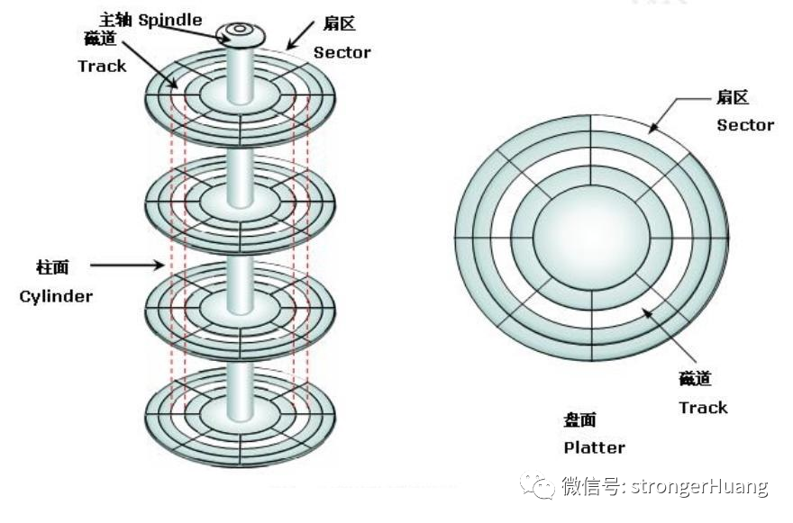

由上图可以看出磁盘的结构，以前**硬盘的最小单位是扇区**，通常一扇区为512B，但是现在许多磁盘一个扇区就达到了4KB，那么块的概念从哪里来的呢，实际上块并不存在，他只是因为文件系统如果一个扇区一个扇区的读数据太慢，所以在文件系统下提出了块的概念，一块一块的读可以大大提高效率，块大小=扇区大小*2^n。**根据文件系统的不同，一个块可以是两个扇区也可以是四个**。综上所述，**文件读取时的最小单位是块**。**扇区是对硬盘而言，磁盘块是对文件系统而言。** **所以文件系统操作文件的最小单位是块，而磁盘的基本单位是扇区。**

而操作系统与内存打交道时才有了页的概念，因为如果采用内存的分页机制，内存被分为大小为4K的页面。也是一种虚拟单位。

**综上：操作系统操作内存是以页为基本单位、文件系统操作磁盘是以块为基本单位，而磁盘自身读写是以扇区为基本单位。**


## **二、文件系统中inode与高速缓冲区的作用**

### 2.1 inode

i节点描述：

（1）一个i节点可以有多个文件名来对应它

（2）i节点能描述文件占用的块数

（3）**?i节点描述了文件大小和指向数据块的指针**

（4）通过i节点实现文件的逻辑结构和物理结构的转换

操作系统通过inode以文件的方式操控磁盘，所以说**inode节点是文件与磁盘的映射，文件系统**通过I节点存取文件数据。

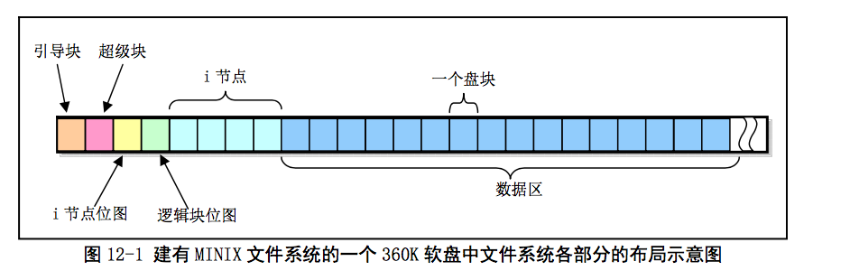

0块：引导块，每块1024B
1块：超级块：**超级快记录了总i节点数，逻辑块数，以及记录他们存在的对应的位图数，操作系统也就是根据超级快来处理该分区的文件操作的。**
2块：i节点位图
3块：逻辑块位图
4...18：i节点区块
19块：数据块，刚好和Linux文件系统分析之二中提到的数据块开始于第19块吻合。

### 2.2 重点——inode与block找文件

那么inode是什么呢？**Block是记录文件内容的区域，inode则是记录该文件的属性及其放置在哪个Block之内的信息**。所以，每个文件都会占用一个inode。**当Linux系统要查找某个文件时，它会先搜索inode table找到这个文件的属性及数据存放地点，然后再查找数据存放的Block进而将数据取出。**inode数量在一开始已被设定好，其设定方式通常是"硬盘大小/一个容量"，这个容量比Block大一些较佳，例如刚才将Block设为4K，那么这个容量可以设为8K左右。所以，一块1GB的硬盘如果以8K 大小划分它的inode数，则会有131072个inode。一个inode的大小为128Byte，这样，我们就可以清楚地知道，**一个分区被格式化为一个文件系统之后，基本上它一定会有inode table与数据区域两大块，一个用来记录文件的属性信息与该文件存放的Block块，一个用来记录文件的内容。**

### 2.3?高速缓冲区

?用户在访问磁盘时并不是直接操作硬盘，效率很低，所以引入了高速缓冲区，**高速缓冲区是用户与磁盘的映射结构**。

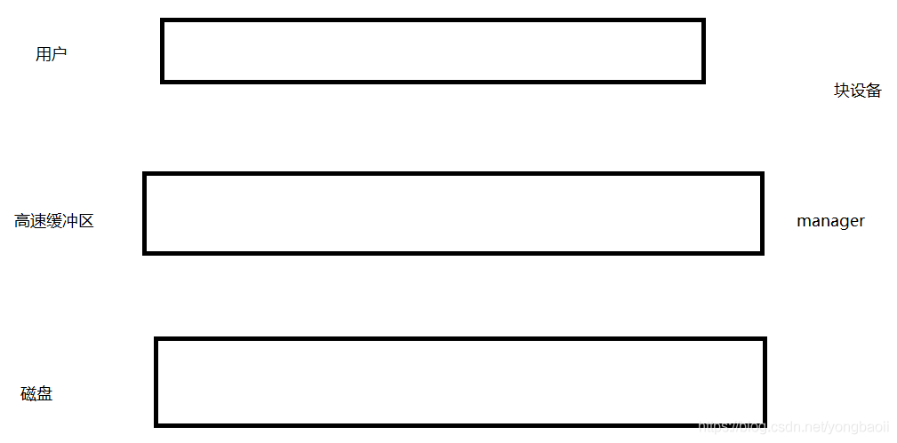字节大小的缓冲块**，**正好与块设备上的磁盘逻辑块大小相同**，高速缓冲采用hash表和包含所有缓冲块的双向循环链表进行操作管理。?


# [Inode详解](https://www.cnblogs.com/qingshui2014/p/4284966.html)

**一、inode是什么**

理解inode，要从文件储存说起。

文件储存在硬盘上，**硬盘的最小存储单位叫做"扇区"（Sector）**。每个扇区储存512字节（相当于0.5KB）。

操作系统读取硬盘的时候，[Inode详解](https://www.cnblogs.com/qingshui2014/p/4284966.html)

**一、inode是什么**

理解inode，要从文件储存说起。

文件储存在硬盘上，**硬盘的最小存储单位叫做"扇区"（Sector）**。每个扇区储存512字节（相当于0.5KB）。

**操作系统读取硬盘的时候，不会一个个扇区地读取，这样效率太低，而是一次性连续读取多个扇区，即一次性读取一个"块"（block）。这种由多个扇区组成的"块"，是文件存取的最小单位。****"块"的大小，最常见的是4KB，即连续八个sector组成一个block。**


**文件数据都储存在"块"中，那么很显然，我们还必须找到一个地方储存文件的元信息，比如文件的创建者、文件的创建日期、文件的大小等等。这种储存文件元信息的区域就叫做inode，中文译名为"索引节点"。**  


**每一个文件都有对应的inode，里面包含了与该文件有关的一些信息。**

 

**二、inode内容**

inode包含文件的元信息，具体来说有以下内容：
  \* 文件的字节数
  \* 文件拥有者的User ID
  \* 文件的Group ID
  \* 文件的**读、写、执行权限**
  \* 文件的时间戳，共有三个：**ctime指inode上一次变动的时间，mtime指文件内容上一次变动的时间，atime指文件上一次打开的时间。**
  \* **链接数，即有多少文件名指向这个inode links** 
  \* **文件数据block的位置**

可以用stat命令，查看某个文件的inode信息：

```
stat example.txt
```

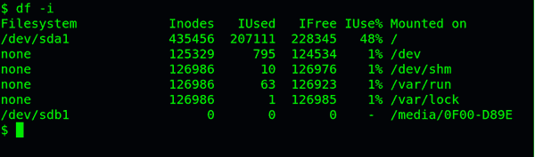

总之，除了文件名以外的所有文件信息，都存在inode之中。至于为什么没有文件名，下文会有详细解释。

 

**三、inode结构**

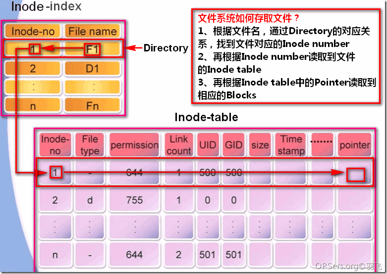

了解一下文件系统如何存取文件的：
**1、根据文件名，通过Directory里的对应关系，找到文件对应的Inode number**
**2、再根据Inode number读取到文件的Inode table**
**3、再根据Inode table中的Pointer读取到相应的Blocks**

这里有一个重要的内容，就是Directory，他不是我们通常说的目录，而是一个列表，记录了一个文件/目录名称对应的Inode number。如下图：

**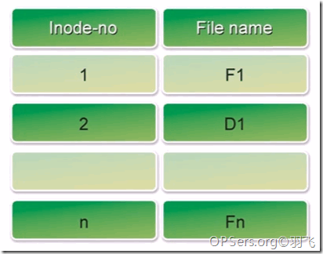**

 

**四、inode大小**

inode也会消耗硬盘空间，所以硬盘格式化的时候，**操作系统自动将硬盘分成两个区域。一个是数据区，存放文件数据；另一个是inode区（inode table），存放inode所包含的信息。**


每个inode节点的大小，一般是128字节或256字节。inode节点的总数，在格式化时就给定，一般是每1KB或每2KB就设置一个inode。假定在一块1GB的硬盘中，每个inode节点的大小为128字节，每1KB就设置一个inode，那么inode table的大小就会达到128MB，占整块硬盘的12.8%。

查看每个硬盘分区的inode总数和已经使用的数量，可以使用df命令。

```
df -i
```


查看每个inode节点的大小，可以用如下命令：

```
sudo dumpe2fs -h /dev/hda | grep "Inode size"
```

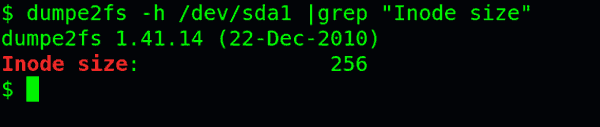

由于每个文件都必须有一个inode，因此有可能发生inode已经用光，但是硬盘还未存满的情况。这时，就无法在硬盘上创建新文件。

 

**五、inode号码**

**每个inode都有一个号码，操作系统用inode号码来识别不同的文件。**


这里值得重复一遍，**Unix/Linux系统内部不使用文件名，而使用inode号码来识别文件。对于系统来说，文件名只是inode号码便于识别的别称或者绰号。**


表面上，用户通过文件名，打开文件。实际上，系统内部这个过程分成三步：

首先，系统找到这个**文件名对应的inode号码**；

其次，**通过inode号码**，获取**inode信息**； 这里是通过 inode table

最后，**根据inode信息，找到文件数据所在的block，读出数据。**


使用ls -i命令，可以看到文件名对应的inode号码：

```
ls -i example.txt
```


 

**五、目录文件**

Unix/Linux系统中，目录（directory）也是一种文件。打开目录，实际上就是打开目录文件。

目录文件的结构非常简单，就是一系列目录项（dirent）的列表。每个目录项，由两部分组成：**所包含文件的文件名，以及该文件名对应的inode号码。**

ls命令只列出目录文件中的所有文件名：

```
ls /etc
```

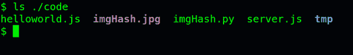


ls -i命令列出整个目录文件，即文件名和inode号码：

```
ls -i /etc
```

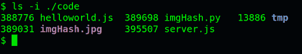


如果要查看文件的详细信息，就必须根据inode号码，访问inode节点，读取信息。ls -l命令列出文件的详细信息。

```
ls -l /etc
```

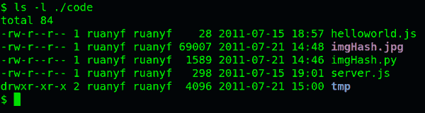

理解了上面这些知识，就能理解目录的权限。目录文件的读权限（r）和写权限（w），都是针对目录文件本身。**由于目录文件内只有文件名和inode号码**，所以如果只有读权限，只能获取文件名，无法获取其他信息，因为其他信息都储存在inode节点中，而读取inode节点内的信息需要目录文件的执行权限（x）。


 #### 软连接 和硬链接的区别

硬链接只有 links 连接数等于0的时候才会真正的删除inode点，也就是删除文件；

其他的时候仅仅是删除的是一个文件名而已；并不是真正的删除；


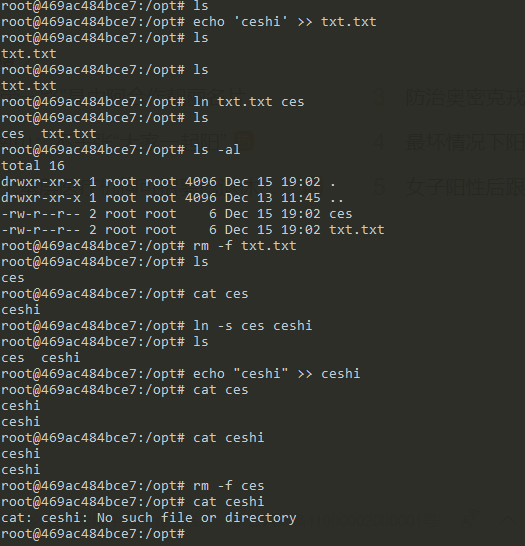

**七、硬链接**

一般情况下，文件名和inode号码是"一一对应"关系，每个inode号码对应一个文件名。但是，Unix/Linux系统允许，多个文件名指向同一个inode号码。

这意味着，可以用不同的文件名访问同样的内容；对文件内容进行修改，会影响到所有文件名；但是，删除一个文件名，不影响另一个文件名的访问。这种情况就被称为"硬链接"（hard link）。

ln命令可以创建硬链接：

```
ln 源文件 目标文件
```

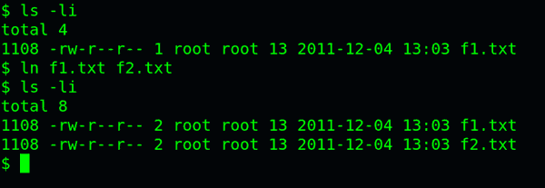

运行上面这条命令以后，**源文件与目标文件的inode号码相同，都指向同一个inode。inode信息中有一项叫做"链接数"，记录指向该inode的文件名总数，这时就会增加1。**

反过来，删除一个文件名，就会使得inode节点

的"链接数"减1。当这个值减到0，表明没有文件名指向这个inode，系统就会回收这个inode号码，以及其所对应block区域。

这里顺便说一下目录文件的"链接数"。**创建目录时，默认会生成两个目录项："."和".."。前者的inode号码就是当前目录的inode号码，等同于当前目录的"硬链接"；后者的inode号码就是当前目录的父目录的inode号码，等同于父目录的"硬链接"。**

**所以，任何一个目录的"硬链接"总数，总是等于2加上它的子目录总数（含隐藏目录）。**

 

**八、软链接**

除了硬链接以外，还有一种特殊情况。

文件A和文件B的inode号码虽然不一样，但是文件A的内容是文件B的路径。读取文件A时，系统会自动将访问者导向文件B。因此，无论打开哪一个文件，最终读取的都是文件B。这时，文件A就称为文件B的"软链接"（soft link）或者"符号链接（symbolic link）。

这意味着，**文件A依赖于文件B而存在，如果删除了文件B，打开文件A就会报错："No such file or directory"。**这是软链接与硬链接最大的不同：**文件A指向文件B的文件名，而不是文件B的inode号码，文件B的inode"链接数"不会因此发生变化。**

ln -s命令可以创建软链接。

```
ln -s 源文文件或目录 目标文件或目录
```

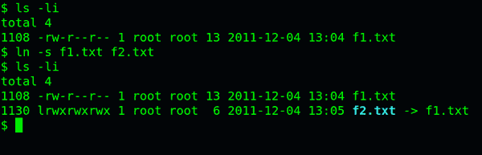

 

**九、inode的特殊作用**

由于inode号码与文件名分离，这种机制导致了一些Unix/Linux系统特有的现象：
(1) **有时，文件名包含特殊字符，无法正常删除。这时，直接删除inode节点，就能起到删除文件的作用。**
(2) **移动文件或重命名文件，只是改变文件名，不影响inode号码。**
(3) **打开一个文件以后，系统就以inode号码来识别这个文件，不再考虑文件名。因此，通常来说，系统无法从inode号码得知文件名**。

第3点使得软件更新变得简单，可以在不关闭软件的情况下进行更新，不需要重启。因为系统通过inode号码，识别运行中的文件，不通过文件名。更新的时候，新版文件以同样的文件名，生成一个新的inode，不会影响到运行中的文件。等到下一次运行这个软件的时候，文件名就自动指向新版文件，旧版文件的inode则被回收。"块"的大小，最常见的是4KB，即连续八个sector组成一个block。

文件数据都储存在"块"中，那么很显然，我们还必须找到一个地方储存文件的元信息，比如文件的创建者、文件的创建日期、文件的大小等等。这种储存文件元信息的区域就叫做inode，中文译名为"索引节点"。

每一个文件都有对应的inode，里面包含了与该文件有关的一些信息。

 

**二、inode内容**

inode包含文件的元信息，具体来说有以下内容：
  \* 文件的字节数
  \* 文件拥有者的User ID
  \* 文件的Group ID
  \* 文件的读、写、执行权限
  \* 文件的时间戳，共有三个：ctime指inode上一次变动的时间，mtime指文件内容上一次变动的时间，atime指文件上一次打开的时间。
  \* 链接数，即有多少文件名指向这个inode
  \* 文件数据block的位置

可以用stat命令，查看某个文件的inode信息：

```
stat example.txt
```


总之，除了文件名以外的所有文件信息，都存在inode之中。至于为什么没有文件名，下文会有详细解释。

 

**三、inode结构**


了解一下文件系统如何存取文件的：
1、根据文件名，通过Directory里的对应关系，找到文件对应的Inode number
2、再根据Inode number读取到文件的Inode table
3、再根据Inode table中的Pointer读取到相应的Blocks

这里有一个重要的内容，就是Directory，他不是我们通常说的目录，而是一个列表，记录了一个文件/目录名称对应的Inode number。如下图：

****

 

**四、inode大小**

inode也会消耗硬盘空间，所以硬盘格式化的时候，操作系统自动将硬盘分成两个区域。一个是数据区，存放文件数据；另一个是inode区（inode table），存放inode所包含的信息。

每个inode节点的大小，一般是128字节或256字节。inode节点的总数，在格式化时就给定，一般是每1KB或每2KB就设置一个inode。假定在一块1GB的硬盘中，每个inode节点的大小为128字节，每1KB就设置一个inode，那么inode table的大小就会达到128MB，占整块硬盘的12.8%。

查看每个硬盘分区的inode总数和已经使用的数量，可以使用df命令。

```
df -i
```


查看每个inode节点的大小，可以用如下命令：

```
sudo dumpe2fs -h /dev/hda | grep "Inode size"
```


由于每个文件都必须有一个inode，因此有可能发生inode已经用光，但是硬盘还未存满的情况。这时，就无法在硬盘上创建新文件。

 

**五、inode号码**

每个inode都有一个号码，操作系统用inode号码来识别不同的文件。

这里值得重复一遍，Unix/Linux系统内部不使用文件名，而使用inode号码来识别文件。对于系统来说，文件名只是inode号码便于识别的别称或者绰号。

表面上，用户通过文件名，打开文件。实际上，系统内部这个过程分成三步：

首先，系统找到这个文件名对应的inode号码；其次，通过inode号码，获取inode信息；最后，根据inode信息，找到文件数据所在的block，读出数据。

使用ls -i命令，可以看到文件名对应的inode号码：

```
ls -i example.txt
```


 

**五、目录文件**

Unix/Linux系统中，目录（directory）也是一种文件。打开目录，实际上就是打开目录文件。

目录文件的结构非常简单，就是一系列目录项（dirent）的列表。每个目录项，由两部分组成：所包含文件的文件名，以及该文件名对应的inode号码。

ls命令只列出目录文件中的所有文件名：

```
ls /etc
```


ls -i命令列出整个目录文件，即文件名和inode号码：

```
ls -i /etc
```


如果要查看文件的详细信息，就必须根据inode号码，访问inode节点，读取信息。ls -l命令列出文件的详细信息。

```
ls -l /etc
```


理解了上面这些知识，就能理解目录的权限。目录文件的读权限（r）和写权限（w），都是针对目录文件本身。由于目录文件内只有文件名和inode号码，所以如果只有读权限，只能获取文件名，无法获取其他信息，因为其他信息都储存在inode节点中，而读取inode节点内的信息需要目录文件的执行权限（x）。

 

**七、硬链接**

一般情况下，文件名和inode号码是"一一对应"关系，每个inode号码对应一个文件名。但是，Unix/Linux系统允许，多个文件名指向同一个inode号码。

这意味着，可以用不同的文件名访问同样的内容；对文件内容进行修改，会影响到所有文件名；但是，删除一个文件名，不影响另一个文件名的访问。这种情况就被称为"硬链接"（hard link）。

ln命令可以创建硬链接：

```
ln 源文件 目标文件
```


运行上面这条命令以后，源文件与目标文件的inode号码相同，都指向同一个inode。inode信息中有一项叫做"链接数"，记录指向该inode的文件名总数，这时就会增加1。

反过来，删除一个文件名，就会使得inode节点中的"链接数"减1。当这个值减到0，表明没有文件名指向这个inode，系统就会回收这个inode号码，以及其所对应block区域。

这里顺便说一下目录文件的"链接数"。创建目录时，默认会生成两个目录项："."和".."。前者的inode号码就是当前目录的inode号码，等同于当前目录的"硬链接"；后者的inode号码就是当前目录的父目录的inode号码，等同于父目录的"硬链接"。所以，任何一个目录的"硬链接"总数，总是等于2加上它的子目录总数（含隐藏目录）。

 

**八、软链接**

除了硬链接以外，还有一种特殊情况。

文件A和文件B的inode号码虽然不一样，但是文件A的内容是文件B的路径。读取文件A时，系统会自动将访问者导向文件B。因此，无论打开哪一个文件，最终读取的都是文件B。这时，文件A就称为文件B的"软链接"（soft link）或者"符号链接（symbolic link）。

这意味着，文件A依赖于文件B而存在，如果删除了文件B，打开文件A就会报错："No such file or directory"。这是软链接与硬链接最大的不同：文件A指向文件B的文件名，而不是文件B的inode号码，文件B的inode"链接数"不会因此发生变化。

ln -s命令可以创建软链接。

```
ln -s 源文文件或目录 目标文件或目录
```


 

**九、inode的特殊作用**

由于inode号码与文件名分离，这种机制导致了一些Unix/Linux系统特有的现象：
(1) 有时，文件名包含特殊字符，无法正常删除。这时，直接删除inode节点，就能起到删除文件的作用。
(2) 移动文件或重命名文件，只是改变文件名，不影响inode号码。
(3) 打开一个文件以后，系统就以inode号码来识别这个文件，不再考虑文件名。因此，通常来说，系统无法从inode号码得知文件名。

第3点使得软件更新变得简单，可以在不关闭软件的情况下进行更新，不需要重启。因为系统通过inode号码，识别运行中的文件，不通过文件名。更新的时候，新版文件以同样的文件名，生成一个新的inode，不会影响到运行中的文件。等到下一次运行这个软件的时候，文件名就自动指向新版文件，旧版文件的inode则被回收。


