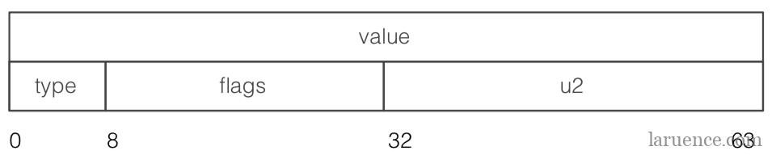

# GC

>让程序员不必过分的关系内存分配问题，将更多的精力放在业务逻辑；
>
>https://www.laruence.com/2020/03/23/5605.html   php7
>
>https://www.laruence.com/2018/04/08/3170.html  php7 zval  随便看一下把 有时间

对象进行普通的赋值操作也是引用的符号表来进行赋值，所以不是引用；

``````php
//强制分离
$a = 10;
$b = $a;
$c = &$a; //当is_ref = 1的过程中 refcount大于1(有另外的变量引用（=赋值）) 那么会发生强制分离b会分裂出来形成一个新的zval，避免被影响

$c = 5; //php7 会在修改的时候 发生分离，不会再上述要求中发生分离；


//强制分裂  // php5 $f的时候发生强制分离
$d = 'qiuqiuqiu';
xdebug_debug_zval('d');
$e = &$d;
xdebug_debug_zval('d');
$f = $d; //php7这里并没有发生强制分离
//$f = 1111;才会发生 写时赋值 不存在强制分离 整个说法了


//数组分裂的奇怪问题
$a = [1,2,3,6];
$x = &$a[1];
$tmp = $a;
$tmp[1] = 999;
echo $a[1]; // 999//还是没有f
``````

````php
# 写时复制分离的基本原理
#我们之前讲过，PHP中的变量是用一个存储在symbol_table中的符号名，对应一个zval来实现的，比如对于上面的第一行代码，会在symbol_table中存储一个值"var", 对应的有一个指针指向一个zval结构，变量值"laruence"保存在这个zval中，所以不难想象，对于上面的代码来说，我们完全可以让"var"和"var_dup"对应的指针都指向同一个zval就可以了。
#PHP也是这样做的，这个时候就需要介绍我们之前一直没有介绍过的zval结构中的refcount字段了。
#refcount,顾名思义，记录了当前的zval被引用的计数。

##   refcount > 1
#PHP在修改一个变量以前，会首先查看这个变量的refcount，如果refcount大于1，PHP就会执行一个分离的例程， 对于上面的代码，当执行到第三行的时候，PHP发现$var指向的zval的refcount大于1，那么PHP就会复制一个新的zval出来，将原zval的refcount减1，并修改symbol_table，使得$var和$var_dup分离(Separation)。这个机制就是所谓的copy


on write(写时复制)。

#####重点：  现在我们知道，当使用变量复制的时候 ，PHP内部并不是真正的复制，而是采用指向相同的结构来尽量节约开销

###   不分离； 分离条件；
## c 源代码 条件； 
    
#############################看这里  写时复制；########################################    
##### 重点注意的是 ，这个条件是加复制语句之前的判断；change on write； 添加引用的条件；是否分离的条件
##### 普通的复制  就是写时复制；就是发生修改的时候复制；
if((*val)->is_ref || (*val)->refcount<2){
          //不执行Separation
        ... ;//process
  }

<?php
   $var = "laruence";    
   $var_ref = &$var;     // 引用的时候不分离 refcount = 1；
   $var_ref = 1;
?>
    
  ##   这个需要去分离； php 5.*
    
<?php
   $var = "laruence";
   $var_dup = $var;     // 分离 因为 refcount =2  小于2的时候才不分离了；
   $var_ref = &$var;
?>
    
    
````


**引用计数垃圾回收**

````c
struct _zval_struct {
     union {
          long lval;
          double dval;
          struct {
               char *val;
               int len;
          } str;
          HashTable *ht;   
          zend_object_value obj;  //hander//对象的zval就是一个句柄
          zend_ast *ast;
     } value;
     zend_uint refcount__gc;
     zend_uchar type;
     zend_uchar is_ref__gc;
};

/*体来说， zend_object(以下简称object)在PHP5中其实是一种相对特殊的存在， 在PHP5中，只有resource和object是引用传递，也就是说在赋值，传递的时候都是传递的本身，也正因为如此，Object和Resource除了使用了Zval的引用计数以外，还采用了一套独立自身的计数系统。*/

/*这个我们从zval中也能看出object和其他的类似字符串的的不同：*/

typedef union _zvalue_value {
    long lval;
    double dval;
    struct {
        char *val;
        int len;
    } str;
    HashTable *ht;
    zend_object_value obj;
} zvalue_value;
//对于字符串和数组，zval中都直接保存它们的指针，而对于object却是一个zend_object_value的结构体:

typedef unsigned int zend_object_handle;
 
typedef struct _zend_object_value {
    zend_object_handle handle;
    const zend_object_handlers *handlers;
} zend_object_value;
//真正获取对象是需要通过这个zend_object_handle，也就是一个int的索引去全局的object buckets中查找:

ZEND_API void *zend_object_store_get_object_by_handle(zend_object_handle handle TSRMLS_DC)
{
    return EG(objects_store).object_buckets[handle].bucket.obj.object;
}
//而EG(objects_store).object_buckets则是一个数组，保存着:

typedef struct _zend_object_store_bucket {
    zend_bool destructor_called;
    zend_bool valid;
    zend_uchar apply_count;
    union _store_bucket {
        struct _store_object {
            void *object;
            zend_objects_store_dtor_t dtor;
            zend_objects_free_object_storage_t free_storage;
            zend_objects_store_clone_t clone;
            const zend_object_handlers *handlers;
            zend_uint refcount;
            gc_root_buffer *buffered;
        } obj;
        struct {
            int next;
        } free_list;
    } bucket;
} zend_object_store_bucket;
//其中，zend_object_store_bucket.bucket.obj.object才保存着真正的zend_object的指针，注意到此处是void *, 这是因为我们很多扩展的自定义对象，也是可以保存在这里的。
````

**循环引用**（造成内存泄漏）

``````php
#对象
class A{
    public $a;
}
$a = new A;
$a->a = $a;
xdebug_debug_zval('a'); //存在循环引用
#数组
$b = ['a','b','c'];
$b[] = &$b;
xdebug_debug_zval('b');
``````

**php7 zval**

``````c
struct _zval_struct {
     union {
          zend_long         lval;             /* long value */
          double            dval;             /* double value */
          zend_refcounted  *counted;
          zend_string      *str;
          zend_array       *arr;
          zend_object      *obj;
          zend_resource    *res;
          zend_reference   *ref;
          zend_ast_ref     *ast;
          zval             *zv;
          void             *ptr;
          zend_class_entry *ce;
          zend_function    *func;
          struct {
               uint32_t w1;
               uint32_t w2;
          } ww;
     } value;
    union {
        struct {
            ZEND_ENDIAN_LOHI_4(
                zend_uchar    type,         /* active type */
                zend_uchar    type_flags,
                zend_uchar    const_flags,
                zend_uchar    reserved)     /* call info for EX(This) */
        } v;
        uint32_t type_info;
    } u1;
    union {
        uint32_t     var_flags;
        uint32_t     next;                 /* hash collision chain */
        uint32_t     cache_slot;           /* literal cache slot */
        uint32_t     lineno;               /* line number (for ast nodes) */
        uint32_t     num_args;             /* arguments number for EX(This) */
        uint32_t     fe_pos;               /* foreach position */
        uint32_t     fe_iter_idx;          /* foreach iterator index */
    } u2;
};
``````

**16个字节的value struct**



**其中value部分, 是一个size_t大小(一个指针大小), 可以保存一个指针, 或者一个long, 或者一个double.指针的大小跟操作系统的位数和内存大小有关系，例如32位操作系统，一个指针4个字节内存最大可以是4G；**

**PHP7中的zval的类型做了比较大的调整, 总体来说有如下17种类型:**

``````c
/* regular data types */
#define IS_UNDEF                    0
#define IS_NULL                     1
#define IS_FALSE                    2
#define IS_TRUE                     3
#define IS_LONG                     4
#define IS_DOUBLE                   5
#define IS_STRING                   6
#define IS_ARRAY                    7
#define IS_OBJECT                   8
#define IS_RESOURCE                 9
#define IS_REFERENCE                10
/* constant expressions */
#define IS_CONSTANT                 11
#define IS_CONSTANT_AST             12
/* fake types */
#define _IS_BOOL                    13
#define IS_CALLABLE                 14
/* internal types */
#define IS_INDIRECT                 15
#define IS_PTR                      17
``````

其中PHP5的时候的IS_BOOL类型, 现在拆分成了IS_FALSE和IS_TRUE俩种类型. 而原来的引用是一个标志位, 现在的引用是一种新的类型.

对于IS_INDIRECT和IS_PTR来说, 这俩个类型是用在内部的保留类型, 用户不会感知到, 这部分会在后续介绍HashTable的时候也一并介绍.

从PHP7开始, 对于在zval的value字段中能保存下的值, 就不再对他们进行引用计数了, 而是在拷贝的时候直接赋值, 这样就省掉了大量的引用计数相关的操作, 这部分类型有:

````c
IS_LONG
IS_DOUBLE
````

对于那种根本没有值, 只有类型的类型, 也不需要引用计数了:

``````c
IS_NULL
IS_FALSE
IS_TRUE
``````

**而对于复杂类型, 一个size_t保存不下的, 那么我们就用value来保存一个指针, 这个指针指向这个具体的值, 引用计数也随之作用于这个值上, 而不在是作用于zval上了.**


**以数组为例**  IS_ARRAY

`````c
struct _zend_array {
    zend_refcounted_h gc;
    union {
        struct {
            ZEND_ENDIAN_LOHI_4(
                zend_uchar    flags,
                zend_uchar    nApplyCount,
                zend_uchar    nIteratorsCount,
                zend_uchar    reserve)
        } v;
        uint32_t flags;
    } u;
    uint32_t          nTableMask;
    Bucket           *arData;
    uint32_t          nNumUsed;
    uint32_t          nNumOfElements;
    uint32_t          nTableSize;
    uint32_t          nInternalPointer;
    zend_long         nNextFreeElement;
    dtor_func_t       pDestructor;
};

// zend_refcounted_h
typedef struct _zend_refcounted_h {
    uint32_t         refcount;          /* reference counter 32-bit */
    union {
        struct {
            ZEND_ENDIAN_LOHI_3(
                zend_uchar    type,
                zend_uchar    flags,    /* used for strings & objects */
                uint16_t      gc_info)  /* keeps GC root number (or 0) and color */
        } v;
        uint32_t type_info;
    } u;
} zend_refcounted_h;
`````

**除了数据类型以外， 以前的经验也告诉我们， 一个数据除了它的类型以外， 还应该有很多其他的属性， 比如对于INTERNED STRING，它是一种在整个PHP请求期都存在的字符串(比如你写在代码中的字面量), 它不会被引用计数回收.** 


**而对于INTERNED STRING来说， 这个IS_STR_INTERNED标志位应该是作用于字符串本身而不是zval的.**
**那么类似这样的标志位一共有多少呢？作用于zval的有**：

``````c
IS_TYPE_CONSTANT            //是常量类型
IS_TYPE_IMMUTABLE           //不可变的类型， 比如存在共享内存的数组
IS_TYPE_REFCOUNTED          //需要引用计数的类型
IS_TYPE_COLLECTABLE         //可能包含循环引用的类型(IS_ARRAY, IS_OBJECT)
IS_TYPE_COPYABLE            //可被复制的类型， 还记得我之前讲的对象和资源的例外么？ 对象和资源就不是
IS_TYPE_SYMBOLTABLE         //zval保存的是全局符号表， 这个在我之前做了一个调整以后没用了， 但还保留着兼容，
                            //下个版本会去掉
``````

**作用于字符串的有：**

``````c
IS_STR_PERSISTENT             //是malloc分配内存的字符串
IS_STR_INTERNED             //INTERNED STRING
IS_STR_PERMANENT            //不可变的字符串， 用作哨兵作用
IS_STR_CONSTANT             //代表常量的字符串
IS_STR_CONSTANT_UNQUALIFIED //带有可能命名空间的常量字符串
``````

**作用于对象的有：**

``````c
IS_OBJ_APPLY_COUNT          //递归保护
IS_OBJ_DESTRUCTOR_CALLED    //析构函数已经调用
IS_OBJ_FREE_CALLED          //清理函数已经调用
IS_OBJ_USE_GUARDS           //魔术方法递归保护
IS_OBJ_HAS_GUARDS           //是否有魔术方法递归保护标志
``````


## 存在的问题


https://www.laruence.com/2018/04/08/3170.html


**第五, 这个是关于引用的, PHP5的时代, 我们采用写时分离, 但是结合到引用这里就有了一个经典的性能问题:**

```php
<?php  
function dummy($array) {}    
$array = range(1, 100000); 
$b = &$array;   
dummy($array);
?>
```

当我们调用dummy的时候, 本来只是简单的一个传值就行的地方, 但是因为$array曾经引用赋值给了$b, 所以导致$array变成了一个引用, 于是此处就会发生分离, 导致数组复制, 从而极大的拖慢性能, 这里有一个简单的测试:

```php
<?php$array = range(1, 100000);
function dummy($array) {}
$i = 0;
$start = microtime(true);
while($i++ < 100) {    
        dummy($array);
}
printf("Used %sS\n", microtime(true) - $start);
$b = &$array;
//注意这里, 假设我不小心把这个Array引用给了一个变量$i = 0;$start = microtime(true);while($i++ < 100) {    dummy($array);}printf("Used %ss\n", microtime(true) - $start);
?>
```

我们在5.6下运行这个例子, 得到如下结果:

```
$ php-5.6/sapi/cli/php /tmp/1.phpUsed 0.00045204162597656sphp


```
