# GIT

>分布式版本控制；
>
>注意： git 命令参数 一般用--cached来两个--表示一个完整的命令参数；
>
>比如： --no-ff   --cached     --set-upstream-to

***

**集中式和分布式的区别？**

集中式：版本库是集中放在 中央服务器；

缺点：

* 必须联网才能工作；
* 安全性差，中央服务器故障，就会出问题；

***

分布式：每一台电脑都会有一个完整的版本库；

优点：

* 安全性
* 不需要联网
* 强大的分支管理；
* 这里的中央服务器仅仅是为了，<font color=red>方便交换修改。</font>在实际使用分布式版本控制系统的时候，其实很少在两人之间的电脑上推送版本库的修改，因为可能你们俩不在一个局域网内，两台电脑互相访问不了，也可能今天你的同事病了，他的电脑压根没有开机。因此，<font color =red>分布式版本控制系统通常也有一台充当“中央服务器”的电脑，但这个服务器的作用仅仅是用来方便“交换”大家的修改，没有它大家也一样干活，只是交换修改不方便而已。</font>
* 多个人如何协作呢？比方说你在自己电脑上改了文件A，你的同事也在他的电脑上改了文件A，这时，你们俩之间只需把各自的修改推送给对方，就可以互相看到对方的修改了。
* Git跟踪并管理的是修改，而非文件。

---


**安装**

**git config --global user.name qiuqiu**

**git config --global user.email qiuqiu@163.com**

因为是分布式 所以就需要自报家门x

**创建本地的版本库**

**git init** 	

会生成一个.git

git 命令默认是设置了环境变量，在任意地方都可以都可以执行git命令；

---


**专有名词解析**

Untracked files : 没有添加追踪的文件  git add .

branch : 分支


Workspace：工作区

Index / Stage：暂存区

Repository：仓库区（或本地仓库）


Remote：远程仓库

insertions ： 插入的内容

file changed :    文件的改动


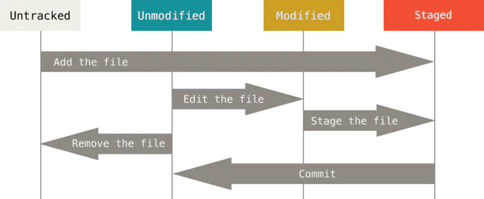

上面的remove the file 起始就是git reset --hard  HEAD；


每个版本，就是一个commitid；

<font color=red>HEAD : 当前分支 master ->当前版本  注意</font>

HEAD^: 上一个版本

HEAD^^:  上上个版本

commit id 使用SHA 计算出来的一个很大的数字 主要是为了解决多人协作方式不冲突的问题；可以通过 git log 查看；注意每一个人的commitid 肯定是不一样的；

暂存区存在total：一次性提交暂存区的所有修改；

git跟踪的是修改：你又理解了Git是如何跟踪修改的，每次修改，如果不用`git add`到暂存区，那就不会加入到`commit`中

**只有添加到暂存区，git 才会看到文件的修改是的**  又有添加 tracked 变化才能看到；

Fast-forward  git merge 模式中的fast-forward 只需要移动一下指针就可以了  注意的是 fast-forward 在删除分支之后会丢失分支信息；


git commit 之后暂存区的数据还存在吗？
还是当暂存区没有的数据，直接区找版本库；？？？？？？只要没有删除就会有这部分数据

可以去.git/index去看一下；


####**ssh**

添加ssh key total：识别是不是你推送的；

ssh-keygen -t rsa -C “qiuqiu@163.com” 添加ssh 公钥到git配置；

创建一个远程仓库；

####**流程**

***


##**命令**

**如果暂存区没有数据就进行和回滚到和当前当本库的数据；**

<font color=red>但是他会丢弃掉本地工作区的所有的修改；</font>

>**git tag -h的形式来查看帮助；**

#### git status 查看状态

#### git add 

````php
git add .
git add file_name
//**git add .**   提交所有的文件到跟踪 track；添加文件到暂存区；把添加放到暂存区； 
//**IDE ctrl+alt+a  就是add  起码缓存区的是正确的，可如果工作区有问题可以使用git checkout --file 来进行回滚；**

````

### git rm

`````php
// git rm  === rm git add 本地的也会删除；
// git rm --cached  仅仅是删除的暂存区的内容；
`````


#### git commit 

`````php
git commit  -m  'ceshi'
git commit -am  'ceshi'  //a add m commit 提交到暂存区，并且提交到版本库；
`````


#### git branch 

`````php
git branch  //显示所有的分支
 
git branch -vv //verbose 冗长的信息，更加详细的信息，显示分支和上流；upstream
G:\website\Project\allalg (master -> origin)
$ git branch -vv
* master 9c5efa9 [origin/master] 'init'
###----------------------------------------------------------------------------
git branch feature // 创建分支
git branch -d dev // 删除分支
git branch -D [branch] //删除没有合并过的分支用-D
git branch --set-upstream dev origin/dev  //创建分支并且创建上流；
git  branch  -M main // /move/rename 修改当前分支为 main 
`````


#### git checkout

````php
git checkout dev //切换分支  // ！！！ 切换分支的时候要commit or stash
git checkout -b dev  //创建并且切换分支；

git switch -c dev //创建并且切换到dev分支
git switch  //用这个来切换分支；最新版本； 一定要先看一下 git的状态 然后再切分支；git  checkout 也是老版本的切换分支；   

git checkout -b dev oringin/dev   //在本地创建和远程对应的分支
    
//版本回退；回退工作区；
git checkout -- file_Name  // 回退filename当暂存区有内容就和暂存区一样，没有内容就和版本库一样；
/////***** 放弃还没有暂存的工作区的修改；
//`git checkout -- file`命令中的`--`很重要，没有`--`，就变成了“切换到另一个分支”的命令，我们在后面的分支管理中会再次遇到`git checkout`命令。
//git checkout - - file 其实是用版本库里的版本替换工作区的版本，无论工作区是修改还是删除，都可以“一键还原”。

````


#### git restore + git switch -c dev

```php
//git checkout //做拆分拆分成 git restore + git switch  // 单一职责每一个类只做一件事情，做好一件事情就行了；

git switch //切换分支；
git switch -c dev // 创建分支并且切换分支；
    
// git restore  数据的恢复；  //恢复//详细去看git reset单独篇幅；

--staged
Specify the restore location. If neither option is specified, by default the working tree is restored. Specifying --staged will only restore the index. Specifying both restores both.
//--staged 指定还原位置。如果未指定任何选项，默认情况下将恢复工作树。指定 --staged 只会恢复索引。指定两者将恢复两者。

    
git restore // 重置工作区；
git restore --cached // 重置暂存区； //重置暂存区吗？  //使暂存区和repos代码一样；
# restore  恢复；
```


### git restore

````php
//重置 工作区 //重置暂存区；
git restore // 重置工作区；
git restore --cached // 重置暂存区； //重置暂存区吗？  //使暂存区和repos代码一样；
# restore  恢复；
````


#### git push

````php
git push -u origin/dev //第一次推送远程仓库，需要创建上流，可以通过git branch -vv 查看结果，以后用git push就可以了；
git push // 建立上流之后可以用git push;

// push 之前一定要先 pull  有冲突解决冲突；
````

#### git fetch + git pull

``````php
git pull = git fetch + git merge;// 

``````


#### git log

``````php
git log  // 可以设置git 的别名；
// git lg
//git config --global alias.lg "log --color --graph --pretty=format:'%Cred%h%Creset -%C(yellow)%d%Creset %s %Cgreen(%cr) %C(bold blue)<%an>%Creset' --abbrev-commit"
//.git/config  全局配置
//git config --global alias [user.name user.email]
    
git reflog // 查询最近使用的命令和提交；所有的分支；
//**git reflog  所有分支的最近几次提交；*可以查看最近分支命令和提交；
#git reflog: 查看命令历史；挽回错误的重置；用来记录你的每一次命令；查看命令记录
#git reflog show master: 显示某一分支指向的变迁
``````


#### git diff

``````php
git diff  // 暂存区和工作区的不同；
git diff HEAD// 工作区和版本库的不同 HEAD的commitid的不同；
git diff --cached // 暂存区和版本去的比较；   --cached  代表的就是暂存区；
``````

**a 是本地  b是其他的地方 暂存区  和  版本区；**

b是working tree ,a 是index（stage）；

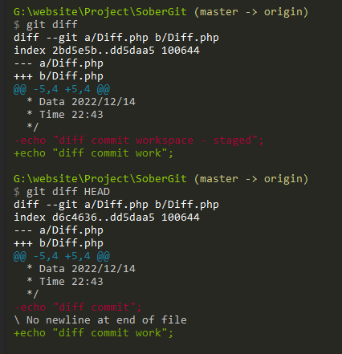

#### git  merge

`````php
//master  dev 合并到master     fast-forward 快进 
// 优势：日志非常的详尽，每次merge放生的方式和事件都有完整的历史，当出现问题的时候追溯比较方便；
//缺点：日志过于繁杂， 不人性化；
git merge dev // 有冲突要解决冲突，手动解决，conflict ，要修改成两个都行的通；
    
//解决冲突，继续去add merge;
    
//**git merge --no-ff dev** **合并整个分支**   合并分支时，加上`--no-ff`参数就可以用普通模式合并，合并后的历史有分支，能看出来曾经做过合并，而`fast forward`合并就看不出来曾经做过合并。  可以很容易的看出做出过合并 --no-ff  这里的ff 就是fast-forward前进的合并方式； 可以使用git merge --no-ff 来进行合并；

`````

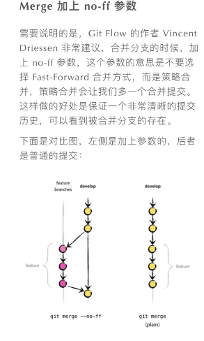

#### git rebase（变基）

````php
//优势：日志是线性的；
//劣势；很多痕迹被删除了，无法跟踪，合并的commit的时间和方式；
git rebase // 变基 // 变成线性；//up to date;最新的；
````


#### git reset

`````php
//本地仓库的版本回退； //  重置
git reset HEAD(commit_id)  //回退HEAD的commitid  当前版本； HEAD^ 上版本 HEAD^^上上版本
//--soft  回退到暂存区，可以通过commit来恢复；--- 移动HEAD；
//--hard  会有数据的丢失；HEAD版本数据的丢失；HEAD版本的丢失； 重置暂存区和工作区；
//--mixed ，默认，回退到工作区，可以通过 add commit;恢复； // 
    
    --mixed               reset HEAD and index     add commit 来恢复；
    --soft                reset only HEAD          commit 来做恢复；
    --hard                reset HEAD, index and working tree   会有数据的丢失；
    
    
#vscode终端 出现问题！！！  
git reset --hard HEAD^
fatal: ambiguous argument '^HEAD': unknown revision or path not in the working tree.
Use '--' to separate paths from revisions, like this:
'git <command> [<revision>...] -- [<file>...]'
    
//因为cmd控制台中换行符默认是^，而不是\ ，所以 ^ 符号被git编译为换行符了，解决方案：

git reset --hard "HEAD^"   // vscode 终端 解决方案，加双引号，变成字符串；
git reset --hard HEAD~    
`````


**远程仓库**  

#### git  remote                    remote  === origin

>**注意这git remote add origin url 这里的url 最好是使用 ssh的url 这里我是用公私钥的形式来进行验证；**

`````php
git remote add origin url  // 创建远程仓库；  默认是origin  远程仓库的名字；remote 远程仓库；
git remote     // origin   显示所有的远程仓库；
git remote -v //显示所有的远程仓库  显示url；
git remote rm [remote]   //删除远程仓库  
git remote rename old_name new_name   #修改仓库名
//每一个新的分支 第一次push 都需要guan'li'a
git push -u [remote] [branch]      //-u 第一次提交 建议用这个-u 本地分支和远程分支 master建立联系 以后推送就可以简化命git remote git //当然也可以一直使用 git push origin dev;  不建立上流只能这样；
 
// 有很多分支 根本不需要推送到远程仓库；
    
//**git branch --set-upstream  dev   origin/dev  创建本地和远程之间的联系；** **git push -u origin dev 建立远程分支和本地分支关联**  **建立关联的total ： 以后直接git push 就可以了，或者使用git push origin dev就不需要建立关联；****建立关联就是创建一个上游；**
    
###  git remote add [name] [url]  在客户端，添加远程版本库//
### 远程仓库url 要自己在github上创建；---- 自己创建；
### 这句话的意思是在客户端创建远程仓库信息；并不是在github创建远程仓库；注意；name 就是起一个别名而已；
`````

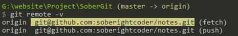


#### git clone

`````php
//如何关联 远程仓库？？   git clone
//git clone  [url]    .
`````


#### git stash

`````php
// 储藏分支；
//存储 存储之后分支会变成 clean
git stash 
git stash list 
//恢复：
//一是用git stash apply恢复，但是恢复后，stash内容并不删除，你需要用git stash drop来删除；
//另一种方式是用git stash pop，恢复的同时把stash内容也删了：
git stash apply stash@{0}
git stash drop stash@{0}
git stash pop
//比较用于修改bug ，正在处理的分支又不想commit；需要用stash；
//$ git checkout master
//error: Your local changes to the following files would be overwritten by checkout:
//        denig.php
//Please commit your changes or stash them before you switch branches.
//Aborting

 G:\website\Project\SoberGit (debug -> origin)
$ git stash
Saved working directory and index state WIP on debug: ad98816 'debug'

G:\website\Project\SoberGit (debug -> origin)
$ git status
On branch debug
nothing to commit, working tree clean
 
    
 G:\website\Project\SoberGit (debug -> origin)
$ git stash list
stash@{0}: WIP on debug: ad98816 'debug'
stash@{1}: On master: ceshi-masster
stash@{2}: On master: ceshi-ceshi
    
G:\website\Project\SoberGit (debug -> origin)
$ git stash pop   //  会弹出0  
On branch debug
Changes not staged for commit:
  (use "git add <file>..." to update what will be committed)
  (use "git restore <file>..." to discard changes in working directory)
        modified:   denig.php

no changes added to commit (use "git add" and/or "git commit -a")
Dropped refs/stash@{0} (165220f7e7c09c6d1b7be0e8a87c64ca5c9dfe03)

G:\website\Project\SoberGit (debug -> origin)
$ git stash list
stash@{0}: On master: ceshi-masster
stash@{1}: On master: ceshi-ceshi
`````


#### git cherry-pick  

`````php
git cherry-pick commit_Id  //将指定的提交应用于当前分支；
 //**`git cherry-pick <commit>`命令，把bug提交的修改“复制”到当前分支，避免重复劳动。**  **合并一次提交；**
`````


 #### git revert

`````php
//生成一个新的commit 来回滚之前的git revert  // 具体了解看单独的篇幅；
`````


#### git tag

 `````php
 // 注意标签是和版本绑定的   还可以创建带有说明的标签，用-a指定标签名，-m指定说明文字：
 git tag v0.1 HEAD === git tag v1.0   //和当前版本绑定；
 git tag -a v0.1 -m 'php5.6' commit_Id   //  和其他的版本绑定；创建标签
     
 git tag    // 显示所有标签；
 git tag -d  // 删除标签；
 git show tag_name // 显示标签的详细信息；
  
 //git push origin <tagname>：
 git push origin v0.1 //推送某一个标签到远程；
 git push origin --tags //推送全部的标签到远程；
 
  //如果标签已经推送到远程，要删除远程标签就麻烦一点，先从本地删除
  git tag -d v0.9
  #git push origin :refs/tags/<tagname>   //在删除远程   // 可以删除一个远程标签。
 // 删除远程tag 需要去了解 .git文件的目录结构；:refs/tags/<tagname>
 //git push origin 这就是对远程做操作的命令；
 `````


----


**git rebase 变基**

 改变git log 历史轨迹变成直线；

提交历史变成了一条直线，

缺点：本地分叉已经被修改过了；merge的时间和地点找不到了，如果有bug 溯源不好办；


---


**git hub fork pull request** 


----


**.gitignore** 忽略文件

`````bash
#cache-php 忽略文件；

/vendor/*
/config/app.php

/tmp/cache/models/*
!/tmp/cache/models/empty
/tmp/cache/persistent/*
!/tmp/cache/persistent/empty
/tmp/cache/views/*
!/tmp/cache/views/empty
/tmp/sessions/*
!/tmp/sessions/empty
/tmp/tests/*
!/tmp/tests/empty

/logs/*
!/logs/empty

# CakePHP 2

/app/tmp/*
/app/Config/core.php
/app/Config/database.php
/vendors/*

#myself

#排除以.开头的配置文件
.*
*.class
*.gitignore
/app/tmp/*
# 不排除
!.php
!app.class
!/app/tmp/test

`````

------

## debug

>dns github 域名服务器被屏蔽了；

````php
### bug的原因，进制访问22端口；
$ git pull
ssh: connect to host github.com port 22: Connection refused
fatal: Could not read from remote repository.
​
Please make sure you have the correct access rights
and the repository exists.
    
//解决问题的思路；
网上的招都没用，只能自力更生了。既然和GitHub建立ssh连接的时候提示connection refused，那我们就详细看看建立ssh连接的过程中发生了什么，可以使用ssh -v命令，-v表示verbose，会打出详细日志。

//$ ssh -vT git@github.com
OpenSSH_9.0p1, OpenSSL 1.1.1o  3 May 2022
debug1: Reading configuration data /etc/ssh/ssh_config
debug1: Connecting to github.com [::1] port 22.
debug1: connect to address ::1 port 22: Connection refused
debug1: Connecting to github.com [127.0.0.1] port 22.
debug1: connect to address 127.0.0.1 port 22: Connection refused
ssh: connect to host github.com port 22: Connection refused
从上面的信息马上就发现了诡异的地方，连接http://github.com的地址居然是::1和127.0.0.1。前者是IPV6的localhost地址，后者是IPV4的localhost地址。


###---------------------------------------------------------------------------

到这里问题就很明确了，是DNS解析出问题了，导致http://github.com域名被解析成了localhost的ip地址，就自然连不上GitHub了。

##Windows下执行ipconfig /flushdns 清楚DNS缓存后也没用，最后修改hosts文件，增加一条github.com的域名映射搞定。
140.82.113.4 github.com
查找http://github.com的ip地址可以使用https://www.ipaddress.com/来查询，也可以使用nslookup命令

nslookup github.com 8.8.8.8
nslookup是域名解析工具，8.8.8.8是Google的DNS服务器地址。直接使用

nslookup github.com
就会使用本机已经设置好的DNS服务器进行域名解析，ipconfig /all可以查看本机DNS服务器地址。

这个问题其实就是DNS解析被污染了，有2种可能：

DNS解析被运营商劫持了
使用了科学上网工具
````


---


git  rebase 和 git merge 的选择！！！！

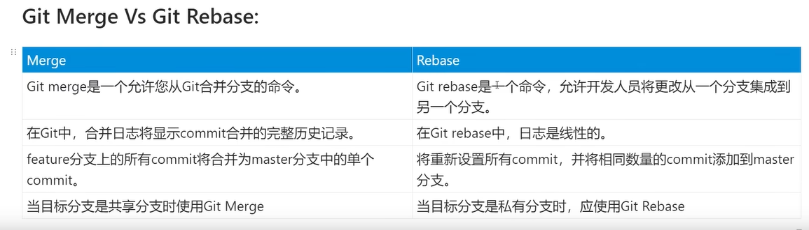


**私有分支可以使用rebase；**

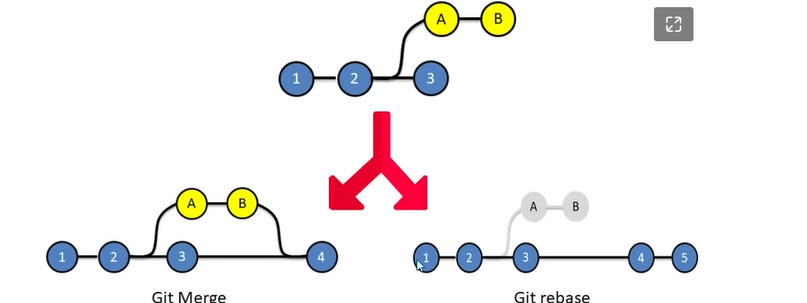

----


**问题：**

**git fetch 和 git pull 的区别？？？**

git push 前 一定要先更新pull一下一下代码

git pull = git fetch + git merge;

git fetch 仅仅是更新了所有的提交对象，因为HEAD头没有移动，所以工作区的内容不会发生变化，git merge 就是移动HEAD到最新的；

**git merge** **移动HEAD到最新的提交对象**；

####git reset 版本的回退；

**git reset --hard HEAD**^    会删除

这种方式是比较危险的方式，他会使工作区和本地仓库来同步；会丢失本地工作区的数据；

----


<font color=red>**git reset  是对版本库的回退；**</font>

最好使用**git reset HEAD^**  就是同步本地仓库和暂存区，本地工作区还是有最新的内容，还可以通过git add. git

 commit 来恢复； 默认是mixed；


**git reset 三种模式：**通过删除commit 来实现的回退；   

* --mixed 只有本地保存数据 想要恢复 直接 add commit   mixed；
* **--soft  仅仅是回退了 commit  然后直接commit 就可以回退；(索引和本地都不会改变)**
* --hard 危险，会存在数据的丢失；工作区的数据会丢失；

**git reset 可以使用 git reflog  命令记录  再使用 git reset commit_id 来进行恢复；**


----

#### git revert  去看单独的篇幅；

**git revert ** HEAD^ 会新生成一个commit ； **用一次 新的commit 来回滚之前的一个commit；**  **git reset 直接通过删除的形式；**

<font color=red>git revert ????  这里必须要搞明白 等级很高  revert的回退；</font>

<font color=red>结点可以分为：普通结点和合并结点，可以使用git show commit_id 查看结点的详细信息，1代表的就是父结点；</font>

特点：

* <font color=red>**revert 回退  HEAD 是向前移动的  reset 是后退的，所以当git pull的时候会出现问题；**</font>

* **反操作一个提交对象；**

* **git revert 也会产生冲突，所以 就需要你解决冲突**

* **git revert 参数 -n 就是不commit -m 父亲是谁？m 1 选择一个父亲，抛弃另外一个分支，一般在merge 有多个父提交，要选择继承那个父节点**     

* **解决完冲突之后需要使用   继续  add. commit** 

* **如果操作过程中发生代码冲突，让用户决定如何继续操作。**

  **（1）`--continue`**

  用户解决代码冲突后，第一步将修改的文件重新加入暂存区（`git add .`），第二步使用下面的命令，让 Cherry pick 过程继续执行。

  > ```bash
  > $ git revert --continue
  > ```

  **（2）`--abort`**

  发生代码冲突后，放弃合并，回到操作前的样子。

  **（3）`--quit`**

  发生代码冲突后，退出 Cherry pick，但是不回到操作前的样子。

-----


**git push -f  之后的恢复方式；** **推送远程之后的恢复方式**  ***** **直接覆盖**

直接强制覆盖就可以了；

----


索引是缓存区的另外一种叫法;index  staged  cached 都可以的叫法；


----


**git cherry-pick**       **赋值commit**    就是将指定的提交(commit)应用于其他分支

**git cherry-pick f**

> ```bash
>  a - b - c - d   Master
>       \
>         e - f - g Feature
> ```

现在将提交`f`应用到`master`分支。

> ```bash
> # 切换到 master 分支
> $ git checkout master
> 
> # Cherry pick 操作  #f  就是commitid
> $ git cherry-pick f  
> 
> 
> ```

上面的操作完成以后，代码库就变成了下面的样子。

> ```bash
>  a - b - c - d - f   Master
>       \
>         e - f - g Feature
> ```


**conflict 冲突问题解决：**

**在 `cherry-pick` 多个commit时，可能会遇到代码冲突，这时 `cherry-pick` 会停下来，让用户决定如何继续操作**

git  cherry-pick commit1 commit2 commit3 

git cherry-pick  --continue   解决冲突之后然后继续  

git cherry-pick --abort    **放弃 直接回到最开始的样子**

git cherry-pick  --quit  **不回到最开始的样子，就是成功的保留，并且退出cherry-pick流程；**

----


**git switch -c dev** 创建分支 并且切换分支 都是指针的操作； git checkout -b  dev 创建一个分支流 并且进行切换；


dev 分支 git commit


**git merge**    **fast-forward** 快进 


​											HEAD 当前分支，分支master指向版本库，也就是commit的版本库；committid；

**git branch -d dev**  删除dev分支；


**git merge 有冲突的情况**


**注意 这个情况，只有存在冲突的时候才会分叉，git merge 仅仅是一个fast-forward快进；**


**就是  合并之前的两个结点会有冲突，可以i解决冲突；**


**分叉 都是代表会有冲突；**????  分叉不一定会有冲突 分叉不一定会有冲入 merge  直接merge 就行了；

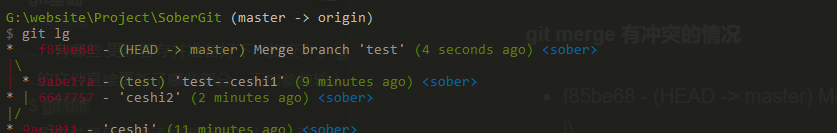


**没有冲突 conflict  git merge --no-ff dev**


----


**git rebase 变基**

```bash
$ git log --graph --pretty=oneline --abbrev-commit
*   e0ea545 (HEAD -> master) Merge branch 'master' of github.com:michaelliao/learngit
|\  
| * f005ed4 (origin/master) set exit=1
* | 582d922 add author
* | 8875536 add comment
|/  ·
* d1be385 init hello
...
#git pull 合并  三个分支的合并，三方对比；
```


**git rebase之后**

```bash
$ git log --graph --pretty=oneline --abbrev-commit
* 7e61ed4 (HEAD -> master, origin/master) add author
* 3611cfe add comment
* f005ed4 set exit=1
* d1be385 init hello
...
# 
```

---

IDE

**ide version crontrol**  

**删除分支：setting version control 需要看一下 branch 所有的分支；然后可以清理一下不要的分支；这里是版本库的控制； git clone  或者git init 版本库的控制**  **这里是设置本地仓库** 

**VCS version control system**

**add 是否默认的添加；**
**文件删除的时候 默认的二添加**


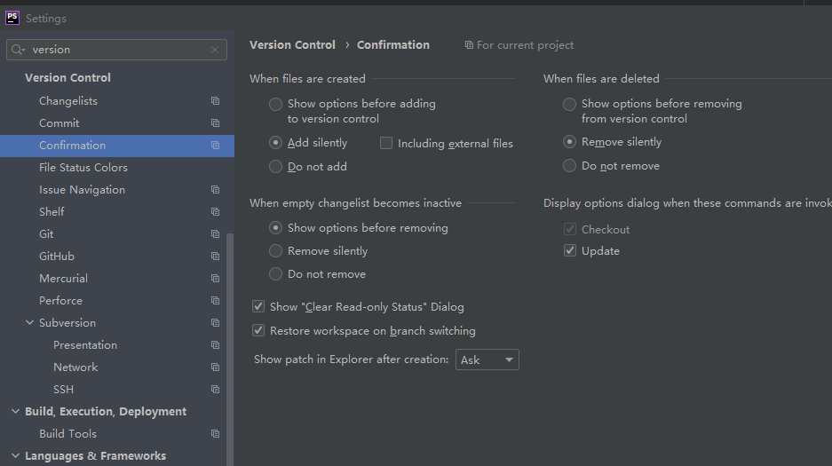

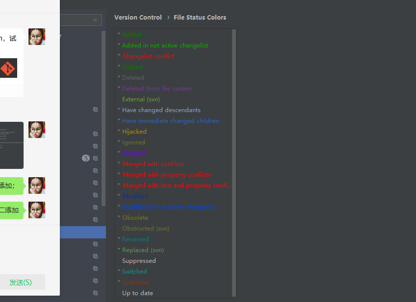

**颜色设置**；**modify conflict  ignored**   

蓝色的modified   绿色的added

红色的conflict

灰色的 ingore

merged  合并？？？？？？


**一些 backgroup的操作  注意：**

####背后的操作


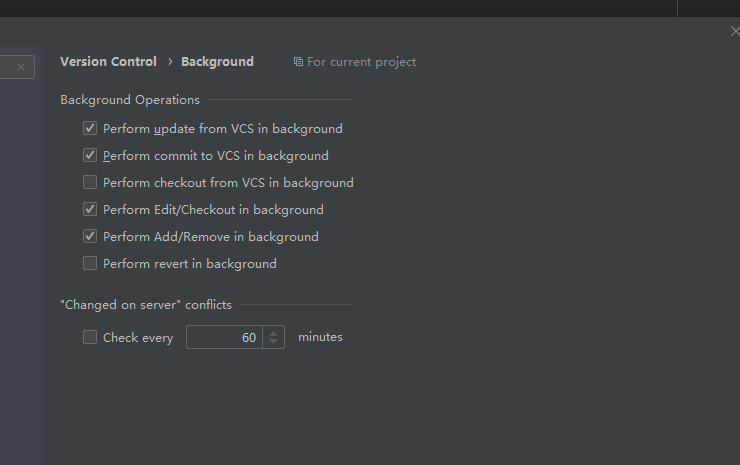


IDEA 帮助文档提供了切换分支时的选项说明;

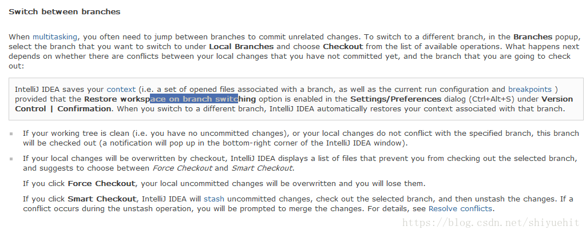

1. 本地分支切换的时候（例如A切到B），会弹出来Restore workspace on branch switching 对话框，如果选择是的话，在切换分支的时候，你在当前分支（A）所做的一些还未add或commit/push的文件改动（包括断点等的设置）会带到切换后的分支（B）上；

2. 如果本地工作空间没有uncommitted changes， 分支会顺利切换

3. 如果本地工作空间（分支A）有些文件会被分支B改动，IDEA会弹出对话框，让你选择Force Checkout 或 Smart Checkout;

如果选择Force Checkout， 本地工作空间（分支A）的一些未提交的修改会被覆盖（被分支B覆盖），会有很大可能丢代码！！！
如果选择Smart Checkout，IDEA会先执行stash命令，贮存这些未提交的修改，然后checkout 到分支B，在切换到分支B后，unstash 这些修改，所以A分支本地的这些修改会带到B分支上

————————————————
版权声明：本文为CSDN博主「shiyuehit」的原创文章，遵循CC 4.0 BY-SA版权协议，转载请附上原文出处链接及本声明。
原文链接：https://blog.csdn.net/shiyuehit/article/details/83010956


关于 git的一些 配置操作问题 ide配置操作


https://www.jetbrains.com/help/phpstorm/2019.3/configuring-version-control-options.html


-----


## 2022-7-22  

## 两个问题  git revert  的回退版本； 

## 当没有冲突的时候git merge 的版本链什么样子的  ????????


**git stash  的具体操作；**  git stash 


````shell
## 提醒你 你要 git push 就是你本地仓库 版本要高于远程版本仓库；
$ git status
On branch master
Your branch is ahead of 'origin/master' by 3 commits.
  (use "git push" to publish your local commits)

nothing to commit, working tree clean

* 738ab4a - (HEAD -> master, debug) debug_success (4 months ago) <sober>
* 6d4b04e - ceshi_success_debug_revert44 (4 months ago) <sober>
* 63f38d7 - ceshi_success_debug_revert3 (4 months ago) <sober>
* c3ef9e4 - (origin/master) debug success (4 months ago) <sober>
* dc71a33 - debug_revert-ceshi5 (4 months ago) <sober>
* dd6aaed - debug_revert-ceshi1 (4 months ago) <sober>
* 1186df5 - debug success (4 months ago) <sober>
* 1ab8fdd - debug_ceshi-test (4 months ago) <sober>


##
nothing to commit, working tree clean

##
## git diff 比较的是工作区和缓存区的内容
## git diff HEAD -- filename  就是工作区和 暂存区的内容；


## 删除缓存区里面的内容；git  rm 
#(use --cached to keep the file, or -f to force removal)*********8
#git rm -f 和 rm 的区别
#git rm 的意思是，不仅删除了一个文件，而且 git 把删除这个文件的事记录到缓冲区了（即 add 了）。rm 的意思是，仅仅把文件删了，git 没把它添进缓冲区里。

#git rm 等价于rm + git add
#  想要完全删除 必须先用rm 删除工作区的  然后用git rm 删除缓存区的内容
#  当然也可以用 rm  git add. 

# 取消追踪 
# git rm hello.c --cached
 git rm -r –-cached a.txt 
#如果只需要删除缓冲区 可以使用
git rm --cached ceshi 

G:\website\Project\SoberGit (master -> origin)
$ git rm ceshi
error: the following file has changes staged in the index:
    ceshi
(use --cached to keep the file, or -f to force removal)

G:\website\Project\SoberGit (master -> origin)
$ git rm --cached ceshi
rm 'ceshi'

G:\website\Project\SoberGit (master -> origin)
$ git status
On branch master
Your branch is ahead of 'origin/master' by 3 commits.
  (use "git push" to publish your local commits)

Untracked files:
  (use "git add <file>..." to include in what will be committed)
        ceshi

nothing added to commit but untracked files present (use "git add" to track)


## $ git branch -vv
  ceshi  3d0f4e5 [origin/ceshi: ahead 15, behind 3] Revert " "revert merge branch debug""
  debug  738ab4a debug_success
* master 9ac3811 [origin/master: ahead 4] 'ceshi'


## git commit -a -m 而若是使用git commit -am，则能够省略git add a.txt这一步，由于git commit -am能够提交跟踪过的文件，而a.txt一开始已经被跟踪过了
#提交跟踪过的文件； 其实就是跟踪之后的文件，直接提交就可以了；
````


##  git  rm  -f   ==  rm  git add         git  rm --cached file_name仅仅是删除index里面的内容；

`````php
rm, git rm, git rm --cached 区别与关系
//1. rm
是仅仅删除working directory里的文件，但若需要删除staging area和HEAD上的文件，需要先执行git add, 然后执行git commit -m "delete xxx"；

或者直接执行一句 git commit -am "delete xxx" ，多加一个"-a"参数，这个参数的功能之一就是将working directory里删除的文件从staging area中删除.

//2. git rm  === rm + git add  把删除这件事情添加到缓存区；
相当于rm + git add, 即working directory和staging area中都删除了该文件

若想推到本地repository只需git commit -m "delete xxx"即可

若想推到远程repository只需git push

    
    
#-----------------------------------
//3. git rm --cached    停止追踪该文件；
//保留本地文件，仅仅删除staging area中的文件，停止跟踪该文件的变化

//在commit的之后repository里也会删除该文件，不再跟踪

###### update 更新 修改
## 修改文件名 需要重新跟踪吗？ 显示的状态是什么状态？？????  是否是通过文件名来做追踪的；确实通过文件名来跟踪的；
    ###----------------------- 原先文件的删除 然后 新文件名未追踪；
    mv renametest.php renametest1.php
    Changes not staged for commit:
  (use "git add/rm <file>..." to update what will be committed)
  (use "git restore <file>..." to discard changes in working directory)
        deleted:    renametest.php

Untracked files:
  (use "git add <file>..." to include in what will be committed)
        renametest1.php
###---------------------------------------------------------------------------
## modified  修改文件的内容；

## rm  删除  git rm  == rm + git add . git rm --cached 
    
##add  untracked  未被追踪的； git add .
   
##  查找的话 没有呀；
`````


````php
这是一个由 .gitignore 文件引发的小问题。

为何 .gitignore 不生效
我们公司一些外包的同学喜欢本地 mock 一些数据，建一些相关文件夹。可以这么做，但是他们把这些文件夹 git add 后又 commit 了。这些 mock 文件夹按道理不应该出现在 git 的仓库里，但是他们没有添加到 .gitignore。这就导致了，你每次改了 mock 的数据，这些变化的文件都会被 git 识别，因此被反复的 add 和 commit。

可能有人会说，直接添加 git ignore 不就行了么？

//对，我开始也是这么想的，但是，添加以后，mock 文件夹的变化依旧能被 git 检测到


//后来，通过网上的一些解决方案，我知道了，已经添加至 git 仓库的文件（commit 后的），是不能被 .gitignore 文件所影响的，需要先 git rm 让其脱离 git 仓库。因此，我们使用：

//git rm -r --cached mock

//-r 是因为 mock 是文件夹，--cached 的意思是让文件脱离 git 仓库的管理。//不再追踪该文件；

//这个命令后，需要 git commit

git rm 和 rm 的区别
git rm 的意思是，不仅删除了一个文件，而且 git 把删除这个文件的事记录到缓冲区了（即 add 了）。rm 的意思是，仅仅把文件删了，git 没把它添进缓冲区里。

git rm 等价于rm + git add
````


##  git  merge  and  git rebase


git merge  前进


