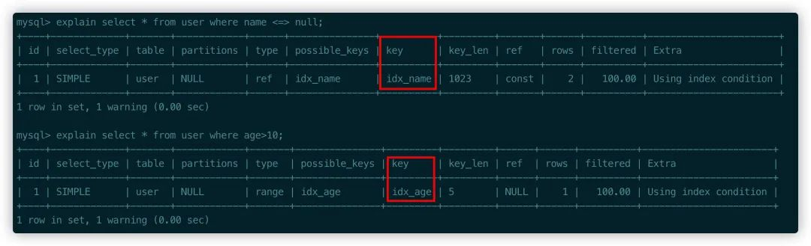

# MySQL -- NULL

>**NULL代表的是未知数，任何值都不等于NULL，并且任意值和NULL计算都是NULL；**
>
>判断时候为NULL 需要用IS NULL ，对NULL，进行搜素偶的时候不需要使用NULL；
>
>空列的存储需要更多的存储空间需要额外的空间来判断是否是NULL；

---

## 注意：

  >使用聚合函数会省略NULL；但是avg，还是要算的，count(name);计算会省略null；
  >
  >= 不能生效的，需要用IS NULL;
  >
  >oder by group by distinct 对于`distinct`和`group by`来说，所有的NULL值都会被视为相等，对于`order by`来说升序NULL会排在最前
  >
  >on 和where  条件语句，NULL代表的是false；on或者where 语句一般后面是false true null；null 代表就是false； 需要注意一下；
  >
  >**这一行记录可以为NULL，那么这一条记录会占用额外的字节！！无论你存不存储，都需要占用额外的一个字节；**

---

## <=> and = 

>`<=>` 是 MySQL 中用于比较两个表达式是否相等的操作符。它会返回一个布尔值，如果两个表达式相等，则返回1，否则返回0。这个操作符会忽略 NULL 值，即使其中一个表达式为 NULL，也会返回 0。**这个操作符通常用于比较可能包含 NULL 值的列或变量。**
>
>---
>
><=> NULL // 一般用于 NULL的计算；
>
>=   是否相等； NULL = NULL；
>
><>  不等于  NULL <> NULL;
>
>---
>
>**summary ：**   **（就是解决 NULL = NULL ，和NULL <=>NULL的问题u！！！）**
>
>where 条件（= <>）结果有三种 true；false 和NULL，但是NULL代表的也是false；
>
> NULL = NULL; NULL与任何值做运算都是NULL，他在where 条件中代表的是false；
>
>where 条件(<=>)结果却只有两种 true，false；NULL = NULL；是true；
>
>---
>
>

`````mysql
#sql : select * from t where name <=> null;搜寻为null的列；
# select NULL<=>NULL;  1;
# select NULL=NULL; NULL;

#select NULL<=>1; 0;
#select NULL = 1; NULL，如果是在筛选语句中 on 或者where中都是false；

###---重要！！！
select 1 where NULL = NULL;  --  空值  代表的就是false； false 并没有执行； NULL 代表的就是false；NULL 与任何计算都是NULL值； 除了<=> 计算；
select 1 where NULL <=> NULL; -- true; 
`````


----


Mysql难以优化引用可空列查询，它会使**索引、索引统计和值计算更加复杂。**

**可空列需要更多的存储空间，还需要mysql内部进行特殊处理。** 

**可空列被索引后，每条记录都需要一个额外的字节，还能导致MYisam 中固定大小的索引变成可变大小的索引**

**注意：但把NULL列改为NOT NULL带来的性能提示很小,除非确定它带来了问题,否则不要把它当成优先的优化措施,最重要的是使用的列的类型的适当性.**


总结：

1. 索引统计和索引计算更加复杂了；

   count(column) 是忽略null的
   oder by  distinct group by 会返回null行，所有的NULL都是相等的；
   = null 失效 需要用is null

   值的计算 任意值和NULL计算都是NULL

   

2. 占用更多的存储空间； 跟存储结果有关；需要额外的一个字节来判断是否是null；

   

3. 空列被索引后，每个记录都需要额外一个字段；

最近刚入职新公司，发现数据库设计有点小问题，数据库字段很多没有NOT NULL，对于强迫症晚期患者来说，简直难以忍受，因此有了这篇文章。

基于目前大部分的开发现状来说，我们都会把字段全部设置成`NOT NULL`并且给默认值的形式。

通常，对于默认值一般这样设置：

1. 整形，我们一般使用0作为默认值。
2. 字符串，默认空字符串
3. 时间，可以默认`1970-01-01 08:00:01`，或者默认`0000-00-00 00:00:00`，但是连接参数要添加`zeroDateTimeBehavior=convertToNull`，建议的话还是不要用这种默认的时间格式比较好

但是，考虑下原因，为什么要设置成NOT NULL？

来自高性能Mysql中有这样一段话：

> 尽量避免NULL
>
> 很多表都包含可为NULL（空值）的列，即使应用程序并不需要保存NULL也是如此，这是因为可为NULL是列的默认属性。通常情况下最好指定列为NOT NULL，除非真的需要存储NULL值。
>
> 如果查询中包含可为NULL的列，对MySql来说更难优化，因为可为NULL的列使得索引、索引统计和值比较都更复杂。可为NULL的列会使用更多的存储空间，在MySql里也需要特殊处理。当可为NULL的列被索引时，每个索引记录需要一个额外的字节，在MyISAM里甚至还可能导致固定大小的索引（例如只有一个整数列的索引）变成可变大小的索引。
>
> 通常把可为NULL的列改为NOT NULL带来的性能提升比较小，所以（调优时）没有必要首先在现有schema中查找并修改掉这种情况，除非确定这会导致问题。但是，如果计划在列上建索引，就应该尽量避免设计成可为NULL的列。
>
> 当然也有例外，例如值得一提的是，InnoDB使用单独的位（bit）存储NULL值，所以对于稀疏数据有很好的空间效率。但这一点不适用于MyISAM。

书中的描述说了几个主要问题，我这里暂且抛开MyISAM的问题不谈，这里我针对InnoDB作为考量条件。

1. 如果不设置NOT NULL的话，NULL是列的默认值，如果不是本身需要的话，尽量就不要使用NULL
2. 使用NULL带来更多的问题，比如索引、索引统计、值计算更加复杂，如果使用索引，就要避免列设置成NULL
3. 如果是索引列，会带来的存储空间的问题，需要额外的特殊处理，还会导致更多的存储空间占用
4. 对于稀疏数据有更好的空间效率，稀疏数据指的是**很多值为NULL，只有少数行的列有非NULL值**的情况

### 默认值

对于MySql而言，如果不主动设置为NOT NULL的话，那么插入数据的时候默认值就是NULL。

NULL和NOT NULL使用的空值代表的含义是不一样，NULL可以认为这一列的值是未知的，空值则可以认为我们知道这个值，只不过他是空的而已。

举个例子，一张表中的某一条`name`字段是NULL，我们可以认为**不知道名字是什么**，反之如果是空字符串则可以认为**我们知道没有名字，他就是一个空值**。

而对于大多数程序的情况而言，没有什么特殊需要非要字段要NULL的吧，NULL值反而会对程序造成比如空指针的问题。

对于现状大部分使用`MyBatis`的情况来说，我建议使用默认生成的`insertSelective`方法或者纯手动写插入方法，可以避免新增NOT NULL字段导致的默认值不生效或者插入报错的问题。

### 值计算

**聚合函数不准确**

**对于NULL值的列，使用聚合函数的时候会忽略NULL值。**

现在我们有一张表，`name`字段默认是NULL，此时对`name`进行`count`得出的结果是1，这个是错误的。

`count(*)`是对表中的行数进行统计，`count(name)`则是对表中非NULL的列进行统计。


**=失效**

对于NULL值的列，是不能使用`=`表达式进行判断的，下面对`name`的查询是不成立的，必须使用`is NULL`。


**与其他值运算**

NULL和其他任何值进行运算都是NULL，包括表达式的值也是NULL。

`user`表第二条记录`age`是NULL，所以`+1`之后还是NULL，`name`是NULL，进行`concat`运算之后结果还是NULL。


可以再看下下面的例子，任何和NULL进行运算的话得出的结果都会是NULL，想象下你设计的某个字段如果是NULL还不小心进行各种运算，最后得出的结果。；


**distinct、group by、order by**

对于`distinct`和`group by`来说，所有的NULL值都会被视为相等，对于`order by`来说升序NULL会排在最前


**其他问题**

表中只有一条有名字的记录，此时查询名字`!=a`预期的结果应该是想查出来剩余的两条记录，会发现与预期结果不匹配。


### 索引问题

为了验证NULL字段对索引的影响，分别对`name` 和`age`添加索引。


关于网上很多说如果NULL那么不能使用索引的说法，这个描述其实并不准确，根据引用官方文档[3]里描述，使用is NULL和范围查询都是可以和正常一样使用索引的，实际验证的结果好像也是这样，看以下例子。



然后接着我们往数据库中继续插入一些数据进行测试，当NULL列值变多之后发现索引失效了。


我们知道，一个查询SQL执行大概是这样的流程：


首先连接器负责连接到指定的数据库上，接着看看查询缓存中是否有这条语句，如果有就直接返回结果。

如果缓存没有命中的话，就需要分析器来对SQL语句进行语法和词法分析，判断SQL语句是否合法。

现在来到优化器，就会选择使用什么索引比较合理，SQL语句具体怎么执行的方案就确定下来了。

**最后执行器负责执行语句、有无权限进行查询，返回执行结果。**

从上面的简单测试结果其实可以看到，索引列存在NULL就会存在书中所说的导致优化器在做索引选择的时候更复杂，更加难以优化。

### 存储空间

数据库中的一行记录在最终磁盘文件中也是以行的方式来存储的，对于InnoDB来说，有4种行存储格式：`REDUNDANT`、 `COMPACT`、 `DYNAMIC` 和 `COMPRESSED`。

I**nnoDB的默认行存储格式是`COMPACT`，存储格式如下所示，虚线部分代表可能不一定会存在。**


变长字段长度列表：**有多个字段则以逆序存储，我们只有一个字段所有不考虑那么多，存储格式是16进制，如果没有变长字段就不需要这一部分了。**

````php
// 
//MySQL支持一些变长的数据类型，比如VARCHAR(M)、VARBINARY(M)、TEXT类型，BLOB类型，这些数据类型修饰列称为变长字段，变长字段中存储多少字节的数据不是固定的，所以我们在存储真实数据的时候需要顺便把这些数据占用的字节数也存起来。在Compact行格式中，把所有变长字段的真实数据占用的字节长度都存放在记录的开头部位，从而形成一个变长字段长度列表。
````


NULL值列表：**用来存储我们记录中值为NULL的情况，如果存在多个NULL值那么也是逆序存储，并且必须是8bit的整数倍，如果不够8bit，则高位补0。1代表是NULL，0代表not NULL。如果都是NOT NULL那么这个就不存在了**。

````php
// 怎么存储的？
// 就是一个列名对应着一个bit，1代表的是null，0代表的是notnull；
````


ROW_ID：一行记录的唯一标志，没有指定主键的时候自动生成的ROW_ID作为主键。

TRX_ID：事务ID。

ROLL_PRT：回滚指针。

最后就是每列的值。

为了说明清楚这个存储格式的问题，我弄张表来测试，这张表只有`c1`字段是NOT NULL，其他都是可以为NULL的。


**可变字段长度列表**：`c1`和`c3`字段值长度分别为1和2，所以长度转换为16进制是`0x01 0x02`，逆序之后就是`0x02 0x01`。

**NULL值列表**：因为存在允许为NULL的列，所以`c2,c3,c4`分别为010，逆序之后还是一样，同时高位补0满8位，结果是`00000010`。

````php
//todo? 也就是null值有可能大于一个字节；别被误导了；
//每一个字段记录对应一个二进制位
````


其他字段我们暂时不管他，最后第一条记录的结果就是，当然这里我们就不考虑编码之后的结果了。


这样就是一个完整的数据行数据的格式，反之，如果我们把所有字段都设置为NOT NULL，并且插入一条数据`a,bb,ccc,dddd`的话，存储格式应该这样：


**虽然我们发现NULL本身并不会占用存储空间，但是如果存在NULL的话就会多占用一个字节的标志位的空间。**

