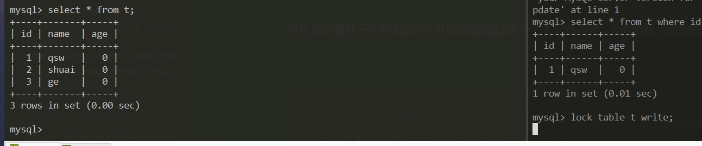
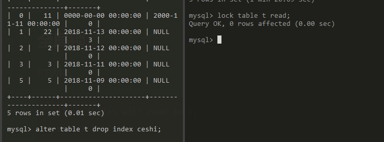
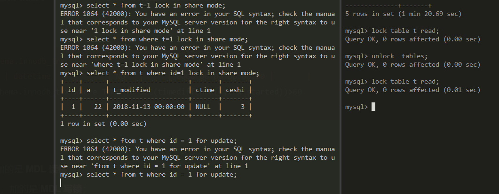
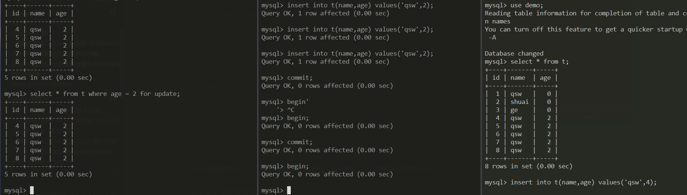
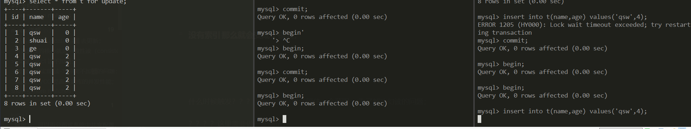
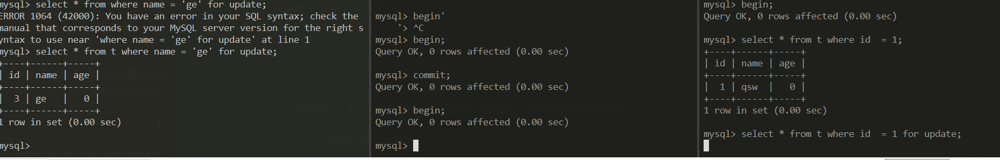
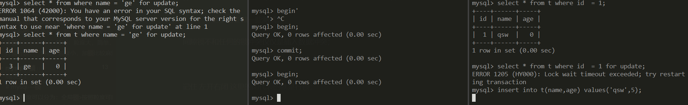
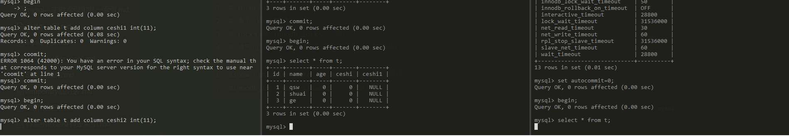

# mysql---锁

>按照粒度可以分为：全局锁，表锁和行锁
>
>锁主要是来解决资源竞争的问题；
>
>**mysql锁是通过锁主索引来实现的；**
>
>没有索引的查询我只能去遍历索引树，一条条的查询，那么只能去锁住所有行，也就是锁表；
>
>---
>
>question：
>
>表锁和表锁肯定是冲突的吗？  肯定有呀，废话；但是意向锁和行锁是没有冲突的把？？？没有；
>
>但是表锁和行锁是冲突的吗？ 有呀，但是行锁和意向锁，并不冲突，但是表锁和意向锁坑肯定是冲突的；也是表锁的一种；


## 全局锁

FTWRL

```mysql
flush tables with read lock;  ## flush table with read lock;  加一个全局锁；
unlock tables;
```

场景：全库的一个逻辑备份；

* myisam的数据备份； **数据不可以正常的更新；**
  如果不加 全局锁，很可能会出现，商品表的商品减少，备份，但是用户的前没有减少情况；
* innodb 直接使用 **mysqldump -uroot hp --single-transaction --ignore-table=db.table_name  db table > /usr/local/ceshi.sql** 
  恢复：mysqldump uroot -h -p db_name < test.sql  use db_table source test.sql 
*  --all-databases 全表备份；
* **在备份(读)之前，启动一个事务，来确保拿到视图，数据可以正常的更新，**

----


## 表锁 （肯定是和行锁冲突的；）

#####表锁：

`````mysql 
flush tables table_name read;  # 也可以 lock table table_name read/write;
flush tables table_name write;
unlock tables;                 #  解锁；

LOCK TABLES trans READ, customer WRITE;

UNLOCK TABLES;
`````

**innodb 当没有索引的时候会锁住整张表；**


---


#####MDL 元数据 锁 ，主要是为了防止DML（数据操纵语言 就是curd） 和DDL（数据定义语言）的并发冲突问题；dcl tcl 


**MDL表锁 是和 表锁冲突的； 但是不和行锁冲突！！！   ？？？ 这个是冲突的呀；？？？？？？？**






行锁和表锁冲突吗？ 我感觉肯定冲突的呀； 肯定也是冲突的呀；傻逼吗？但是意向锁和行锁并不冲突；




**DDL 他只能开一个单独的事务 并且会自动提交？？？？DML写锁；没有阻塞 会直接提交**


````mysql
# 查看长事务  information_schema.innodb_trx  
# trx_started                | datetime            | NO   |     | 0000-00-00 00:00:00 |       |
select * from information_schema.innodb_trx where TIME_TO_SEC(timediff(now(),trx_started))>60

````


* 对一张表进行 CRUD 操作时，加的是 **MDL 读锁**；

* 对一张表做结构变更操作的时候，加的是 **MDL 写锁**；

* MDL 是在事务提交后才会释放，这意味着**事务执行期间，MDL 是一直持有的**。

* 那如果数据库有一个长事务（所谓的长事务，就是开启了事务，但是一直还没提交），那在对表结构做变更操作的时候，可能会发生意想不到的事情，比如下面这个顺序的场景：

  1. 首先，线程 A 先启用了事务（但是一直不提交），然后执行一条 select 语句，此时就先对该表加上 MDL 读锁；
  2. 然后，线程 B 也执行了同样的 select 语句，此时并不会阻塞，因为「读读」并不冲突；
  3. 接着，线程 C 修改了表字段，此时由于线程 A 的事务并没有提交，也就是 MDL 读锁还在占用着，这时线程 C 就无法申请到 MDL 写锁，就会被阻塞；

  那么在线程 C 阻塞后，后续有对该表的 select 语句，就都会被阻塞，如果此时有大量该表的 select 语句的请求到来，就会有大量的线程被阻塞住，这时数据库的线程很快就会爆满了。


这是因为申请 MDL 锁的操作会形成一个队列，队列中**写锁获取优先级高于读锁**，一旦出现 MDL 写锁等待，会阻塞后续该表的所有 CRUD 操作。

**首先要拿到写锁，不然就会阻塞到后面的DML读锁；其实这些问题 都是长事务引起的问题；**

**ALTER TABLE tbl_name WAIT N add column ...   可以多次尝试  wait n 就是等不阻塞的时候 修改表结构 能拿到写锁 就会执行  拿不到写锁 也不会阻塞后面的读锁；**


**所以为了能安全的对表结构进行变更，在对表结构变更前，先要看看数据库中的长事务，是否有事务已经对表加上了 MDL 读锁，如果可以考虑 kill 掉这个长事务，然后再做表结构的变更。**


````mysql
select * from information_schema.innodb_trx where TIME_TO_SEC(timediff(now(),trx_started))>60
````


注意：

````php
set autocommit=0;// 这个设置仅仅设置了本session； 仅仅是本次会话；
````


### 案例

 很多程序员同学在工作中可能都会碰到，在给一张有几万条记录的表添加索引时，进度非常慢，导致表锁死，今天就给大家说一说处理方式：

  使用Navicat的命令行模式，执行以下命令：

show processlist;       **// 查看 顺序执行的；**

  **这时会看到有哪些线程正在执行，也可以查看锁表的线程。你会发现alter table * add key 那个线程状态是Waiting for table metadata lock，后面有个这个表的所有操作都是这个状态，很明显是这条加索引的语句把表给锁了。查看线程ID，执行**

  kill 线程ID

这样被锁住的表就能立即被使用了。

  由此得出一个结论，当一张表数据量很大时，不要轻易添加索引，会导致表被锁死！如果非要添加，那么应该先把数据表进行备份，然后进行空表添加索引。


---


##### 意向锁；   ---       提高加表锁的效率；


- 在使用 InnoDB 引擎的表里对某些记录加上「共享锁」之前，需要先在表级别加上一个「意向共享锁」；  读锁；
- 在使用 InnoDB 引擎的表里对某些纪录加上「独占锁」之前，需要先在表级别加上一个「意向独占锁」；写锁；

**注意，在普通的select语句利用mvcc实现一致读，所以是无锁的；**

注意：

* **意向锁和行锁是不冲突的，但是和表锁是冲突的，但是意向锁和表锁是冲突的**

*  **表锁（lock tables table）和行锁是冲突的，读读共享，读写互斥，写写互斥；**

所以加表级锁的时候，如果没有意向锁我们**需要去遍历所有的记录**，查看有没有独占锁，效率就很低；

如果有了意向锁，直接查看有没有互斥锁，就看有没有意向互斥锁所就可以了，有也就意味着有互斥行锁，就不需要去遍历了；

总结：意向锁的目的就是为了**快速判断表里是否有记录被锁**；

---


## 行锁

**行锁的实现是要依靠索引的，当没有索引的时候需要锁住整张表；**

- Record Lock，记录锁，也就是仅仅把一条记录锁上；
- Gap Lock，间隙锁，锁定一个范围，但是不包含记录本身；
- Next-Key Lock：Record Lock + Gap Lock 的组合，锁定一个范围，并且锁定记录本身。临建锁；

##### 行锁


##### 间隙锁

**key-next lock**   解决幻读的问题；  间隙锁加行锁 来解决

----


## 幻读 （主要是插入的问题，insert into table values ()hhh）

**也就是说，即使把所有的记录都加上锁，还是阻止不了新插入的记录，这也是为什么“幻读”会被单独拿出来解决的原因。**

**所以 如果你想update  也不会出现“幻读的问题”，可以使用表锁来解决；** 


就是说，幻读指的是一个事务在前后两次查询同一个范围的时候，后一次查询看到了前一次查询没有看到的行。这里，我需要对“幻读”做一个说明：

<font color=red>仅仅是插入的问题；</font>

**注意幻读问题 特指的是insert插入问题；当然也可以去修改数据update；**

间隙锁的引入，可能会导致同样的语句锁住更大的范围，这其实是影响了并发度的。


**幻读问题的解决：**

* **快照读用的是mvcc来解决的；**

* **当前读用的是next-key lock来解决的；**

---


## 详细讲一下 间隙锁 next-key lock


**注意 间隙锁 只能在 加锁的时候才能加；**   select * from t fot update  /lock in share mode;


**快照读是不加锁的；**  而且快照读 肯定是解决了幻读的； //


**所以 间隙锁  是只有在 在加锁（写锁（for update）和 读锁lock in share mode）的时候才会去加间隙锁；**

可是update  insert 或者 delete  肯定就枷锁了呀；

````mysql

# 普通索引 
# bash 1
begin;
# 不加锁  啥都不加  仅仅加了一个DML的表锁；表锁；
select * from t where age = 2;
# 加 行锁和 间隙锁；  age 是一个普通索引； （0 2] （2 +无穷） 所以直接不能插入了；
select * from t where age = 2 for update;


mysql> select * from t where age = 2;
+----+------+-----+
| id | name | age |
+----+------+-----+
|  4 | qsw  |   2 |
|  5 | qsw  |   2 |
|  6 | qsw  |   2 |
|  7 | qsw  |   2 |
|  8 | qsw  |   2 |
+----+------+-----+
5 rows in set (0.00 sec)

mysql> select * from t where age = 2 for update;
+----+------+-----+
| id | name | age |
+----+------+-----+
|  4 | qsw  |   2 |
|  5 | qsw  |   2 |
|  6 | qsw  |   2 |
|  7 | qsw  |   2 |
|  8 | qsw  |   2 |
+----+------+-----+
5 rows in set (0.00 sec)


## 如果是唯一索引 或者主键 直接给退化成 行锁；


##没有索引那么就锁整张表的区间； 全部都锁；

## Next-Key Lock:行锁和间隙锁组合起来就叫Next-Key Lock。
````


###普通索引；就是锁 行锁 左右的那两个区间；



---


### 唯一索引 和主键索引 next-lock  就变成了 行锁； 并不是间隙锁会变成；next-lock变成了行锁；


-----


### 没有索引 那么就会变成了锁表；

锁表 也会被阻塞住； 加写锁； 加了一个全部的间隙锁； 所有区间的间隙锁；



**这里是 无索引 也会锁表； 会锁住整张表；因为需要一条条的去找这个数据；所以只能锁住这张表；**  



**间隙锁 也是锁住整个区间的；所以代价比较大；**  只能锁全表才能去实现；

 **所有的区间都会被加间隙锁；**



---


设置隔离级别：0 1 2 3  // 读未提交，读已提交  可重复读，串行化；

mysql> show variables like '%iso%'
    -> ;
+---------------+-----------------+
| Variable_name | Value           |
+---------------+-----------------+
| tx_isolation  | REPEATABLE-READ |
+---------------+-----------------+
1 row in set (0.00 sec)

set tx_isolation  ;  

set tx_isolation=1;


---


什么时候触发？？？ **当前读的时候会锁住一个范围； 为了解决幻读的问题；**

？？？？这里需要做一些测试；

**间隙锁不和任何的锁冲突仅仅是插入数据冲突；**  和插入数据这个操作冲突；


<font color=red>**记住 左开右闭 这里的闭代表的就是行锁；** </font>

```mysql
#auto_increment;  自增；

create tale t(
id int(11) not null auto_increment,
a int(11) default 1,
b int (11) default 1,
c char(11) default '',
d int(11) default 1,
PRIMARY KEY(id),
KEY idx_a_b(a,b),
UNIQUE KEY u_d(d),
)engine=innodb default charset=utf8mb4


# 探寻   普通索引的a
insert into t(a,b,c) values(1,2,3);
insert into t(a,b,c) values(5,2,3);
insert into t(a,b,c) values(9,2,3);

set autocommit = 0;
update t set t.a = 123 where t.a = 1;

# 无索引
# 锁主整张表;
# 有索引


```

mvcc解决了快照读的幻读的问题；

间隙锁+ 行锁 = next-key  lock 用来解决当前读的幻读问题；

---


## 锁的一些案例自己好好测试一下把


````mysql
#锁的一些案例

#问数据库的索引和锁，问下面两个sql语句会加什么锁？
#索引idx_a_b_c
set autocommit=0;
update t set t.a = 123 where t.a = 1;
set autocommit=0;
update t set t.a = 1234 where t.a = 1;


#联合所索引 idx_a_b_c  其实是一个四个索引  a b c id   四个索引； 主键也是索引的；
#所以右四个 a  ab   abc  abcd
#记住 不走索引 直接就锁表； 
#？？？？？这里到底是锁主键 还是锁整张表？？？？？？？？？？？  感觉是主键把  b=123的主键；
update t set t.a = 123 where t.b = 123;


# 如果是c没有索引的话 ，
#那么会锁 
	
# b不走索引；


````


------

##一些比较好的问题，间隙锁的问题；

> **update 和  select 用不上索引的代价简直恐怖；**


老师，今天的文章对我影响很大，发现之前掌握的知识有些错误的地方，课后我用你的表结构根据以前不清楚的地方实践了一遍，现在有两个问题，麻烦您解答下

 1.我在事务1中执行 begin;select * from t where c=5 for update;事务未提交，然后事务2中begin;update t set c=5 where id=0;执行阻塞，替换成update t set c=11 where id=0;执行不阻塞，我觉得原因是事务1执行时产生next-key lock范围是(0,5].(5,10]。我想问下update set操作c=xxx是会加锁吗？以及加锁的原理。 '

2.一直以为gap只会在二级索引上，看了你的死锁案例，发现主键索引上也会有gap锁？

作者回复: 1. 好问题。你可以理解为要在索引c上插入一个(c=5,id=0)这一行，是落在(0,5],(5,10]里面的，11可以对吧 <font color=red>2. 嗯，主键索引的间隙上也要有Gap lock保护的</font>


Mr.Strive.Z.H.L

看了@令狐少侠 提出的问题，对锁有了新的认识： 对于非索引字段进行update或select .. for update操作，代价极高。所有记录上锁，以及所有间隔的锁。 对于索引字段进行上述操作，代价一般。只有索引字段本身和附近的间隔会被加锁。 这次终于明白，为什么说update语句的代价高！

作者回复: **是的，update、delete语句用不上索引是很恐怖的😄**


````mysql
#锁整张表和锁某一行数据；
#next-lock 如果是唯一所以那么变成了行锁；

````


---


## 注意 表锁 和表锁肯定是冲突的；表锁和行锁 也肯定是冲突的；

注意：行锁和意向锁肯定是不冲突的；但是意向锁和表锁是冲突的；意向锁是表锁；


---


##  没有索引 

随便看一下把，还行把；

https://blog.csdn.net/qq_25800311/article/details/82531872

**没有索引-----走的是叶子节点n的时间复杂度；**

**有索引走的是索引树，logn的时间复杂度；====树高；效率相差天差地别；**


4.不使用索引情况下，sql查询语句是怎么执行的？

答：如果没有索引，必须遍历整个表。例如这样一个查询：select * from table1 where id=10000。如果没有索引，必须遍历整个表，直到ID等于10000的这一行被找到为止；有了[索引](http://baike.baidu.com/subview/262241/8045149.htm)之后(必须是在ID这一列上建立的索引)，即可在索引中查找。由于索引是经过某种算法优化过的，因而查找次数要少的多。可见，索引是用来定位的。


---


##  看看这个 无索引 是什么情况；  其实是由 索引的，还是行锁；锁住行；

<font color=red>**行锁要锁索引，但是没有索引，咋办只能锁表了；**</font>

select \* from table2 where age = 19;

如果age 没有索引；

那么会

行锁 会锁 age=19的主键索引id的数据；

间隙锁 会全部锁？？？？ 负无穷 - id]  (19 重无穷)


----

## 关于 多个索引的问题； 锁的实现原理，是通过 锁索引来实现的，当没有索引，只能锁表；


其实也是正常现象呀；行锁 肯定要锁的是整行呀；肯定也会锁主键索引；而且二级索引树也会保存主键索引；

`````mysql
mysql> select * from t;
+----+------+---------------------+---------------------+-------+
| id | a    | t_modified          | ctime               | ceshi |
+----+------+---------------------+---------------------+-------+
|  0 |   11 | 0000-00-00 00:00:00 | 2000-11-11 00:00:00 |     0 |
|  1 |   22 | 2018-11-13 00:00:00 | NULL                |     3 |
|  2 |    2 | 2018-11-12 00:00:00 | NULL                |     0 |
|  3 |    3 | 2018-11-11 00:00:00 | NULL                |     0 |
|  5 |    5 | 2018-11-09 00:00:00 | NULL                |     0 |
+----+------+---------------------+---------------------+-------+
5 rows in set (0.00 sec)


`````


查看索引；

mysql> show index  from t;
+-------+------------+------------+--------------+-------------+-----------+-------------+----------+--------+------+------------+---------+---------------+
| Table | Non_unique | Key_name   | Seq_in_index | Column_name | Collation | Cardinality | Sub_part | Packed | Null | Index_type | Comment | Index_comment |
+-------+------------+------------+--------------+-------------+-----------+-------------+----------+--------+------+------------+---------+---------------+
| t     |          0 | PRIMARY    |            1 | id          | A         |           5 |     NULL | NULL   |      | BTREE      |         |               |
| t     |          1 | a          |            1 | a           | A         |           5 |     NULL | NULL   | YES  | BTREE      |         |               |
| t     |          1 | t_modified |            1 | t_modified  | A         |           5 |     NULL | NULL   |      | BTREE      |         |               |
| t     |          1 | ceshi      |            1 | a           | A         |           5 |     NULL | NULL   | YES  | BTREE      |         |               |
+-------+------------+------------+--------------+-------------+-----------+-------------+----------+--------+------+------------+---------+---------------+

desc 

update t set a=123 where a=22;  // 注意 主键索引和普通索引都会被锁住；

间隙索引；会不会也被锁住呢？？？？   c索引的间隙索引   （11,22] (22 ,正无穷)  锁住这一个区间；  

主键索引的间隙索引，会退化成行锁，所以直接锁住id =1的行就可以了；


``````php
# 线程1 
mysql> begin;
Query OK, 0 rows affected (0.00 sec)

mysql> update t set a=123 where a=22;
Query OK, 1 row affected (0.00 sec)
Rows matched: 1  Changed: 1  Warnings: 0

mysql>
    
#线程2 这是一个间隙锁；
mysql> insert into t values(7,13,now(),null,0);
ERROR 1205 (HY000): Lock wait timeout exceeded; try restarting transaction
mysql> insert into t values(7,13,now(),null,0);

    

``````


---


## 主键索引的问题

* 有主键索引 那么就用id primary key
* 如果没有primary 默认使用  unique key and not null
* 如果还没有 那么就是用默认的_rowid 来实现；

行隐藏的几个字段：\_rowid   t'x_id 事务的id   roll_pst  回退指针；

---


##  记住 当你有索引 但是你不走索引那么也会锁表；需要一条数据一条数据的去查询；也会锁表；


当有索引 而不走索引，肯定要去遍历主键索引树的叶子节点，肯定需要去锁表；

### 原因

对于innoDB引擎的行锁是通过给索引上的索引项加锁来实现的, 而不是针对记录来加锁的.
假如在操作数据的时候, 没有索引, 是无法使用行级锁的, 此时使用的是表锁。

### 导致问题

如果是个长事务，极有可以会导致被锁表的其他操作等待超时，Lock wait timeout


---


##  注意 当前读 不加锁  当前读 不加写锁 也不加读锁；；；；；；；；记住了哦；

##啥子都不加； lock in share  mode； 加的是读锁，for update update  select 加的是写锁；


````mysql
#t_noindex 表 没有索引；
select * from t_noindex;

#长事务的问题；
# om information_schema.innodb_trx where TIME_TO_SEC(timediff(now(),trx_started))>60

# 当前读 select * from t; 也不加表锁；当前读是不加锁的；
#mysql5.7   
#show variables like 'transaction_isolation';
#  transaction_isolation | REPEATABLE-READ
````


## 其实我们对二级索引加锁，但是会锁主键索引的情况就是一个回表的原因；


## 去拿锁的时候，其实就是一个队列的形式；拿不到锁就会被阻塞，其实这里就是一个自旋锁；


拿锁其实就是队列的形式去拿锁；


当一个线程加一一个行+读锁-----执行 没有commit  读锁； 

另外一个线程加一个给这个行加写锁-------会阻塞，因为优先级比价高，会阻塞到后面的读锁；

那么其他的线程就在读这一行数据的时候就会被阻塞；不能再读数据；当然这里也有事务超时之类的；一个保险，防止一个事务执行过长吧；


##  注意这三个表的数据；

`````mysql
# information_schema
# 事务 innodb_trx  
# locks 锁 innodb_locks   锁；
# 锁等待问题； innodb_lock_waits(); 锁等待；

#show variables like '%timeout%';  超时等待；
#innodb_lock_wait_timeout    | 50
`````


## DML 长事务 拿不到DML写锁 阻塞后面读锁的问题

// 注意DDL只要拿到DML写锁执行完立马释放写锁；防止为了阻塞后面的DML读锁；防止阻塞到了后面的DML读锁select；

2                                                                          1                                                                       3



执行时顺序是  123 ； 后面的


----

##  关于锁的表


从InnoDB1.0开始，在INFORMATION_SCHEMA架构下添加了表INNODB_TRX、INNODB_LOCKS、INNODB_LOCK_WAITS。（详情见附录）通过这三张表，用户可以更简单地监控当前事务并分析可能存在的锁问题。


