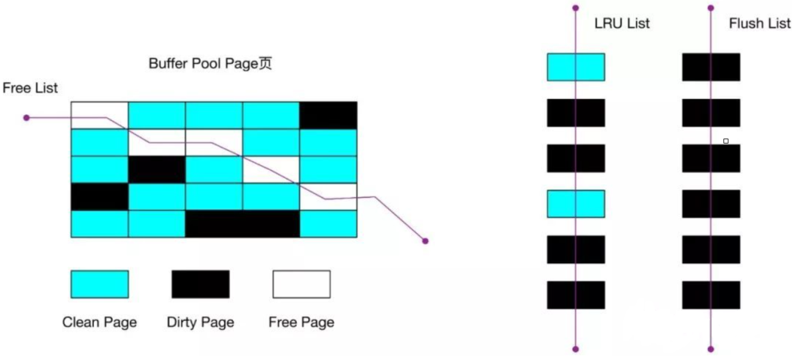

# mysql-buffer_pool

>buffer_pool 缓存池；来提高数据库的读写能力；
>
>平衡cpu和磁盘之间得速度差异的问题；所以出现了缓冲区，也就是内存；

每次数据都从磁盘里读取，为了加快查询效率加一个缓存就行；

* 读取数据的时候，当数据存在于buffer_pool中，客户端会直接读取buffer_pool中的数据，否则再去磁盘读取；
* 当修改数据的时候，首先是修改buffer_pool 中数据所在的页，然后将其设置为脏页，最后由后台线程将脏页写入到磁盘；

#### 配置

innodb_buffer_pool_size = 128M

默认是 128M

一般建议设置成可用物理内存的百分之60到百分之80

页的概念：每一个页都是innodb_page_size = 16kb

buffer_pool 中的页的概念就是缓存页；

### 如何提高缓存命中率？

Buffer Pool  的大小是有限的，对于一些频繁访问的数据我们希望可以一直留在 Buffer Pool 中，而一些很少访问的数据希望可以在某些时机可以淘汰掉，从而保证 Buffer Pool  不会因为满了而导致无法再缓存新的数据，同时还能保证常用数据留在 Buffer Pool 中。

要实现这个，最容易想到的就是 LRU（Least recently used）算法。

**lru链表算法的实现；**

**该算法的思路是，链表头部的节点是最近使用的，而链表末尾的节点是最久没被使用的。那么，当空间不够了，就淘汰最久没被使用的节点，从而腾出空间。**

简单的 LRU 算法的实现思路是这样的：

- 当访问的页在 Buffer Pool  里，就直接把该页对应的 LRU 链表节点移动到链表的头部。
- 当访问的页不在 Buffer Pool 里，除了要把页放入到 LRU 链表的头部，还要淘汰  LRU 链表末尾的节点

 数组的，局部原理，局部原理 ，程序是有空间局部性的，靠近当前被访问数据的数据，在未来很大概率会被访问到。

#### 缓存页的分类

#### 

* Free Page（空闲页），表示此页未被使用，位于 Free 链表；
* Clean Page（干净页），表示此页已被使用，但是页面未发生修改，位于LRU 链表。
* Dirty Page（脏页），表示此页「已被使用」且「已经被修改」**，其数据和磁盘上的数据已经不一致。当脏页上的数据写入磁盘后，内存数据和磁盘数据一致，那么该页就变成了干净页。脏页同时存在于 LRU 链表和 Flush 链表。**

### 脏页什么时候会被刷入磁盘？

引入了 Buffer Pool  后，当修改数据时，首先是修改  Buffer Pool  中数据所在的页，然后将其页设置为脏页，但是磁盘中还是原数据。

因此，脏页需要被刷入磁盘，保证缓存和磁盘数据一致，但是若每次修改数据都刷入磁盘，则性能会很差，因此一般都会在一定时机进行批量刷盘。

可能大家担心，如果在脏页还没有来得及刷入到磁盘时，MySQL 宕机了，不就丢失数据了吗？

**这个不用担心，InnoDB 的更新操作采用的是 Write Ahead Log 策略，即先写日志，再写入磁盘，通过 redo log 日志让 MySQL 拥有了崩溃恢复能力。**

下面几种情况会触发脏页的刷新：

- **当 redo log 日志满了的情况下，会主动触发脏页刷新到磁盘；**
- **Buffer Pool 空间不足时，需要将一部分数据页淘汰掉，如果淘汰的是脏页，需要先将脏页同步到磁盘；**
- **MySQL 认为空闲时，后台线程回定期将适量的脏页刷入到磁盘；**
- **MySQL 正常关闭之前，会把所有的脏页刷入到磁盘；**

在我们开启了慢 SQL 监控后，如果你发现**「偶尔」会出现一些用时稍长的 SQL**，这可能是因为脏页在刷新到磁盘时可能会给数据库带来性能开销，导致数据库操作抖动。

如果间断出现这种现象，就需要调大 Buffer Pool 空间或 redo log 日志的大小。