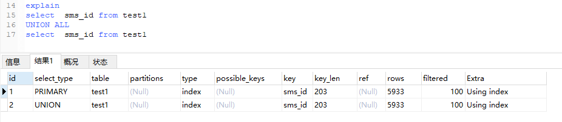

# temporary临时表


但内存毕竟是有限的资源，因此，如**果数据量比较大，则不适合用内存表，而是选择用磁盘临时表(innodb引擎)**，这种临时表采用B+树存储结构(innodb引擎)，innodb的bufferpool资源是共享的，临时表的数据可能会对bufferpool的热数据有一定的影响，另外，操作可能涉及到物理IO。


## 使用内部临时表

### 场景

我们先看一下什么时候会使用到内部临时表？

> Using temporary
>
> 去重方面比较多，
>
> 临时创建的一个表去做去重；distinct  group by union 也需要去重；

 

测试表结构如下：

```
CREATE TABLE `test1` (
  `sms_id` varchar(50) COLLATE utf8mb4_unicode_ci DEFAULT NULL,
  `app_id` int(1) NOT NULL DEFAULT '0',
  `payment` double NOT NULL DEFAULT '0',
  KEY `sms_id` (`sms_id`)
) ENGINE=InnoDB DEFAULT CHARSET=utf8mb4 COLLATE=utf8mb4_unicode_ci
```

前面提到执行计划中包含有时，会使用临时表，这里列两个主要的场景。

### 场景1：union 场景


**union操作的含义是，取两个子查询结果的并集，重复的数据只保留一行，通过建立一个带主键的临时表，就可以解决“去重”问题，通过临时表存储最终的结果集，所以能看到执行计划中Extra这一项里面有“Using temporary”。**


与union相关的一个操作是union all，后者也是将两个子查询结果合并，但不解决重复问题。所以对于union all，没有“去重”的含义，因此也就不需要临时表了。



 

 

 

###  **场景2：group by**


 

 

group by的含义是按指定列分组，并默认按照指定列有序。上面的SQL语句含义是将test1中的数据按app_id列分组，统计每种app_id列值的记录数目。

从执行计划中看到了"Using temporary;Using filesort"：

- **对于group by而言，我们首先需要统计每个值出现的数目，这就需要借助临时表来快速定位，如果不存在，则插入一条记录，如果存在，并累加计数，所以看到了"Using temporary"；**
- 然后又因为group by隐含了排序含义，所以还需要按照app_id列进行对记录排序，所以看到了"Using filesort"。

**1).消除filesort**

实际上，group by也可以显示消除“排序含义”。

 

**可以看到，语句中加上“order by null”后，执行计划中，不再出现“Using filesort”。**


**2).消除临时表**

****

可以看到执行计划中已经没有了“Using temporary”，所以group by并非一定依赖临时表，临时表在group by中的作用主要是“去重”。

所以，实际上有另外一种方式，不使用临时表，直接利用sort_buffer排序(sort_buffer不够时，进行文件排序，具体而言是每一个有序数组作为一个单独文件，然后进行外排归并)，然后再扫描得到聚合后的结果集。


# [Using temporary与Using filesort](https://www.cnblogs.com/flzs/p/14242151.html)

## Using temporary


`Using temporary`表示由于排序没有走索引、使用`union`、子查询连接查询、使用某些视图等原因（详见https://dev.mysql.com/doc/refman/5.6/en/internal-temporary-tables.html），**因此创建了一个内部临时表。**

**注意这里的临时表可能是内存上的临时表，也有可能是硬盘上的临时表，理所当然基于内存的临时表的时间消耗肯定要比基于硬盘的临时表的实际消耗小。**

 

查看sql执行时使用的是内存临时表还是硬盘临时表，需要使用如下命令：

```sql
mysql> show global status like '%tmp%';
+-------------------------+-------+
| Variable_name           | Value |
+-------------------------+-------+
| Created_tmp_disk_tables | 0     |
| Created_tmp_files       | 5     |
| Created_tmp_tables      | 11    |
+-------------------------+-------+
```

[Created_tmp_tables](https://dev.mysql.com/doc/refman/5.6/en/server-status-variables.html#statvar_Created_tmp_tables)表示mysql创建的内部临时表的总数（包括内存临时表和硬盘临时表）；[Created_tmp_disk_tables](https://dev.mysql.com/doc/refman/5.6/en/server-status-variables.html#statvar_Created_tmp_disk_tables)表示mysql创建的硬盘临时表的总数。


**是使用磁盘的临时表或者使用内存临时表是由tmp_table_size 大小来决定；**16M


当mysql需要创建临时表时，选择内存临时表还是硬盘临时表取决于参数[tmp_table_size](https://dev.mysql.com/doc/refman/5.6/en/server-system-variables.html#sysvar_tmp_table_size)和[max_heap_table_size](https://dev.mysql.com/doc/refman/5.6/en/server-system-variables.html#sysvar_max_heap_table_size)，内存临时表的最大容量为`tmp_table_size`和`max_heap_table_size`值的最小值，当所需临时表的容量大于两者的最小值时，mysql就会使用硬盘临时表存放数据。

 

用户可以在mysql的配置文件里修改该两个参数的值，两者的默认值均为16M。

```ini
tmp_table_size = 16M
max_heap_table_size = 16M
```

查看`tmp_table_size`和`max_heap_table_size`值：

```sql
mysql> show global variables like 'max_heap_table_size';
+---------------------+----------+
| Variable_name       | Value    |
+---------------------+----------+
| max_heap_table_size | 16777216 |
+---------------------+----------+

mysql> show global variables like 'tmp_table_size';
+----------------+----------+
| Variable_name  | Value    |
+----------------+----------+
| tmp_table_size | 16777216 |
+----------------+----------+
如果ORDER BY或GROUP BY中的字段都来自其他的表而非连接顺序中的第一个表的话，就会创建一个临时表了。
```


## Using filesort


如果问`Using filesort`是什么意思，大多数人应该会回答“基于硬盘的排序”或者“数据太多不适合内存，所以在硬盘上排序”。然而这些解释是错误的。

**`Using filesort`仅仅表示没有使用索引的排序，事实上`filesort`这个名字很糟糕，并不意味着在硬盘上排序，`filesort`与文件无关。因此消除`Using filesort`的方法就是让查询sql的排序走索引。**

**`filesort`使用的算法是`QuickSort`，即对需要排序的记录生成元数据进行分块排序，然后再使用mergesort方法合并块。其中`filesort`可以使用的内存空间大小为参数[sort_buffer_size](https://dev.mysql.com/doc/refman/5.5/en/server-system-variables.html#sysvar_sort_buffer_size)的值，默认为2M。当排序记录太多`sort_buffer_size`不够用时，mysql会使用临时文件来(磁盘)存放各个分块，然后各个分块排序后再多次合并分块最终全局完成排序。**

 **使用 分块的形式来排序,当内存不够的时候需要需要用磁盘;**


```
mysql> show global variables like ``'sort_buffer_size'``;``+------------------+--------+``| Variable_name  | Value |``+------------------+--------+``| sort_buffer_size | 262144 |``+------------------+--------+
```

　　[Sort_merge_passes](https://dev.mysql.com/doc/refman/5.6/en/server-status-variables.html#statvar_Sort_merge_passes)表示`filesort`执行过的文件分块合并次数的总和，如果该值比较大，建议增大`sort_buffer_size`的值。

```
mysql> show global status like ``'%sort%'``;``+-------------------+---------+``| Variable_name   | Value  |``+-------------------+---------+``| Sort_merge_passes | 226   |``| Sort_range    | 0    |``| Sort_rows     | 1384911 |``| Sort_scan     | 6    |``+-------------------+---------+
```

　　

#### filesort排序方式

`filesort`使用的排序方法有两种：

第一种方法是对需要排序的记录生成`<sort_key,rowid>`的元数据进行排序，该元数据仅包含排序字段和rowid。排序完成后只有按字段排序的rowid，因此还需要通过rowid进行回表操作获取所需要的列的值，可能会导致大量的随机IO读消耗；

第二种方法是是对需要排序的记录生成`<sort_key,additional_fields>`的元数据，该元数据包含排序字段和需要返回的所有列。排序完后不需要回表，但是元数据要比第一种方法长得多，需要更多的空间用于排序。

参数[max_length_for_sort_data](https://dev.mysql.com/doc/refman/5.6/en/server-system-variables.html#sysvar_max_length_for_sort_data)字段用于控制`filesort`使用的排序方法，当所有需要排序记录的字段数量总和小于`max_length_for_sort_data`时使用第二种算法，否则会用第一种算法。该值的默认值为1024。

```
mysql> show global variables like ``'max_length_for_sort_data'``;``+--------------------------+-------+``| Variable_name      | Value |``+--------------------------+-------+``| max_length_for_sort_data | 1024 |``+--------------------------+-------+` `mysql> ``set` `global max_length_for_sort_data = 1024;
```

　　

 在排序的语句中都出现了Using filesort，字面意思可能会被理解为：使用文件进行排序或中文件中进行排序。实际上这是不正确的，这是一个让人产生误解的词语。
当我们试图对一个没有索引的字段进行排序时，就是filesoft。它跟文件没有任何关系，实际上是**内部的一个快速排序。**

