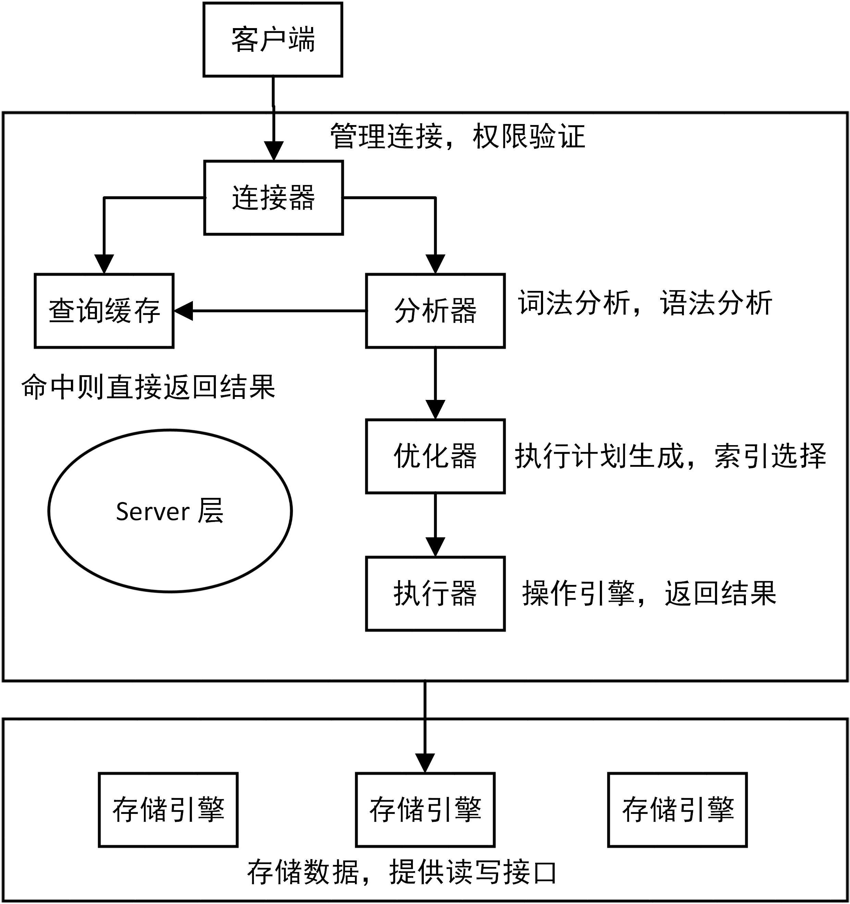
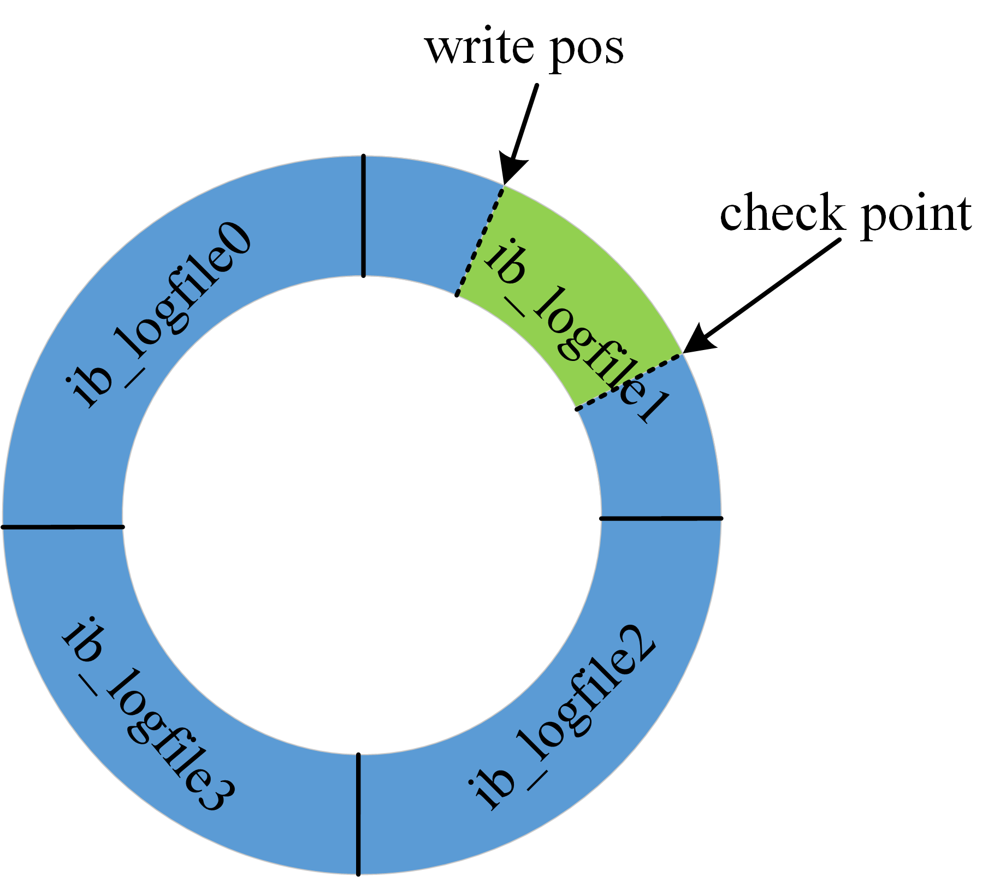
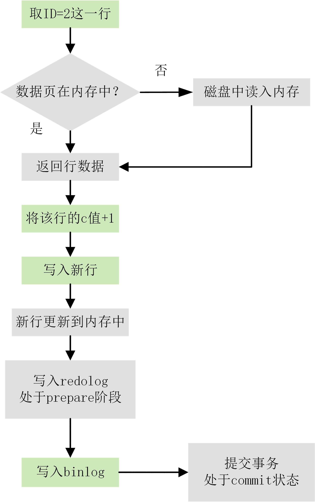
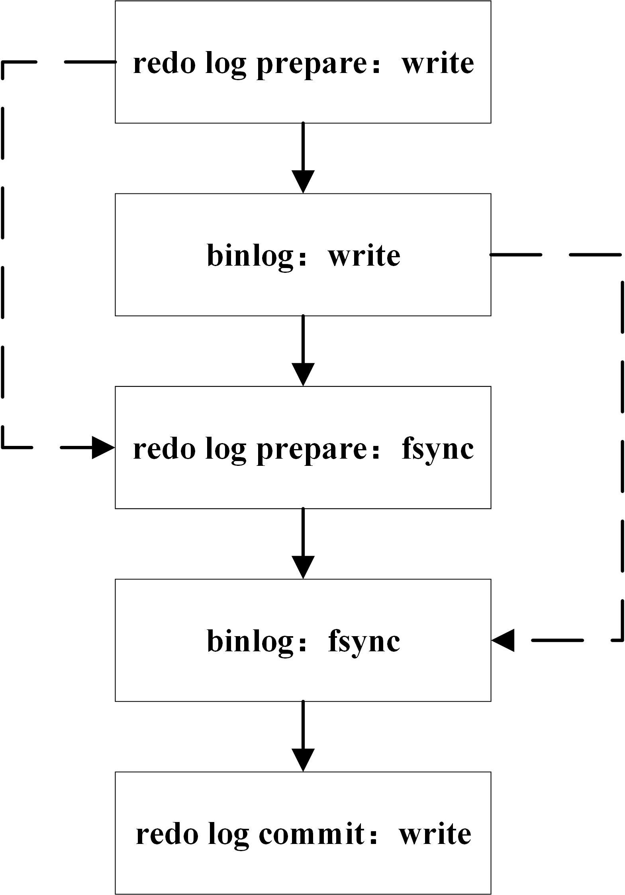
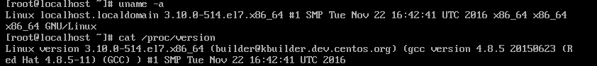
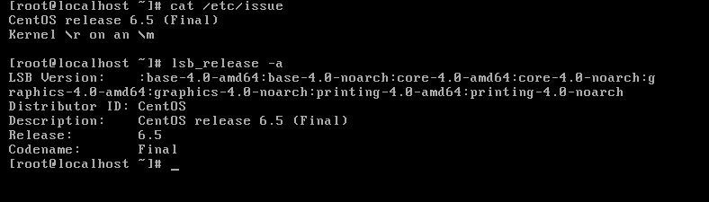

#两阶段提交

>

 出于性能的考虑，事务在提交时为了保证数据安全，需要将 redo 和 undo 数据落盘，不用等待数据落盘。但是 mysql 不仅要考虑 innodn 存储引擎层的 redo 数据，还要考虑数据库上层的 binlog 数据落盘，已经两个层面数据落盘的顺序问题。两阶段提交可以解决单个事务 redo 和 binlog 落盘顺序的问题。

两阶段提交（ 2PC ）分为两个过程：

l  准备阶段（ prepare phase ）ii

生成 xid 信息，回滚段设置为 prepare 状态，并将 redo 落盘。

l  提交阶段（ commit phase ）

在 binlog 生成 commit 的 XID event ， Binlog 落盘，释放回滚段，释放锁。

 

二阶段提交的回滚：
 只写了redo，没落盘binlog，回滚。

落盘了redo，binlog落盘成功了，也有commit XID，自然是成功。

落盘了redo，binlog落盘成功了，没有commit XID，也认为事务已提交。


```mysql
##  就是把 redolog  分为两部分 prepare  和 commit 状态；
##1.prepare 写redo log 
## 2. 写binlog；可以去检查binlog 数据的完整性；
## 3.relog commit;

##保证 binlog  和redo log 数据的一致性！！！
###1. prepare 在写binlog之前crash，那么我们应该做回滚就可以了是不是；
###2. 当commit之前发生了crash ，需要检查binlog的完整性，如果是完整的，那么就提交，不完整，那么就回滚；
###3 commit 之后发生了 crash ，那么直接commit 提交事务就可以了！！！
```


现在再来思考下一个问题，如果每个事物提交的时候，都要去将 redo 和 binlog 落盘，那么瓶颈就在落盘阶段被放大了。这个时候就要引入组提交。组提交使得 redo 和 binlog 落盘的时候可以批量落盘，多个事务的 redo 和 binlog 可以一次 fsync 操作完成数据落盘，减少了 fsync 函数的调用，提高了效率。同时 innodb 存储引擎层本身就支持组提交。

 

组提交之后，引入了另一个问题。数据库上层的 binlog 写入顺序和 innodb 层事务提交顺序无法保持一致。如果不保持一致，那么就会出现通过在线工具比如 xtrabackup 备份数据库搭建主从的时候，出现丢失事务的场景，比如下面：

                        

   binlog 提交顺序（ T1,T2,T3 ）， innodb commit 顺序（ T2,T3,T1 ），此时 innodb 检测到 T3 上下两层都已经提交，认为不再需要恢复，那么 T1 事务在备份的时候没有经历两阶段提交， T1 的事务在备份的时候数据还是事务开始前的数据，从库又不再进行恢复，导致 T1 事务被丢弃。所以后来引进了 prepare_commit_mutex, 以串行的方式来保证顺序，但是这样会使组提交失效，所以后来提出了 BLGC （ binary log group commit ）

该行为分为三个阶段

Flush 阶段

内存中生成事务的二进制日志

Sync 阶段

将内存中多个事务的二进制日志调用 1 次 fsync 刷盘

Commit 阶段

二进制日志在内存中会有一个队列，队列第一个事务是 leader ，其他时 follower ， leader 会根据顺序调用存储引擎层事务提交。 Innodb 本身就支持组提交。


之前我们了解了一条查询语句的执行流程，并介绍了执行过程中涉及的处理模块。一条查询语句的执行过程一般是经过连接器、分析器、优化器、执行器等功能模块，最后到达存储引擎。

那么，一条 SQL 更新语句的执行流程又是怎样的呢？

首先我们创建一个表 user_info，主键为 id，创建语句如下：

```
CREATE TABLE `T` (
`ID` int(11) NOT NULL,
`c` int(11) DEFAULT NULL,
PRIMARY KEY (`ID`)
) ENGINE=InnoDB DEFAULT CHARSET=utf8mb4;
```

插入一条数据：

```
INSERT INTO T VALUES ('2', '1');
```

如果要将 ID=2 这一行的 c 的值加 1，SQL 语句为：

```
UPDATE T SET c = c + 1 WHERE ID = 2;
```

前面介绍过 SQL 语句基本的执行链路，这里把那张图拿过来。因为，更新语句同样会走一遍查询语句走的流程。



1. 通过连接器，客户端与 MySQL 建立连接
2. update 语句会把 T 表上的所有查询缓存结果清空
3. 分析器会通过词法分析和语法分析识别这是一条更新语句
4. 优化器会决定使用 ID 这个索引（聚簇索引）
5. 执行器负责具体执行，找到匹配的一行，然后更新
6. 更新过程中还会涉及 redo log（重做日志）和 binlog（归档日志）的操作

其中，这两种日志默认在数据库的 data 目录下，redo log 是 ib_logfile0 格式的，binlog 是 xxx-bin.000001 格式的。

接下来让我们分别去研究下日志模块中的 redo log 和 binlog。

## 日志模块：redo log

在 MySQL 中，如果每一次的更新操作都需要写进磁盘，然后磁盘也要找到对应的那条记录，然后再更新，整个过程 IO 成本、查找成本都很高。为了解决这个问题，MySQL 的设计者就采用了日志（redo log）来提升更新效率。

而日志和磁盘配合的整个过程，其实就是 MySQL 里的 WAL 技术，WAL 的全称是 Write-Ahead Logging，它的关键点就是先写日志，再写磁盘。

具体来说，当有一条记录需要更新的时候，InnoDB 引擎就会先把记录写到 redo log（redolog buffer）里面，并更新内存（buffer pool），这个时候更新就算完成了。同时，InnoDB 引擎会在适当的时候（如系统空闲时），将这个操作记录更新到磁盘里面（刷脏页）。

redo log 是 InnoDB 存储引擎层的日志，又称重做日志文件，redo log 是循环写的，redo log 不是记录数据页更新之后的状态，而是记录这个页做了什么改动。

redo log 是固定大小的，比如可以配置为一组 4 个文件，每个文件的大小是 1GB，那么日志总共就可以记录 4GB 的操作。从头开始写，写到末尾就又回到开头循环写，如下图所示。



图中展示了一组 4 个文件的 redo log 日志，checkpoint 是当前要擦除的位置，擦除记录前需要先把对应的数据落盘（更新内存页，等待刷脏页）。write pos 到 checkpoint 之间的部分可以用来记录新的操作，如果 write pos 和 checkpoint 相遇，说明 redolog 已满，这个时候数据库停止进行数据库更新语句的执行，转而进行 redo log 日志同步到磁盘中。checkpoint 到 write pos 之间的部分等待落盘（先更新内存页，然后等待刷脏页）。

有了 redo log 日志，那么在数据库进行异常重启的时候，可以根据 redo log 日志进行恢复，也就达到了 crash-safe。

redo log 用于保证 crash-safe 能力。innodb_flush_log_at_trx_commit 这个参数设置成 1 的时候，表示每次事务的 redo log 都直接持久化到磁盘。这个参数建议设置成 1，这样可以保证 MySQL 异常重启之后数据不丢失。

# 日志模块：binlog

MySQL 整体来看，其实就有两块：一块是 Server 层，它主要做的是 MySQL 功能层面的事情；还有一块是引擎层，负责存储相关的具体事宜。redo log 是 InnoDB 引擎特有的日志，而 Server 层也有自己的日志，称为 binlog（归档日志）。

binlog 属于逻辑日志，是以二进制的形式记录的是这个语句的原始逻辑，依靠 binlog 是没有 crash-safe 能力的。

**binlog 有两种模式，statement 格式的话是记 sql 语句，row 格式会记录行的内容，记两条，更新前和更新后都有。**

sync_binlog 这个参数设置成 1 的时候，表示每次事务的 binlog 都持久化到磁盘。这个参数也建议设置成 1，这样可以保证 MySQL 异常重启之后 binlog 不丢失。

为什么会有两份日志呢？

因为最开始 MySQL 里并没有 InnoDB 引擎。MySQL 自带的引擎是 MyISAM，但是 MyISAM 没有 crash-safe 的能力，binlog 日志只能用于归档。而 InnoDB 是另一个公司以插件形式引入 MySQL 的，既然只依靠 binlog 是没有 crash-safe 能力的，所以 InnoDB 使用另外一套日志系统——也就是 redo log 来实现 crash-safe 能力。

redo log 和 binlog 区别：

1. **redo log 是 InnoDB 引擎特有的；binlog 是 MySQL 的 Server 层实现的，所有引擎都可以使用。**
2. **redo log 是物理日志，记录的是在某个数据页上做了什么修改；binlog 是逻辑日志，记录的是这个语句的原始逻辑。**
3. **redo log 是循环写的，空间固定会用完；binlog 是可以追加写入的。追加写是指 binlog 文件写到一定大小后会切换到下一个，并不会覆盖以前的日志。**

有了对这两个日志的概念性理解后，再来看执行器和 InnoDB 引擎在执行这个 update 语句时的内部流程。

1. 执行器先找引擎取 ID=2 这一行。ID 是主键，引擎直接用树搜索找到这一行。如果 ID=2 这一行所在的数据页本来就在内存中，就直接返回给执行器；否则，需要先从磁盘读入内存，然后再返回。
2. 执行器拿到引擎给的行数据，把这个值加上 1，比如原来是 N，现在就是 N+1，得到新的一行数据，再调用引擎接口写入这行新数据。
3. 引擎将这行新数据更新到内存（InnoDB Buffer Pool）中，同时将这个更新操作记录到 redo log 里面，此时 redo log 处于 prepare 状态。然后告知执行器执行完成了，随时可以提交事务。
4. 执行器生成这个操作的 binlog，并把 binlog 写入磁盘。
5. 执行器调用引擎的提交事务接口，引擎把刚刚写入的 redo log 改成提交（commit）状态，更新完成。

下图为 update 语句的执行流程图，图中灰色框表示是在 InnoDB 内部执行的，绿色框表示是在执行器中执行的。



其中将 redo log 的写入拆成了两个步骤：prepare 和 commit，这就是两阶段提交（2PC）。

# 两阶段提交（2PC）

MySQL 使用两阶段提交主要解决 binlog 和 redo log 的数据一致性的问题。

redo log 和 binlog 都可以用于表示事务的提交状态，而两阶段提交就是让这两个状态保持逻辑上的一致。下图为 MySQL 二阶段提交简图：



**两阶段提交原理描述:**

1. **InnoDB redo log 写盘，InnoDB 事务进入 prepare 状态。**
2. **如果前面 prepare 成功，binlog 写盘，那么再继续将事务日志持久化到 binlog，如果持久化成功，那么 InnoDB 事务则进入 commit 状态(在 redo log 里面写一个 commit 记录)**

**备注: 每个事务 binlog 的末尾，会记录一个 XID event，标志着事务是否提交成功，也就是说，recovery 过程中，binlog 最后一个 XID event 之后的内容都应该被 purge。**

# **日志相关问题**

## 怎么进行数据恢复？

binlog 会记录所有的逻辑操作，并且是采用追加写的形式。当需要恢复到指定的某一秒时，比如今天下午二点发现中午十二点有一次误删表，需要找回数据，那你可以这么做：

- 首先，找到最近的一次全量备份，从这个备份恢复到临时库
- 然后，从备份的时间点开始，将备份的 binlog 依次取出来，重放到中午误删表之前的那个时刻。

这样你的临时库就跟误删之前的线上库一样了，然后你可以把表数据从临时库取出来，按需要恢复到线上库去。

## redo log 和 binlog 是怎么关联起来的?

**redo log 和 binlog 有一个共同的数据字段，叫 XID。崩溃恢复的时候，会按顺序扫描 redo log：**

- **如果碰到既有 prepare、又有 commit 的 redo log，就直接提交；**
- **如果碰到只有 parepare、而没有 commit 的 redo log，就拿着 XID 去 binlog 找对应的事务。**
-  **binlog_format                                  | ROW**

## MySQL 怎么知道 binlog 是完整的?

**一个事务的 binlog 是有完整格式的：**

- **statement 格式的 binlog，最后会有 COMMIT**
- **row 格式的 binlog，最后会有一个 XID event**

**在 MySQL 5.6.2 版本以后，还引入了 binlog-checksum 参数，用来验证 binlog 内容的正确性。对于 binlog 日志由于磁盘原因，可能会在日志中间出错的情况，MySQL 可以通过校验 checksum 的结果来发现。所以，MySQL 是有办法验证事务 binlog 的完整性的。**


**binLog日志是归档日志，逻辑日志。以二进制的形式记录语句的原始逻辑。**
**有两种模式，statement 格式的话是记 sql 语句，row 格式会记录行的内容，记两条，更新前和更新后都有。**


show variables like 'log_bin%'

show variables like 'binlog_%'


## redo log 一般设置多大？

redo log 太小的话，会导致很快就被写满，然后不得不强行刷 redo log，这样 WAL 机制的能力就发挥不出来了。

如果是几个 TB 的磁盘的话，直接将 redo log 设置为 4 个文件，每个文件 1GB。

## 数据写入后的最终落盘，是从 redo log 更新过来的还是从 buffer pool 更新过来的呢？

实际上，redo log 并没有记录数据页的完整数据，所以它并没有能力自己去更新磁盘数据页，也就不存在由 redo log 更新过去数据最终落盘的情况。

1. 数据页被修改以后，跟磁盘的数据页不一致，称为脏页。最终数据落盘，就是把内存中的数据页写盘。这个过程与 redo log 毫无关系。
2. 在崩溃恢复场景中，InnoDB 如果判断到一个数据页可能在崩溃恢复的时候丢失了更新，就会将它读到内存，然后让 redo log 更新内存内容。更新完成后，内存页变成脏页，就回到了第一种情况的状态。

## redo log buffer 是什么？是先修改内存，还是先写 redo log 文件？

在一个事务的更新过程中，日志是要写多次的。比如下面这个事务：

```
begin;
INSERT INTO T1 VALUES ('1', '1');
INSERT INTO T2 VALUES ('1', '1');
commit;
```

这个事务要往两个表中插入记录，插入数据的过程中，生成的日志都得先保存起来，但又不能在还没 commit 的时候就直接写到 redo log 文件里。

因此就需要 redo log buffer 出场了，它就是一块内存，用来先存 redo 日志的。也就是说，在执行第一个 insert 的时候，数据的内存被修改了，redo log buffer 也写入了日志。

但是，真正把日志写到 redo log 文件，是在执行 commit 语句的时候做的。

以下是我截取的部分 redo log buffer 的源代码：

```
/** redo log buffer */
struct log_t{
char		pad1[CACHE_LINE_SIZE];
lsn_t		lsn;
ulint		buf_free;   // buffer 内剩余空间的起始点的 offset
#ifndef UNIV_HOTBACKUP
char		pad2[CACHE_LINE_SIZE];
LogSysMutex	mutex;
LogSysMutex	write_mutex;
char		pad3[CACHE_LINE_SIZE];
FlushOrderMutex	log_flush_order_mutex;
#endif /* !UNIV_HOTBACKUP */
byte*		buf_ptr;    // 隐性的 buffer
byte*		buf;        // 真正操作的 buffer
bool		first_in_use;
ulint		buf_size;   // buffer大小
bool		check_flush_or_checkpoint;
UT_LIST_BASE_NODE_T(log_group_t) log_groups;

#ifndef UNIV_HOTBACKUP
/** The fields involved in the log buffer flush @{ */
ulint		buf_next_to_write;
volatile bool	is_extending;
lsn_t		write_lsn;	/*!< last written lsn */
lsn_t		current_flush_lsn;
lsn_t		flushed_to_disk_lsn;
ulint		n_pending_flushes;
os_event_t	flush_event;
ulint		n_log_ios;
ulint		n_log_ios_old;
time_t		last_printout_time;

/** Fields involved in checkpoints @{ */
lsn_t		log_group_capacity;
lsn_t		max_modified_age_async;
lsn_t		max_modified_age_sync;
lsn_t		max_checkpoint_age_async;
lsn_t		max_checkpoint_age;
ib_uint64_t	next_checkpoint_no;
lsn_t		last_checkpoint_lsn;
lsn_t		next_checkpoint_lsn;
mtr_buf_t*	append_on_checkpoint;
ulint		n_pending_checkpoint_writes;
rw_lock_t	checkpoint_lock;
#endif /* !UNIV_HOTBACKUP */
byte*		checkpoint_buf_ptr;
byte*		checkpoint_buf;
/* @} */
};
```

redo log buffer 本质上只是一个 byte 数组，但是为了维护这个 buffer 还需要设置很多其他的 meta data，这些 meta data 全部封装在 log_t 结构体中。

# 总结

这篇文章主要介绍了 MySQL 里面最重要的两个日志，即物理日志 redo log（重做日志）和逻辑日志 binlog（归档日志），还讲解了有与日志相关的一些问题。

另外还介绍了与 MySQL 日志系统密切相关的两阶段提交（2PC），两阶段提交是解决分布式系统的一致性问题常用的一个方案，类似的还有 三阶段提交（3PC） 和 PAXOS 算法。


root@56cc17e95d92:/# **uname -a**
Linux 56cc17e95d92 4.9.60-linuxkit-aufs #1 SMP Mon Nov 6 16:00:12 UTC 2017 x86_64 GNU/Linux
root@56cc17e95d92:/# apt-get install cat /e
entrypoint.sh  etc/
root@56cc17e95d92:/# vim /etc/
bash: vim: command not found
root@56cc17e95d92:/# cd /proc/
root@56cc17e95d92:/proc# ls
1          crypto       ioports      locks         scsi           tty
193        devices      irq          meminfo       self           uptime
203        diskstats    kallsyms     misc          slabinfo       version
acpi       dma          kcore        modules       softirqs       vmallocinfo
buddyinfo  driver       key-users    mounts        stat           vmstat
bus        execdomains  keys         mpt           swaps          zoneinfo
cgroups    fb           kmsg         mtrr          sys
cmdline    filesystems  kpagecgroup  net           sysrq-trigger
config.gz  fs           kpagecount   pagetypeinfo  sysvipc
consoles   interrupts   kpageflags   partitions    thread-self
cpuinfo    iomem        loadavg      sched_debug   timer_list

**发行版本 和内核** 

**root@56cc17e95d92:/proc# cat /etc/os-release**
PRETTY_NAME="Debian GNU/Linux 10 (buster)"
NAME="Debian GNU/Linux"
VERSION_ID="10"
VERSION="10 (buster)"
VERSION_CODENAME=buster
ID=debian
HOME_URL="https://www.debian.org/"
SUPPORT_URL="https://www.debian.org/support"
BUG_REPORT_URL="https://bugs.debian.org/"


## [linux 内核版本和发行版本区别](https://www.cnblogs.com/wxxjianchi/p/9424854.html)

**内核版本：我的理解是，内核是系统的心脏，是linux中最基层的代码。**版本号如 Linux version 3.10.0-514.el7.x86_64

　　查看内核版本可使用。uname -a 或者cat /proc/version

　　　　

**发行版本：在内核的基础上，开发不同应用程序，组成的一个完整的操作系统。目前估计各种发行版本有数十种，比如Centos Linux release 7.3.1611 (Core).**

　　查看发行版本可使用 cat /etc/issue ；lsb_release -a；cat /etc/redhat-release;

　　　　

　　　　