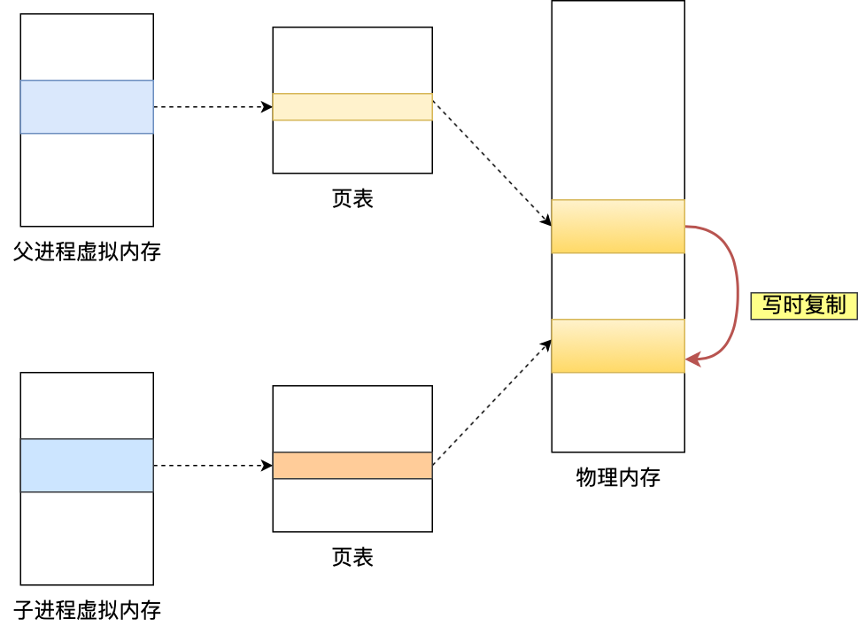

# Redis 持久化

> **RDB和AOF**

两种持久化技术：

---


RDB和AOF；

**默认开启RDB快照；Redis重启的时候，之前缓存的数据会被重新加载；**

````php
# 全量备份；
# 可以配置 让redis 每隔一段时间执行一下bgsave；
# 存储的是二进制格式的数据，文件比较下，来做数据恢复的时候比较快 ；
# 配置如下：
#900s内做了至少修改一次，300s内做至少修改一次，60s内至少10000次修改；
save 900 1
save 300 10
save 60 10000
#bgsave  会创建一个线程 去执行，并不会阻塞到当前的主进程；
````


### AOF 

**aof的优点：故障情况下丢失的数据会比RDB少；只有秒级的数据丢失**

`````php
#redis启动的时候，优先从aof里面恢复数据复杂，会通过rdb恢复；
#aof就是一种命令追加的方式；是一个增量备份；
#存储的是执行的命令；
# 但是会存在文件过大的问题，可以使用rewriteaof来减小aof文件的大小！！！压缩文件的大小！！！
`````

注意 AOF罗盘策略；

但是always同步策略，每执行一个命令都要去落盘的话，性能会产生损耗；所以一般都是配置每秒写入。这样对性能的影响不是很大；

----


<font color=red>**Redis是先执行写操作命令后，然后才将命令写入到AOF日志；**</font>


* 避免额外的检查开销，**命令执行没有错误才写盘；**
* 不会阻塞当前写操作的执行；但是会阻塞下一个命令；


当然当还没有来得及写盘的时候服务器宕机了，这个数据还是会有丢失的风险；

````mysql
# 因为mysql每一个事务，在commmit的时候 ，就会做到了持久化？？
````


----


**注意将命令写入日志，这个操作是由主进程来执行的，也就是说会阻塞到下一个命令；**

**如果在将日志内容写入到硬盘时，服务器的硬盘的 I/O 压力太大，就会导致写硬盘的速度很慢，进而阻塞住了，也就会导致后续的命令无法执行**


在 Redis 中 AOF 持久化功能默认是不开启的，需要我们修改 `redis.conf` 配置文件中的以下参数：


----


Q:

为什么需要aof_buf，而不是直接写磁盘？

A:

**直接写磁盘导致性能完全取决于磁盘负载。先写入缓冲区的话，我们可以根据实际需求调整缓冲区同步硬盘的策略，在性能和安全方面做出平衡。**

---


**三种同步策略：**fsync 

tips

**· 系统\**write\**操作**

write操作在写入系统缓冲区后直接返回，同步硬盘操作依赖于操作系统调度机制。

**· 系统\**fsync\**操作**

fsync操作针对单个文件操作（例如AOF文件）做强制硬盘同步。fsync将阻塞直到写入硬盘完成后返回，确保数据持久化。

| **可配置值** | **说明**                                                     |
| ------------ | ------------------------------------------------------------ |
| always       | 每次命令写入aof_buf都会调用系统fsync同步                     |
| **everysec** | **写入aof_buf后调用系统write。由专门线程负责每秒调用fsync**  |
| no           | 写入aof_buf后调用系统write，不进行fysnc。由操作系统自行控制fsync |


**缺点：恢复数据慢，需要逐条命令去执行 ；**


----


####**AOF重写**

**如果当 AOF 日志文件过大就会带来性能问题，比如重启 Redis 后，需要读 AOF 文件的内容以恢复数据，如果文件过大，整个恢复的过程就会很慢。**

使用的方法：

**AOF 重写机制是在重写时，读取当前数据库中的所有键值对，然后将每一个键值对用一条命令记录到「新的 AOF 文件」，等到全部记录完后，就将新的 AOF 文件替换掉现有的 AOF 文件。** 

因为**如果 AOF 重写过程中失败了，现有的 AOF 文件就会造成污染**，可能无法用于恢复使用。

所以 AOF 重写过程，先重写到新的 AOF 文件，重写失败的话，就直接删除这个文件就好，不会对现有的 AOF 文件造成影响。


##**bgrewriteaof**  重写AOF；


当aof文件过大需要使用到重写去处理aof文件；

----


### RDB

是把当前进程所有数据生成快照保存到硬盘的过程 ；

这里提一点，Redis 的快照是**全量快照**，**也就是说每次执行快照，都是把内存中的「所有数据」都记录到磁盘中。**

可以使用bgsave命令，来创建子进程来执行；

阻塞只发生在阻塞阶段；

优点：

**RDB是一个二进制文件；占用空间比较小；恢复速度比较快；**

**恢复速度块，远快于AOF，直接取到内存就可以了；**


缺点：

全量备份不能一直备份，不能每时每刻都生成，没办法做到持久化；

save 900 1
save 300 10
save 60 10000


- 900 秒之内，对数据库进行了至少 1 次修改；
- 300 秒之内，对数据库进行了至少 10 次修改；
- 60 秒之内，对数据库进行了至少 10000 次修改。


---


### fork阻塞问题

Q 内存数据太多为什么会阻塞？

A 因为内存数据太多主进程页表太大，copy时间太久，会阻塞到主进程；

Q为什么大key也会阻塞主进程？

​	当主进程的数据发生修改的时候，修改的那部分数据会发生cow（写时复制），所以某个key太多也会阻塞到主进程；


**因为fork的时候子进程会copy主进程的页表；但是页表还是指向同一个物理内存；**




当主进程或者父进程，发生内存数据修改的时候，物理内存才会被复制一份；


**这样的目的是为了减少创建子进程时的性能损耗，从而加快创建子进程的速度，毕竟创建子进程的过程中，是会阻塞主线程的。**


**所以，创建 bgsave 子进程后，由于共享父进程的所有内存数据，于是就可以直接读取主线程里的内存数据，并将数据写入到 RDB 文件。**  **因为是同一份页面，所以可以共享物理内存数据，所以子进程可以直接读取主线程的内存数据；**


当主线程对这些共享的内存数据也都是只读操作，那么，主线程和 bgsave 子进程相互不影响。
