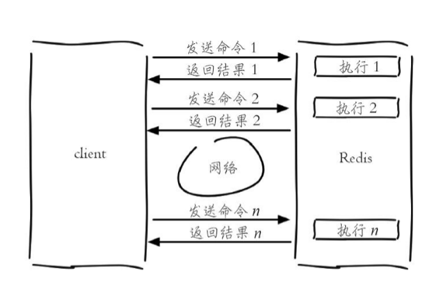
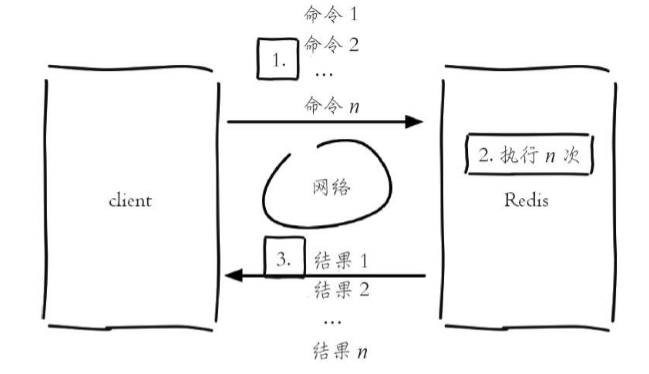
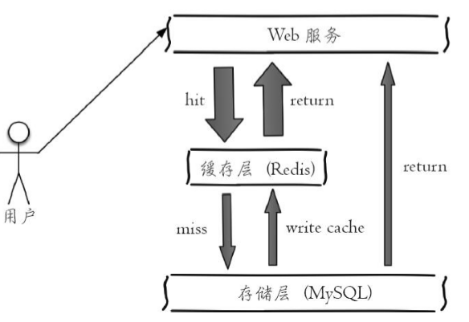
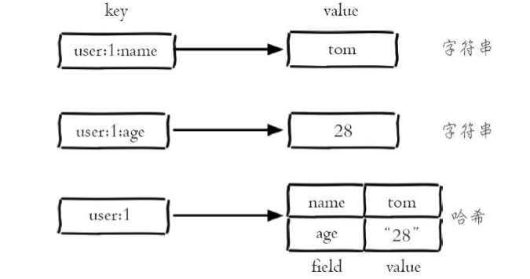
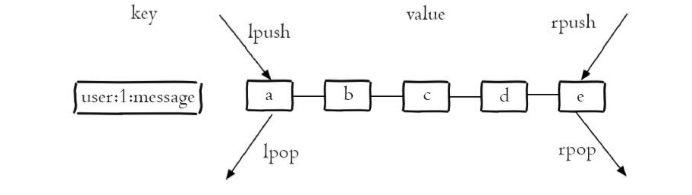
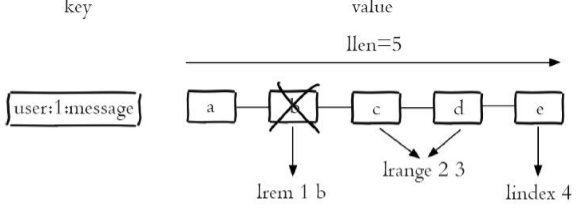
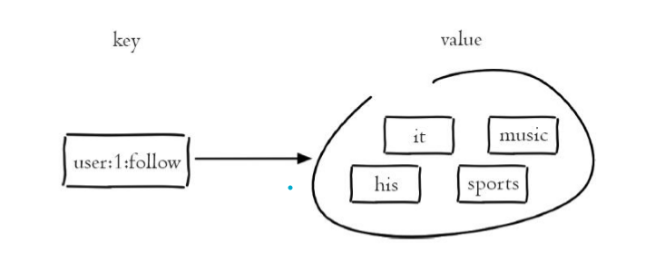
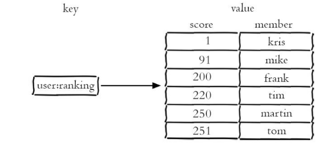

# Redis那点儿事--基础操作

---

redis的基本命令操作和一些基础底层概念，万字长文，感觉还不错，点个赞呗，有什么不懂的或者问题，可以留言;

## Redis的几种特性

#### 速度快 (官方给出的数据是读写性能可以达到10万/秒)

为什么速度快？

1. Redis的所有数据都放在内存中;
2. Redis是C语言实现的；
3. Redis是单线程的，**预防了多线程可能存在的竞争问题**；**没有上下文的切换；**
4. epoll IO模型；

#### 基于键值对的数据结构

Redis提供了五种数据结构 ：字符串（String），哈希（Hsah），列表（List），集合（Set）,有序集合（Zset);

#### 持久化

RDB和AOF把Redis的数据持久化到磁盘；

#### 主从复制

Redis 提供好了复制功能，实现了多个相同数据的Redis副本，复制功能是分布式Redis的基础；

#### 客户端语言多

支持Redis的客户端语言很多 ，几乎涵盖了所有的主流语言,例如:C,java,php,phthoy,C++;

#### 丰富的功能

#### 简单稳定

#### 高可用和分布式


# Redis的安装

事件是检验真理的唯一路径；

源码安装：

~~~~
$ wget http://download.redis.io/releases/redis-3.0.7.tar.gz 
$ tar xzf redis-3.0.7.tar.gz 
$ ln -s redis-3.0.7 redis 
$ cd redis 
$ make 
$ make instal
//查看是否安装成功 查看redis的版本
$redis-cli -v  
~~~~

#### Redis配置  启动 操作 关闭Redis

Redis 安装成功之后，在src和/usr/local/bin目录下多了几个以redis开头的执行文件，我们称之为shell Redis；

|     可执行文件      |               作用                |
| :-----------------: | :-------------------------------: |
|  **redis-server**   |           **启动Redis**           |
|    **redis-cli**    |        **Redis命令客户端**        |
|   redis-benchmark   |         Redis基准测试工具         |
| **redis-check-aof** | Redis AOF持久化文件检测和修复工具 |
|   redis-check-rdb   | Redis RDB持久化文件检测和修复工具 |
|   redis-sentinel    |        启动Redis Sentinel         |

1. **启动Redis**

​	有三种启动方式：默认配置，运行配置，配置文件启动。

**默认配置**: 

```
redis-server    //6379 默认配置(这里是redis默认参数配置，不会去读conf文件，要想读取配置文件，需要用配置启动) 直接启动无法自定义配置，所以这种方式是不会在生产环境中使用;
```

**运行配置**: 要加上要修改的配置名和值（可以是多对），没有设置的配置使用默认配置；

````
//一般是这个形式
redis-server --key1 value1 --key2 value2
````

```
redis-server --port 6380
```

虽然运行配置可以自定义配置，但是如果修改配置较多，或者希望保存到文件中去，便于查看配置，最好是使用配置文件启动；

**配置文件启动**：将配置指定到文件中去；

```shell
redis-server /etc/redis.conf
```

​	几个重要配置：

| 配置名              | 配置说明                                |
| ------------------- | --------------------------------------- |
| port                | 端口                                    |
| logfile             | 日志文件                                |
| dir                 | Redis工作目录(存放持久化文件和日志文件) |
| daemonize(守护进程) | 是否以守护进程的方式启动Redis           |


2. **Redis的操作**

* redis 命令客户端 redis-cli，redis-cli有两种方式链接Redis服务器；

  * 交互方式 redis-cli -h {host} -p {port}  交互方式实现，不需要再执行redis-cli了；

    ~~~
    root@7a850e76e1a0:/etc# redis-cli -h 127.0.0.1 -p 6380
    127.0.0.1:6380> set redisport 6380
    OK
    127.0.0.1:6380> exit
    redis-cli -p 6380 
    ~~~
  
* 命令方式 redis-cli -h {host} -p{port} {command}  可以直接得到结果，不需要交互；
  
    ~~~
    root@7a850e76e1a0:/etc# redis-cli -h 127.0.0.1 -p 6380 get redisport
    "6380"
  ~~~
  
    **注意：**redis-cli 就是默认连接-h 127.0.0.1，-p 6379；

3.停止Redis服务

Redis 提供了shutdown命令来停止Redis服务；（就是优雅的安全的关闭Redis这个进程，kill -9 不但不会持久化，又可能会导致数据的丢失）

~~~php
#停掉127.0.0.1上6379端口上的Redis服务
redis-cli shutdown  
redis-cli -h 127.0.0.1 -p 6380 (docker中相当于关闭一个容器)(docker中容器就是一个进程)
~~~

~~~php
 # User requested shutdown...    ######redis.log 
5 * Calling fsync() on the AOF file.
 * Saving the final RDB snapshot before exiting.   #### 会进行持久化RDB shutdown
 * DB saved on disk
 * Removing the pid file.
 # Redis is now ready to exit, bye bye...
~~~

shutdown 还有一个参数，代表的是在关闭Redis之前是否生成 持久化文件；

~~~
redis-cli shutdown nosave/save 
~~~

	#### Redis的重大版本

​	借鉴了linux的命名规则，版本号的第二位如果是奇数，则为非稳定版本（例如：2.7,2.9,3.1),如果是偶数那么是稳定版本(2.6,2.8,3.0)，线上环境都是稳定版本；

# API的理解和使用

主要介绍一下，Redis的一些**全局命令**，**数据结构和内部编码**，**单线程命令处理机制**是十分有必要的；

#### 全局命令

---

Redis数据结构是以键值对的形式保存，下面是一些关于**键的命令**；

| 名称             | 命令                   | 效果                                                         |
| ---------------- | ---------------------- | ------------------------------------------------------------ |
| 查看所有键       | keys  *                | 所有的键输出                                                 |
| 键总数           | dbsize                 | 当前数据库的键的总数                                         |
| 键是否存在       | exists key             | 检查键是否存在                                               |
| 删除键           | del key [key . . .]    | 删除一个键 批量删除键 ,删除成功现实个数，删除不存在的key返回0； |
| 键过期           | **expire key seconds** | 大于等于0:剩余的过期时间，等于-1:键没设置过期时间，等于-2:键不存在； |
| 键的数据类型结构 | **type key**           | 键不存在返回none; 剩下的就是那五种数据结构 string hash list set zset |

**注意:**dbsize计算键总数不会遍历所有的剑，获取的是Redis的内置变量，所以dbsize命令的时间复杂度是O(1),**key * 需要遍历所有的键，所以时间复杂度是O(n),所以线上环境保存大量键，key * 是被禁止使用的；**

#### **数据结构和内部编码**

---

string，list，hash，set，zset仅仅是对外的数据结构；

每种数据结构都有自己底层的内存编码实现，而且这种实现，这样Redis会在不同的场合选择合适的内部编码；

例如:list数据结构会包括 **linkedlist和ziplist，quicklist**两种内部编码；

可以用命令 **object encoding key** 来查询内部编码；

~~~	
127.0.0.1:6380> object encoding mylist
"quicklist"
~~~

* 这样的优点是可以改进内存编码，而对外部的数据结构没有什么影响；**例如 3.2提供的quicklist**

* 内部多种编码会在不同的场景发挥各自的优势；

#### 单线程架构 

---

Redis使用单线程和I/O多路复用模型来实现高性能的内存数据服务；

**为什么Redis单线程性能这么高？？？这个是重点知识**   

因为Redis是单线程来处理命令的，所以每一条命令到达服务端都不会立即被执行，所以的命令都会进入到一个队列中，然后逐个操作；

执行顺序未知，但是任意的两个命令不能同时执行；

**Redis的命令执行不会存在并发的问题；**

为什么Redis的单线程可以达到每秒万级别的处理能力？

1. Redis 是对于内存的数据操作，是nm级别的操作；

2. 非阻塞I/O，用epoll来实现多路复用；

3. 单线程没有线程的上下文切换和竞争(锁的竞争)的消耗

4. 很多数据结构，key到value的哈希数据结构，value 有很多数据结构！！

    

注意：对呀服务端来说，锁和线程切换，通常是性能杀手；

**Redis的存在的问题?**

因为Redis是单线程的，如果**命令的执行时间过长**就会导致命令的阻塞，所以Redis面向的是**快速执行**的场景；

#### 字符串(String)

---

Redis的基础数据结构之一，字符串类型可以是：**简单的字符串，复杂的字符串（JSON,XML），数字（整数，小数），二进制（图片和音频，视频）**，但是最大不能超过**512M**；

#### 命令

---

* **常用命令**

  ---

  
  
  1. **设置值**

  ~~~
  set key value [ex seconds] [px milliseconds] [nx|xx]
  ~~~
  
  * ex seconds :为键设置秒级的过期时间
  * px milliseconds: 为键设置毫秒级别的过期时间；
  * nx:键必须不存在，才能设置成功，用于添加; 当存在则为nil； not exists ；
  * xx: 键必须是不存在，才能设置成功，用于更新；
  
  ~~~php
  setex key seconds value    //设置key的秒级别的过期时间
  setnx key value           //当key不存在的时候才能设置成功
  ~~~
  
  **注意:**以setnx命令为例子，由于**redis是单线程命令处理机制**，如果多个客户端请求，只有一个客户端可以设置成功；
  
  **分布式锁的实现；     **   **就是用setnx**
 2. **获取值**

   ~~~php
   get key
   get not_exists_key //nil返回空
   ~~~
   
3. **批量设置值**  

   ```
   mset key value [key value ....]	
   ```

   ~~~
   127.0.0.1:6380> mset a php b java c c++ d go
   OK
   ~~~

4. 批量获取

   ~~~
   mget key [key ...]
   ~~~

   ~~~
   127.0.0.1:6380> mget a b c d e
   1) "php"
   2) "java"
   3) "c++"
   4) "go"
   5) (nil)
   ~~~

   key不存在的时候是nil；

   批量操作命令可以提高开发效率；

   n次get的示意图：经过了n次网络，Redis服务器执行了n次命令；

   

   一次mget的示意图：mget，经历了1次网络，Redis对mget命令进行拆分，执行了n次命令；

   

   虽然Redis可以支持每秒数万的读写操作，但是这个仅仅是指的是Redis服务器的处理能力，对于客户端来说，一次命令出了命令时间，还有网络时间，假如网络延迟是1ms,命令时间是0.1ms(每秒1万条命令处理)那么性能对比如下：

   |   命令    |             时间              |
   | :-------: | :---------------------------: |
   | 1000次get | 1000x1+1000x0.1=1100ms = 1.1s |
   |  1次mget  | 1x1+1000x0.1 = 101ms = 0.101s |

   **注意：批量操作可以提高效率，但是注意Redis面向的是快速执行场景，如果执行命令时间过长，会产生Redis阻塞；**

5. 计数 （increase decrease） **原子操作；**

   ~~~php
   incr key  //对值做自增操作  原子操作；
   ~~~

   * key是整数，返回自增结果；
   
   * key不是整数，返回错误；
   
   * key不存在，按照0开始自增，返回结果是1；
   
    ~~~
   127.0.0.1:6380> get hello
   "helloword"
   127.0.0.1:6380> incr hello
   (error) ERR value is not an integer or out of range
   127.0.0.1:6380> exists py
   (integer) 0
   127.0.0.1:6380> incr py
   (integer) 1
    ~~~
   
   ~~~php
   decr key  //自减操作  原子操作
   decrby key decrement //自减指定数字
   incrby key increment //自增指定数字
   incrbyfloat key increment //自增浮点数
   ~~~
   
   注意：很多存储系统和编程语言内部使用**CAS（compare and swap）机制**实现计数功能，会有cpu的开销，Redis不存在这个问题，**因为Redis是单线程的，命令顺序执行；**

* **不常用命令**

  ---

  1. **追加值**

     ~~~php
     append key value //向尾部追求值
     ~~~

     ~~~
     127.0.0.1:6380> get hello
     "helloword"
     127.0.0.1:6380> append hello php
     (integer) 12
     127.0.0.1:6380> get hello
     "hellowordphp"
     ~~~
  
  2. **字符串的长度**
  
     ~~~php
     strlen key  //返回字符串的长度  一个汉字占三个字节
     ~~~
  
     ~~~
     127.0.0.1:6380> get hello
     "hellowordphp"
     127.0.0.1:6380> strlen hello
     (integer) 12
     127.0.0.1:6380> set nihao 中国
     OK
     127.0.0.1:6380> strlen nihao
     (integer) 6
     ~~~
     
  3. **设置并返回原值**
  
     ~~~
     getset key value  //设置key value 但是会返回原先的值
     ~~~
  
     ~~~
     #区分一下 getset 和  set
     127.0.0.1:6380> getset chain fruit
     (nil)
     127.0.0.1:6380> get chain apple
     127.0.0.1:6380> getset chain apple
     "fruit"
     127.0.0.1:6380> get chain
     "apple"
     127.0.0.1:6380> set chain banana
     OK
     127.0.0.1:6380> get chain
     "banana"
     ~~~
  
  4. **设置指定位置的字符**
  
     ~~~php
     setrange key offset value   //offset 偏移量 从0 - （strlen-1） change     >strlen add
     ~~~
  
     ~~~
     127.0.0.1:6380> set redis pest
     OK
     127.0.0.1:6380> setrange redis 0 b
     (integer) 4
     127.0.0.1:6380> get redis
     "best"
     127.0.0.1:6380> setrange redis 4 e
     (integer) 5
     127.0.0.1:6380> get redis
     "beste"
     ~~~
  
  5. **获取部分字符串**
  
     ~~~php
     getrange key start end  //start 和 end 分别是开始和结束的偏移量;
     ~~~
  
     ~~~
     127.0.0.1:6380> getrange redis 0 1
     "be"
     127.0.0.1:6380> getrange redis 0 -1   #输出全部字符
     "beste"
     ~~~
  
  
  
  ​      上面所有命令的时间复杂度问题，就写几个需要注意的：
  
  ​        **批量处理命令：**
  
  ​	
  
  | 命令                           | 时间复杂度                                                   |
  | ------------------------------ | ------------------------------------------------------------ |
  | del key [key . . . . ]         | O(k),k代表删除键的个数                                       |
  | mset key value [key value ...] | O(k),k代表设置键的个数                                       |
  | mget key [key .....]           | O(k),k代表获取键的个数                                       |
  | getrange key start end         | O(n)n是字符串的长度，由于获取字符串非常快，所以如果字符串不是很长，可视作O(1) |
  
  **注意：因为Redis的单线程，操作时候注意 k的值不能太大，不然会导致Redis的命令阻塞；**

#### 内部编码

---

三种内部编码:

* int : 8个字节的长整型；（-2^64 - 2^64-1）

* embstr : 小于等于39个字节的字符串；

* raw : 大于39个字节的字符串；

  Redis会根据当前值的类型和长度决定来使用那种内部编码；

~~~
127.0.0.1:6380> set key 7897987
OK
127.0.0.1:6380> object encoding key
"int"
127.0.0.1:6380> set key "hellw word"
OK
127.0.0.1:6380> object encoding key
"embstr"
127.0.0.1:6380> set key "aaaaaaaaaaaaaaaaaaaaaaaaaaaaaaaaaaaaaaaaaaaaaaaaaaaaaaaaaaaaaaaaaaaaaaaaaaaaaaaaaaaaaaaaaaaaaaaaaaa"
OK
127.0.0.1:6380> object encoding key
"raw"
~~~


#### 经典使用场景 

---

1. **缓存功能**

   Redis作为缓存层，MySQL作为存储层；由于Redis具有**支持高并发的特性**，所以缓存通常能起到**加速读写**和**降低后端压力**的作用；

   ​	

   ​	当有请求的时候先请求Redis，缓存hit(缓存命中)，则直接return数据给web服务端，当缓存miss就去访问MySQL，write cache到Redis，并且返回数据到web服务端；

   ~~~php
   //伪代码
   $key = "cache:user:".$uid;
   if(isexists $key != null){
   	return get $key;
   }
   $mysqlData = mysql->get($key);
   if(!empty($mysqlData)){
   	set $key $mysqlData ex 3000; //setnx $key 3000 $MysqlData
   }
   return $mysqlData;
   ~~~

   

 2. **计数**    

      就是利用Redis的单线程，来实现计数，使用命令incr key；
   
  3. **共享Session**
   
      分布式服务器中存在的问题，当使用负载均衡的时候，有可能会因为均衡会发送请求到不同的服务器，那么就会出现用户退出的问题，这个地方可以使用Redis对用户的登录数据来进行统一管理；当然也可以使用ip_hash来解决每次访问的都不是同一个服务器的问题；

4. **限速** （限制一个请求在某一定时间内的请求次数，防止被频繁请求）

    本书的例子是：一分钟内如果请求次数超过5次那么就要被限制速度；
    
    ~~~php
    //伪代码
    $key = "message:limit:".$phone; 
    $isExists = set key value ex 60 nx; //已经存在还去set 返回的是nil
    if($isExists != null || $key <= 5){
        //不限速
    }else{//$isExists = null && $key>5 那么就限速 一分钟之内请求5次
        //限速
    }   
    ~~~


#### 哈希 (Hash)

---

Redis中哈希类型是指**键值本身又是键值对结构**，类似 value = {{field1，value1},...{fieldN，valueN}};

String和Hash的比较：Hash类型的映射关系叫做**field-value**，注意这里的value是field对应的值；String是**key-value**；

**Hash命令的作用域是field,String命令的做用域是key；**

​	


#### 命令

---

1. **设置值**

   ~~~mysql
   hset key field value
   ~~~

   ~~~mysql
   127.0.0.1:6380> hset user:1 name qq
   (integer) 1
   
   ~~~

   **成功返回1 ，失败返回0**，hsetnx 和set，setnx，差不多一样，仅仅是**作用域由key变成了field**；

2. 获取值

   ~~~
   hget key field
   ~~~

   ~~~
   127.0.0.1:6380> hget user:1 name
   "qq"
   127.0.0.1:6380> hget user:2 age
   (nil)
   ~~~

   **不存是nil；**

3. 删除field

   ~~~
   hdel key field [field .....]
   ~~~

   删除某一个key中一个或者多个field，返回**成功删除的个数**；

   ~~~
   127.0.0.1:6380> hdel user:1 age name
   (integer) 2
   ~~~

4.  获取 field的个数

   ~~~
   hlen key
   ~~~

   ~~~
   127.0.0.1:6380> hset user:1 name qq
   (integer) 1
   127.0.0.1:6380> hset user:1 age 18
   (integer) 1
   127.0.0.1:6380> hset user:1 city BJ
   (integer) 1
   127.0.0.1:6380> hlen user:1
   (integer) 3
   ~~~

5. 批量设置或获取field-value

   ~~~
   hmset key field value [field value ...]
   hget key field [field ...]
   ~~~

   ~~~
   127.0.0.1:6380> hmset user:3 name pp age 88 city qd
   OK
   127.0.0.1:6380> hmget user:3 name city age
   1) "pp"
   2) "qd"
   3) "88"
   ~~~

6.  判断field是否存在

   ~~~
   hexists key field
   ~~~

   包括返回1，不包括返回0；

   ~~~
   127.0.0.1:6380> hexists user:1 name
   (integer) 1
   127.0.0.1:6380> hexists user:1 height
   (integer) 0
   ~~~

7. 获取所有的fields

   ~~~php
   hkeys key    //这里其实是获取所有的field
   ~~~

   ~~~
   127.0.0.1:6380> hkeys user:3
   1) "name"
   2) "age"
   3) "city"
   ~~~

8. 获取所有的value

   ~~~
   hvals key
   ~~~

   ~~~
   127.0.0.1:6380> hvals user:3
   1) "pp"
   2) "88"
   3) "qd"
   ~~~

9. 获取所有的field-value

   ~~~
   hgetall key
   ~~~

   ~~~
   127.0.0.1:6380> hgetall user:3
   1) "name"
   2) "pp"
   3) "age"
   4) "88"
   5) "city"
   6) "qd"
   ~~~

   **注意：hgetall获取所有field-value,当元素过多的时，会Redis命令堵塞，所以最好是用hscan方式来实现渐式的遍历；**

10. 自增 （计数）

    ~~~
    hincrby key field
    hincrbyfloat key field
    ~~~

    与String中的incrby和incrbyfloat命令一样，但是它们的**作用域是field**；

11. 字符串的长度

    ~~~
    hstrlen key field
    ~~~

注意下面的几个命令，需要控制要操作元素的个数，避免Redis的阻塞；

| 命令                            | 时间复杂度                                           |
| ------------------------------- | ---------------------------------------------------- |
| hdel key field [field...]       | O(k),k是要操作的field个数                            |
| hgetall key                     | O(n),n是field总数，线上一般都是禁止的，最好使用hscan |
| hmget key field [field ...]     | O(k),k是要操作的field个数                            |
| hmset key value [key value ...] | O(k),k是要操作的field个数                            |
| hkeys key                       | O(n),n是field总数                                    |
| hvals key                       | O(n),n是field总数                                    |

#### Hash内部编码

---

两种内部编码：

1. ziplist 当哈希元素个数小于512个(field <512)，同时value值小于64字节，Redis会使用Ziplist实现哈希，**连续储存，比较节省内存O(n)**；
2. hashtale ，当数据比较多的时候（field >=512），读写效率会提高到O(1);

可以自己测试一下，object encoding key  **这个名字的作用域是key**

#### 使用场景

**保存用户数据或者订单数据（比较常见）**

​	主要有三种缓存用户数据的方式：

 1. 原生字符串类型，每一个属性一个键；

    ~~~
    set user:1:name qq
    set user:1:age 18
    set user:1:city bj
    ~~~

     优点：简单直接，更新简单，每一个属性都支持更新操作；

    缺点：占用内存比较多，用户信息的内聚性(同一行userid数据，age，name，city，关联性比较差，只有看到key的数据，才知道他们同属于userid=1的数据)比较差，所以此种方案一般不会在生产中使用；

	2. 序列化字符串类型，将用户的信息序列化后用一个键保存；

    ~~~
    set user:1 serialize($userInfo)
    ~~~

    优点：占用内存比较少，比较简单；

    缺点：每次对数据进行更细，都必须全部取出数据unserialize，更新，最后序列化再更新到，如果你仅仅想取一个字段，那么需要取出所有的数据反序列化查看；

	3. 哈希类型 每一个用户属性都要对应一个field-value，但是只用一个键来保存；

    ~~~
    hmset user:1 name qq age 18 city bj [key name..age.. city..]
    ~~~

    优点： 占用内存比较少；

    缺点：当Redis数据的数量发生变化的时候内部编码会再Ziplist和Hashtable之间进行转换，所以需要控制这种转换，Hashtable会消耗更多的内存；

    #### 列表（List）

    列表用来存储**多个有序字符串**；
    
    列表中的每一个字符串称为**元素，**一个列表可以最多可以储存**2^32 -1** 个元素，列表是一种灵活的数据结构，可以当作栈或者队列来使用：
    
    下面这个图像是元素的添加和弹出；
    
    ​	
    
    下面这个图是元素的范围查询和下标查询;
    
    

列表包含的两个特点:

* 列表中的元素是有序的,可以通过下标来获取元素或者范围元素列表;

* 列表中的元素是可以重复的;

#### 命令

push 插入 pop 弹出

---

| 操作类型 | 命令                 |
| :------: | :------------------- |
|   添加   | rpush  lpush linsert |
|   查询   | lrange lindex llen   |
|   删除   | lpop rpop lrem       |
|   修改   | lset                 |
|   阻塞   | blpop brpop          |

1. 添加操作

   * 从右边插入元素

     ~~~
     rpush key value [value ...]
     ~~~

     ~~~
     127.0.0.1:6380> rpush listkey a b cd
     (integer) 3
     127.0.0.1:6380> lrange listkey 0 -1
     1) "a"
     2) "b"
     3) "cd"
     ~~~

   * 从左边插入元素

     ~~~
     lpush key value [value ....]
     ~~~

   * 向某个**元素前或者后**插入元素

     在列表中寻找等于 pivot的元素，在这个元素前面或者后面插入一个新的元素value；

     ~~~
     linsert key before|after pivot value
     ~~~

     ~~~
     127.0.0.1:6380> linsert listkey before a php
     (integer) 5
     127.0.0.1:6380> lrange listkey 0 -1
     1) "php"
     2) "a"
     3) "b"
     4) "cd"
     5) "a"
     ~~~

     注意 ：从左往右只插入一次;下标为4的a没有在前面插入php
   
2. 查找操作

   * 获取 指定范围内的元素列表

     ~~~
     lrange key start end 
     ~~~

     两个特点：

      * **索引的下标从左到右是 0 -> N-1，从右到左是 -1 -> -N**

      * end选项中包含自身

        ~~~
        127.0.0.1:6380> lrange listkey 1 3
        1) "a"
        2) "b"
        3) "cd"
        ~~~

   * 获取指定索引下标的元素

     ~~~
     lindex key index
     ~~~

     ~~~
     127.0.0.1:6380> lindex listkey -1
     "a"
     ~~~

   * 获取列表的长度

     ~~~
     llen key
     ~~~

     ~~~
     127.0.0.1:6380> llen listkey
     (integer) 5
     ~~~

3. 删除操作

   * 从列表的左侧弹出元素

     ~~~
     lpop key
     ~~~

     ~~~
     127.0.0.1:6380> lrange listkey 0 -1
     1) "php"
     2) "a"
     3) "b"
     4) "cd"
     5) "a"
     127.0.0.1:6380> lpop listkey
     "php"
     127.0.0.1:6380> lrange listkey 0 -1
     1) "a"
     2) "b"
     3) "cd"
     4) "a"
     ~~~

   * 从列表右侧弹出元素

     ~~~
     rpop key
     ~~~

     ~~~
     127.0.0.1:6380> rpop listkey
     "a"
     127.0.0.1:6380> lrange listkey 0 -1
     1) "a"
     2) "b"
     3) "cd"
     ~~~

   * 删除指定元素

     ~~~
     lrem key count valule
     ~~~

     根据count的不同分为三种情况:

     * count > 0,从左到右，删除最多count个元素；

     * count < 0,从右到左，删除最多个count个元素;

     * count = 0,删除全部

       ~~~
       127.0.0.1:6380> lpush listkey a a a a
       (integer) 7
       127.0.0.1:6380> lrem listkey 4 a    # 左边三个a 
       (integer) 4
       127.0.0.1:6380> lrange listkey 0 -1
       1) "a"
       2) "b"
       3) "cd"
       ~~~

   * 按照索引范围修剪列表

     ~~~
     ltrim start end 
     ~~~

     保留 start 和 end，及其两者之间的元素；

     ~~~
     127.0.0.1:6380> lrange listkey 0 -1
     1) "a"
     2) "b"
     3) "cd"
     127.0.0.1:6380> ltrim listkey 1 2
     OK
     127.0.0.1:6380> lrange listkey 0 -1
     1) "b"
     2) "cd"
     ~~~

4. 修改

   * 修改指定索引下的元素

     ~~~
     lset key index value
     ~~~

     ~~~
     127.0.0.1:6380> lset listkey 1 c
     OK
     127.0.0.1:6380> lrange listkey 0 -1
     1) "b"
     2) "c"
     ~~~

     注意:下标取值范围是从 0 -> N-1,下表从0 开始；

5. 阻塞操作

   ~~~
   blpop key [key ...] timeout
   brpop key [key ...] timeout
   ~~~

   * key [ key ...]:多个列表的键；
   * timeout ： 阻塞的时间秒
   1. 列表是nil的时候，timeout=3s，那么客户端要等待三秒后返回，如果timout等于0那么，会一直阻塞;
   ~~~
   rpop listkey 3
   ~~~
   ~~~
   127.0.0.1:6380> brpop listkey 0
   1) "listkey"
   2) "a"
   (14.97s)
   127.0.0.1:6380> brpop listkey 3
   (nil)
   (3.05s)
   127.0.0.1:6380>
   ~~~
    第一个实例timeout是0，如果是空那么会一直阻塞，当另外一个客户端rpush输入到列表一个数值的时候，立马返回;
  
  6. 列表不为空的时候，立即返回
    ~~~~
    127.0.0.1:6380> brpop listkey 0
    1) "listkey"
    2) "a"
    ~~~
    
     **注意：**
    
       * 如果有多个键位，那么brpop会从左到右遍历键，一旦有一个键是可以弹出的，客户端立即返回；
    
       * 如果多个客户端一起执行rpop，先执行的brpop命令的客户端可以获取到弹出的值；
    
    **命令及其复杂度**
    
    | 类型操作 | 命令                                  | 时间复杂度                           |
    | -------- | ------------------------------------- | ------------------------------------ |
    |          | rpush key value [value ...]           | O(k),k是元素的个数；                 |
    | 添加     | lpush key value [value ...]           | O(k),k是元素的个数；                 |
    |          | linsert key brfore\|after pivot value | O(n),n是距离头和尾的距离；           |
    |          | lrange key start end                  | O(s+n)，s，n分别是start和end的位置； |
    | 查找     | lindex key index                      | O(n),n是索引的偏移量；               |
    |          | llen key                              | O(1)                                 |
    |          | lpop key                              | O(1)                                 |
    | 删除     | rpop key                              | O(1)                                 |
    |          | lrem key count value                  | O(n),n是列表的长度；                 |
    |          | ltrim key start end                   | O(n),n是裁剪的元素个数；             |
    | 修改     | lset key index value                  | O(n),n是索引的偏移量；               |
    | 阻塞操作 | brpop key  blpop key                  | O(1)                                 |

#### 内部编码

* ziplist（压缩列表）列表的元素个数要小于512个，元素的值要小于64字节，主要是为了减少内存；

* linkedlist (链表)

  注意: **Redis3.2 出现了quicklist集合了两者的特点;**
#### 使用场景
1. 阻塞队列
* 使用lpush和brpop来实现阻塞队列，生产者客户端使用lpush从列表左边侧插入元素,多个消费者客户端brpop阻塞抢尾部的元素,多个客户端来保证了消费的负载均衡和高可用;
2. 文章列表

* 假如每一篇文章都是用哈希结构存储，每一篇文章有三个属性:title,timestamp,content：

  ~~~
  127.0.0.1:6380>  hmset acticle:1 title xx timestamp 234 content xx1
  OK
  ~~~

* 向用户的文章列表中插入文章；

  ~~~
  lpush user:1:acticles acticle1 acticle2 acticle3...
  ~~~

* 获取id=1的用户的前10篇文章；

  ~~~php
  //伪代码
  $acticle_keys = lrange user:1:acticles 0 9  //前十篇文章
  foreach($acticle_keys as $acticle){
     $info = hgetall($acticle);
  }
  ~~~

  实际上列表使用的场景很多：

  * lpush + lpop = Stack（栈）
  * lpush + rpop = Queue（队列）
  * lpush + ltrim = Capped Collection (有限集合)
  * lpush + brpop = Message Queue （消息队列）

### 集合（Set）

集合（set）类型用来保存多个字符串元素，但是和列表相比较，集合中不能允许存在重复的元素， 并且元素是无序的，不能通过索引下标来获取元素；

**注意 ：**一个集合最多存储2^32-1个元素；Redis支持集合的增删改查，同时还支持多个集合的交集，并集，差集



#### 命令

1. 集合内的操作

   * 添加元素,结果是返回成功的个数；

     ~~~
     sadd key element [element . . .]
     ~~~

     ~~~
     127.0.0.1:6380> sadd setest a b c d
     (integer) 4
     127.0.0.1:6380> sadd setest a
     (integer) 0
     ~~~

     

   * 删除元素，结果是返回成功的个数；

     ~~~
     srem key element [element ...]
     ~~~

     ~~~
     127.0.0.1:6380> srem setest a b c
     (integer) 3
     127.0.0.1:6380> srem setest hello
     (integer) 0
     ~~~

   * 计算元素的个数

     ~~~~
     scard key 
     ~~~~

     ​	scard 的时间复杂度是O(1)；很明显直接从Redis内部变量中取出来的，并不是遍历元素个数；

     ~~~
     127.0.0.1:6380> scard setest
     (integer) 1
     ~~~

   * 判断元素是否在集合中

     ~~~
     sismember key element 
     ~~~

     返回结果:1在集合内，反之0不在；

     ~~~
     127.0.0.1:6380> sismember setest a
     (integer) 0
     127.0.0.1:6380> sismember setest d
     (integer) 1
     ~~~

   * 随机从集合中返回元素
   
     ~~~ 
     srandmember key [count]   //count 是参数默认值是1
     ~~~
   
     ~~~
     127.0.0.1:6380> srandmember setest 2
     1) "c"
     2) "d"
     127.0.0.1:6380> srandmember setest
     "a"
     ~~~
   
     **注意**：返回的值不会从集合中删除；
   
   * 从集合中随机弹出元素
   
     ~~~
     spop key            	    //redis3.2 支持[count]参数
     ~~~
   
     ~~~
     127.0.0.1:6380> spop setest
     "c"
     127.0.0.1:6380> smembers setest
     1) "a"
     2) "d"
     ~~~
   
     **注意**：spop命令之后元素会从集合中删除，srandmember不会删除元素；
   
   * 获取所有的元素
   
     ~~~
     smembers key  //结果是无序的
     ~~~
   
     ~~~
     127.0.0.1:6380> smembers setest
     1) "c"
     2) "e"
     3) "a"
     4) "d"
     5) "f"
     ~~~
   
     ​	
   
2. 集合间操作（交集，并集，差集）

   * 多个集合的交集

     ~~~
     sinter key [key ...]
     ~~~

   * 多个集合的并集

     ~~~
     sunion key [key ...]
     ~~~

   * 多个集合的差集(把b中属于a的去掉)

     ~~~
      sdiff key [key ...]
     ~~~

   * 将交集，并集，差集的结果保存；

     ~~~
     sinterstore destination key [key...]
     sunionstore destination key [key...]
     sdiffstore destination key [key...]
     ~~~

     由于当元素较多的时候比较耗时，所以先保存在Redis中的key中；destination也是集合类型；

#### 命令的时间复杂度（O(k)，是可以通过操作数来现实的，O(n),n是总数，如果总数过大，可以使用scan的方式）

|                  命令                  |                    时间复杂度                    |
| :------------------------------------: | :----------------------------------------------: |
|     sadd  key element [element...]     |                O(k),k是元素的个数                |
|     srem key element [element...]      |                O(k),k是元素的个数                |
|               scard key                |                       O(1)                       |
|         sismember key element          |                O(1)(Hash所以是1)                 |
|        srandmember key [count]         |                    O(count )                     |
|                spop key                |                       O(1)                       |
|              smembers key              |                 O(n),n是元素总数                 |
| sinter key [key ...]  或者 sinterstore | O(m*k)，k是多个集合中元素最少的个数，m是键个数； |
| sunion key [key ...] 或者 sunionstore  |           O(k),k是多个集合的元素个数和           |
|   sdiff key [key ...] 或者sdiffstore   |           O(k),k是多个集合的元素个数和           |

#### 内部编码

两种内部编码：

*  intset(整数集合)：当集合中元素都是整数，并且元素个数小于512个；减少内存的适合用；
* hashtable(哈希表)：无法满足intset条件的时候；

~~~
127.0.0.1:6380> object encoding setest      //用 object encoding key 查看
"hashtable"
~~~

#### 使用场景

sadd = Tagging(标签)

spop/srandmember = Random Item(随机抽奖)

sadd+sinter = s'ocial Graph（社交需求，共同好友）

### 有序集合

有序集合保留了元素不能重复的特性，又通过score来引入了有序的概念；列表的有序是通过下标引入；




列表，有序集合，集合之间的区别：

| 数据结构 |    是否允许重复元素     | 是否有序 | 有序的实现方式 |
| :------: | :---------------------: | :------: | :------------: |
|   List   |           是            |    有    |      下标      |
|   Set    |           否            |    否    |       无       |
|   Zset   | 否（score是有可能重复） |    有    |     score      |

#### 命令

1. 集合内

   * 添加成员

     ~~~
     zadd key score member [score member...]  //返回的结果代表的是成功的个数
     ~~~

     ~~~
     127.0.0.1:6380> zadd user:ranking 251 tom
     (integer) 1
     127.0.0.1:6380> zadd user:ranking 200 frank 220 tim 1 kris 91 mike
     (integer) 4
     ~~~

     zadd需要注意的两点：

     * Redis3.2 为zadd添加了xx，nx，c'h，incr四个选项：
       *  nx：member不存在的时候才能设置成功,用于添加；
       * xx ： member存在的时候才能设置成功，用于更新；
       * ch : 返回此操作后，有序集合元素和分数发生变化的个数；
       * incr : 对 score做增加，相当于zincrby 
     * 有序集合相比较集合提供了排序的手段，但是也产生了代价，zadd的时间复杂度是O(log(n))(skiplist的时间复杂度)，sadd的时间复杂度是O(1)(hashtable的时间复杂度)；

   * 计算元素个数

     ~~~
     zcard key   //时间复杂度是O(1),直接从Redis的内部变量中取出来;
     ~~~

     ~~~
     127.0.0.1:6380> zcard zsetest
     (integer) 4
     ~~~

   * 获取某一个成员（member）的分数

     ~~~
     zscore key member
     ~~~

     ~~~
     127.0.0.1:6380> zscore zsetest tom    //member not exists
     (nil)
     127.0.0.1:6380> zscore user:ranking tom
     "251"
     ~~~

   * 计算成员排名（按照score）

     ~~~
     zrank key member    //从低到高
     zrevrank key member  //从高到低
     ~~~

     ~~~
     127.0.0.1:6380> zrank zsetest qiu
     (integer) 3
     127.0.0.1:6380> zrevrank zsetest qiu
     (integer) 0                           //注意 排名是从0开始的;得到的排名要+1
     ~~~

   * 删除成员

     ~~~
     zrem key member  //返回的是成功删除的个数
     ~~~

     ~~~
     127.0.0.1:6380> zrem zsetest test1
     (integer) 1	
     ~~~

   * 增加成员的 分数

     ~~~
      zincrby key increment element    
     ~~~

     ~~~
     127.0.0.1:6380> zrange zsetest 0 -1 withscores
     1) "yue"
     2) "91"
     3) "qiao"
     4) "99"
     5) "qiu"
     6) "110"
     127.0.0.1:6380> zincrby zsetest 1 qiao
     "100"
     ~~~
     
   * 返回指定范围的成员
   
     ~~~
     zrange key start end [withscores]    //从低到高
     zrevrange key start end [withscores]  //从高到低
     ~~~
   
     ~~~
     127.0.0.1:6380> zrange zsetest 0 -1 withscores    // 0 -1 代表全部的
     1) "yue"
     2) "91"
     3) "qiao"
     4) "100"
     5) "qiu"
     6) "110"
     127.0.0.1:6380> zrevrange zsetest 0 -1 withscores
     1) "qiu"
     2) "110"
     3) "qiao"
     4) "100"
     5) "yue"
     6) "91"
     ~~~
   
   * 返回指定分数范围的成员
   
     ~~~
     zrangebyscore key min max [withscores] [limit offest count]  //从低到高
     zrevrangebyscore key min max [withscores] [limit offest count] //从高到低
     ~~~
   
     * [limit offest count] ：来现实 输出的个数和起始位置；
   
     * withscores：输出结果带scores；
     * min,max:支持开区间((  ))和闭区间([  ]),和无限大(+inf),无限小(-inf);
     * infinitas 无限，来自拉丁文；简写inf；
   
     ~~~
     127.0.0.1:6380> zrangebyscore zsetest 91 +inf withscores
     1) "yue"
     2) "91"
     3) "qiao"
     4) "100"
     5) "qiu"
     6) "110"
     127.0.0.1:6380> zrangebyscore zsetest 92 +inf withscores
     1) "qiao"
     2) "100"
     3) "qi"
     4) "110"
     ~~~
   
   * 返回指定分数范围的成员个数
   
     ~~~
     zcount key min max
     ~~~
   
     ~~~
     127.0.0.1:6380> zcount zsetest 90 120
     (integer) 3
     ~~~
   
   * 删除指定排名的升序元素
   
     ~~~
     zremrangebyrank key start end //删除升序排列的范围元素
     ~~~
   
     ~~~
     127.0.0.1:6380> zrange zsetest 0 -1 withscores
     1) "yue"
     2) "91"
     3) "qiao"
     4) "100"
     5) "qiu"
     6) "110"
     127.0.0.1:6380> zremrangebyrank zsetest 0 1
     (integer) 2
     127.0.0.1:6380> zrange zsetest 0 -1 withscores
     1) "qiu"
     2) "110"
     ~~~
   
   * 删除指定分数范围的成员
   
     ~~~~
     zremrangebyscore key min max
     ~~~~
   
     ~~~
     127.0.0.1:6380> zrange zsetest 0 -1 withscores
     1) "qiu"
     2) "110"
     3) "shou"
     4) "120"
     5) "jiao"
     6) "130"
     127.0.0.1:6380> zremrangebyscore zsetest 110 130
     (integer) 3
     ~~~
   
2. 集合间的操作

   * 交集

     ~~~
     zinterstore destination numkeys key [key ...] [weights weight [weights]] [aggregate sum|min|max]
     ~~~

     * destination：交集的结果保存在这个键；
     * numkeys：需要做交集计算键的个数；
     * key [key ...]:需要做交集的键；
     * weights weight[weight ...]:每一个键的权重，在做交集的时候，每个键中的member的score会乘以权重，每一个键权重默认是1；
     * aggregate sum|min|max：交集时候score的计算方式，默认是sum；

   * 并集

     ~~~
     zunionstore destination numkeys key [key ...] [weights weight [weight...]] [aggregate sum|min|max]
     ~~~

     交集的相加，差集的保留；

     #### 时间复杂度

     zcard  key    zscore key member 除了这两个 O(1)其他的需要讨论元素个数或者成员总数；

     #### 内部编码

     ~~~
     object encoding key
     ~~~

     * ziplist(压缩列表)：当有序集合的元素个数小于128个，每个元素的值都是小于64字节；Redis会选择ziplist作为有序集合的内部实现，可以减少内存的使用；
     * skiplist(跳表)：当ziplist条件不满足的时候，ziplist的读写效率会下降，所以内部使用skiplist来实现；

     #### 使用场景

     排行榜系统

     例如一个集赞系统:

     1. 发布你的作品

        ~~~
        zadd  user:acticle:2020_07_15 0 tom_user_name
        ~~~

        ~~~
        127.0.0.1:6380> zadd user:acticle:2020_07_15 0 tom_user_name
        (integer) 1
        ~~~
   
	  2. 点赞数的增加
	  
	     ~~~
	     zincrby user:acticle:2020_07_15 1 tom_user_name  //+1
	     ~~~
	  
	     ~~~
	     127.0.0.1:6380> zincrby user:acticle:2020_07_15 1 tom_user_name
	     "1"
	     ~~~
	  
	  3. 删除这次的作品
	  
	     ~~~
	     zrem key member
	     ~~~
	  
	     ~~~
	     127.0.0.1:6380> zrem user:acticle:2020_07_15 tom_user_name
	     (integer) 1
	     ~~~
	  
	  4. 获取排名比如 点赞数前十名
	  
	     ~~~
	     zrevrange user:acticle:2020_07_15 0 9 withscores  //从高到低 zrevrange
	     ~~~
	  
	  5. 展示用户的分数和用户信息，排名名次；
	  
	     ~~~
	     hgetall usere:info:tom_user_name   //从哈希中取出用户数据
	     zscore user:acticle:2020_07_15 tom_user_name   //分数
	     zrank user:acticle:2020_07_15 tom_user_name    //排名 名次
	     ~~~


### 键管理

主要从三方面讲解：

* 单个键
* 遍历键
* 数据库管理

#### 单个键

前面学过的，type,del,object,exists,expire...

1. 键重命名

   ~~~
   rename key newkey
   ~~~

   注意在newkey已经存在,那么他的值会被覆盖；

   ~~~
   127.0.0.1:6380> set php redis
   OK
   127.0.0.1:6380> set a b
   OK
   127.0.0.1:6380> set d c
   OK
   127.0.0.1:6380> rename a d
   OK
   127.0.0.1:6380> get d
   "b"
   ~~~

   所为为了防止被覆盖的事情发生最好还是使用

   ~~~
   renamenx key newkey           //newkey不存在的时候才会设置成功
   ~~~

   使用重命名命令的注意事项：

   * 由于重命名rename key newkey，会执行 del key，所以当键key比较比较多的时候会被阻塞；
   * 执行 rename key key的问题，Redis3.2，会成功执行，以前版本的Redis会报错；

2. 随机返回一个key

   ~~~
   randomkey 
   ~~~

   ~~~
   127.0.0.1:6380> dbsize
   (integer) 9
   127.0.0.1:6380> randomkey
   "setest"
   127.0.0.1:6380> select 11
   OK
   127.0.0.1:6380[11]> dbsize
   (integer) 0
   ~~~

   从**当前数据库**(默认是0数据库)中随机返回一个key；

3. 键过期

   ~~~~
   expire key sceonds  //设置秒过期
   expire key timestamp //设置秒级别过期的时间戳
   ~~~~

   ~~~
   ttl key //查看key秒级别过期时间
   pttl key //查看key毫秒级别的过期时间
   ~~~

   返回值：

   * 大于等于0 的整数，代表的过期时间（ttl s pttl ms）；
   * -1，该key没有设置过期时间；
   * -2，该key不存在；

   Redis2.6提供了毫秒的过期时间

   ~~~
   pexpire key millionseconds
   pexpireat key millionseconds   //ms过期时间，用法和上面一样
   ~~~

   使用过期命令的几个问题：

   * expire的key不存在的时候返回0；

     ~~~
     127.0.0.1:6380[11]> expire not_exists_key 10
     (integer) 0
     ~~~

   * 如果过期时间是负数，会直接删除；等于del；

   * persist key 命令可以消除过期时间；

   * 字符串中的set命令消除过期时间；（内部源码最后执行了removeExpire）

   * Redis**不支持二级数据结构**（哈希，列表）内部元素的过期时间；

   * 当使用set + expire,推荐使用setex来实现过期时间的设置；也保证了其原子性；

4. 迁移键

| 命令           | 作用域          | 原子性 | 支持多个键 |
| -------------- | --------------- | ------ | ---------- |
| move           | Redis的实例内部 | 是     | 否         |
| dump + restore | Redis的实例外部 | 否     | 否         |
| migrate        | Redis的实力外部 | 是     | 是         |

* move 

  ~~~
  move key   //Redis内部得到迁移  基本报废了 基本用不到
  ~~~

  ~~~
  127.0.0.1:6380> move php 11
  (integer) 1
  127.0.0.1:6380[11]> keys *
  1) "php"
  ~~~

* dump  + restore

  ~~~~
  dump key  //源Redis   //键值格式化，格式采用的是RDB格式;
  restore key ttl value   //ttl过期时间，0代表的是不过期，value值就是格式化的数值;
  ~~~~

  redis-6380

  ~~~
  127.0.0.1:6380> dump php
  "\x00\x05redis\t\x00\x15\xa2\xf8=\xb6\xa9\xde\x90"
  127.0.0.1:6380> get php
  "redis"
  ~~~

  redis-6381

  ~~~~
  127.0.0.1:6381> restore php 0 "\x00\x05redis\t\x00\x15\xa2\xf8=\xb6\xa9\xde\x90"
  OK
  127.0.0.1:6381> get php
  "redis"
  ~~~~

  很明显**不能保证操作的原子性**；

  注意：

  * dump + restore 不能保证原子性；
  *  **迁移的过程中是开启了两个客户端的链接**，所以dump的结果不是在source Redis 和target Redis之间进行传输；**需要开启多个客户端;**

  伪代码：

  ~~~php
  $sourceRedis = new RedisConnext('6380');
  $targetRedis = new RedisConnect("6381");
  $res = $targetRedis->restore(key,ttl,$sourceRedis->dump(key));      
  ~~~

* migrate

  ~~~
  migrate host port key|"" destination_db timeout [copy] [replace] [keys key [key ...]]
  ~~~

  * host:目标Redis的IP；

  * port:目标Redis的端口；

  * key|"":Redis3.0.6可以支持多个键，使用多个键操作时候这里选择"",后面加keys key [key ...]

  * destination_db: 目标Redis的数据库；

  * timeout: 迁移超时时间**(ms)**;

  * [copy]：迁移后并不删除源键；

  * [replace] : 目标Redis是否存在键都会进行覆盖；

  * keys key [key ...]: 迁移多个键；

    redis-6380

  ~~~
  127.0.0.1:6380> migrate 172.17.0.3 6381 hello 0 1000
  OK
  ~~~

  ​		redis-6381

  ~~~
  127.0.0.1:6381> get hello
  "word"
  ~~~

  **注意：当目标Redis已经存在键，需要设置参数replace进行覆盖操作；**

  Redis3.0.6之后都支持多个键的迁移操作；

  Redis-6380 

  ~~~
  127.0.0.1:6380> migrate 172.17.0.3 6381 "" 0 1000 keys java pathoy go
  OK
  ~~~

  Redis-6381

  ~~~
  127.0.0.1:6381> keys *
  1) "php"
  2) "hello"
  3) "pathoy"
  4) "go"
  5) "java"
  ~~~

  **所以迁移的时候能用migrate 最好就用migrate；**

  **注意：上面用的是docker的IP容器互联;host根据自己情况参考；**

#### 遍历键

 说白了,就两个命令:keys和scan；

**keys**

~~~
keys pattern
~~~

pattern模式：

* \*  代表匹配任意的字符；

* ？代表任意一个字符串；

* []代表匹配部分字符，例如[1,3]代表匹配1，3，[1-10]代表匹配1到10的任意数字；

* \x用来做转义；例如需要匹配?和括号的转义；特殊符号的转义；

  随便举几个例子：

  ~~~
  keys [j,r]edis
  keys hill*
  redis-cli redis video* | xargs redis-cli del   //删除所有的以video开头的键;
  ~~~

  **注意：在执行keys的时候，Redis是出于阻塞状态；所以不要在生产环境使用keys，一般情况公司运维都把keys这个命令禁止，php中的函数exec也禁止；**

**scan** （渐进式遍历）这个比较重要;经常运营让你导出一些数据之类的；可以自己写一个脚本；程序员坚决不做重复的东西；

Redis2.8版本之后;scan出现来解决keys的阻塞问题；每次scan的时间复杂度是O(1),但是要实现keys的功能，需要多次scan；

~~~
scan cursor [math pattern] [count number]
~~~

* cursor 游标，第一次遍历是从0开始，每次遍历完成之后返回当前的游标的值，直到游标为0，表示遍历的结束；

* math pattern 和key一样，就是做模式匹配；

* count number  每次要遍历键的个数，默认number是10，可以根据实际情况做调整；

  做一个小测试：26个英文字母；

  ~~~
  mset a a b b c c d d e e f f g g h h i i j j k k l l m m n n o o p p q q r r s s t t u u v v w w x x y y z z
  ~~~

  ~~~
  scan 0
  ~~~

  ~~~
  127.0.0.1:6381[11]> scan 0
  1) "10"
  2)  1) "w"
      2) "s"
      3) "i"
      4) "b"
      5) "l"
      6) "n"
      7) "z"
      8) "x"
      9) "y"
     10) "v"
  ~~~

  ~~~
  scan 10
  ~~~

  ~~~
  127.0.0.1:6381[11]> scan 10
  1) "27"
  2)  1) "d"
      2) "r"
      3) "t"
      4) "h"
      5) "k"
      6) "j"
      7) "g"
      8) "m"
      9) "q"
     10) "a"
     11) "e"
  ~~~

  ~~~
  scan 27
  ~~~

  ~~~
  127.0.0.1:6381[11]> scan 27
  1) "0"                               //返回0 结束
  2) 1) "f"
     2) "o"
     3) "u"
     4) "c"
     5) "p"
  ~~~

  **注意:这里有一个坑，要注意一下 默认不是返回10条吗?为啥scan 10返回的是11条，这里的count并不是指定多少就返回多少，仅仅是一个提示，并不能保证一定就会返回这么多条；**

  除了scan以外，Redis还提供了面向hash，set，zset，的扫描遍历命令，解决hgetall，smembers，zrange的阻塞问题，对应的命令hscan，sscan，zscan；

  缺点：虽然接解决了Redis的阻塞问题；但是如在scan过程中存在键的变化（增 删 改），会出现，新建遍历不到，或者重复键，**也就是说scan并不能保证遍历出所有的键**

  ### 数据库的管理

  主要就是几个命令：select，dbsize，flushdb/flushall

  * 切换数据库

    ~~~
    select index  //默认是0 一共16个数据库  0-15
    ~~~

    **注意:如果你想使用多个数据库功能，最好是一台 服务器部署多个Redis实例；**

  * flushdb/flushall

    ~~~
    flushdb //清空当前数据库
    flushall  //清空所有的数据库
    ~~~

    * 删东西一定要谨慎，尤其还是删库....，千万不要跑路；
    * 如果需要删的东西比较多，注意Redis的阻塞的问题；

###参考书籍   《Redis开发与运维》

