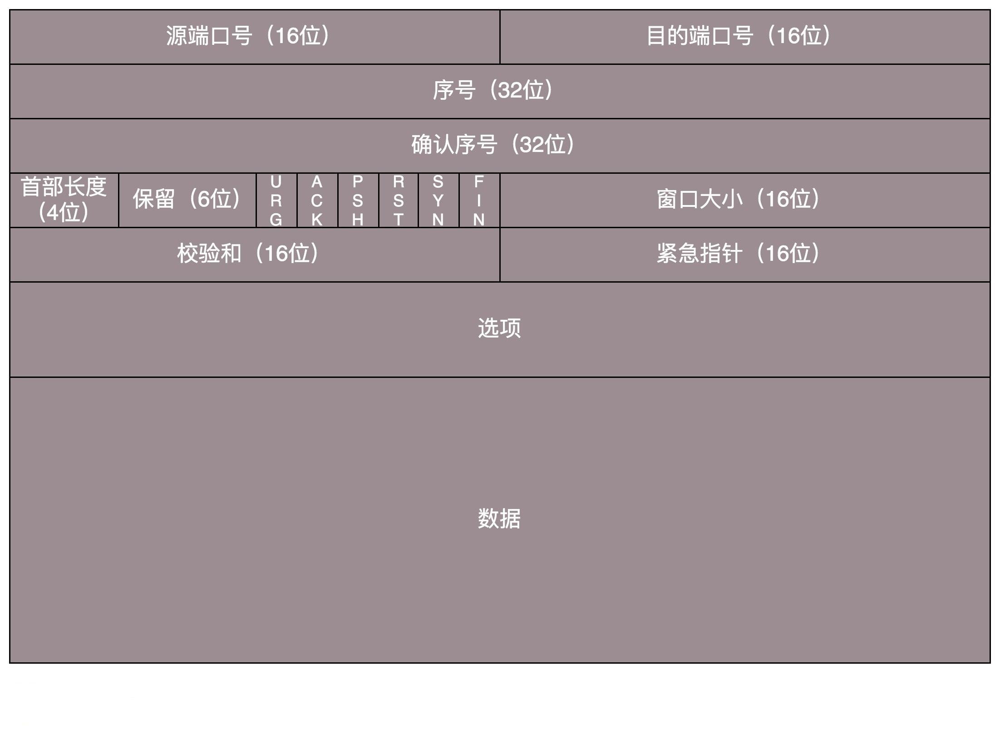
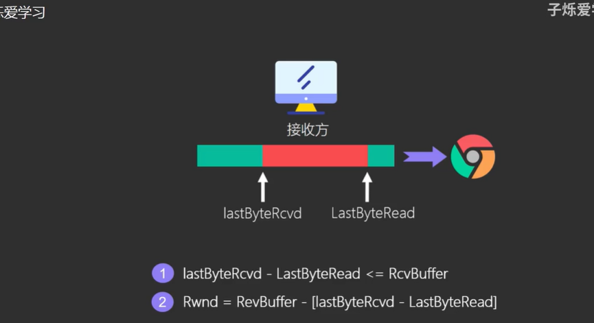
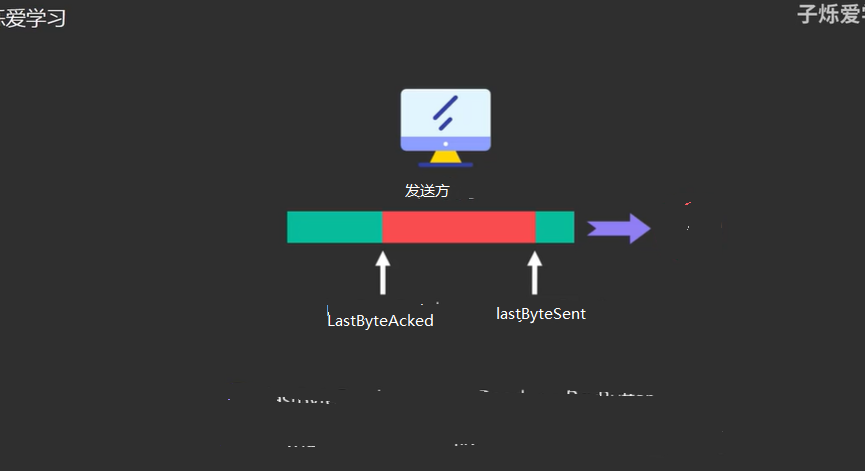
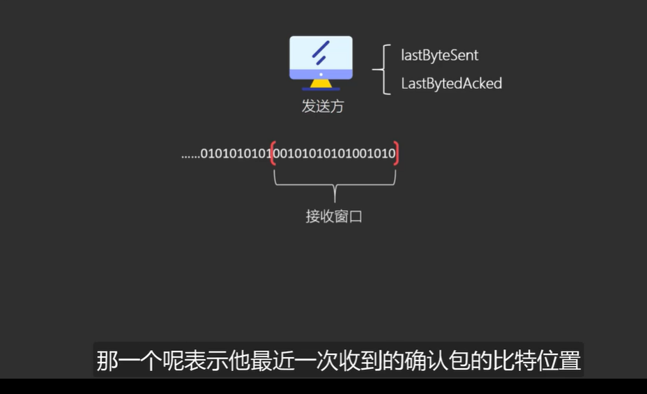
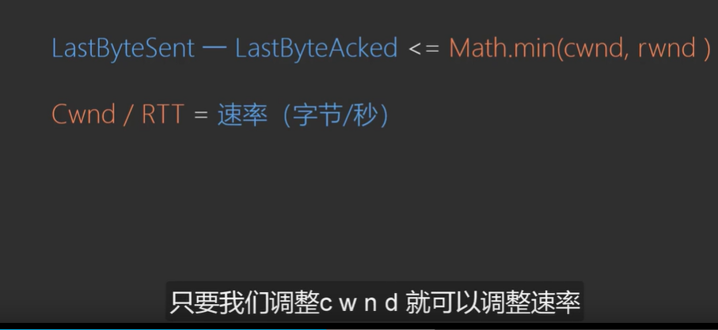
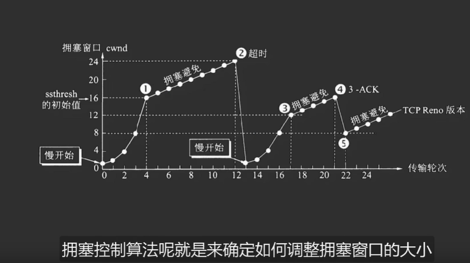
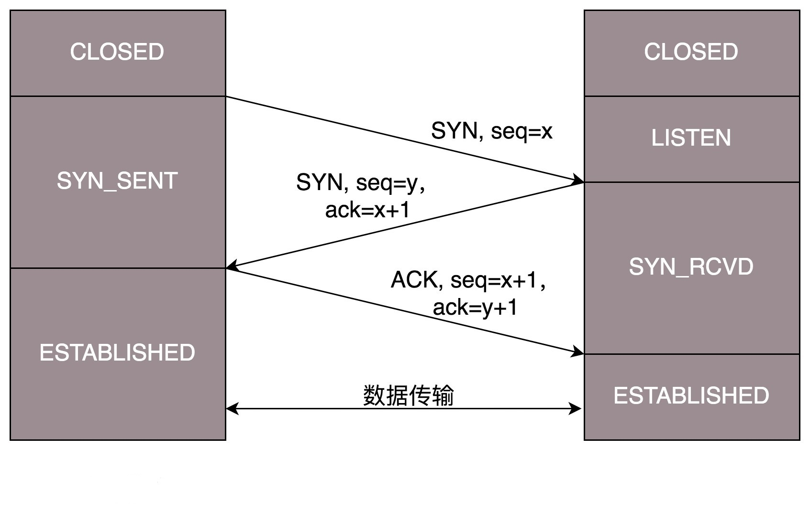
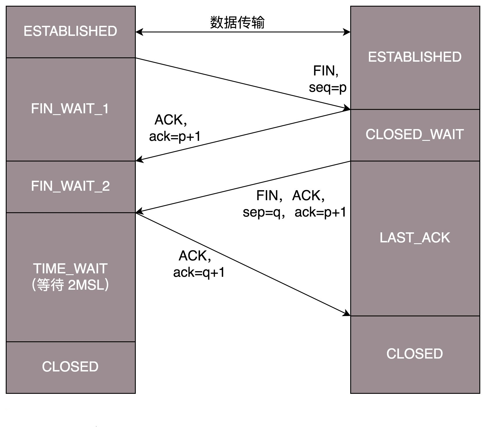

# TCP

>顺序问题，丢包问题，连接维护，流量控制，拥塞控制；

**序列号和确认号是保证可靠性因素之一；**

**TCP头的格式；**

#### 顺序问题；

由seq序号来保证；来解决乱序问题；

#### 丢包问题；

由ack 确认码来决定；会有超时重传机制；

#### 连接维护

**连接就是两端的状态维护，中间过程没有所谓的连接，一旦传输失败，一端收到消息，才知道状态的变化**

**状态码 ：**

* SYN（同步）：**发起一个 连接请求，或 连接接受报文；**
* ACK（acknowlege）：回复；
* RST：重新连接；
* FIN（finish）：释放连接；

**TCP 是面向连接的，因而双方要维护连接的状态，这些带状态位的包的发送，会引起双方的状态变更。**

#### 流量控制  (一个是对另一端的) 

窗口大小；2个字节；

**接收端和发送端都会有一个buffer缓存区；**

用来控制发送端别发的太快了，接收端处理不过来了，或者说发送端别发的太慢了，我们这里有很多空余的空间；

**接收窗口；**  rwnd   大小是动态变化的，所以我们可以叫他**滑动窗口；**

**Rwnd 接收窗口的大小就是绿色的部分；**

**接收方是通过TCP报头字段内的窗口大小来传递给发送方；**

**发送窗口的值（数据），发送的数据由lastByteSent-LastByteAcked = 发送端要发送数据的窗口大小；** 

**LastByteSent - LastByteAcked <= Math.min(cwnd, rwnd )**

#### 拥塞控制(一个是针对网络的)cwnd

​	

**当网络环境不好的时候，他会控制自己的发送速度；**不能改变世界，就改变自己；

rtt 一次通信的往返时间；

tcp的发送方会会自己去感知网络的拥塞程度；

只要发生丢包时间（也就是超时那么就会）就认为网络发生了拥塞；

tcp的每一端，除了维护进行流量控制的滑动窗口外，还要维护一个拥塞窗口cwnd   就是对tcp发送方的发送处理进行限制；

整个拥塞控制分为四个阶段：

**慢开始，拥塞避免，快重传，快恢复；**

**拥塞控制算法就是来控制拥塞窗口的大小；**

**当发生超时的时候窗口大小的阈值就会变为原先的一半；**

####三次握手

注意客户端和服务端的状态变化；

**客户端一发一收建立连接establish（建立）；**

为什么要进行三次握手？？？

简略来说：**客户端和服务端都是一发一收；**

为什么2不两次握手，主要是为了当有请求延迟了，然后客户端又超时重发，然后和服务端建立连接，原先的请求又到达了客户端，如果不进行第三次的确认那么会建立很多连接，其实这是没必要的；

为什么不四次握手？ 因为客户端和服务器之间已经一手一发了，所以没有必须要继续下去了；

当第三次请求发送给服务端感觉会丢失发一个确认，那么也会认为确认也会丢失，那么我也发一个连接问一下把，那么就会形成无限套娃；就没必要了；

#### 四次挥手

