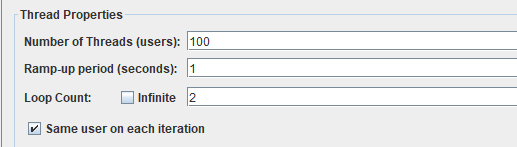
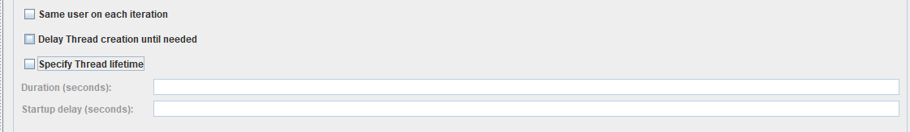
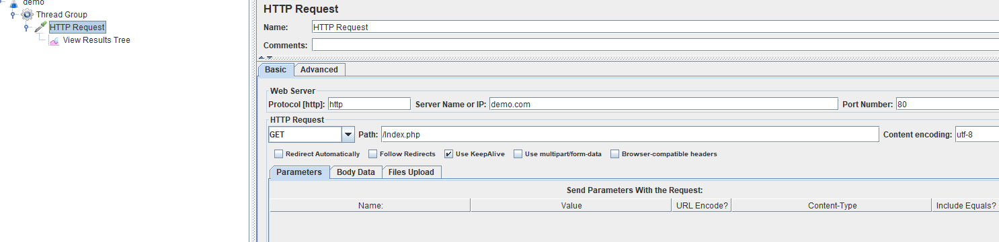
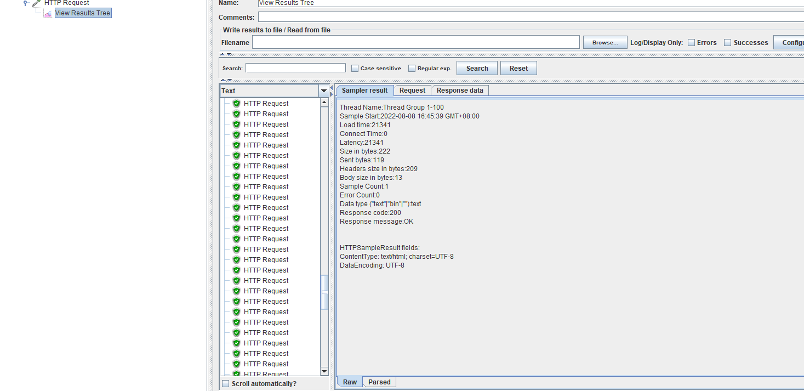

# ab压力测试


最近公司要求对一些潜在风险的接口进行压测，目前选用ab进行压测，在这记录下：

ApacheBench

**安装**
sudo apt-get install apache2-utils

**yum install httpd-tools      ab -v**    

---


###**参数配置**

Options are:
    -n requests     要执行的请求次数；
    -c concurrency  并发数量；
    -s timeout      响应时间；

​	-t timelimit 基准测试花费的时间；

`````shell
  -n requests     Number of requests to perform
    -c concurrency  Number of multiple requests to make at a time
    -t timelimit    Seconds to max. to spend on benchmarking
                    This implies -n 50000
    -s timeout      Seconds to max. wait for each response
                    Default is 30 seconds
`````

-n: 请求个数 -c：并发量（模拟请求的客户端数量） -t: 多少秒内进行并发  ??????

demo
ab -n 1000 -c 100 -s 1 http://127.0.0.1:1080/event?config_name=mysql_config


`````shell
# 其实从这里就可以看出来 并发qps 1s php处理的请求数 是很少的；
# 一般一台计算机的请求并发数 就是58；qps；php的服务器；

$ abs -n 100 -c 100 -t 1 http://www.demo.com/index.php
This is ApacheBench, Version 2.3 <$Revision: 1901567 $>
Copyright 1996 Adam Twiss, Zeus Technology Ltd, http://www.zeustech.net/
Licensed to The Apache Software Foundation, http://www.apache.org/

Benchmarking www.demo.com (be patient)
Finished 5 requests


Server Software:        nginx/1.21.5
Server Hostname:        www.demo.com
Server Port:            80

Document Path:          /index.php
Document Length:        4 bytes

Concurrency Level:      100
Time taken for tests:   1.009 seconds
Complete requests:      5
Failed requests:        0
Total transferred:      900 bytes
HTML transferred:       20 bytes

Requests per second:    4.96 [#/sec] (mean)

Time per request:       20179.980 [ms] (mean)
Time per request:       201.800 [ms] (mean, across all concurrent requests)
Transfer rate:          0.87 [Kbytes/sec] received

Connection Times (ms)
              min  mean[+/-sd] median   max
Connect:        0    1   1.3      0       3
Processing:   526  626 173.3    574     929
Waiting:      385  516  81.7    530     611
Total:        526  626 174.6    574     932

Percentage of the requests served within a certain time (ms)
  50%    535
  66%    612
  75%    612
  80%    932
  90%    932
  95%    932
  98%    932
  99%    932
 100%    932 (longest request)
`````


---


###报告参数

Failed requests：失败的请求。

**Requests per second：也就是常说的QPS, 每秒查询率，这是一个平均值。  吞吐量  每秒处理多少个请求；QPS  requests**

**Time per request：完成一个请求所花费的时间。 ms**


Transfer rate: 网络传输速度。对于大文件的请求测试，这个值很容易成为系统瓶颈所在;


total transferrded  总的传输量；


```shell
# 连接数；
Connection Times (ms)
              min  mean[+/-sd] median   max
Connect:        0    1   0.5      1       5
Processing:     1    3   5.6      2      62
Waiting:        0    3   5.6      2      62
Total:          1    4   5.6      3      63
```

---

###文档；

### ab压测测试

https://blog.csdn.net/youngspy23/article/details/50720640?utm_medium=distribute.pc_relevant.none-task-blog-2~default~baidujs_baidulandingword~default-0-50720640-blog-71084343.pc_relevant_multi_platform_featuressortv2removedup&spm=1001.2101.3001.4242.1&utm_relevant_index=2

---


[Apache](https://so.csdn.net/so/search?q=Apache&spm=1001.2101.3001.7020)附带的ab，它非常容易使用，ab可以直接在Web服务器本地发起测试请求。这至关重要，因为我们希望测试的服务器的处理时间，而不包含数据的网络传输时间以及用户PC本地的计算时间。

需要清楚的是，ab进行一切测试的本质都是基于HTTP，所以可以说它是对于Web服务器软件的黑盒性能测试，它获得的一切数据和计算结果，都可以通过HTTP来解释。

另有一些压力测试软件，包括LoadRnner、Jmeter等，则是不同程度上包含了服务器处理之外的时间，比如LoadRunner运行在用户PC上，可以录制浏览器行为，这种测试的结果玩玩侧重于站点用户的角度，有另外一些层面的参考意义。


---


## jmeter

###安装

https://blog.csdn.net/weixin_43279012/article/details/108490036?spm=1001.2101.3001.6650.1&utm_medium=distribute.pc_relevant.none-task-blog-2%7Edefault%7ECTRLIST%7Edefault-1-108490036-blog-117357810.pc_relevant_multi_platform_featuressortv2removedup&depth_1-utm_source=distribute.pc_relevant.none-task-blog-2%7Edefault%7ECTRLIST%7Edefault-1-108490036-blog-117357810.pc_relevant_multi_platform_featuressortv2removedup&utm_relevant_index=1


### jmeter 的安装 和简单的使用；


https://blog.csdn.net/liao_11/article/details/124651040


### jmeter的压测的使用


### 线程组的设置；

threads 就是并发数；

ramp-up period   加速期   ramp-up period用于设置启动所有线程所需要的时间  **启动线程所需要的时间；**  如果线程很多 那么最好给多点时间；


loop count     循环数 

设置循环次数：

**该项设置线程组在结束前每个线程循环的次数，如果次数设置为1，那么JMeter在停止前只执行测试计划一次。**





### 一些其他的线程参数 （图片在下面）

same user on each iteration     每次迭代都使用相同的用户


Delay Thread creation until needed：

默认情况下，测试开始的时候，所有线程就被创建完了。如果勾选了此选项，那么线程只会在合适的需要用到的时候创建。


**线程组调度器设置**  


**（1）持续时间（秒）：**       **duration  期间；**

**控制测试执行的持续时间，以秒为单位。**

**（2）启动延迟（秒）：**

**控制测试在多久后启动执行，以秒为单位**




###http request  

**http请求的设置** Request的设置；




### 结果设置；

**结果树**




