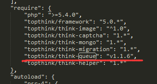

# composer

>仓库，类包的命令规律：
>
>````shell
><vendor>/<name> <version>
>````

**类包管理工具 类包的管理工具；**

首先要搞清楚的一件事情是，所有的依赖都定义在composer.json中，手册中给出了一些基本用法和例子。**你可能已经注意到，在指定版本号的时候，我们并不一定要指明一个精确的版本。**那么就有可能发生这么一个情况，对于同一份composer.json，我们在不同时刻拉取到的依赖文件可能不同（因为composer会在满足条件的情况下去拉取最新的那份依赖），从而导致一些异常情况。composer update和composer install正是为了解决这个问题而出现的。


####command

composer init 生成或者定制自己的    依赖composer.json

**composer install** 

composer install所执行的事情非常类似，只在第一步的时候有差别。当**你本地如果已经存在一份composer.lock时，它将会去读取你的composer.lock而非composer.json，并且以此为标准去下载依赖。**当你本地没有composer.lock的时候，它所做的事情和composer update其实并没有区别。

这意味着，**只要你本地有一份composer.lock，你就可以保证无论过去了多久，你都能拉到相同的依赖。而如果你把它纳入你的项目的版本控制中，那么你就可以确保你项目中的每一个人、每一台电脑，不管什么系统，都能拉取到一模一样的依赖，以减少潜在的依赖对部署的影响。**当然，请记得，你应该使用的命令是**composer install**。

**composer update** （他只需要读取composer.json 就可以了；）

>注意少用 composer update 会把 依赖包的版本更新到最新版本，会出问题！！！this is just wrong！！！要用 composer require

* 当你执行composer update的时候，composer会去读取composer.json中指定的依赖，去分析他们，并且去拉取符合条件最新版本的依赖。然后他会把所拉取到的依赖放入vendor目录下，并且把所有拉取的依赖的精确版本号写入composer.lock文件中 
* 如果**你不希望影响别的已经安装的依赖，仅仅更新你修改的部分**，那你可以通过指定白名单来确定要更新的范围，例如：（tp5的queue队列包示例：从v1.1.4-->>v1.1.6）




```shell
composer update topthink/think-queue=v1.1.6
```

* 那什么时候该使用composer update呢？**当你修改了你的依赖关系，不管是新增了依赖，还是修改了依赖的版本，又或者是删除了依赖，这时候如果你执行composer install的时候，是不会有任何变更的，但你会得到一个警告信息**

  Warning: The lock file is not up to date with the latest changes in composer.json. You may be getting outdated dependencies. Run update to update them.

  

**composer require** **（新增）**

composer require topthink/think-queue

**项目开发中要增加扩展包时：**

使用这种：**composer require new/package 来安装。**

````shell
$ composer require monolog/monolog:1.19
 
# 或者
$ composer require monolog/monolog=1.19
 
# 或者用require 就不需要 自己去修改！！！加上自己需要的版本； 他会在自动给你写在  composer.json 里面！！！
$composer require monolog/monolog 1.19
````


###show命令

使用`show`命令可以列出项目目前所安装的包的信息：

````shell
# 列出所有已经安装的包
$ composer show
 
# 可以通过通配符进行筛选
$ composer show monolog/*
 
# 显示具体某个包的信息
$ composer show monolog/monolog
````


**composer  remove** 删除

remove 命令用于移除一个包及其依赖（在依赖没有被其他包使用的情况下），如果依赖被其他包使用，则无法移除：

```shell
$ composer remove monolog/monolog
```

**composer search** 

```
composer search monolog
```

**配置**

**全局配置；**

```
composer config -g repo.packagist composer https://mirrors.aliyun.com/composer/
```


```
composer config --unset repos.packagist
```


```shell
#更新composer --- 
composer self-update
```


移动 composer.phar，这样 composer 就可以进行全局调用：

```shell
# mv composer.phar /usr/local/bin/composer
composer option
php composer.phar option
#全局调用
```


```shell
# 更新所有依赖
$ composer update

# 更新指定的包
$ composer update monolog/monolog

# 更新指定的多个包
$ composer update monolog/monolog symfony/dependency-injection

# 还可以通过通配符匹配包
$ composer update monolog/monolog symfony/*
```


####约束

### 精确版本

我们可以告诉 Composer 安装的具体版本，例如：1.0.2，指定 1.0.2 版本。

### 范围

通过使用比较操作符来指定包的范围。这些操作符包括：**>，>=，<，<=，!=**。

你可以定义多个范围，使用**空格**或者逗号 , 表示逻辑上的**与**，使用**双竖线 ||** 表示逻辑上的**或**。其中与的优先级会大于或。 实例：

- \>=1.0
- \>=1.0 <2.0
- \>=1.0 <1.1 || >=1.2

**我们也可以通过使用连字符 - 来指定版本范围。**

连字符的左边表明了 `>=` 的版本，如果右边的版本不是完整的版本号，则会被使用通配符进行补全。例如`1.0 - 2.0`等同于`>=1.0.0 <2.1`（`2.0`相当于`2.0.*`），而`1.0.0 - 2.1.0`则等同于`>=1.0.0 <=2.1.0`。

### 通配符

可以使用通配符来设置版本。`1.0.*`相当于`>=1.0 <1.1`。
例子：`1.0.*`  * 代表是可以变化的，1.0.不能bian'hua

### 波浪号 ~

我们先通过后面这个例子去解释~操作符的用法：`~1.2`相当于`>=1.2 <2.0.0`，而`~1.2.3`相当于`>=1.2.3 <1.3.0`。对于使用[`Semantic Versioning`](http://semver.org/)作为版本号标准的项目来说，这种版本约束方式很实用。**例如`~1.2`定义了最小的小版本号，然后你可以升级2.0以下的任何版本而不会出问题，因为按照`Semantic Versioning`的版本定义，小版本的升级不应该有兼容性的问题。**简单来说，`~`定义了最小的版本，并且允许版本的最后一位版本号进行升级（没懂得话，请再看一边前面的例子）。
例子：`~1.2`

> **需要注意的是，如果~作用在主版本号上，例如`~1`，按照上面的说法，Composer可以安装版本1以后的主版本，但是事实上是`~1`会被当作`~1.0`对待，只能增加小版本，不能增加主版本。**

### 折音号 ^

```
^`操作符的行为跟`Semantic Versioning`有比较大的关联，它允许升级版本到安全的版本。例如，`^1.2.3`相当于`>=1.2.3 <2.0.0`，因为在2.0版本前的版本应该都没有兼容性的问题。而对于1.0之前的版本，这种约束方式也考虑到了安全问题，例如`^0.3`会被当作`>=0.3.0 <0.4.0`对待。
例子：`^1.2.3
```

------

## 版本稳定性

**如果你没有显式的指定版本的稳定性，Composer会根据使用的操作符，默认在内部指定为`-dev`或者`-stable`。例如：**

| 约束           | 内部约束                     |
| :------------- | :--------------------------- |
| `1.2.3`        | `=1.2.3.0-stable`            |
| `>1.2`         | `>1.2.0.0-stable`            |
| `>=1.2`        | `>=1.2.0.0-dev`              |
| `>=1.2-stable` | `>=1.2.0.0-stable`           |
| `<1.3`         | `<1.3.0.0-dev`               |
| `<=1.3`        | `<=1.3.0.0-stable`           |
| `1 - 2`        | `>=1.0.0.0-dev <3.0.0.0-dev` |
| `~1.3`         | `>=1.3.0.0-dev <2.0.0.0-dev` |
| `1.4.*`        | `>=1.4.0.0-dev <1.5.0.0-dev` |

例子：`1.0 - 2.0`


**如果你想指定版本只要稳定版本，你可以在版本后面添加后缀`-stable`。**


`minimum-stability` 配置项定义了包在选择版本时对稳定性的选择的默认行为。默认是`stable`。它的值如下（按照稳定性排序）：**`dev`，`alpha`，`beta`，`RC`和`stable`**。除了修改这个配置去修改这个默认行为，我们还可以通过[稳定性标识](https://getcomposer.org/doc/04-schema.md#package-links)（例如`@stable`和`@dev`）来安装一个相比于默认配置不同稳定性的版本。例如：


## lib库的版本；

**alpha 阿拉法  也是测试的意思，不过是第一次测试版本！！**

***Beta*（β，贝塔)**  **测试的意思；**  比较稳定；

**dev** **开发环境；**  版本变动比较多，开发人员的开发环境；

**stable 稳定版本；**  已经是线上的版本；product；


```
{
    "require": {
        "monolog/monolog": "1.0.*@beta",
        "acme/foo": "@dev"
    }
}
```


**Semantic Versioning，语义化版本号**，简称“SemVer”。**是一种格式化的版本号规则。并且版本号中各个部分的含义被加以了限制。**这一套规则，是为了改善各种软件版本号格式混乱，语义不明的现状而提出的。

Semantic Versioning标准的官网兼说明页面是https://semver.org/。

**其中有一个规则，就是要求小版本不能用兼容性的问题；**


## 安装较低版本的laravel遇到的问题md


`````shell


Use --ignore-platform-reqs when you are installing a lower version of laravel.

full code: composer create-project laravel/laravel:^8.0 example --ignore-platform-reqs then change the php version on your composer.json from 7.3 to 8.0

Hope this solve your installation problem.

Another fix would be to install the last specific version of laravel 8:
##composer create-project laravel/laravel:8.6.11 example-boilerplate --prefer-dist
`````

