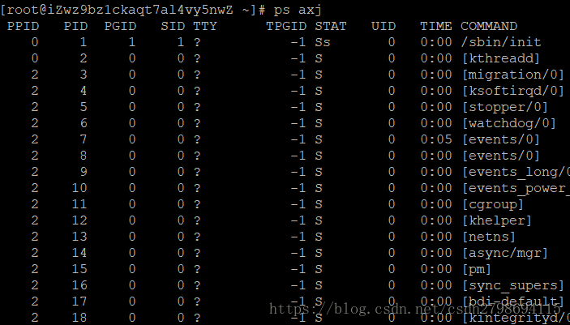
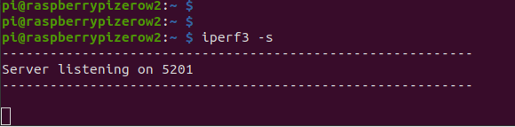
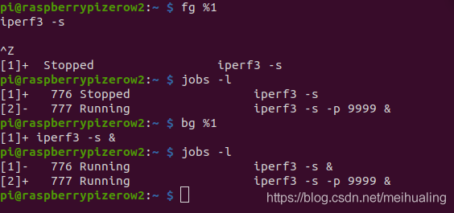
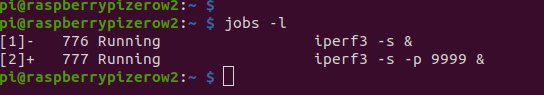
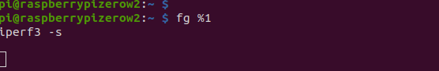
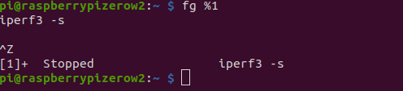

# daemon

daemon就是一段持续运行的程序，用于处理计算机系统希望接收到的阶段性服务需求；

Daemon[程序段](https://baike.baidu.com/item/程序段)将请求提交给其他合适的程序（或者进程）。网络上每个页面的服务器都有一个HTTPS或者是[超文本传输协议](https://baike.baidu.com/item/超文本传输协议)daemon，持续地等待从网络客户端及其用户发送来的请求。

Daemon程序，又称之为守护进程，通常在系统后台长时间运行，**由于没有控制终端与前台进行交互**，Daemon程序一般作为**系统服务使用；**

**keepalived sshd firewalld** 

**daemon函数：**

**int daemon(int nochdir,int noclose)**

创建守护进程的时候,往往要做以下两件事情：

1.将进程的工作目录修改为"/"根目录

daemon的参数**nochdir**为0时,即可将工作目录修改为[根目录](https://baike.baidu.com/item/根目录/6061330)；

2.将标准输入,输出和错误输出[重定向](https://baike.baidu.com/item/重定向/9064196)到/dev/null

daemon的参数**noclose**为0时,输入,输出以及错误输出重定向到/dev/null

###后台运行和守护进程的区别？

​	

**daemon进程简介**

**如何判断一个进程是否为daemon进程**

**关于后台运行进程**

**什么是linux的daemon进程**？

daemon进程又称为守护 进程，**是在系统 启动就运行，系统关闭才停止的进程**，独立于终端之外，不与客户端交互。**一般进程在关闭终端后就停止了，而daemon进程不会停止。**

**怎么判断一个进程是否为daemon进程？**
因为daemon进程独立于终端，故使用ps axj命令查看进程时，其终端名(TTY)显示为？，终端前台进程组ID(TPGID)显示为-1

怎么让一个**进程在退出终端后继续运行**？
1.nohup
2.编写daemon程序
3.由系统的daemon进程启动，这样进程就作为daemon的子进程，如写进crontab里

一、概述

Daemon（守护进程）是运行在后台的一种特殊进程。它独立于控制终端并且周期性地执行某种任务或等待处理某些发生的事件。它不需要用户输入就能运行而且提供某种服务，不是对整个系统就是对某个用户程序提供服务。Linux系统的大多数服务器就是通过守护进程实现的。常见的守护进程包括系统日志进程syslogd、 web服务器httpd、邮件服务器sendmail和数据库服务器mysqld等。

守护进程一般在系统启动时开始运行，除非强行终止，否则直到系统关机都保持运行。守护进程经常以超级用户（root）权限运行，因为它们要使用特殊的端口（1-1024）或访问某些特殊的资源。

守护进程的父进程是init进程，因为它真正的父进程在fork出子进程后就先于子进程exit退出了，所以它是一个由init继承的孤儿进程。守护进程是非交互式程序，没有控制终端，所以任何输出，无论是向标准输出设备stdout还是标准出错设备stderr的输出都需要特殊处理。

守护进程的名称通常以d结尾，比如sshd、xinetd、crond等。

二、守护进程的创建

首先我们需要理解一些基本概念：

进程组(process group)： 一个或多个进程的集合，每个进程都有一个进程组ID，这个ID就是进程组长的进程ID
会话期(session)： 一个或多个进程组的集合，每个会话有唯一一个会话首进程(session leader)，会话ID为会话首进程ID
控制终端(controlling terminal) ：每一个会话可以有一个单独的控制终端，与控制终端连接的会话首进程就是控制进程(controlling process)。 这时候，与当前终端交互的就是前台进程组，其他的都是后台进程组。

通常，在生产环境中，Linux的专业用户都是通过命令行方式用ssh远程登陆Linux主机，通过命令行操作和使用

Linux的。

 

# 程序在前台运行:

通常，刚刚接触Linux的人或者不熟悉Linux的人，会发现登录后，**在终端上输入命令运行一个程序后，终端上**

**就不能再输入命令了，直到刚才的程序运行完毕退出后，才能执行其它命令运行其它程序**。我们管这种方式叫

程序在前台运行。   	

以iperf3 -s为例，一旦运行起来，终端上就不能再接收任何命令了，直到iperf3 -s退出

 

# 程序在后台运行：

**就是程序运行起来后，不占用终端，终端能继续接收并执行其它命令，收后台运行。**

如何后台运行一个程序呢，其实也很简单，**在命令行最后加上&就可以了**，如下面所示：

运行后会跳出如上所示的[1]776, [2]777，其中[1]和[2]表示后台进程编号，776和777是进

程的PID。这里回车后会发现还能继续输入命令，这就表示这二个iperf3 -s和iperf3 -s -p 9999

被运行在了后台，终端可以继续输入命令操作控制使用linux。

 

# 程序的前后台切换：

**Ctrl+z, bg %[number], fg %[number], jobs -l命令可以把程序在前后台之前切换。**

以iperf3 -s为例，

## 如何查看当前正在后台运行的程序：

如上图运行了二个后台的iperf3后，我们再输入jobs -l可以看到有二个后台程序在运行，

## 如何把后台程序切换到前台：

输入fg %1就可以把1号后台程序（PID号为666）的iperf3进程调到前台来了。这时控制台

被iperf3占用，无法再输入新的命令。

## 如何把前台程序切换到后台：

当程序在前台运行时，直接在键盘上按Ctrl + z则可，这时，会如下图所示，重新跳出命令

行提示符可以输入新的命令了，但我们可以看到提示被切到后台的程序此时不是在运行状态

而是在stopped状态（也可以通过输入jobs -l查看到状态是stopped）。

我们还需要输入bg %1命令，让1号后台程序恢复到运行状态（如下图）。

此时就完成了程序从前台到后台的切换。

 

当我们不是通过输入exit的方式（输入exit后，后台进程会被init接管，继续在后台运行）

退出终端时（网络断了，或者终端程序被关闭了等等），**Linux初接触者往往会以为后台程序还在**

**运行，其实不然，当终端退出后，所有在这个终端上发起执行的前后台程序都会自动退出。**

那么当我们执行一些需要花费很长时间（比如说，几个小时，甚至几天）的程序时，我们往往希望：

# 终端退出时，后台执行的程序保持后台运行不要退出

这时需要怎么办呢？这里我们就需要用到**nohup**命令

nohup iperf3 -s &

此时终端退出，程序就可以继续在后台运行了，我们再次通过ssh登录后，可以通过 cat nohup.out命令，查看

程序后台运行期间的输出的信息，如上图所示。

它与exit退出后，再次登陆的没有加nohup命令的后台程序的最大区别在于在能nohup.out文件里找到输出信息，

后没有加nohup的程序的输出信息已经不知道去哪里找了。

 

 

# 后台运行程序和以Daemon方式运行的程序的区别

通常加上nohup命令后台运行程序已经能满足我们日常的使用了，为什么这里还要提到Daemon程序呢，

从外面来看Daemon程序后后台运行程序并没有太大的不同，请注意他们有以下几个不同点。

1 ）程序运行时不能使用**命令将其转换成Daemon程序，只有编程时可以指定程序为Daemon程序**

2）Daemon进程完全脱离终端控制台，而后台程序并未完全脱离终端，比如在终端未关闭前还是会往终端输出结果

3）Daemon进程在关闭终端控制台时不会受影响，而后台程序会随用户退出而停止，除非加上nohup

4）**Daemon进程的会话组和当前目录，文件描述符都是独立的**。**后台运行只是终端进行了一次fork，让程序**

   **在后台执行（这一条对于一般使用者来说并不重要）。**

