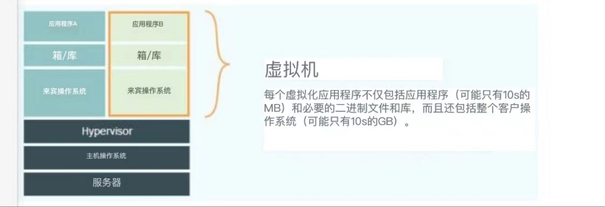
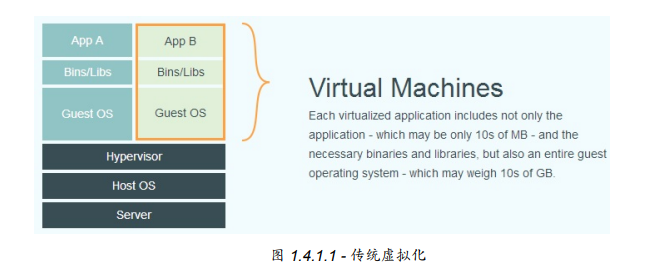
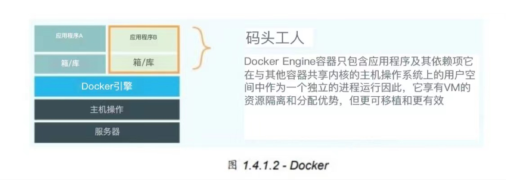
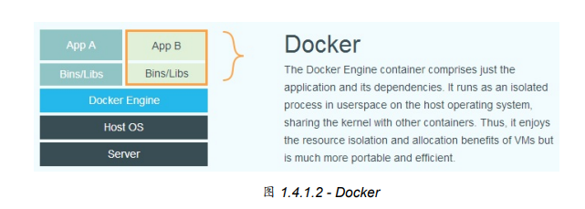

# docker

## docker 和虚拟化的区别

https://blog.csdn.net/pushiqiang/article/details/78682323

>虚拟化技术最主要的目的是提高硬件资源的使用率。传统虚拟化是实现虚拟出多个操作系统共同使用硬件资源；容器虚拟化是实现在单个操作系统上虚拟出多个资源组共同使用硬件资源
>
>```php
>虚拟话：
>需要硬件支持，需要模拟硬件，可以运行不同的操作系统，启动需要走开机启动流程(分钟级)。
>
>容器技术:
>共用宿主机内核，第一个进程直接启动服务(nginx,mysql等)，开机秒级，轻量，损耗少，但仅支持linux系统docker 是对app的隔离
>```

* 虚拟化是对资源的隔离

* **传统虚拟机技术是虚拟出一套硬件 后，在其上运行一个完整操作系统，在该系统上再运行所需应用进程；**

* **而容器内的应用进程 直接运行于宿主的内核，容器内没有自己的内核，而且也没有进行硬件虚拟。因此容器要比 传统虚拟机更为轻便；**

* 容器化 仅仅支持 但仅支持linux系统。windows的docker也仅仅是先虚拟出linux os；

  ----

  

Docker 自开源后受到广泛的关注和讨论，至今其 GitHub 项目已经超过 4 万 6 千个星标和一 万多个 fork。甚至由于 Docker 项目的火爆，在 2013 年底，dotCloud 公司决定改名为 Docker。Docker 最初是在 Ubuntu 12.04 上开发实现的；Red Hat 则从 RHEL 6.5 开始对 Docker 进行支持；Google 也在其 PaaS 产品中广泛应用 Docker。 

**Docker 使用 Google 公司推出的 Go 语言 进行开发实现，基于 Linux 内核的 cgroup，namespace，以及 AUFS 类的 Union FS 等技术，对进程进行封装隔离，属于 操作 系统层面的虚拟化技术。由于隔离的进程独立于宿主和其它的隔离的进程，因此也称其为容 器。最初实现是基于 LXC，从 0.7 版本以后开始去除 LXC，转而使用自行开发的 libcontainer，从 1.11 开始，则进一步演进为使用 runC 和 containerd。** 

**Docker 在容器的基础上，进行了进一步的封装，从文件系统、网络互联到进程隔离等等，极 大的简化了容器的创建和维护。使得 Docker 技术比虚拟机技术更为轻便、快捷。** 

​     下面的图片比较了 Docker 和传统虚拟化方式的不同之处。传统虚拟机技术是虚拟出一套硬件 后，在其上运行一个完整操作系统，在该系统上再运行所需应用进程；而容器内的应用进程 直接运行于宿主的内核，容器内没有自己的内核，而且也没有进行硬件虚拟。因此容器要比 传统虚拟机更为轻便。


---


传统的虚拟化


​		




>*Hypervisor*，又称虚拟机监视器（英语：virtual machine monitor，缩写为 VMM），是用来建立与执行虚拟机器的软件、固件或硬件。 进行硬件虚拟；硬件的支持；

---


容器化





总结：很明显，虚拟化，多了硬件虚拟和运行操作系统的损耗，所以docker更加轻便，系统资源；利用率更高；

所以这里的contianer仅仅是一个文件系统；


### 容器化的优点

1. 高效的系统利用率
2. 秒级的启动时间
3. **一致的运行环境**    持续的交付和部署 更加轻松的迁移  **一次创建多次部署的问题**，也解决了为什么“在我的机器上没问题”的原因；
4. **更加轻松的维护和扩展  因为docker容器的分层存储，使得重复的部分更加复用；**


## 镜像 容器 仓库

### 镜像 （静态数据）

Docker 镜像是一个特殊的文件系统，除了提供容器运行时所需的程序、库、资源、配置等文 件外，还包含了一些为运行时准备的一些配置参数（如匿名卷、环境变量、用户等）。镜像 不包含任何动态数据，其内容在构建之后也不会被改变。

#### 分层存储

**镜像构建时，会一层层构建，前一层是后一层的基础。每一层构建完就不会再发生改变，后 一层上的任何改变只发生在自己这一层。**比如，删除前一层文件的操作，实际不是真的删除 前一层的文件，而是仅在当前层标记为该文件已删除。在最终容器运行的时候，虽然不会看 到这个文件，但是实际上该文件会一直跟随镜像。因此，在构建镜像的时候，需要额外小 心，每一层尽量只包含该层需要添加的东西，任何额外的东西应该在该层构建结束前清理 掉。

**分层存储的优点：**

**分层存储**的特征还使得**镜像的复用、定制变的更为容易。甚至可以用之前构建好的镜像作为基础层，然后进一步添加新的层**，以定制自己所需的内容，构建新的镜像。 所以更加轻松的维护和扩展；

### 容器（动态数据）

镜像（ Image ）和容器（ Container ）的关系，就像是面向对象程序设计中的 类 和 实例 一样，镜像是静态的定义，容器是镜像运行时的实体。容器可以被创建、启动、停止、删 除、暂停等。

容器的实质是进程，但与直接在宿主执行的进程不同，**容器进程运行于属于自己的独立的 命 名空间**。因此容器可以拥有自己的 root 文件系统、自己的网络配置、自己的进程空间，甚 至自己的用户 ID 空间。容器内的进程是运行在一个隔离的环境里，使用起来，就好像是在一 个独立于宿主的系统下操作一样。这种特性使得容器封装的应用比直接在宿主运行更加安 全。也因为这种隔离的特性，很多人初学 Docker 时常常会混淆容器和虚拟机。

前面讲过镜像使用的是分层存储，容器也是如此。每一个容器运行时，是以镜像为基础层， 在其上创建一个当前容器的存储层，我们可以称这个为容器运行时读写而准备的存储层为**容器存储层**。

**容器存储层的生存周期和容器一样，容器消亡时，容器存储层也随之消亡。**因此，任何保存 于容器存储层的信息都会随容器删除而丢失。

按照 Docker 最佳实践的要求，**容器不应该向其存储层内写入任何数据，容器存储层要保持无 状态化。所有的文件写入操作，都应该使用 数据卷（Volume）**、或者绑定宿主目录，在这些 位置的读写会跳过容器存储层，直接对宿主（或网络存储）发生读写，其性能和稳定性更 高。

**数据卷的生存周期独立于容器，容器消亡，数据卷不会消亡**。因此，使用数据卷后，容器删 除或者重新运行之后，数据却不会丢失


## 仓库

通常，一个仓库会包含同一个软件不同版本的镜像，而标签就常用于对应该软件的各个版 本。我们可以通过 **<仓库名>:<标签>** 的格式来指定具体是这个软件哪个版本的镜像。**如果不给 出标签，将以 latest 作为默认标签。**

**仓库名经常以 两段式路径 形式出现，比如 jwilder/nginx-proxy ，前者往往意味着 Docker Registry 多用户环境下的用户名，后者则往往是对应的软件名。**但这并非绝对，取决于所使 用的具体 Docker Registry 的软件或服务。


