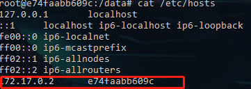
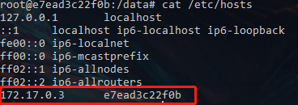

# docker容器互联

#### 容器IP互联

docker中的容器都是需要通信的，但是常规的**Ip互联**，也可以实现容器间的通信，但是每次重启容器IP都会发生变化，所以这种方式不建议使用；

这里开启了两个Redis容器分别对应端口是6380，6381，下面使用的就是Ip互联进行通信；

Redis-6380:

~~~
root@e74faabb609c:/data# ping 172.17.0.3
PING 172.17.0.3 (172.17.0.3): 56 data bytes
64 bytes from 172.17.0.3: icmp_seq=0 ttl=64 time=0.094 ms
64 bytes from 172.17.0.3: icmp_seq=1 ttl=64 time=0.128 ms
64 bytes from 172.17.0.3: icmp_seq=2 ttl=64 time=0.096 ms
~~~

Redis-6381:

~~~
root@e7ead3c22f0b:/data# ping 172.17.0.2
PING 172.17.0.2 (172.17.0.2): 56 data bytes
64 bytes from 172.17.0.2: icmp_seq=0 ttl=64 time=0.087 ms
64 bytes from 172.17.0.2: icmp_seq=1 ttl=64 time=0.229 ms
64 bytes from 172.17.0.2: icmp_seq=2 ttl=64 time=0.122 ms
~~~

当重启Redis-6381Ip地址有可能会发生变化

~~~
$ docker exec redis-6381 cat /etc/hosts
127.0.0.1       localhost
::1     localhost ip6-localhost ip6-loopback
fe00::0 ip6-localnet
ff00::0 ip6-mcastprefix
ff02::1 ip6-allnodes
ff02::2 ip6-allrouters
172.17.0.4      cae76091cb1d
~~~

为了解决这个问题所以这里引入了link可以用容器名来进行容器互联，就像是DNS，加了一层解析，可以直接用域名进行访问；简单点说**就是修改了hosts文件；**

#### link互联

link 创建一个Redis容器redis-6382

~~~
 docker run -d --name redis-6382 -p 6382:6382 -v G:/website/:/datadisk/website/ --link redis-6380:redis80 redis redis-server /datadisk/website/docker-lnmp/conf/redis-6382.conf
~~~

~~~
root@e48dd578b173:/usr/local/bin# cat /etc/hosts
127.0.0.1       localhost
::1     localhost ip6-localhost ip6-loopback
fe00::0 ip6-localnet
ff00::0 ip6-mcastprefix
ff02::1 ip6-allnodes
ff02::2 ip6-allrouters
172.17.0.2      redis80 e74faabb609c redis-6380     //dns先去找本机的hosts文件
172.17.0.5      e48dd578b173
~~~

ping redis80，redis-6380都可以ping通，建立联系；

~~~
root@e48dd578b173:/usr/local/bin# ping redis80
PING redis80 (172.17.0.2): 56 data bytes
64 bytes from 172.17.0.2: icmp_seq=0 ttl=64 time=0.118 ms
64 bytes from 172.17.0.2: icmp_seq=1 ttl=64 time=0.051 ms
~~~

~~~
root@e48dd578b173:/usr/local/bin# ping redis-6380
PING redis80 (172.17.0.2): 56 data bytes
64 bytes from 172.17.0.2: icmp_seq=0 ttl=64 time=0.183 ms
64 bytes from 172.17.0.2: icmp_seq=1 ttl=64 time=0.118 ms
64 bytes from 172.17.0.2: icmp_seq=2 ttl=64 time=0.052 ms
~~~

**注意：link是单向的redis-6380 hosts文件配置没有变化；所以要想两个容器之间相互通信，必须两个容器都必须要link；**

####创建网络进行容器互联（推荐）

自定义网络来连接多个容器

~~~
docker network create -d bridge my_net
~~~

* -d : 就是指网络类型
* my_net ：创建的网络名字

~~~
 docker run -d --name redis-6383 -p 6383:6383 -v G:/website/:/datadisk/website/ --network my_net redis redis-server /datadisk/website/docker-lnmp/conf/redis-6383.conf
~~~

~~~
 docker run -d --name redis-6384 -p 6384:6384 -v G:/website/:/datadisk/website/ --network my_net redis redis-server /datadisk/website/docker-lnmp/conf/redis-6384.conf
~~~

~~~
$ docker ps
CONTAINER ID        IMAGE               COMMAND                  CREATED             STATUS              PORTS                                      NAMES
a709bbeed60f        redis               "docker-entrypoint.s…"   3 seconds ago       Up 3 seconds        6379/tcp, 0.0.0.0:6384->6384/tcp           redis-6384
434f5b751740        redis               "docker-entrypoint.s…"   2 minutes ago       Up 2 minutes        6379/tcp, 0.0.0.0:6383->6383/tcp           redis-6383
~~~

ping

~~~
root@434f5b751740:/data# ping redis-6384
PING redis-6384 (172.19.0.3): 56 data bytes
64 bytes from 172.19.0.3: icmp_seq=0 ttl=64 time=0.099 ms
64 bytes from 172.19.0.3: icmp_seq=1 ttl=64 time=0.174 ms
64 bytes from 172.19.0.3: icmp_seq=2 ttl=64 time=0.182 ms
~~~

~~~
root@a709bbeed60f:/data# ping redis-6383
PING redis-6383 (172.19.0.2): 56 data bytes
64 bytes from 172.19.0.2: icmp_seq=0 ttl=64 time=0.075 ms
64 bytes from 172.19.0.2: icmp_seq=1 ttl=64 time=0.132 ms
64 bytes from 172.19.0.2: icmp_seq=2 ttl=64 time=0.133 ms
~~~

