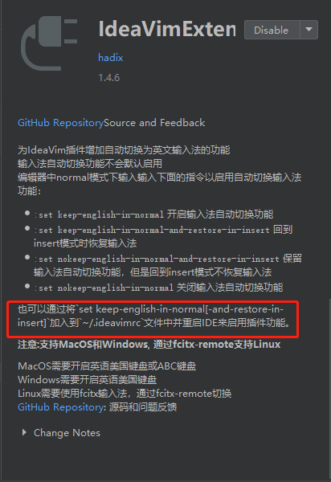
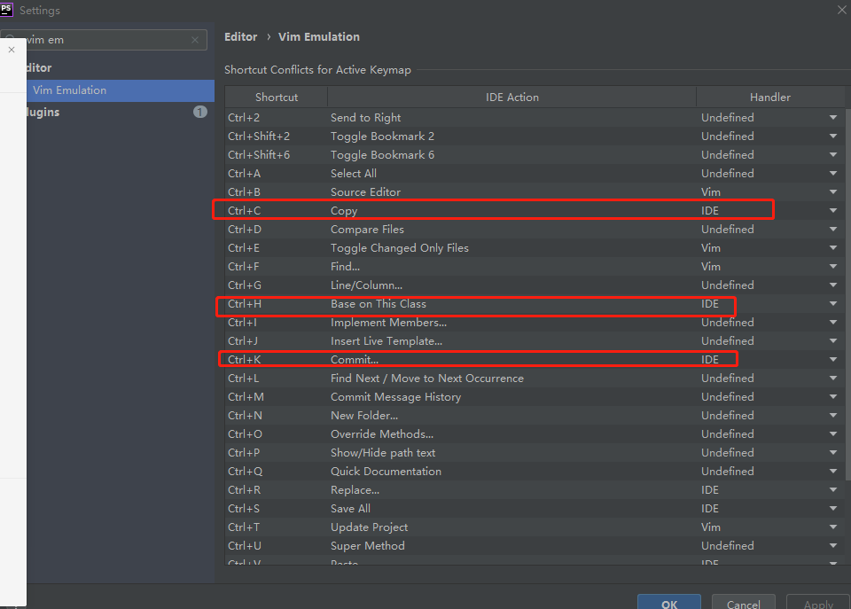
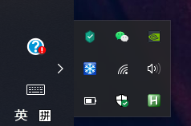

# IdeaVim 提高开发效率

### 为什么要用IdeaVim？

1. 解放上下左右键位，所有的键位都在主键盘；
2. 自定义快捷键，快速定位；
3. 解放鼠标 ；
4. 总之 ：双手不离开键盘，快速开发 提高开发效率；

### 安装

 * phpstorm安装ideaVim + IdeaVimExtension(主要是Ideavim的一个插件，具有自动切换英文输入法的功能) ,Ctrl+shift+a,搜plugin，然后安装...不详述了...

     1. 下面有一个简介:我用的是 set keep-english-in-normal-and-restore-in-insert，就是在普通模式用的是英文，返回插入模式的时候会返回以前插入模式的输入法0；**贼好用...**

        
     
        2. 插件下载如果有点慢...，你可以通过[http://plugins.jetbrains.com](http://plugins.jetbrains.com/)官网插件下载下来，然后通过 installed 右边的配置按键 disk安装;**贼快...**
###配置

​		做配置之前需要了解一些基础知识：

   * vim  有四种模式：

       * 普通模式 Normal Mode 我们刚进入vim所处的模式；

       * 可视模式 Visual Mode 按 v 可以进入这种模式  就是对行，字符，列的选中；

       * 插入模式  Instert Mode 按 i o a r I O A R 都可以进入插入模式;

       * 命令模式  Command Mode 按 : 进入到命令模式，例如 :set nu  回车 就是实现行号；
* map的命令的几种组合 map 就是映射;
  	 * nore  代表的就是非递归 ，就是a->b,b->c 那么按a结果是b 不会再往下递归搜查;
  	 * n  指的是普通模式下生效；
  	 * v i c 分别是再可视 插入 命令模式下生效；

​         所以：上面会出现多种组合  map  nnoremap inoremap noremap 自己体会;

​		下面是我的ideavimrc的配置：

```php
		*windows的配置就在用户（Users）目录下 然后找到你的用户名 创建一个.ideavimc的文件就行了 
		* mac 应该是 cd 就行,也就是 ~ 家目录....我没试过		感觉可以  echo $HOME 看看 应该是这个目录
```


```php
### .ideavimrc
# IdeaVimExtension 自动切换输入法
set keep-english-in-normal-and-restore-in-insert
# 移动键位  hjkl 移动键位太反人类 所以我改成了 ijkl 
#   i
#<j   l>
#   k
noremap i k
noremap j h
noremap k j
noremap l l
# insert  这里是 i被占用了 所以只好换一个h 感觉h没用 根据你们的习惯去修改
noremap h i
noremap H I

# 行首 行尾
noremap J 0
noremap L $ 

# map 设置
map R :source $MYVIMRC<CR>
map Q :q<CR>
```

其实上面就是做了一个简单的映射，比如:noremap i k;  当你按 i的时候那就相当于按了k；


# vim 常规快捷键操作

注意：有很多快捷键操作都是.ideavimrc的配置快捷键;

#### 常规操作

| 指令 | 效果                                     |
| ---- | ---------------------------------------- |
| Esc  | 退出插入模式，进入普通模式               |
| j    | 光标向左移动                             |
| l    | 光标向友移动                             |
| k    | 光标向下移动                             |
| i    | 光标向上移动                             |
| J    | 移动光标到当前行首                       |
| L    | 移动光标到当前的行尾                     |
| b    | 按照单词向前移动 字首                    |
| w    | 按照单词向后移动 字首                    |
| e    | 按照单词向后移动 字尾                    |
| G    | 移动到文档的最后一行                     |
| gg   | 移动到文档的第一行                       |
| v    | 进入到可视模式，配合移动键jkli来进行选中 |
| u    | 插销上一次的操作                         |
| dd   | 删除当前行                               |
| dw   | 删除这个单词后面的内容                   |
| dG   | 删除光标后的全部文字                     |
| dJ   | 删除当前行光标之前的内容                 |
| dL   | 删除当前行光标之后的内容                 |
| y    | 复制当前行，会复制换行符                 |
| yy   | 复制当前行的内容                         |
| yyp  | 复制当前行到下一行                       |
| nyy  | 复制当前开始的n行                        |
| p    | 粘贴                                     |
| ddp  | 当前行和下一行互换                       |

y  和 d 你可以看成 下了复制的命令 但是 复制那些内容要看后面的命令 y 就是复制当前行  

注意一下p的用法；复制整行时候可以使用ddp替换上下行的原因；

```undefined
p: 如果删除或复制为整行内容，则粘贴至光标所在行的下方，如果复制或删除的内容为非整行，则粘贴至光标所在字符的后面；

P: 如果删除或复制为整行内容，则粘贴至光标所在行的上方，如果复制或删除的内容为非整行，则粘贴至光标所在字符的前面；
```

## 八、复制命令 y


作者：zianL
链接：https://www.jianshu.com/p/31d965be44fa
来源：简书
著作权归作者所有。商业转载请联系作者获得授权，非商业转载请注明出处。

#### 插入操作

| 按键 | 效果 |
| :--- | :---- |
| i | 在光标前 |
| I | 在当前行首 |
| a | 在光标后 |
| A | 在当前行尾 |
| o | 在当前行下新开一行 **(比较常用)** |
| O | 在当前行上新开一行 |
| cw（c:change w:word） | 修改当前光标之后的单词内容                          |
| chw | 修改当前光标所在的单词 （修改的时候还是比较好用的） |


#### 查找命令

| 指令   | 效果                                                         |
| ------ | ------------------------------------------------------------ |
| /code  | 查找code 一样的内容 ，向后                                   |
| ?code  | 查找code一样的内容，向前                                     |
| n      | 查找下一处                                                   |
| N      | 查找上一处                                                   |
| f+字符 | 移动光标到当前行字符的位置，向后查找  **经常 f + 字符      chw 这两个命令配合使使用，修改某一行中的单词** |
| F+字符 | 移动光标到当前行字符的位置，向前查找                         |


#### 命令模式

| 命令            | 效果                                         |
| --------------- | -------------------------------------------- |
| :q              | 一般退出 不保存                              |
| :q！            | 强制退出 不保存                              |
| :w filename     | 文件另存为filename                           |
| :set nu         | 显示行号                                     |
| :set autoindent | 自动缩排，回车与第一个非空格符对齐           |
| :set highlight  | 高亮设置查看                                 |
| :set hlsearch   | 查找的代码设置为高亮  （这个还是比较好用的） |
| :set nohlsearch | 关闭高亮                                     |


#### 删除操作

很多都在 常规操作里面写了 就还剩下一个x命令没有写

| 指令 | 效果                 |
| ---- | -------------------- |
| x    | 删除一个字符，光标后 |
| X    | 删除一个字符，光标前 |


# 开发过程中遇到的问题

*  **这个问题比较重要 一定要去修改一下** ********* 五颗星

  **vim 和 IDE 的快捷键冲突的问题？**

  很多 例如：ctrl +c ctrl +v 很方便的操作不能用了

  改进：ctrl + shift + a 搜索 vim emulation 去修改你需要使用的快捷键的handler （可以选择 IDE
   或者 vim） 根据你自己的习惯去修改

  

* **Esc 离手太远的问题？**

  ​	做不做修改看个人习惯  我看很多人都把 capslock 修改成Esc 离手比较近 而且capslock这个键用的比较少;

  注意 ： 在文件配置 .ideavimrc 加上 ``` imap <capslock> <Esc>```行不通，所以.....mac 要找一下其他方法;

   * windows 我用的是一个类似于插件的形式来实现的         AutoHotKey；

     就是创建一个文件 caps_to_esc.ahp

     文件内容：

     ~~~php
     #意思很简单就是 按Esc 就是大写锁定 capslock 就是esc  
     Capslock::Esc
     Esc::Capslock
     ~~~

     然后运行caps_to_esc.ahp脚本；
     
     然后就看到运行了，如下图：就是下面的H图标的脚本
     
     
  
  * 如果感觉每次开机启动很麻烦，可以用如下方法实现开机自启动
  
     快捷键 win+r    =>  shell:startup  然后把脚本复制进去就行了;
  
    ​	
  
    