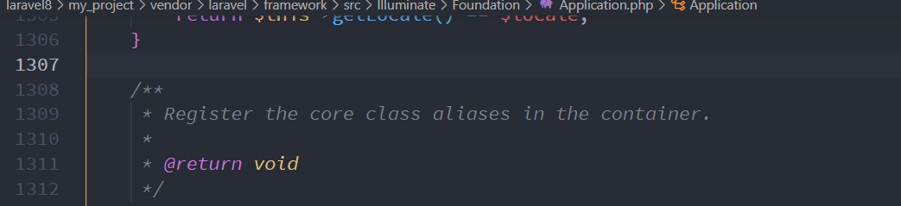
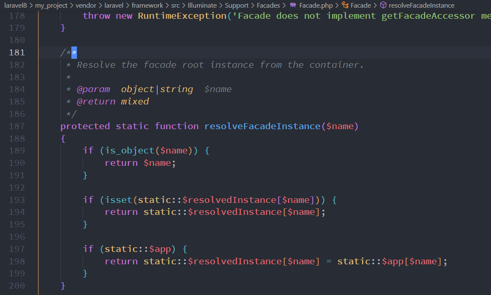

# 定制一个属于自己的门面 

> 你要明白明确 门面底层的代码是在哪里的？？？？ 怎么找到门面的具体实现类；
>
>实现一个自己的门面；
>
>**门面设计模式是一种结构型设计模式，它提供了一个统一的接口，用于访问子系统中的一组接口。这种模式隐藏了子系统的复杂性，使得客户端可以通过简单的接口来访问子系统，而不需要了解子系统内部的实现细节。**

---

## facade 门面的具体实现类 所在的对应关系就是在下面；





---

## 门面获取的对象都是从哪里来的  

`````php
//从下面我们直到都是从app 服务容器里面来的；
static::app[$name];//这个就是从容器获取到的，getFacadeAccessor 获取到的name;
`````



---

## 还是存在一个问题；门面是什么时候放到app服务容器里面的呢？

````php
<?php

namespace App\Providers;

use App\Facades\TestManager;
use Illuminate\Support\ServiceProvider;

class AppServiceProvider extends ServiceProvider
{
    /**
     * Register any application services.
     *
     * @return void
     */
    public function register()
    {
        //注册门面具体实例到容； ---- 这个时候放进去的；
        $this->app->bind('test',function() {
            return new TestManager;
        });
    }

    /**
     * Bootstrap any application services.
     *
     * @return void
     */
    public function boot()
    {
        //
    }
}
````


---


## 具体实现；

注意：

**app.php alias 数组是一个类的别名；使用这个字符串代表的就是这个类；**

````php
//code
//web.php
 /**
  * facades门面设计
  */

Route::get('facades/test',function() {   
    //类的别名；
    Test::main();
});


// 
<?php
namespace App\Facades;

use Illuminate\Support\Facades\Facade;

class Test extends Facade
{
     /**
     * Get the registered name of the component.
     *
     * @return string
     */
    protected static function getFacadeAccessor()
    {
        return 'test'; // 从 服务容器app里面拿到的对象；那么这里是怎么把真的对象放到容器里面的呢？？
        // 可以直接new
        // return new TestManager();
    }
}

// 具体实例类；
<?php
namespace App\Facades;

class TestManager 
{
    public function main() {
        echo "facades Test";
    }
}

// 要把具体的实现对象添加到容器里面去；

<?php

namespace App\Providers;

use App\Facades\TestManager;
use Illuminate\Support\ServiceProvider;

class AppServiceProvider extends ServiceProvider
{
    /**
     * Register any application services.
     *
     * @return void
     */
    public function register()
    {
        //注册门面具体实例到容； //     目标不变不明白吗       你     
        $this->app->bind('test',function() {
            return new TestManager;
        });
    }

    /**
     * Bootstrap any application services.
     *
     * @return void
     */
    public function boot()
    {
        //
    }
}

````


