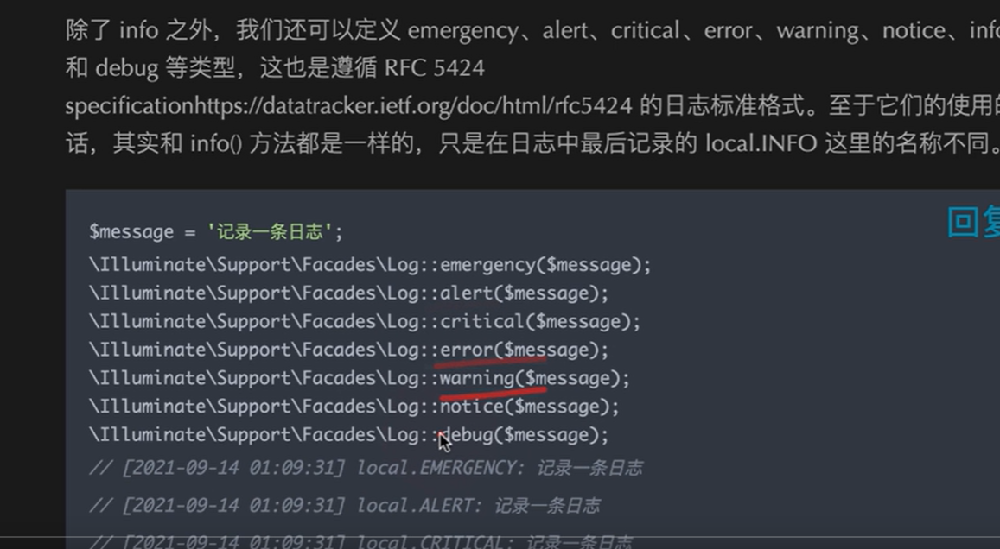

# Log 日志系统；

----

## 配置的位置

config/logging.php

````php
<?php
// 级别  emergency(紧急的；)、alert（警觉）、critical（危险的临界的）、error、warning、notice、info 和 debug。//info and debug 级别最低； info 和 debug 一个界别；
use Monolog\Handler\NullHandler;
use Monolog\Handler\StreamHandler;
use Monolog\Handler\SyslogUdpHandler;

return [

    /*
    |--------------------------------------------------------------------------
    | Default Log Channel
    |--------------------------------------------------------------------------
    |
    | This option defines the default log channel that gets used when writing
    | messages to the logs. The name specified in this option should match
    | one of the channels defined in the "channels" configuration array.
    |
    */
	//默认目录
    'default' => env('LOG_CHANNEL', 'stack'),

    /*
    |--------------------------------------------------------------------------
    | Log Channels
    |--------------------------------------------------------------------------
    |
    | Here you may configure the log channels for your application. Out of
    | the box, Laravel uses the Monolog PHP logging library. This gives
    | you a variety of powerful log handlers / formatters to utilize.
    |
    | Available Drivers: "single", "daily", "slack", "syslog",
    |                    "errorlog", "monolog",
    |                    "custom", "stack"
    |
    */
    //path代表的是路径；
    'channels' => [
        'stack' => [
            'driver' => 'stack',
            'channels' => ['single','daily'],
            'ignore_exceptions' => false,
        ],
		//永久保存！！
        'single' => [
            'driver' => 'single',
            'path' => storage_path('logs/laravel.log'),
            //必须debug 级别才会接收才会打日志；
            'level' => env('LOG_LEVEL', 'debug'),
        ],
		//14天的xdebug日志文件；
        'daily' => [
            'driver' => 'daily',
            'path' => storage_path('logs/laravel.log'),
            // 只有debug 级别才会打日志；
            'level' => env('LOG_LEVEL', 'debug'),
            'days' => 14,
        ],

        'slack' => [
            'driver' => 'slack',
            'url' => env('LOG_SLACK_WEBHOOK_URL'),
            'username' => 'Laravel Log',
            'emoji' => ':boom:',
            'level' => env('LOG_LEVEL', 'critical'),
        ],

        'papertrail' => [
            'driver' => 'monolog',
            'level' => env('LOG_LEVEL', 'debug'),
            'handler' => SyslogUdpHandler::class,
            'handler_with' => [
                'host' => env('PAPERTRAIL_URL'),
                'port' => env('PAPERTRAIL_PORT'),
            ],
        ],
		//错误输出；进程的错误输出；
        'stderr' => [
            'driver' => 'monolog',
            'level' => env('LOG_LEVEL', 'debug'),
            'handler' => StreamHandler::class,
            'formatter' => env('LOG_STDERR_FORMATTER'),
            'with' => [
                'stream' => 'php://stderr',
            ],
        ],
		//操作系统的日志；syslog
        'syslog' => [
            'driver' => 'syslog',
            'level' => env('LOG_LEVEL', 'debug'),
        ],
		//php.ini里面定义的错误日志；
        'errorlog' => [
            'driver' => 'errorlog',
            'level' => env('LOG_LEVEL', 'debug'),
        ],

        'null' => [
            'driver' => 'monolog',
            'handler' => NullHandler::class,
        ],

        'emergency' => [
            'path' => storage_path('logs/laravel.log'),
        ],
    ],

];

````


日志的格式你怎么去定义；

stack 

channel

``````php
//打log 的一个语法怎么去写，怎么去实现；
Log::info(); //facades也是用门面去实现的；
``````


---


## monolog 日志类型




